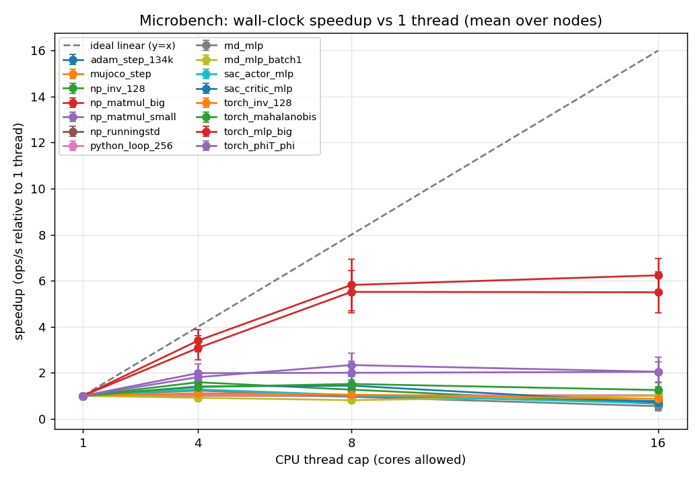
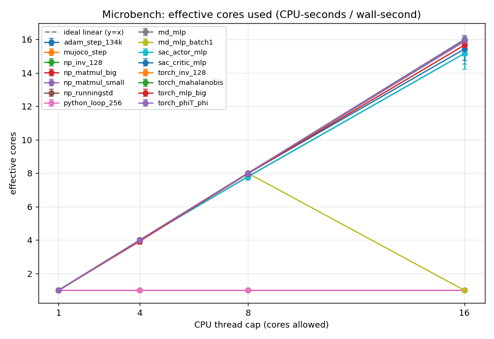
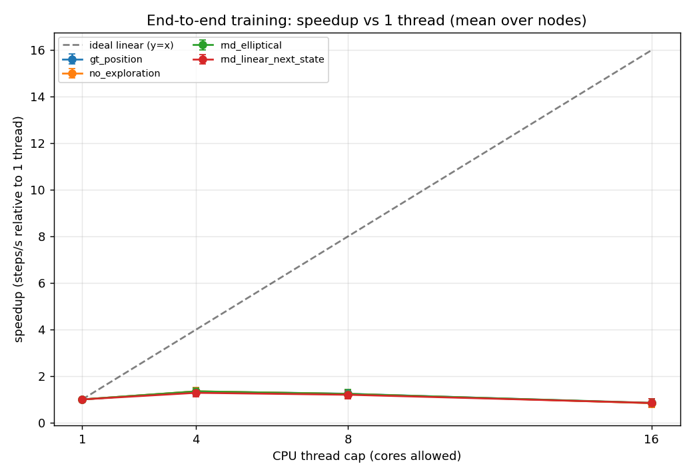
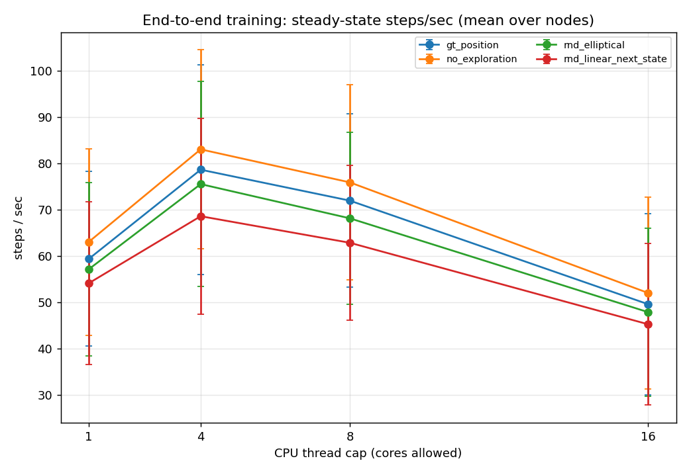
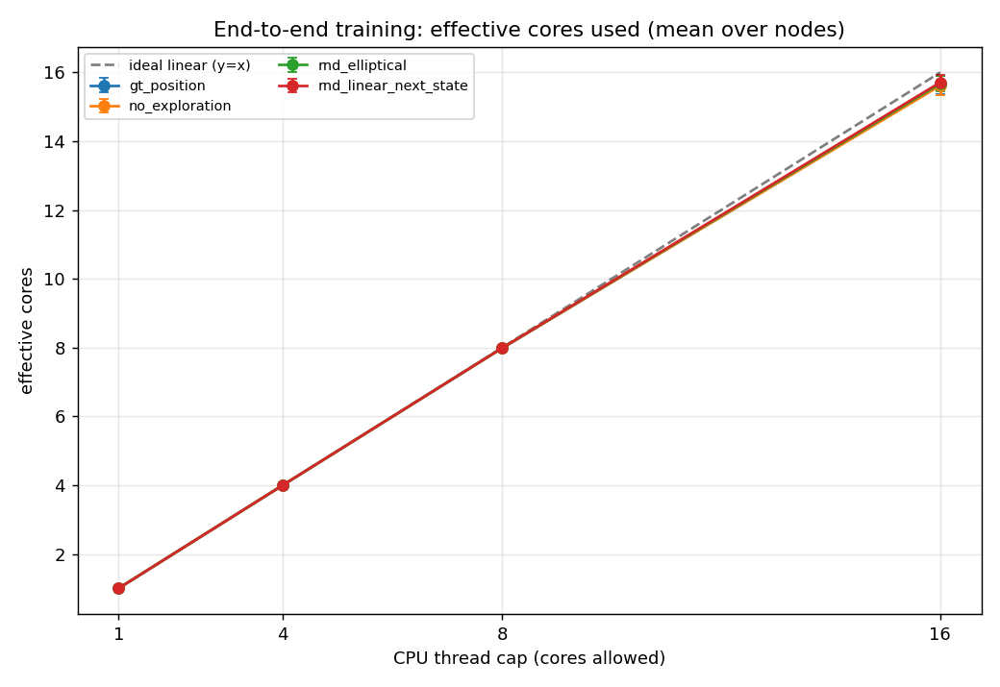
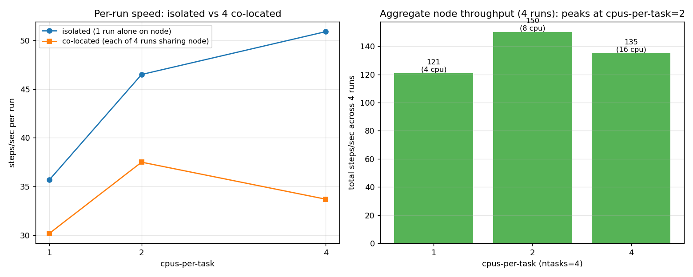

# CPU parallelization of `04_many_exploration_method.py`

**Questions.** When this training script runs, which parts can use multiple CPU
cores and which are stuck on one core? What is the real wall-clock speedup for
**1, 2, 4, 8, 16** cores? And what are the cluster's per-user limits?

**Answer in one paragraph.** This training loop is essentially a **single-core
workload with a thin layer of small matrix multiplies that parallelize badly.**
The parts that cannot use more than one core at all — MuJoCo physics, the
VisitCount Python loop, the NumPy running-mean/std update, replay-buffer
gathering — sit directly on the per-step path, so by Amdahl's law they cap the
whole run. The parts that *can* use more cores (the SAC actor/critic and RND
matrix multiplies, run by PyTorch/MKL) are too small (batch 256, dims ≤256) to
benefit: PyTorch still launches one worker thread per core and those threads
**spin-wait at ~100% CPU**, so the run *looks* like it is using 8 cores (CPU =
800%) while going only ~1.2× faster than on one core. **Best end-to-end speedup
is only ~1.3–1.4× and it plateaus by 4 cores — 2 cores already captures almost all
of it (~1.3× at ~66% per-core efficiency); 8 cores is no better; 16 cores is
*slower* than 1 core on most nodes.** With `device=cuda` the math moves to the GPU, the CPU side
uses ~1 core, and for these tiny networks the GPU is only *competitive* with the
CPU (it beats a weak CPU and loses to a fast one), not the decisive win you'd get
with large networks. **Practical guidance: for a CPU run, 2 CPUs is
the efficient choice (~1.3× at ~65% per-core efficiency) and 4 buys a little more
speed; 1–2 CPUs for a GPU run. Beyond 4 is wasted, and — if you don't also cap
`OMP_NUM_THREADS` — actively makes the run slower.**

**Method.** Two measurements, both run this session, replicated across **29 node
instances** (microbenchmarks) / **17 nodes** (end-to-end) spanning **8 distinct
CPU families/models** (Intel Xeon Silver/Gold/Platinum + AMD EPYC; several nodes
share a model), plus one GPU node:

1. **Microbenchmarks** (`code/microbench.py`) — each numerical primitive in the
   loop, isolated at the *exact* tensor size the loop uses, under a fixed thread
   cap. Reports throughput and *effective cores* =
   `process_CPU_seconds / wall_second` (how many cores the process *keeps busy /
   consumes* — spin-wait counts as busy, so read it next to the speedup: 1.0 =
   one core busy, 8.0 = eight cores busy).
2. **End-to-end** (`code/profile_e2e.py`) — the real training loop, steady-state
   `steps/sec` and effective cores per thread cap, intermediate eval disabled so
   the number reflects the train step itself. Cross-checked against the
   **unmodified** `04_many_exploration_method.py` run under `/usr/bin/time -v`.
   *Scope:* this measures the per-step training compute. A production run also does
   periodic eval rollouts (`eval_freq=500`, 10 episodes) and the distance-to-GT /
   wandb callbacks — all single-threaded MuJoCo/Python/NumPy, i.e. *more* serial
   than the train step. So the real run scales **no better** than the numbers here,
   and the "request ~4 CPUs" conclusion holds *a fortiori*. §2 reports a direct
   measurement of the with-eval run to confirm this.

Thread cap = `OMP_NUM_THREADS = MKL_NUM_THREADS = OPENBLAS_NUM_THREADS = … = N`
plus `torch.set_num_threads(N)`. Speedups are computed **per node** (ratio within
one machine) and then averaged, so they measure scaling, not hardware spread.

> **Read CPU% and speedup together.** PyTorch (MKL/OpenMP) and NumPy (OpenBLAS)
> launch one worker thread per allowed core, and idle threads **spin-wait** at
> ~100% CPU (`OMP_WAIT_POLICY` defaults to active). So a run can report 800% CPU
> ("8 cores!") while the wall clock barely moves. *Effective cores ≈ how many
> cores are lit up; speedup ≈ how much faster it actually is.* For this workload
> they diverge sharply.

---

## 1. Which part can use multiple CPU cores (measured)

Each row is a real component of the training step, mapped to the microbenchmark
that isolates it. "eff. cores @8" is how many cores it lights up at an 8-thread
cap; "speedup @N" is wall-clock throughput relative to 1 thread.

| Component (code) | Library | eff. cores @8 | speedup @4 | @8 | @16 | verdict |
|---|---|--:|--:|--:|--:|---|
| MuJoCo env.step physics | MuJoCo (C) | 1.0 | 1.01 | 1.02 | 1.01 | **serial — locked to 1 core** |
| VisitCount compute loop (gt_position) | pure Python | 1.0 | 1.03 | 1.00 | 1.02 | **serial — locked to 1 core** |
| RND obs RunningMeanStd.update | numpy | 1.0 | 1.02 | 1.00 | 1.01 | **serial — locked to 1 core** |
| Adam optimizer .step (SAC actor+critics) | torch ATen foreach | 8.0 | 1.02 | 0.98 | 0.77 | spins up 8 cores, ~no speedup (peak 1.02×) |
| Intrinsic fwd per env-step (batch 1) | torch (MKL/oneDNN) | 8.0 | 0.91 | 0.81 | 1.00 | spins up 8 cores, *slower* (peak 1.00×) |
| SAC critic MLP fwd+bwd (6→256→256→1) | torch (MKL/oneDNN) | 8.0 | 1.41 | 1.44 | 0.71 | limited: peak 1.44×, then 0.71× at 16 |
| SAC actor MLP fwd+bwd + squashed-Gaussian | torch (MKL/oneDNN) | 7.8 | 1.28 | 1.03 | 0.67 | limited: peak 1.28×, then 0.67× at 16 |
| RND predictor MLP fwd+bwd (4→256→128) | torch (MKL/oneDNN) | 7.8 | 1.23 | 0.95 | 0.55 | spins up 8 cores, ~no speedup (peak 1.23×) |
| EllipticalBonus inv(128×128) (torch) | torch linalg (MKL LAPACK) | 8.0 | 1.11 | 1.05 | 0.86 | spins up 8 cores, ~no speedup (peak 1.11×) |
| matrix inverse 128×128 (numpy LAPACK) | numpy linalg (OpenBLAS LAPACK) | 8.0 | 1.59 | 1.27 | 0.65 | limited: peak 1.59×, then 0.65× at 16 |
| EllipticalBonus φ@Λ⁻¹ (256×128 @ 128×128) | torch (MKL) | 8.0 | 1.38 | 1.51 | 1.25 | limited: peak 1.51×, then 1.25× at 16 |
| EllipticalBonus φᵀ@φ (128×256 @ 256×128) | torch (MKL) | 8.0 | 1.81 | 2.33 | 2.04 | limited: peak 2.33×, then 2.04× at 16 |
| small matmul 256×128 @ 128×128 (numpy) | numpy (OpenBLAS) | 8.0 | 1.98 | 2.00 | 2.04 | limited: peak ~2.0× |
| _[contrast]_ big MLP 1024-wide, batch 4096 | torch (MKL/oneDNN) | 8.0 | 3.08 | 5.51 | 5.50 | **scales — size effect** |
| _[contrast]_ big matmul 2048×2048 (numpy) | numpy (OpenBLAS) | 8.0 | 3.40 | 5.82 | 6.24 | **scales — size effect** |

_29 nodes for the core ops, 12 for the actor/batch-1/mahalanobis/Adam rows. Full per-node CSV in `results/microbench_summary.csv`._

> **How to read the per-op `speedup` columns.** Each op is timed in a tight loop
> that re-dispatches it from Python every iteration — exactly as the training loop
> does — so the speedup is "how much faster this op makes the *loop that calls it*,"
> not the pure library kernel scaling in isolation. That is the right number for
> this question (the real loop also pays Python dispatch), but it means a flat
> `speedup` is partly small-tensor and partly dispatch-bound. The big-MLP / big-matmul
> rows are the control: the *same* libraries scale 5–6× when the tensor is large, so
> the flat small-op numbers are a size effect, not a library limitation. Two minor
> fidelity notes: `rnd_mlp` trains both layers, but the tested `rnd_linear_next_state`
> freezes the body and trains only the head (so the table slightly *overstates* RND's
> torch work — conservative for the "torch work is small" conclusion); `python_loop_256`
> and `mujoco_step` are faithful analogs of `VisitCount.compute` and the PointMaze step
> (same serial character, slightly different constants).

**How to read it.** Three groups:

- **Genuinely serial (1 core, always).** MuJoCo `env.step`, the VisitCount
  `compute` Python loop (used by `gt_position`/`gt_position_velocity`), and the
  RND `RunningMeanStd.update`. These never use more than one core no matter the
  cap. The replay-buffer index/gather and the per-step Python wrapper bookkeeping
  (visit-count discretization, `RemoveGoal`, `Flatten`, `Monitor`) are in the
  same category (single-threaded Python / memory-bound copies; they run every
  step regardless of `--algorithm`).
- **Lights up N cores but barely speeds up.** The SAC actor/critic MLPs, the RND
  predictor MLP, the per-step batch-1 intrinsic forward, the Adam optimizer step,
  and `inv(128×128)`. At batch 256 with dims ≤256 these are too small for the
  threads to pay off — peak ~1.0–1.6×, and at 16 threads they go *backward*
  (0.55–0.86×) because thread dispatch + spin-wait cost more than the work.
- **The matmuls that scale a little.** `phi^T@phi`, `phi@Λ⁻¹`, and the small
  numpy matmul reach ~2× at 8 threads — the largest single GEMMs in the step,
  still small.
- **Contrast (proves it is a size effect, not a library limit).** The same
  libraries on a big MLP (1024-wide, batch 4096) and a big matmul (2048²) scale
  **5–6× at 8 threads.** The flat results above are purely because *this script's*
  tensors are tiny.

The dominant per-step torch work is the SAC gradient step: per the SB3 source it
is **8 network forward passes + 5 backward passes** (actor ×2 fwd + ×1 bwd, the
two online critics ×4 fwd + the two of them ×1 bwd-pair, two target critics ×2
fwd), all on the `6→256→256→1` / `4→256→256` shapes — exactly the
`sac_critic_mlp`/`sac_actor_mlp` primitives above, which top out at ~1.4×.




*Left: wall-clock speedup vs threads — almost flat for the training-size ops, 5–6×
for the big contrasts. Right: effective cores — every torch/numpy op rises to the
diagonal (it grabs all cores) even when the left plot shows no speedup. That gap
is the spin-waste.*

---

## 2. End-to-end: performance for 1 / 2 / 4 / 8 / 16 cores

Steady-state training throughput of the real loop (node-paired speedup ± spread
across nodes):

| algorithm | 1 thr | 2 thr | 4 thr | 8 thr | 16 thr | speedup @2 | @4 | @8 | @16 | eff.cores @16 |
|---|--:|--:|--:|--:|--:|--:|--:|--:|--:|--:|
| no_exploration | 63 | 83 | 83 | 76 | 52 | **1.33**±0.09 | 1.35±0.15 | 1.24±0.19 | 0.84±0.19 | 15.6 |
| rnd_linear_next_state | 54 | 70 | 69 | 63 | 45 | **1.29**±0.05 | 1.28±0.16 | 1.20±0.18 | 0.85±0.18 | 15.7 |
| gt_position | 59 | 79 | 79 | 72 | 50 | **1.32**±0.08 | 1.34±0.17 | 1.25±0.17 | 0.84±0.17 | 15.6 |
| rnd_elliptical | 57 | 76 | 76 | 68 | 48 | **1.31**±0.06 | 1.35±0.14 | 1.24±0.20 | 0.85±0.18 | 15.7 |

_steps/sec are mean over 17 nodes (absolute values vary with CPU model); speedup is the per-node ratio, mean±std._

> **The 2-thread column** comes from a **dedicated repeated run** added after review:
> threads {1, 2, 4} measured **3× each on all 17 nodes** (node-paired, monitored;
> `logs/twocore_*/`, `results/twocore_summary.json`). Its 1-thread reproduced the
> original sweep to **<1%** (e.g. 62.7 vs 63.0 steps/s), so it splices in cleanly.
> Two things to note: (a) **2 cores already delivers ~1.3×, essentially the whole
> 4-core gain** — i.e. ~66% efficient per core vs ~34% at 4 cores, so **2 CPUs is
> the efficient choice**; (b) in that cleaner repeated run the matched 4-thread
> figure is a touch higher than the original single-run sweep (≈89 steps/s,
> speedup ≈1.42, vs 83 / 1.35 here) because averaging 3 reps removes single-run
> noise — so 4 cores does edge out 2, but only slightly, and at double the cost.
> 8/16-thread columns are the original single-run sweep. Full data:
> `results/e2e_summary.csv`, `e2e_long.csv`, `results/twocore_long.csv`._

- **4 cores gives the best absolute throughput: ~1.3–1.4× faster** than 1 core for
  every algorithm (≈1.42× in the cleaner repeated run). But it is only ~33–35%
  efficient per core, vs ~66% at 2 cores.
- **2 cores is the most *efficient* point** — measured on a dedicated repeated run
  (threads {1, 2, 4} × **3 reps × 17 nodes**, node-paired): **1.29–1.33× at ~66%
  per-core efficiency** (vs ~35% at 4 cores). 2 cores captures essentially the
  entire 4-core speedup at half the cores, so **2 CPUs is the considerate,
  near-peak choice on a shared cluster; 4 buys only a little more.**
  (`results/twocore_summary.json`; see Table B and its note.)
- **8 cores is no better** (~1.2×) and **16 cores is slower than 1 core for all
  four algorithms** (0.84–0.85×). The extra threads do not pay for themselves:
  beyond the thread-dispatch and spin-wait overhead, 16 threads also **lose
  per-core turbo frequency** (a 1-thread run boosts to single-core turbo; a
  16-thread run sits near all-core base clock) and **contend for memory
  bandwidth and shared L3**. All three effects push the same way; the crossover
  below 1× is their combination, not spin-wait alone. (Earlier the partial data
  made `rnd_elliptical` look like an exception at 16 threads; with all nodes in,
  it degrades to 0.85× like the rest — its matmuls are only slightly larger.)
- **Effective cores at 16 threads ≈ 15.6–16** for all of them — the run consumes
  every core it is given (~1600% CPU) while delivering *less* than 1-core
  throughput. This is the single clearest demonstration that CPU% is not speed.
- The spread is hardware-dependent: high-core, high-bandwidth nodes (serval07/08,
  jaguar03) tolerate 16 threads (~1.0–1.16×); ordinary 16-physical-core nodes
  (32 logical) degrade hard at 16 (down to ~0.49–0.61×). Per node, 14 of 17
  drop below 1× at 16 threads. So "more cores hurt" is worst exactly on the
  smaller nodes — note the cgroup gives each job its own cores but does **not**
  isolate shared memory bandwidth, L3, or turbo budget from co-tenants.





**Cross-check on the unmodified script.** Running `04_many_exploration_method.py`
as-is under `/usr/bin/time -v` reproduces it independently. Across 17 nodes, going
from 1 to 8 threads moves CPU usage from **~96% (0.97 cores) to ~690% (6.9 cores)**
but the wall clock improves only **1.20× ± 0.15** (min 0.94×, max 1.41×; e.g.
serval07 57.5 s → 47.5 s). Seven cores lit, 1.2× faster — the same result the
in-process profiler gives (`results/crosscheck.csv`).

**Production run (with eval + callbacks).** To confirm the train-step-only scope
isn't hiding anything, I ran the unmodified script with periodic eval enabled
(`eval_freq=500`, 5 eval episodes) under `/usr/bin/time` at 1/4/8 threads on 3
nodes. It scales the **same**: 1→4 threads ≈ **1.25× (max 1.33×)**, 1→8 threads ≈
**1.18×** (`logs/followup_*/D_real04_witheval_threads-*.txt`). Eval is
single-threaded, so it dilutes the speedup slightly but does not change the
picture — Table B's train-step numbers are a faithful upper bound on production
scaling.

> **Important default (measured).** PyTorch reads the Slurm cgroup cpuset:
> `torch.get_num_threads()` equals `--cpus-per-task` — measured a 4-cpu allocation
> → 4 threads, a 20-cpu allocation → 20 threads, with OpenMP *and* OpenBLAS both
> honoring it (`logs/limits/torch_default_cpus-{4,20}.txt`). Two consequences:
> - The existing Slurm scripts request `--cpus-per-task=4` and set no
>   `OMP_NUM_THREADS`, so torch defaults to **4 threads — already at the sweet
>   spot.** That configuration is fine; leave it.
> - **The trap is requesting more CPUs without also capping threads.** On a 20-cpu
>   allocation with no `OMP_NUM_THREADS`, torch spawns 20 threads: I measured the
>   *unmodified* script then consume **~16–17 cores (1675% CPU) and run 3–4×
>   _slower_** — ~14 steps/s vs ~54 when capped to 1 thread
>   (`logs/followup_*/C_real04_uncapped_default.txt`). So if you raise
>   `--cpus-per-task`, you **must** also set `OMP_NUM_THREADS≈4`, or the run gets
>   slower. (Only without a cpu cgroup — e.g. on a login node — would torch grab
>   all physical cores of the machine.)

---

## 3. device = cuda comparison

Same sweep on one GPU node. The neural-network math moves to the GPU, so the CPU
side does only env stepping + Python:

| algorithm | 1 thr | 4 thr | 8 thr | 16 thr | eff. CPU cores |
|---|--:|--:|--:|--:|--:|
| no_exploration | 44 | 50 | 50 | 45 | 1.01 |
| rnd_linear_next_state | 54 | 44 | 48 | 38 | 1.00 |
| gt_position | 47 | 58 | 52 | 40 | 1.01 |
| rnd_elliptical | 51 | 53 | 47 | 47 | 1.01 |

_One GPU node (cheetah01). steps/sec for comparison with the CPU runs in Table B._

- **Robust finding: CPU usage collapses to ~1 core**, flat across thread caps —
  on a GPU run the only thing extra CPU cores could speed up (the matmuls) is no
  longer on the CPU. **Request 1–2 CPUs for a GPU run.** (Do *not* read the
  per-thread steps/s columns as scaling — they are single-run noise on one node;
  only `eff_cores ≈ 1` is load-bearing.)
- **Is the GPU faster than the CPU? It depends on the CPU — for these tiny
  networks the GPU is merely *competitive*, not a clear win** (n = 1 GPU node, so
  indicative only). On cheetah01's *own* CPU — a weak 8-core AMD EPYC 7252 — the
  best CPU run is ~24–31 steps/s while its GPU does 44–54, so on this node the
  **GPU is faster**. But the strong CPU nodes (serval, jaguar03, puma) reach
  **68–117 steps/s on CPU at 1–4 threads**, beating this GPU. The networks are too
  small (batch 256, dims ≤256) for the GPU to amortize per-step kernel-launch +
  host↔device transfer, and the single-threaded env step bounds either device. A
  GPU only pays off decisively once the networks are large. _(Same-node CPU vs GPU
  numbers: `results/e2e_long.csv`, node cheetah01, devices cpu/cuda.)_

---

## 4. Cluster limits (discovered + empirically verified)

Per-user caps come from the partition QOS (`cspartcpu` for `cpu`, `cspartgpu` for
`gpu`; both `DenyOnLimit`). My association QOS is `normal` (no extra limits).

| Limit | Value | Enforced as | Empirical check (this session) |
|---|---|---|---|
| CPUs per user, per partition | **400** | `QOSMaxCpuPerUserLimit` | `--cpus-per-task=420` → rejected at submit. 22×20 = 440 cpus submitted → **20 jobs (400 cpu) ran, 2 held pending** `QOSMaxCpuPerUserLimit` |
| GPUs per user, per partition | **40** | `QOSMaxGRESPerUser` | `--gpus-per-node=41` → rejected at submit |
| Memory per user, per partition | **4 TB** | `QOSMaxMemoryPerUser` | `--mem=5000G` → rejected at submit |
| Global job count | 100000 (`MaxJobCount`) | scheduler | no binding per-user job-count cap found |
| Max job-array size | 2048 (`MaxArraySize`) | scheduler | — |

A *single* job over a cap is **rejected at submission**. A *running aggregate*
over a cap is allowed to queue but the excess jobs are **held pending** with the
same reason. The `cpu` and `gpu` partition caps are **separate** (400 each), so
fanning work across both doubles the headroom. This study used 18–20 cpus/node ×
≤17 nodes/partition to stay under 400 and start every job immediately.

Saved transcripts of these checks (so the verification is auditable):
`logs/limits/01_qos_definitions.txt` (the `sacctmgr`/`scontrol` limit definitions),
`logs/limits/02_single_job_over_cap_rejections.txt` (the four over-cap `sbatch`
rejections with their `QOSMax…` errors), and
`logs/limits/03_aggregate_running_cap.txt` (the 22×20-cpu submission → 20 running
/ 400 cpu, 2 pending `QOSMaxCpuPerUserLimit`).

---

## 5. Submitting a set of runs: `--ntasks`, job arrays, and memory

How the different ways to submit a *set* of runs differ, how they look in the
queue, and what happens to speed and memory when several runs share a node.
(Measured this session: `code/run_array_taskset.sh`, `code/probe_task_layout.py`,
`logs/array/`, `logs/array_<node>/`.)

### 5.1 Three ways to submit a set of jobs — and how the queue sees them

| Method | Command shape | Queue view (squeue) | Resource model |
|---|---|---|---|
| **`--ntasks=N` + `srun`** (your `03_run_cpu.slurm`) | one `sbatch`, `--ntasks=4 --cpus-per-task=4`, body `srun wandb agent` | **1 JOBID, 1 line** | 4 tasks **co-located on one node**, sharing its memory + bandwidth |
| **Job array** | `sbatch --array=1-4` | **1 base JOBID**; pending tasks collapse to a single `JOBID_[range]` line, only running tasks expand | 4 **independent** jobs; scheduler spreads them across **different** nodes, each its own cpus/mem |
| **Loop of `sbatch`** (your `00_batch_slurm.sh`) | N separate `sbatch` calls | **N distinct JOBIDs, N lines** | N independent jobs |

Empirical queue view (`logs/array/queue_view_mechanisms.txt`): the `--ntasks` job
showed as one line `6256738` (8 CPUS); the array `6256739` showed as
`6256739_1..4` spread across panther01 + lynx08; the loop showed four separate
ids `6256743..6256746`; and a throttled array `--array=1-10%2` showed its 8
pending tasks **collapsed into a single line** `6256764_[3-10%2]` plus 2 running
lines.

**For "if I submit too many jobs the admin complains": use a job array with a
`%K` throttle.** The collapse only helps *pending* tasks — every *running* array
task still gets its own squeue line, so an unthrottled `--array=1-100` with 60
running shows 60 lines. The `%K` throttle caps how many run at once, hence how many
lines show: `--array=1-1000%5` runs ≤ 5 at a time → ≤ 5 running lines + 1 collapsed
pending line, for any array size. It is still **one base JOBID** (counts as one for
the per-user job count and the 400-cpu cap), and spreads tasks across nodes.

**Stack `--array` with `--ntasks` to pack the most runs behind the fewest lines.**
Each array task can itself be a `--ntasks=4` node running 4 agents, so
`--array=1-M%K --ntasks=4 --cpus-per-task=2` shows ≤ K running lines but runs 4K
concurrent training runs across K nodes. Measured (`logs/array/queue_view_mechanisms.txt`,
`6256822`): `--array=1-6%2 --ntasks=4` showed exactly **2 running lines**
(`6256822_1`, `6256822_2`, 8 CPUS each) + one collapsed `6256822_[3-6%2]` pending
line — 2 lines for up to 8 concurrent runs.

| What you submit | Running queue lines | Concurrent runs |
|---|--:|--:|
| `--ntasks=4` (current) | 1 | 4 (one node) |
| `--array=1-100` (no throttle) | up to 100 | up to 100 |
| `--array=1-100%5` | ≤ 5 | ≤ 5 |
| `--array=1-100%5 --ntasks=4` | ≤ 5 | ≤ 20 (5 nodes × 4) |

A **loop of `sbatch`** is what fills the queue with many distinct JOBIDs.
`--ntasks` keeps it to **one** queue line (one base JOBID) — but where the tasks
land depends on size (next).

**Keeping `--ntasks` on one node (`--nodes=1`).** Slurm uses the *minimum* number
of nodes for your `--ntasks`: a *small* `--ntasks` lands on one node, but a *large*
one **spreads across several nodes** if no single node has enough free cpus. To
forbid spreading, add **`--nodes=1`** (`-N 1`); optionally `--ntasks-per-node=<N>`
to also pin the per-node count. Measured (`nodedemo` sleep jobs):

| Flags | NumNodes | Result |
|---|--:|---|
| `--ntasks=8 --cpus-per-task=2 --nodes=1` | 1 | ran on one node (lynx08) |
| `--ntasks=60 --cpus-per-task=2` (no `--nodes`) | **5** | **spread across affogato[01-05]** |
| `--ntasks=60 --cpus-per-task=2 --nodes=1` | 1 | **pending** `ReqNodeNotAvail` (no single node had 120 free cpus) |

So `--nodes=1` trades "spread" for "wait until one big-enough node is free." If you
need it to start, pin a known-large node: `--nodes=1 --nodelist=jaguar03` (224 cpus)
or keep `ntasks × cpus-per-task` ≤ a common node size. For the live
`--ntasks=4 --cpus-per-task=4` (16 cpus) almost any node fits, so it rarely spreads;
it is the *large* `ntasks` that needs `--nodes=1`. Caveat: forcing a large
`--ntasks` onto one node maximizes the memory-bandwidth contention of §5.3 —
`--nodes=1` buys one queue line at the cost of per-run speed, while a throttled job
array trades the other way. (`--exclusive` is a different knob: it gives you the
whole node, i.e. no *other users* sharing it, but does not by itself prevent
multi-node spread.)

### 5.2 What `--ntasks=4 --cpus-per-task=4 --mem=20G` actually gives you

Measured per task with `srun python probe_task_layout.py` (`logs/array/layout_*.txt`):

- **Total cpus = `ntasks × cpus-per-task` = 16.**
- **Each task gets its OWN distinct 4 cpus** — the four tasks' affinity sets are
  disjoint (adriatic01: `[0,1,16,17]`, `[2,3,18,19]`, `[4,5,20,21]`, `[6,7,22,23]`).
  They do **not** all see 16. (Each "4 cpus" = 2 physical cores + their 2
  hyperthread siblings.)
- **`OMP_NUM_THREADS` is effectively 4 per task, not 16.** With nothing set, torch
  reads each task's affinity and `torch.get_num_threads()` returns **4** per task,
  so the four tasks use 4+4+4+4 threads on 16 cpus — **no oversubscription.**
  (Contrast §2: a *single* run given `--cpus-per-task=16` with no cap uses 16
  threads and runs slower. The per-task `srun` binding is what saves you here.)
- **`--mem=20G` is the per-node TOTAL, shared by all 4 tasks** (`SLURM_MEM_PER_CPU`
  is null). Each run is a separate process using ~0.9 GB resident, so 4 ≈ 3.6 GB of
  the shared 20 GB — memory *capacity* is not the constraint; memory *bandwidth* is.

### 5.3 Co-located (one node) vs isolated: the concurrency penalty

When 4 runs share a node (the `--ntasks` method) each one is **slower** than the
same run alone, because they compete for the node's memory bandwidth. Both columns
below were measured inside the *same* single-node 16-cpu allocation: **"isolated"
= one run active alone** (rest of the node idle, full memory bandwidth to itself);
**"co-located" = 4 runs active at once** (each pinned to its own cpus). "Isolated"
is the no-sharing baseline — it is what a run gets when it does **not** share its
node with your other runs, not a claim about which node it lands on. Per-run
steady steps/s, mean over 5 nodes:

| cpus/task | isolated (1 run alone) | co-located (each of 4) | penalty | total node throughput (×4) |
|--:|--:|--:|--:|--:|
| 1 | 35.7 | 30.2 | 0.85× | 120.7 (4 cpu) |
| 2 | 46.5 | 37.5 | 0.81× | **150.0 (8 cpu)** |
| 4 | 50.9 | 33.7 | **0.66×** | 134.9 (16 cpu) |

- A run packed 4-to-a-node at `cpus-per-task=4` goes only **0.66×** as fast as the
  same run alone — a 34% slowdown purely from sharing.
- **Total node throughput peaks at `cpus-per-task=2` (8 cpus), beating
  `cpus-per-task=4` (16 cpus).** Doubling each task's cpus 2→4 *lowers* aggregate
  work, because the small per-run thread gain is erased by more contention.
  So `03_run_cpu.slurm`'s `--ntasks=4 --cpus-per-task=4` is **over-provisioned**:
  `--ntasks=4 --cpus-per-task=2` does more total work on half the cpus (and
  `--ntasks=8 --cpus-per-task=2` would do more still — more independent runs, each
  cheap).
- Spreading the 4 runs across nodes (job array / loop) avoids the penalty **to the
  extent that** each lands on a node it doesn't share with your other runs — then
  each gets the **isolated** speed (left column). The scheduler does not guarantee
  one-run-per-node, and a node may also be shared with other users' jobs, so a real
  array run lands somewhere between the isolated and co-located numbers; "isolated"
  is the clean best case.



*Left: each run is slower co-located than isolated, and the gap widens with more
cpus/task. Right: aggregate throughput of 4 co-located runs peaks at
cpus-per-task=2 (8 cpu), not 4 (16 cpu).*

### 5.4 Memory: shared pool + shared bandwidth

- **The runs do NOT share training memory** — each is a separate process with its
  own ~0.9 GB address space (no deduplication). They DO share the node's `--mem`
  pool (20 GB here) and physical RAM.
- **They share — and saturate — memory bandwidth.** A pure triad (STREAM-style)
  stream runs at **7.8 GB/s alone**; when **4 run concurrently each drops to
  6.2 GB/s** (0.79× — ratio of mean per-copy throughput; per-node ratios 0.79–0.98,
  mean 0.81, with bigcat01 an outlier at an unusually low ~4.6 GB/s baseline),
  aggregate **24.7 GB/s** (`results/array_bandwidth.csv`). That
  bandwidth ceiling is the mechanism behind the 5.3 slowdown — the training matmuls
  are small and memory-traffic-heavy, so 4 on one node contend for the same memory
  controllers.
- Memory sizing: ~0.9 GB/run × N tasks + headroom. `--mem=20G` for `--ntasks=4` is
  generous (needs ~4 GB); bandwidth, not capacity, is what limits co-located
  throughput.

---

## Appendix A — how the measurement works (code)

The "cores kept busy (consumed)" number, windowed so program startup is excluded
(`code/cpu_profiler.py`):

```python
# effective cores over a window = CPU-seconds charged to the process / wall-seconds.
# 1.0 = one core fully busy; 8.0 = eight cores fully busy on average.
eff_cores = (cpu_time_end - cpu_time_start) / (wall_end - wall_start)
```

Capping every CPU math backend to N threads (must be set before numpy/torch
import for OpenBLAS/MKL to honor it; `torch.set_num_threads` works any time):

```python
for k in ("OMP_NUM_THREADS","MKL_NUM_THREADS","OPENBLAS_NUM_THREADS",
          "NUMEXPR_NUM_THREADS","VECLIB_MAXIMUM_THREADS"):
    os.environ[k] = str(N)
torch.set_num_threads(N)
```

The profiler is an SB3 callback + a background sampler, both opt-in:

```python
PROFILE_ENABLED = os.environ.get("RND_PROFILE", "0") == "1"  # off by default
# StepRateProfiler records (wall, step, process_cpu_time) every 50 steps and
# reports steady_steps_per_sec and steady_effective_cores over [warmup, end].
```

**Turning it off during real training:** leave `RND_PROFILE` unset (or `=0`).
Every sampler/callback method then returns immediately, so the code can stay in
place at zero cost. (Nothing in `04_many_exploration_method.py` was modified for
this study; `profile_e2e.py` is a faithful snapshot that reuses the real classes.)

## Appendix B — reproduction

```
code/cpu_profiler.py        reusable profiler (RND_PROFILE=1 to enable)
code/microbench.py          per-primitive thread-scaling benchmark
code/profile_e2e.py         real training loop, steady-state throughput
code/run_node_sweep.sh      full 1/4/8/16 × {algorithms} sweep for one node
code/run_microbench_only.sh augmented microbench-only pass for one node
code/node_sweep.slurm       per-node sbatch (pin --nodelist, gpu/cpu partition)
code/aggregate.py           logs/*/*.json -> results/*.csv + plots/*.png
code/make_tables.py         results/*.csv -> the markdown tables above
logs/<node>/                raw per-node JSON, /usr/bin/time logs, lscpu, _DONE
results/*.csv               microbench_long/summary, e2e_long/summary, crosscheck
plots/*.png                 scaling figures
```

Re-run one node: `sbatch --nodelist=<node> --partition=<cpu|gpu> --gpus-per-node=0
--cpus-per-task=20 node_sweep.slurm <abs OUTDIR> cpu`. Aggregate:
`conda run -n exploration python code/aggregate.py && python code/make_tables.py`.

Nodes measured: **29** distinct CPU nodes ran the core-op microbenchmarks (17
from the main sweep + 12 augmented-microbench-only nodes), **17** ran the full
end-to-end sweep, **17** produced the unmodified-script `/usr/bin/time` cross-check,
and **1** GPU node ran the `device=cuda` comparison. Families: adriatic, bigcat,
cheetah, cortado, jaguar, lotus, puma, serval — spanning Intel Xeon
Silver 4208 (2.1 GHz) through AMD EPYC 9354 and Xeon Platinum 8380; the scaling
pattern held across all of them. Per-node CPU model, socket, and physical-core
counts: `results/node_hardware.csv` (and `logs/<node>/lscpu.txt`). The 16-thread
degradation hits **14 of 17 nodes** (drop below 1×); only **serval07/08 (32
physical cores, single-socket EPYC) and jaguar03 (56 cores, single-socket EPYC)**
still gain at 16 threads (~1.0–1.16×). It is worst on the 16-physical-core nodes
(32 logical = 16 cores × 2 hyperthreads), where 16 threads cross into
hyperthreads — but raw core count is not the whole story: **puma01 has 80 physical
cores (dual-socket Xeon) yet still drops to 0.58× at 16 threads**, so the cause is
a mix of hyperthread/cross-socket (NUMA) contention, memory bandwidth, and lost
turbo, not core count alone.
