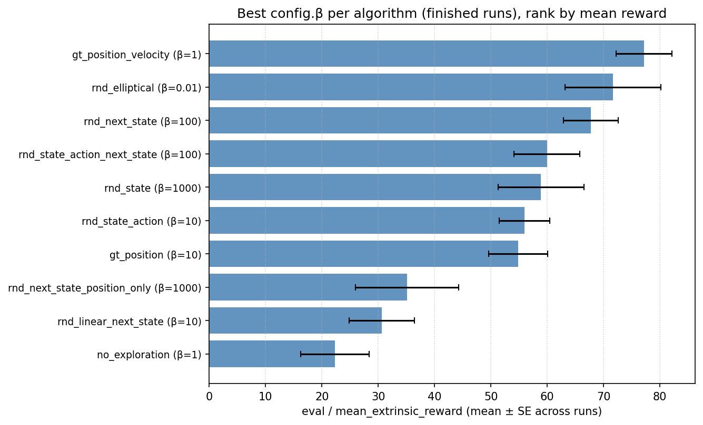
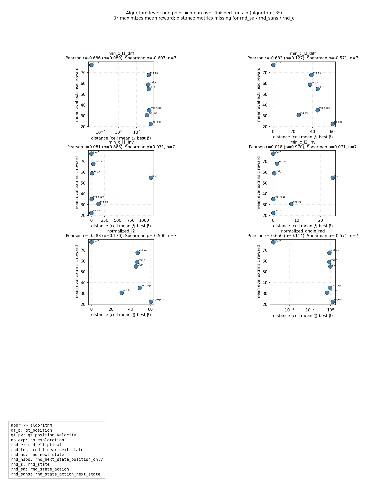
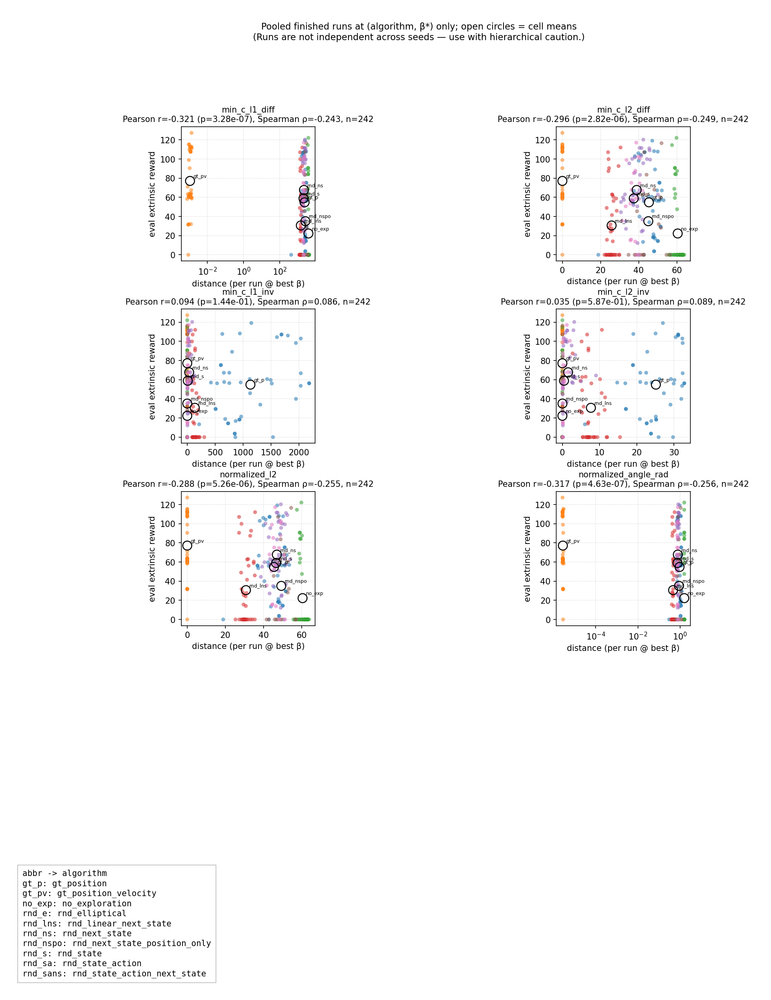

# Analysis — W&B sweep results

Everything in this document is written for **finished** W&B runs only (`state == finished`). Incomplete or crashed jobs are excluded from aggregated tables unless explicitly stated.

Working write-up for **`04_wandb_sweep.yaml`**. Offline exports live under **`analysis/data/`** (this folder is gitignored; you obtain it by downloading from W&B or copying an existing export).

**Audience.** This file is meant to be **self-contained** for someone who has **not** read the training code. Below: what experiment produced the numbers, how tables were built, and what each metric means. Replication detail and a longer checklist live in **`note.md`** at the same path as this file.

**How this document is organized**

1. **Background (this section)** — experiment, metrics, files.
2. **Data sources** — the two sweeps, merged CSV, loading tips.
3. **Run status** — snapshot counts by W&B `state` (your export may differ).
4. **Results** — reward grids, best-β table, bar chart.
5. **Correlation** — extrinsic reward vs `distance_to_gt/*`, notation, formulas, figures.

---

## Background: experiment and pipeline (read this first)

### What question this sweep asks

We compare **exploration bonuses** on the **same RL setup** (same environment, seeds, horizon, optimizer). The **policy** is **SAC** from Stable-Baselines3. The **environment** is **`PointMaze_Large-v3`** (Gymnasium / `gymnasium-robotics`) with a fixed **`bottom_right`** goal. The sweep varies:

- **`algorithm`** — how intrinsic reward is defined (visit counts, several RND variants, etc.).
- **`beta`** — scalar weight on **intrinsic** reward during **training** (grid: `0.0001` … `1000`; eight values). **`no_exploration`** forces intrinsic off in code regardless of `beta`.
- **`a_seed`** — 100 independent runs per `(algorithm, beta)` cell in principle (seeds `0`–`99` in the YAML).

**Primary outcome** we report is **`eval/mean_extrinsic_reward`**: mean **environment (extrinsic) return** over many evaluation episodes at logging time, **not** intrinsic reward. The W&B sweep’s optimization metric is also “maximize `eval/mean_extrinsic_reward`.”

**Algorithms** (value of `config.algorithm` in data; full wiring is in `04_many_exploration_method.py`):

| `config.algorithm` | Role (one line) |
|--------------------|-----------------|
| `no_exploration` | Baseline: intrinsic turned off in code (ignore `beta` for the bonus). |
| `gt_position` | Visit-frequency–style bonus on **position** visit counts (oracle / hand-designed). |
| `gt_position_velocity` | Same idea on **position + velocity** discretization; used as **reference** for `distance_to_gt`. |
| `rnd_next_state` | RND-style predictor on **next-state** features. |
| `rnd_next_state_position_only` | RND on next state but **position-only** part of the observation. |
| `rnd_state` | RND on **current state** features. |
| `rnd_state_action` | RND on **state and action** (needs actions — no distance vector in current pipeline). |
| `rnd_state_action_next_state` | RND on **state, action, next state** (needs actions — no distance vector). |
| `rnd_linear_next_state` | “Linear RND”: shared frozen trunk, trainable linear predictor vs target. |
| `rnd_elliptical` | Elliptical / non-isotropic exploration bonus variant (needs action path for full model — **distance not logged** here). |

### Training and evaluation (high level)

- **Steps:** **`total_timesteps` = 2 000 000** per run.
- **Discount** **`discount_factor` = 0.999**; **max steps per episode** **`env_max_episode` = 400**.
- **Eval:** every **`eval_freq` = 50 000** environment steps: **`n_eval_episodes` = 100** mid-training; **`n_eval_episodes_final` = 10 000** on the **last** eval (end of training). Reported summary metrics are the **final** W&B summary scalars (end of run).
- **Device:** YAML default **`cpu`** (cluster jobs may differ).
- **Termination wrapper:** **`apply_termination_wrapper: false`** — timeouts are treated as truncation for RL (see `note.md` if you need the rationale).
- **RND knobs** fixed in the sweep: `rnd_obs_norm: true`, `rnd_distance: mse`, `rnd_output_dim: 128`, `n_predictors: 1`.

### Where the code lives (so you can verify one detail)

| Topic | Location under `07_reconstruction/` |
|--------|--------------------------------------|
| Sweep definition | `04_wandb_sweep.yaml` |
| Training entrypoint | `04_many_exploration_method.py` |
| Algorithm dispatch / config | Same file (`_algorithm_to_config` and args) |
| Eval logging (`eval/mean_extrinsic_reward`, etc.) | `utilities/callbacks/wandb_eval_logging.py` |
| `distance_to_gt/*` logging | `utilities/callbacks/distance_logging.py` + `distance_to_GT/algorithm_vector.py` |

### How offline data were produced

1. **Download** from Weights & Biases: `analysis/script/download_wandb_sweeps.py` writes `analysis/data/<sweep_id>/runs_index.csv` (one row per run, flattened `config` + `summary`) and per-run JSON under `runs/<run_id>/`.
2. **Merge** both sweeps: `analysis/script/combine_sweep_runs.py` → **`analysis/data/combined_runs_index.csv`**, prepending column **`sweep_id`** so you know which launch cohort a row came from.
3. **Analysis scripts** (same `analysis/script/` folder): group tables, plots, correlations — all documented in the sections below.

You do **not** need the raw `runs/` trees for the tables in this document; the **combined CSV** (or Parquet cache) is enough.

### W&B → CSV column names

The export flattens nested dicts with dots and slashes:

| W&B concept | Typical column in `runs_index.csv` / `combined_runs_index.csv` |
|-------------|------------------------------------------------------------------|
| Run config field | `config.<name>` e.g. `config.algorithm`, `config.beta` |
| Summary (last logged) scalar | `summary.<key>` with slashes, e.g. `summary.eval/mean_extrinsic_reward`, `summary.distance_to_gt/min_c_l1_diff` |
| Run state | `state` — `finished`, `running`, `crashed`, … |

**`summary.step`** is the W&B training step associated with the summary (here usually **2 000 000** when training completed). It is **not** the same thing as “β” or “algorithm”.

### Why two sweep IDs appear

The same **project** and sweep **name** were started twice; IDs **`y24vyh06`** and **`j40bkl6y`** label two **cohorts** of runs. **Always pool both** when reproducing the numbers in this write-up unless you explicitly study cohort effects — the merged file includes **`sweep_id`** for stratification.

### What “best β” means in the tables

For each **`config.algorithm`**, we look at **finished** runs only and find the **`config.beta`** value whose **mean** `eval/mean_extrinsic_reward` (over runs in that cell) is **largest**. That pair **(algorithm, β\*)** is the “best β” row for that algorithm. Ties are broken by the implementation’s sort order (first wins); cells with few seeds are noisier.

### What `distance_to_gt/*` is (intuition)

Roughly: build a long vector of **intrinsic bonus** values on a **fixed grid** of maze observations. The **reference (“ground truth”)** vector is the bonus field of **`gt_position_velocity`** (visit counts in position–velocity space). Each logged scalar compares the **current algorithm’s** bonus vector to that reference (different formulas for L1/L2 scale, inverses, normalization, angle — see **Correlation → Formulas**). **Not every algorithm** defines a comparable vector without **actions**; those runs have **missing** distance columns (explained again in **Correlation**).

### Glossary (quick reference)

| Term | Meaning |
|------|---------|
| **Finished** | W&B `state == finished`. We drop `running` / `crashed` from aggregates here. |
| **Extrinsic reward** | Environment reward; accumulated in eval as `extrinsic_reward` in `info` when wrappers expose it; reported as `eval/mean_extrinsic_reward`. |
| **Intrinsic reward** | Exploration bonus; scaled by **`beta`** during training. Eval also logs intrinsic contribution for diagnostics. |
| **β (beta)** | `config.beta` — training weight on intrinsic signal. |
| **Algorithm** | `config.algorithm` — string naming the exploration method (see **`note.md`** or `_algorithm_to_config` in code for exact definitions). |
| **`distance_to_gt/*`** | Summary metrics from distance between intrinsic vector and GT vector (see Correlation section). |
| **`runs_index.csv`** | Per-sweep flat table of all runs. |
| **`combined_runs_index.csv`** | Vertical concat of sweep tables + `sweep_id`. |

---

## Data sources (always combine)

Use **both** sweeps together for any analysis. They share the same W&B project and sweep name but different launch cohorts:

| Sweep ID   | Folder under `data/` |
|------------|------------------------|
| `y24vyh06` | `data/y24vyh06/`       |
| `j40bkl6y` | `data/j40bkl6y/`       |

- **Project:** `rnd_07_reconstruction` · **Entity (API):** `catresearch`
- **Merged table:** run `python combine_sweep_runs.py` from `analysis/script/` → **`data/combined_runs_index.csv`** (+ extra column **`sweep_id`**).

### Loading speed (important)

The combined table is **very wide** (~63k columns from flattened W&B `summary` / `config`), **~239 MB** CSV, **~3k rows**.

On one reference machine:

| Method | Approx. time | Notes |
|--------|----------------|--------|
| `pandas.read_csv` (full file) | **~500 s**, **~6 GB RAM** | Parses all columns as text first — painful. |
| `pandas.read_csv(..., usecols=[...])` | **~2 s** if you only need ~7 columns | Best quick fix **without** changing format. |
| `pandas.read_parquet` (full) | **~10 s**, file ~**262 MB** | After one-time conversion; needs `pyarrow`. |
| `pandas.read_parquet` (**slim**) | **under 1 s**, file ~**0.14 MB** | 16 core columns only — best for routine plots/tables. |

**Recommended:** after refreshing the CSV, build Parquet caches:

```bash
cd /p/rlprojects/RND/07_reconstruction/analysis/script
python combined_to_parquet.py --slim   # full + combined_runs_index.slim.parquet
```

Then in Python: `pd.read_parquet("data/combined_runs_index.slim.parquet")` for most analysis, or the full `.parquet` when you need rare summary keys.

Refresh exports and replication: **`note.md`**.

## Run status (local export)

Counts from **`runs_index.csv`** in each sweep folder (W&B `state` field). *Recorded for the export present in this repo; re-run the downloader and this section may change.*

### Per sweep

| Sweep ID   | finished | running | crashed | failed |
|------------|---------:|--------:|--------:|-------:|
| `y24vyh06` | 1521     | 82      | 326     | 0      |
| `j40bkl6y` | 813      | 0       | 320     | 0      |

### Combined (both sweeps)

| finished | running | crashed | failed | **total** |
|---------:|--------:|--------:|-------:|----------:|
| 2334     | 82      | 646     | 0      | **3062**  |

No runs used W&B state **`failed`** in this snapshot (only `finished` / `running` / `crashed`). Treat **`running`** as incomplete if you need strictly final metrics.

Primary sweep metric: **`eval/mean_extrinsic_reward`** (maximize).

## Results

### Summary

Aggregates use **`data/combined_runs_index.csv`** (both sweeps). Regenerate tables:

```bash
cd /p/rlprojects/RND/07_reconstruction/analysis/script
python grouped_finished_results.py --markdown          # full grid
python grouped_finished_results.py --markdown-best    # best β per algorithm + SE
python plot_best_per_algorithm.py                     # figure → ../plot/
```

### Tables

**Mean `eval/mean_extrinsic_reward` and mean W&B `summary.step` by (`config.algorithm`, `config.beta`),** over **finished** runs only. `n_runs` is how many finished runs fell in each group.

| algorithm | beta | eval/mean_extrinsic_reward | step | n_runs |
|---|---:|---:|---:|---:|
| gt_position | 0.0001 | 10.232800 | 2000000 | 19 |
| gt_position | 0.001 | 17.266533 | 2000000 | 21 |
| gt_position | 0.01 | 22.625435 | 2000000 | 20 |
| gt_position | 0.1 | 54.690015 | 2000000 | 40 |
| gt_position | 1 | 50.191981 | 2000000 | 42 |
| gt_position | 10 | 54.808591 | 2000000 | 44 |
| gt_position | 100 | 11.557034 | 2000000 | 41 |
| gt_position | 1000 | 3.848676 | 2000000 | 21 |
| gt_position_velocity | 0.0001 | 1.533171 | 2000000 | 17 |
| gt_position_velocity | 0.001 | 28.376295 | 2000000 | 19 |
| gt_position_velocity | 0.01 | 44.015821 | 2000000 | 19 |
| gt_position_velocity | 0.1 | 62.585261 | 2000000 | 38 |
| gt_position_velocity | 1 | 77.155059 | 2000000 | 39 |
| gt_position_velocity | 10 | 9.454530 | 2000000 | 37 |
| gt_position_velocity | 100 | 2.148795 | 2000000 | 38 |
| gt_position_velocity | 1000 | 2.128718 | 2000000 | 17 |
| no_exploration | 0.0001 | 15.183805 | 2000000 | 22 |
| no_exploration | 0.001 | 12.672047 | 2000000 | 19 |
| no_exploration | 0.01 | 7.598371 | 2000000 | 21 |
| no_exploration | 0.1 | 14.463270 | 2000000 | 40 |
| no_exploration | 1 | 22.276429 | 2000000 | 41 |
| no_exploration | 10 | 19.889490 | 2000000 | 42 |
| no_exploration | 100 | 13.616741 | 2000000 | 44 |
| no_exploration | 1000 | 8.643105 | 2000000 | 20 |
| rnd_elliptical | 0.0001 | 57.288980 | 2000000 | 20 |
| rnd_elliptical | 0.001 | 60.956657 | 2000000 | 21 |
| rnd_elliptical | 0.01 | 71.691462 | 2000000 | 21 |
| rnd_elliptical | 0.1 | 3.947105 | 2000000 | 38 |
| rnd_elliptical | 1 | 1.373316 | 2000000 | 37 |
| rnd_elliptical | 10 | 0.384088 | 2000000 | 41 |
| rnd_elliptical | 100 | 0.106673 | 2000000 | 41 |
| rnd_elliptical | 1000 | 0.701547 | 2000000 | 17 |
| rnd_linear_next_state | 0.0001 | 9.743284 | 2000000 | 19 |
| rnd_linear_next_state | 0.001 | 16.177805 | 2000000 | 19 |
| rnd_linear_next_state | 0.01 | 19.056980 | 2000000 | 20 |
| rnd_linear_next_state | 0.1 | 22.947220 | 2000000 | 41 |
| rnd_linear_next_state | 1 | 16.564503 | 2000000 | 38 |
| rnd_linear_next_state | 10 | 30.628418 | 2000000 | 39 |
| rnd_linear_next_state | 100 | 23.973888 | 2000000 | 40 |
| rnd_linear_next_state | 1000 | 0.301175 | 2000000 | 20 |
| rnd_next_state | 0.0001 | 10.695969 | 2000000 | 16 |
| rnd_next_state | 0.001 | 14.896835 | 2000000 | 17 |
| rnd_next_state | 0.01 | 16.732576 | 2000000 | 17 |
| rnd_next_state | 0.1 | 17.780437 | 2000000 | 41 |
| rnd_next_state | 1 | 38.851319 | 2000000 | 37 |
| rnd_next_state | 10 | 49.775205 | 2000000 | 39 |
| rnd_next_state | 100 | 67.713495 | 2000000 | 39 |
| rnd_next_state | 1000 | 59.090042 | 2000000 | 19 |
| rnd_next_state_position_only | 0.0001 | 11.989982 | 2000000 | 17 |
| rnd_next_state_position_only | 0.001 | 12.347988 | 2000000 | 17 |
| rnd_next_state_position_only | 0.01 | 24.692822 | 2000000 | 18 |
| rnd_next_state_position_only | 0.1 | 21.043258 | 2000000 | 38 |
| rnd_next_state_position_only | 1 | 19.192695 | 2000000 | 37 |
| rnd_next_state_position_only | 10 | 14.686330 | 2000000 | 40 |
| rnd_next_state_position_only | 100 | 22.514817 | 2000000 | 42 |
| rnd_next_state_position_only | 1000 | 35.070305 | 2000000 | 19 |
| rnd_state | 0.0001 | 10.581486 | 2000000 | 21 |
| rnd_state | 0.001 | 27.175944 | 2000000 | 16 |
| rnd_state | 0.01 | 17.881515 | 2000000 | 20 |
| rnd_state | 0.1 | 20.348906 | 2000000 | 35 |
| rnd_state | 1 | 21.621166 | 2000000 | 38 |
| rnd_state | 10 | 46.930188 | 2000000 | 40 |
| rnd_state | 100 | 57.773376 | 2000000 | 41 |
| rnd_state | 1000 | 58.883690 | 2000000 | 21 |
| rnd_state_action | 0.0001 | 25.763482 | 2000000 | 17 |
| rnd_state_action | 0.001 | 8.441858 | 2000000 | 19 |
| rnd_state_action | 0.01 | 12.374844 | 2000000 | 18 |
| rnd_state_action | 0.1 | 24.015332 | 2000000 | 40 |
| rnd_state_action | 1 | 30.544603 | 2000000 | 39 |
| rnd_state_action | 10 | 55.991807 | 2000000 | 41 |
| rnd_state_action | 100 | 55.287069 | 2000000 | 39 |
| rnd_state_action | 1000 | 48.231789 | 2000000 | 18 |
| rnd_state_action_next_state | 0.0001 | 10.906933 | 2000000 | 18 |
| rnd_state_action_next_state | 0.001 | 20.412800 | 2000000 | 18 |
| rnd_state_action_next_state | 0.01 | 6.923938 | 2000000 | 21 |
| rnd_state_action_next_state | 0.1 | 14.004308 | 2000000 | 38 |
| rnd_state_action_next_state | 1 | 47.743575 | 2000000 | 40 |
| rnd_state_action_next_state | 10 | 55.137278 | 2000000 | 36 |
| rnd_state_action_next_state | 100 | 59.936453 | 2000000 | 38 |
| rnd_state_action_next_state | 1000 | 18.336725 | 2000000 | 16 |

**Best `config.beta` per algorithm** (largest mean `eval/mean_extrinsic_reward` among finished runs), **rows sorted by that mean descending**. **SE** is the standard error of the mean across runs in that algorithm–β group (pandas `sem`, $(n-1)$ denominator).



| algorithm | beta | eval/mean_extrinsic_reward | SE | step | n_runs |
|---|---:|---:|---:|---:|---:|
| gt_position_velocity | 1 | 77.155059 | 4.975651 | 2000000 | 39 |
| rnd_elliptical | 0.01 | 71.691462 | 8.513950 | 2000000 | 21 |
| rnd_next_state | 100 | 67.713495 | 4.859290 | 2000000 | 39 |
| rnd_state_action_next_state | 100 | 59.936453 | 5.813135 | 2000000 | 38 |
| rnd_state | 1000 | 58.883690 | 7.592515 | 2000000 | 21 |
| rnd_state_action | 10 | 55.991807 | 4.483430 | 2000000 | 41 |
| gt_position | 10 | 54.808591 | 5.238514 | 2000000 | 44 |
| rnd_next_state_position_only | 1000 | 35.070305 | 9.154459 | 2000000 | 19 |
| rnd_linear_next_state | 10 | 30.628418 | 5.838503 | 2000000 | 39 |
| no_exploration | 1 | 22.276429 | 6.076313 | 2000000 | 41 |

## Correlation

Reward vs **`distance_to_gt/*`** (final summary scalars) at the **optimal β** per algorithm (same rule as the ranked “best β” table).

### Notation and formulas

*(Math uses `$...$` / `$$...$$` so previews that support KaTeX or similar will render. Plain GitHub.com may still show raw TeX.)*

#### Pearson correlation *r*

For paired samples $(x_i, y_i)$, $i=1,\ldots,n$, with sample means $\bar{x} = \frac{1}{n}\sum_i x_i$ and $\bar{y} = \frac{1}{n}\sum_i y_i$:

$$
r = \frac{\sum_{i=1}^{n}(x_i - \bar{x})(y_i - \bar{y})}{\sqrt{\sum_{i=1}^{n}(x_i - \bar{x})^2}\,\sqrt{\sum_{i=1}^{n}(y_i - \bar{y})^2}} = \frac{\mathrm{cov}_{\mathrm{sample}}(x,y)}{s_x\,s_y}
$$

where $s_x$ and $s_y$ are the (sample) standard deviations. Thus $-1 \le r \le 1$: it measures **linear** association (direction and strength of a best straight-line fit).

Under bivariate normality with **population** correlation $\rho = 0$, a common test uses

$$
t = r\sqrt{\frac{n-2}{1-r^2}}
$$

which under $H_0:\rho=0$ is referred to a **Student $t$** distribution with $n-2$ degrees of freedom (two-sided *p*-value matches `scipy.stats.pearsonr`).

#### Spearman rank correlation $\rho$ (often written $\rho_s$ or “Spearman’s rho”)

Let $R_i = \mathrm{rank}(x_i)$ and $Q_i = \mathrm{rank}(y_i)$ (average ranks for ties). Spearman’s $\rho$ is **Pearson’s *r* computed on the ranks**:

$$
\rho = \frac{\sum_{i=1}^{n}(R_i - \bar{R})(Q_i - \bar{Q})}{\sqrt{\sum_{i=1}^{n}(R_i - \bar{R})^2}\,\sqrt{\sum_{i=1}^{n}(Q_i - \bar{Q})^2}}.
$$

Same bounds $[-1,1]$, but it captures **monotonic** (consistently up or down) rather than strictly linear trends; it is less sensitive to outliers in the original scale.

#### *p*-value (for these correlation tests)

The reported **two-sided *p*-value** is the probability, **if the null hypothesis “no correlation” were true** (Pearson: $\rho=0$ in the classical normal theory setup; Spearman: analogous permutation / rank-based null), of observing a sample correlation **at least as extreme** as the one computed. **Small *p*** is often taken (e.g. $\alpha = 0.05$) as evidence against that null; **large *p*** means the estimate is **compatible with** no correlation under the test’s assumptions.

**Caveats:** *p*-values assume a correct sampling model. With **$n=7$** algorithm-level means, power is low. With **pooled runs**, observations **nest** within algorithms and sweeps, so marginal *p*-values are **easy to over-interpret** without hierarchical models.

#### “Algo means” vs “pooled runs” in the correlation table

- **Algo means:** For each **algorithm**, take the $\beta$ that maximizes mean `eval/mean_extrinsic_reward` among finished runs. For that cell $(\text{algorithm},\beta^\ast)$, use one pair $(\bar{R}, \bar{D})$ where $\bar{R}$ is the **mean reward** and $\bar{D}$ the **mean** of the chosen `distance_to_gt/*` summary over finished runs in that cell. Correlation is over **one point per algorithm** ($n=7$ for algorithms that log distances).

- **Pooled runs:** Every **finished run** in those optimal $(\text{algorithm},\beta^\ast)$ cells contributes its own `(reward, distance)`; correlation uses all such runs ($n \approx 242$ when distance is non-missing). Runs are **not independent** across seeds and algorithms.

### Figures





### Abbreviations used in the two correlation graphs

- `gt_pv`: `gt_position_velocity`
- `gt_p`: `gt_position`
- `rnd_ns`: `rnd_next_state`
- `rnd_sans`: `rnd_state_action_next_state`
- `rnd_s`: `rnd_state`
- `rnd_sa`: `rnd_state_action`
- `rnd_e`: `rnd_elliptical`
- `rnd_nspo`: `rnd_next_state_position_only`
- `rnd_lns`: `rnd_linear_next_state`
- `no_exp`: `no_exploration`

### Formulas for each `distance_to_gt/*` metric

In training, **`gt`** and **`pred`** are **1D vectors** (same length): intrinsic bonus over the full discretized observation list. **`gt`** is the intrinsic vector of **`gt_position_velocity`** (visit-count model on the position–velocity wrapper); **`pred`** is the current algorithm’s intrinsic vector (or all zeros for **`no_exploration`**). Implementations: `07_reconstruction/distance_to_GT/vector_distance.py`.

#### `min_c_l1_diff`

Optimize a global scale $c$ to align `pred` to `gt` in **L1**, then return the minimum value:

$$
\min_{c \in \mathbb{R}} \ \| \mathrm{gt} - c\,\mathrm{pred} \|_1
= \min_{c} \sum_i \bigl| \mathrm{gt}_i - c\,\mathrm{pred}_i \bigr|.
$$

If **every** $\mathrm{pred}_i = 0$, the code returns $\sum_i |\mathrm{gt}_i|$ (equivalent to no free scale). Otherwise $c$ is found with **bounded scalar optimization** (`scipy.optimize.minimize_scalar`).

#### `min_c_l2_diff`

Same idea in **L2**, with a **closed-form** optimal scale:

$$
c^\ast = \frac{\mathrm{gt} \cdot \mathrm{pred}}{\mathrm{pred} \cdot \mathrm{pred}}
\quad (\text{if } \|\mathrm{pred}\|_2^2 > 0), \qquad
\mathrm{distance} = \bigl\| \mathrm{gt} - c^\ast \mathrm{pred} \bigr\|_2.
$$

If $\mathrm{pred} = 0$, the distance is $\|\mathrm{gt}\|_2$.

#### `min_c_l1_inv` (regularized)

Let $\mathrm{gt}^{\circ}$ be **element-wise inverse** of a **regularized** `gt`: each component is clipped so $|\mathrm{gt}_i| \ge \varepsilon$ with $\varepsilon = 10^{-8}$ before taking $1/\mathrm{gt}_i$. Define $z = \mathrm{gt}^{\circ} \odot \mathrm{pred}$ (element-wise product). Then:

$$
c^\ast = \mathrm{median}(z), \qquad
\mathrm{distance} = \sum_i \bigl| c^\ast - z_i \bigr|
= \bigl\| c^\ast \mathbf{1} - z \bigr\|_1.
$$

#### `min_c_l2_inv` (regularized)

Same $z$ as above, but **L2** closure around the **mean** scale:

$$
c^\ast = \frac{1}{n}\sum_i z_i, \qquad
\mathrm{distance} = \bigl\| c^\ast \mathbf{1} - z \bigr\|_2.
$$

#### `normalized_l2`

Rescale each vector by its **max absolute entry** (with $\varepsilon = 10^{-10}$), then Euclidean distance:

$$
\widehat{\mathrm{gt}}_i = \frac{\mathrm{gt}_i}{\max_j |\mathrm{gt}_j| + \varepsilon}, \quad
\widehat{\mathrm{pred}}_i = \frac{\mathrm{pred}_i}{\max_j |\mathrm{pred}_j| + \varepsilon}, \quad
\mathrm{distance} = \bigl\| \widehat{\mathrm{gt}} - \widehat{\mathrm{pred}} \bigr\|_2.
$$

#### `normalized_angle_rad`

Unit directions in **L2**, then **angle in radians** in $[0, \pi]$:

$$
\mathbf{u}_{\mathrm{gt}} = \frac{\mathrm{gt}}{\|\mathrm{gt}\|_2 + \varepsilon}, \quad
\mathbf{u}_{\mathrm{pred}} = \frac{\mathrm{pred}}{\|\mathrm{pred}\|_2 + \varepsilon}, \quad
\cos\theta = \max\!\left(-1,\ \min\!\left(1,\ \mathbf{u}_{\mathrm{gt}} \cdot \mathbf{u}_{\mathrm{pred}}\right)\right), \quad
\mathrm{distance} = \arccos(\cos\theta).
$$

### Extrinsic reward vs `distance_to_gt/*` (finished runs)

**Setup.** For each algorithm we take the β that maximizes mean **`eval/mean_extrinsic_reward`** (same rule as the ranked “best β” table). We then correlate that performance with **final summary** distance scalars logged during training (vector distance between the algorithm’s intrinsic bonus field and the `gt_position_velocity` reference). **Only seven algorithms** contribute: `rnd_state_action`, `rnd_state_action_next_state`, and `rnd_elliptical` **do not** log these distances (action-conditioned predictors), so they are omitted from *n* = 7 panels.

**Algorithm-level inference (*n* = 7).** Pearson and Spearman are computed on **one point per algorithm** (cell mean reward vs cell mean distance at optimal β). That *n* is small; treat classical *p*-values as illustrative. The **L1/L2 mismatch** metrics (`min_c_l1_diff`, `min_c_l2_diff`) and the **normalized geometry** metrics (`normalized_l2`, `normalized_angle_rad`) all show **negative** *r*: higher reward lines up with **lower** distance-to-GT in this slice. **`min_c_l1_inv`** and **`min_c_l2_inv`** are essentially **uncorrelated** with reward here (|*r*| ≪ 0.1, *p* ≫ 0.5). None of the algorithm-level Pearson *p*’s pass a conventional α = 0.05 threshold.

**Pooled runs (*n* = 242).** All **finished** runs whose (algorithm, β) equals the optimal cell are stacked; correlation is **much “stronger”** and **significant** because variance **between** algorithms and repeated seeds **within** cells both enter the regression. **Runs are not independent** (clustered by algorithm and sweep). Use this panel only as a **marginal / exploratory** check; prefer hierarchical or mixed models for formal claims.

| distance (summary key) | algo means: Pearson *r* | *p* | Spearman ρ | *n* algos | pooled runs: Pearson *r* | *p* | *n* runs |
|---|---:|---:|---:|---:|---:|---:|---:|
| `distance_to_gt/min_c_l1_diff` | -0.686 | 0.089 | -0.607 | 7 | -0.321 | 3.28e-07 | 242 |
| `distance_to_gt/min_c_l2_diff` | -0.633 | 0.127 | -0.571 | 7 | -0.296 | 2.82e-06 | 242 |
| `distance_to_gt/min_c_l1_inv` | 0.081 | 0.863 | 0.071 | 7 | 0.094 | 1.44e-01 | 242 |
| `distance_to_gt/min_c_l2_inv` | 0.018 | 0.970 | 0.071 | 7 | 0.035 | 5.87e-01 | 242 |
| `distance_to_gt/normalized_l2` | -0.583 | 0.170 | -0.500 | 7 | -0.288 | 5.26e-06 | 242 |
| `distance_to_gt/normalized_angle_rad` | -0.650 | 0.114 | -0.571 | 7 | -0.317 | 4.63e-07 | 242 |

### Best-β reward table with all six distance columns

Each row is the best-β cell per algorithm (same as the ranked best table), now augmented with the six `distance_to_gt/*` means from that cell.

| algorithm | eval/mean_extrinsic_reward | min_c_l1_diff | min_c_l2_diff | min_c_l1_inv | min_c_l2_inv | normalized_l2 | normalized_angle_rad |
|---|---:|---:|---:|---:|---:|---:|---:|
| gt_position_velocity | 77.16 | 0.00 | 0.00 | 0.00 | 0.00 | 0.00 | 0.00 |
| rnd_elliptical | 71.69 |  |  |  |  |  |  |
| rnd_next_state | 67.71 | 2144.31 | 38.92 | 34.37 | 1.55 | 46.93 | 0.78 |
| rnd_state_action_next_state | 59.94 |  |  |  |  |  |  |
| rnd_state | 58.88 | 2017.04 | 37.40 | 9.34 | 0.44 | 46.54 | 0.75 |
| rnd_state_action | 55.99 |  |  |  |  |  |  |
| gt_position | 54.81 | 2325.62 | 45.34 | 1129.03 | 25.13 | 45.44 | 0.94 |
| rnd_next_state_position_only | 35.07 | 2565.55 | 45.02 | 0.45 | 0.02 | 49.28 | 0.88 |
| rnd_linear_next_state | 30.63 | 1439.17 | 25.80 | 134.77 | 7.67 | 30.75 | 0.46 |
| no_exploration | 22.28 | 3786.29 | 60.42 | 0.00 | 0.00 | 60.42 | 1.57 |

### Why some algorithms have missing distance values

Distance is logged by `DistanceLoggingCallback` only when `compute_intrinsic_vector_distance()` can build a full intrinsic vector **without actions**. In code, this is restricted to `ALGORITHMS_NO_ACTION`:

- Logged: `no_exploration`, `gt_position`, `gt_position_velocity`, `rnd_next_state`, `rnd_next_state_position_only`, `rnd_state`, `rnd_linear_next_state`
- Not logged (thus blank distance columns): `rnd_state_action`, `rnd_state_action_next_state`, `rnd_elliptical`

Reason: those three require action-conditioned inputs (`state+action` or `state+action+next_state`) and the current distance evaluator uses full-grid observation vectors without action samples.

**Bottom line.** The hypothesis that **better extrinsic reward coexists with smaller distance-to-GT** is **directionally supported** for the **difference / normalized** metrics on the available algorithms, but **not statistically decisive** at the algorithm level with *n* = 7. The **inverse-family** metrics (`*_inv`) do not line up with reward in this aggregate. For a paper-quality test, extend logging to all algorithms or model **run-level** data with **algorithm random effects** and pre-register one primary distance definition.

### Handoff: what your collaborator should know without asking you

- **Numbers are from a local export**, not live W&B. tables and figures match **`combined_runs_index.csv`** at the time someone last ran the scripts. If they refresh data, re-run **`combine_sweep_runs.py`**, then the aggregation/plot scripts under **`analysis/script/`**, and replace any pasted tables if values move.
- **All aggregates in Results + Correlation use finished runs only** unless stated. “3062 total runs” in Run status includes non-finished; reward tables use the **2334** finished subset for the snapshot baked into this file when it was generated.
- **Extrinsic vs intrinsic:** headline metric is **extrinsic return in evaluation**. Intrinsic bonuses drive **exploration during training**; they are not the optimization target in the sweep metric.
- **Correlations use “best β” per algorithm** for fair-ish comparison across methods that need different `beta` scales; pooled-run *p*-values are **not** from an i.i.d. sample (runs cluster by algorithm and seed).
- **Figures** live in **`analysis/plot/`** next to this file; regeneration is via the same Python scripts referenced in **Results → Summary** and **`correlate_reward_distance_to_gt.py`** for correlation plots.
- **Exact training hyperparameters and replication** (git SHA, env, Slurm, W&B URLs) belong in **`note.md`** — send that file along with this one for a full paper trail.

---

See **`note.md`** for sweep background, W&B entity/sweep URLs, and a longer replication checklist (dependencies, commit pins, job orchestration).
