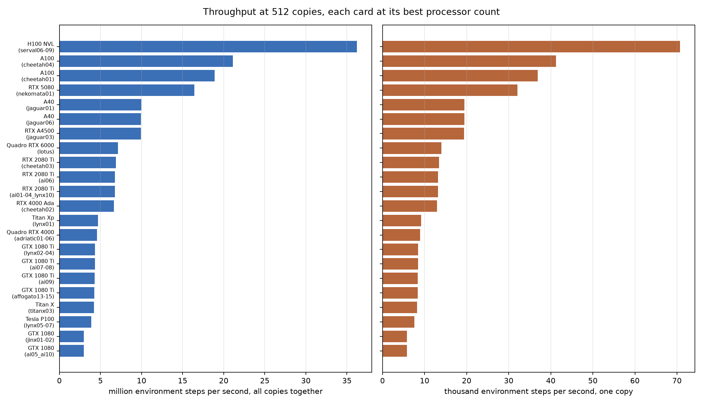
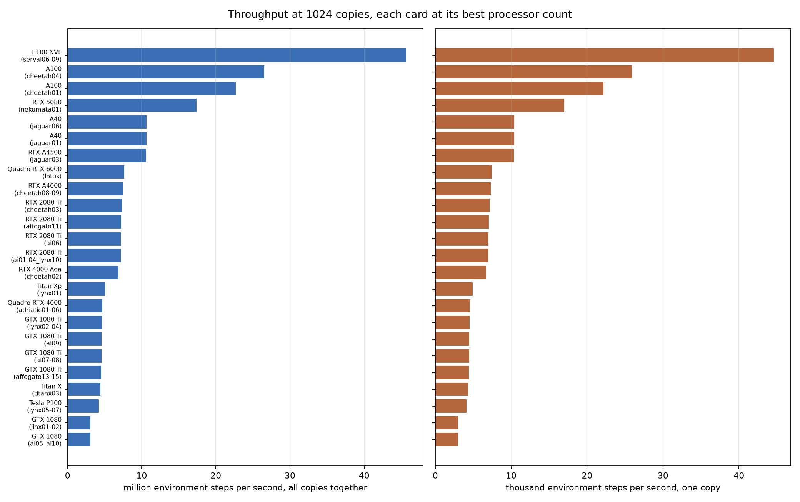
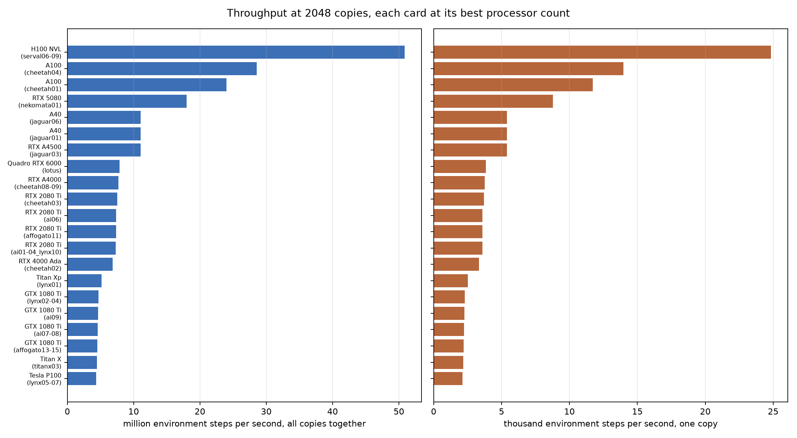
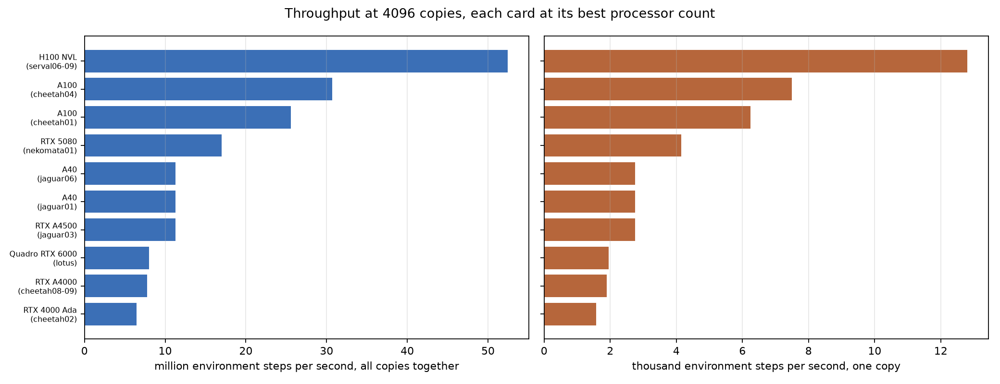
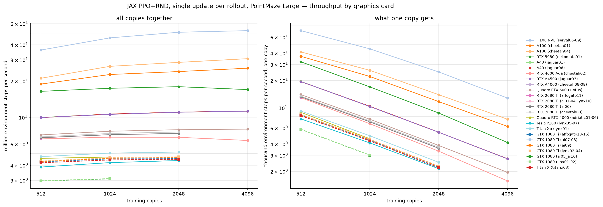
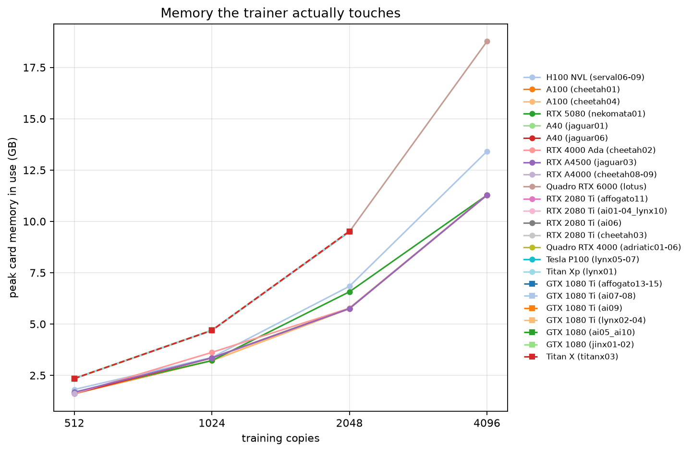

# Throughput of the single-update JAX PPO+RND trainer on every graphics card of this cluster

Written 2026-08-16 16:46 PT. Times in this document are Pacific; the cluster's machines run Eastern, so every machine timestamp is converted where it is displayed.

68 of 80 jobs have reported, giving 221 measured cells; 46 cells did not fit on their card. 12 jobs are still queued or unrun — every number below is what has arrived, not a complete survey.

## 1. What was measured

One training iteration of `ppo/jax_ppo/jax_ppo_rnd.py` in its single-update style (`full_batch`): a 128-step rollout in the batched PointMaze Large environment with no reset noise on the start or the goal, the running statistics, both advantage streams, and one gradient step over the whole batch. Every copy runs 4 environments, so one iteration advances 512 environment steps per copy.

Two rates describe every measurement, and neither substitutes for the other. The aggregate rate says how much work the machine does; the per-copy rate says how long any single copy takes to finish. Writing $s$ for the seconds one iteration takes, $C$ for the number of copies, $T = 128$ for the rollout length and $N = 4$ for the environments per copy:

$$\text{total steps per second} = \frac{C\thinspace T\thinspace N}{s}, \qquad \text{steps per second per copy} = \frac{T\thinspace N}{s}, \qquad \text{hours per million steps per copy} = \frac{10^{6}}{3600\thinspace (T N / s)}.$$

A number is quoted only after the middle half of its timing rounds agreed to within 2% of their median, with compilation and five warm-up iterations discarded first; the spread each number settled to is in the last column of every table.

One job covers all four copy counts on one card at one processor count, and is held under a 27-minute deadline so it stays inside the half hour the survey was asked to keep to. No job came close to it: the longest ran 22 minutes and 20 seconds, and none had to abandon a copy count for lack of time.

## 2. The hardware the survey covers

One node per node class — nodes identical in card type, card memory, processor type and partition — because two nodes of one class are the same machine twice. Processor counts are 8, 16 and 32; a class that cannot allocate 32 (its node reserves one core for the system) is measured at its own maximum instead, and that maximum is named in the table.

| node class | partition | card | compute capability | card memory (GB) | processor | processor counts measured | cells done |
|---|---|---|---|---|---|---|---|
| `serval03` | gpu | H100 NVL | 9.0 | 95.8 | amd epyc 9534 | none yet | 0/12 |
| `serval06-09` | gpu | H100 NVL | 9.0 | 95.8 | amd epyc 9354 | 8, 16, 32 | 12/12 |
| `cheetah01` | gpu | A100 | 8.0 | 41.0 | amd epyc 7252 | 8, 16, 28 | 11/12 |
| `cheetah04` | gpu | A100 | 8.0 | 81.1 | amd epyc 7742 | 8, 16, 32 | 12/12 |
| `nekomata01` | gpu | RTX 5080 | 12.0 | 16.3 | icelake | 8, 16, 22 | 12/12 |
| `jaguar01` | gpu | A40 | 8.6 | 46.1 | skylake | 8, 16, 32 | 12/12 |
| `jaguar06` | gpu | A40 | 8.6 | 46.1 | icelake | 8, 16, 32 | 12/12 |
| `cheetah02` | gpu | RTX 4000 Ada | 8.9 | 20.5 | skylake | 8, 16, 32 | 12/12 |
| `jaguar03` | gpu | RTX A4500 | 8.6 | 20.5 | amd epyc 7663 | 8, 16, 32 | 12/12 |
| `cheetah08-09` | gpu | RTX A4000 | 8.6 | 16.4 | skylake | 8, 16 | 7/12 |
| `jaguar02` | gpu | A16 | 8.6 | 15.4 | icelake | none yet | 0/12 |
| `lotus` | gpu | Quadro RTX 6000 | 7.5 | 24.1 | skylake | 8, 16, 32 | 12/12 |
| `affogato11` | gpu | RTX 2080 Ti | 7.5 | 10.9 | broadwell | 8 | 3/12 |
| `ai01-04_lynx10` | gpu | RTX 2080 Ti | 7.5 | 10.9 | broadwell | 8, 16, 30 | 9/12 |
| `ai06` | gpu | RTX 2080 Ti | 7.5 | 10.9 | broadwell | 8, 16, 30 | 9/12 |
| `cheetah03` | gpu | RTX 2080 Ti | 7.5 | 10.9 | skylake | 8, 16, 32 | 9/12 |
| `adriatic01-06` | gpu | Quadro RTX 4000 | 7.5 | 7.8 | skylake | 8, 16, 30 | 6/12 |
| `jaguar05` | gpu | Quadro RTX 4000 | 7.5 | 7.8 | skylake | none yet | 0/8 |
| `lynx05-07` | gpu | Tesla P100 | 6.0 | 12.2 | broadwell | 8, 16, 30 | 9/12 |
| `lynx01` | gpu | Titan Xp | 6.1 | 12.2 | broadwell | 8, 16, 30 | 9/12 |
| `affogato13-15` | gpu | GTX 1080 Ti | 6.1 | 11.3 | broadwell | 8, 16, 30 | 9/12 |
| `ai07-08` | gnolim | GTX 1080 Ti | 6.1 | 11.3 | skylake | 8, 16, 30 | 9/12 |
| `ai09` | gnolim | GTX 1080 Ti | 6.1 | 11.3 | skylake | 8, 16, 30 | 9/12 |
| `lynx02-04` | gpu | GTX 1080 Ti | 6.1 | 11.3 | broadwell | 8, 16, 30 | 9/12 |
| `ai05_ai10` | gnolim | GTX 1080 | 6.1 | 8.2 | skylake | 8, 16 | 4/12 |
| `jinx01-02` | gnolim | GTX 1080 | 6.1 | 8.2 | haswell | 8, 16, 22 | 6/12 |
| `titanx03` | gnolim | Titan X | 6.1 (catalog says 5.2) | 12.3 | haswell | 8, 16, 22 | 7/12 |

All 23 classes probed so far run the trainer: JAX 0.10.2 with the CUDA 12 plugin reaches every card generation here, from compute capability 6.0 (Tesla P100, 2016) to 12.0 (RTX 5080, 2025), so no node class had to be dropped for lack of support.

## 3. Where to send a run

The tables in section 4 carry every card; this one carries the answer. Ten million steps per copy is the length of a real training run in this project, so the wall time is quoted for that.

| copies | fastest card | node class | hours for ten million steps per copy | next best card, and how much longer it takes | cards that cannot hold this run |
|---|---|---|---|---|---|
| 512 | H100 NVL | `serval06-09` | 0.04 | A100, 1.72 times as long | 0 |
| 1024 | H100 NVL | `serval06-09` | 0.06 | A100, 1.72 times as long | 0 |
| 2048 | H100 NVL | `serval06-09` | 0.11 | A100, 1.78 times as long | 3 |
| 4096 | H100 NVL | `serval06-09` | 0.22 | A100, 1.71 times as long | 14 |

## 4.1 512 copies

Each class at whichever of its processor counts ran fastest. Best value in bold, second best underlined; the table is sorted by the aggregate rate. Taking the fastest of a class's three processor counts flatters each row a little, since it is the smallest of three timings of what section 6 shows to be the same quantity; the effect is under 1%, which is the size of the gap between the processor counts themselves.

| node class | card | processors | seconds per iteration | total steps per second (millions) &darr; | steps per second per copy | hours per million steps per copy | peak card memory (GB) | spread of the middle half |
|---|---|---|---|---|---|---|---|---|
| `serval06-09` | H100 NVL | 8 | 0.0072 | **36.21** | 70,725 | **0.004** | 1.8 | 0.09% |
| `cheetah04` | A100 | 16 | 0.0124 | <u>21.11</u> | 41,227 | <u>0.007</u> | 1.7 | 0.01% |
| `cheetah01` | A100 | 8 | 0.0139 | 18.89 | 36,892 | 0.008 | 1.6 | 0.01% |
| `nekomata01` | RTX 5080 | 8 | 0.0159 | 16.44 | 32,107 | 0.009 | 1.7 | 0.01% |
| `jaguar01` | A40 | 32 | 0.0263 | 9.97 | 19,482 | 0.014 | 1.6 | 0.02% |
| `jaguar03` | RTX A4500 | 32 | 0.0263 | 9.96 | 19,462 | 0.014 | 1.7 | 0.11% |
| `jaguar06` | A40 | 16 | 0.0264 | 9.95 | 19,426 | 0.014 | 1.6 | 0.01% |
| `lotus` | Quadro RTX 6000 | 16 | 0.0367 | 7.15 | 13,964 | 0.020 | 2.3 | 0.16% |
| `cheetah08-09` | RTX A4000 | 16 | 0.0367 | 7.13 | 13,932 | 0.020 | 1.6 | 0.16% |
| `cheetah03` | RTX 2080 Ti | 32 | 0.0381 | 6.88 | 13,443 | 0.021 | 2.3 | 0.22% |
| `ai06` | RTX 2080 Ti | 30 | 0.0387 | 6.77 | 13,219 | 0.021 | 2.3 | 0.25% |
| `ai01-04_lynx10` | RTX 2080 Ti | 8 | 0.0388 | 6.76 | 13,197 | 0.021 | 2.3 | 0.31% |
| `affogato11` | RTX 2080 Ti | 8 | 0.0392 | 6.69 | 13,065 | 0.021 | 2.3 | 0.12% |
| `cheetah02` | RTX 4000 Ada | 32 | 0.0396 | 6.62 | 12,930 | 0.021 | 1.6 | 0.03% |
| `lynx01` | Titan Xp | 8 | 0.0555 | 4.72 | 9,219 | 0.030 | 2.3 | 0.29% |
| `adriatic01-06` | Quadro RTX 4000 | 8 | 0.0574 | 4.56 | 8,912 | 0.031 | 2.3 | 0.24% |
| `lynx02-04` | GTX 1080 Ti | 8 | 0.0605 | 4.33 | 8,462 | 0.033 | 2.3 | 0.05% |
| `ai07-08` | GTX 1080 Ti | 30 | 0.0608 | 4.31 | 8,422 | 0.033 | 2.3 | 0.41% |
| `ai09` | GTX 1080 Ti | 30 | 0.0610 | 4.30 | 8,392 | 0.033 | 2.3 | 0.27% |
| `affogato13-15` | GTX 1080 Ti | 8 | 0.0614 | 4.27 | 8,341 | 0.033 | 2.3 | 0.21% |
| `titanx03` | Titan X | 8 | 0.0625 | 4.20 | 8,196 | 0.034 | 2.3 | 0.10% |
| `lynx05-07` | Tesla P100 | 16 | 0.0678 | 3.87 | 7,550 | 0.037 | 2.3 | 0.03% |
| `jinx01-02` | GTX 1080 | 22 | 0.0882 | 2.97 | 5,805 | 0.048 | 2.3 | 0.03% |
| `ai05_ai10` | GTX 1080 | 8 | 0.0884 | 2.96 | 5,790 | 0.048 | 2.3 | 0.06% |
| `serval03` | H100 NVL | — | — | not measured yet | — | — | — | — |
| `jaguar02` | A16 | — | — | not measured yet | — | — | — | — |
| `jaguar05` | Quadro RTX 4000 | — | — | not measured yet | — | — | — | — |

## 4.2 1024 copies

Each class at whichever of its processor counts ran fastest. Best value in bold, second best underlined; the table is sorted by the aggregate rate. Taking the fastest of a class's three processor counts flatters each row a little, since it is the smallest of three timings of what section 6 shows to be the same quantity; the effect is under 1%, which is the size of the gap between the processor counts themselves.

| node class | card | processors | seconds per iteration | total steps per second (millions) &darr; | steps per second per copy | hours per million steps per copy | peak card memory (GB) | spread of the middle half |
|---|---|---|---|---|---|---|---|---|
| `serval06-09` | H100 NVL | 8 | 0.0115 | **45.67** | 44,599 | **0.006** | 3.4 | 0.35% |
| `cheetah04` | A100 | 32 | 0.0198 | <u>26.50</u> | 25,882 | <u>0.011</u> | 3.2 | 0.01% |
| `cheetah01` | A100 | 28 | 0.0231 | 22.71 | 22,180 | 0.013 | 3.2 | 0.06% |
| `nekomata01` | RTX 5080 | 8 | 0.0301 | 17.42 | 17,010 | 0.016 | 3.2 | 0.02% |
| `jaguar06` | A40 | 8 | 0.0493 | 10.65 | 10,396 | 0.027 | 3.4 | 0.01% |
| `jaguar01` | A40 | 32 | 0.0493 | 10.64 | 10,387 | 0.027 | 3.4 | 0.19% |
| `jaguar03` | RTX A4500 | 32 | 0.0496 | 10.58 | 10,332 | 0.027 | 3.4 | 0.01% |
| `lotus` | Quadro RTX 6000 | 8 | 0.0684 | 7.67 | 7,486 | 0.037 | 4.7 | 0.17% |
| `cheetah08-09` | RTX A4000 | 16 | 0.0701 | 7.48 | 7,308 | 0.038 | 3.4 | 0.11% |
| `cheetah03` | RTX 2080 Ti | 8 | 0.0714 | 7.34 | 7,171 | 0.039 | 4.7 | 0.13% |
| `affogato11` | RTX 2080 Ti | 8 | 0.0726 | 7.22 | 7,048 | 0.039 | 4.7 | 0.15% |
| `ai06` | RTX 2080 Ti | 8 | 0.0730 | 7.18 | 7,011 | 0.040 | 4.7 | 0.20% |
| `ai01-04_lynx10` | RTX 2080 Ti | 8 | 0.0730 | 7.18 | 7,009 | 0.040 | 4.7 | 0.50% |
| `cheetah02` | RTX 4000 Ada | 8 | 0.0766 | 6.84 | 6,682 | 0.042 | 3.6 | 0.00% |
| `lynx01` | Titan Xp | 8 | 0.1039 | 5.05 | 4,928 | 0.056 | 4.7 | 0.10% |
| `adriatic01-06` | Quadro RTX 4000 | 30 | 0.1120 | 4.68 | 4,571 | 0.061 | 4.7 | 0.17% |
| `lynx02-04` | GTX 1080 Ti | 8 | 0.1134 | 4.62 | 4,513 | 0.062 | 4.7 | 0.12% |
| `ai09` | GTX 1080 Ti | 30 | 0.1146 | 4.57 | 4,467 | 0.062 | 4.7 | 0.25% |
| `ai07-08` | GTX 1080 Ti | 30 | 0.1148 | 4.57 | 4,459 | 0.062 | 4.7 | 0.13% |
| `affogato13-15` | GTX 1080 Ti | 8 | 0.1160 | 4.52 | 4,412 | 0.063 | 4.7 | 0.15% |
| `titanx03` | Titan X | 8 | 0.1184 | 4.43 | 4,326 | 0.064 | 4.7 | 0.22% |
| `lynx05-07` | Tesla P100 | 16 | 0.1246 | 4.21 | 4,108 | 0.068 | 4.7 | 0.02% |
| `jinx01-02` | GTX 1080 | 16 | 0.1692 | 3.10 | 3,026 | 0.092 | 4.7 | 0.06% |
| `ai05_ai10` | GTX 1080 | 8 | 0.1699 | 3.09 | 3,014 | 0.092 | 4.7 | 0.17% |
| `serval03` | H100 NVL | — | — | not measured yet | — | — | — | — |
| `jaguar02` | A16 | — | — | not measured yet | — | — | — | — |
| `jaguar05` | Quadro RTX 4000 | — | — | not measured yet | — | — | — | — |

## 4.3 2048 copies

Each class at whichever of its processor counts ran fastest. Best value in bold, second best underlined; the table is sorted by the aggregate rate. Taking the fastest of a class's three processor counts flatters each row a little, since it is the smallest of three timings of what section 6 shows to be the same quantity; the effect is under 1%, which is the size of the gap between the processor counts themselves.

| node class | card | processors | seconds per iteration | total steps per second (millions) &darr; | steps per second per copy | hours per million steps per copy | peak card memory (GB) | spread of the middle half |
|---|---|---|---|---|---|---|---|---|
| `serval06-09` | H100 NVL | 32 | 0.0206 | **50.86** | 24,835 | **0.011** | 6.8 | 0.82% |
| `cheetah04` | A100 | 32 | 0.0367 | <u>28.59</u> | 13,960 | <u>0.020</u> | 5.8 | 0.03% |
| `cheetah01` | A100 | 8 | 0.0437 | 23.99 | 11,712 | 0.024 | 5.8 | 0.04% |
| `nekomata01` | RTX 5080 | 8 | 0.0584 | 17.96 | 8,771 | 0.032 | 6.6 | 0.02% |
| `jaguar06` | A40 | 32 | 0.0950 | 11.04 | 5,391 | 0.052 | 5.8 | 0.01% |
| `jaguar01` | A40 | 16 | 0.0950 | 11.03 | 5,387 | 0.052 | 5.8 | 0.04% |
| `jaguar03` | RTX A4500 | 16 | 0.0951 | 11.03 | 5,384 | 0.052 | 5.8 | 0.03% |
| `lotus` | Quadro RTX 6000 | 16 | 0.1328 | 7.89 | 3,854 | 0.072 | 9.5 | 0.13% |
| `cheetah08-09` | RTX A4000 | 8 | 0.1366 | 7.67 | 3,747 | 0.074 | 5.8 | 0.11% |
| `cheetah03` | RTX 2080 Ti | 32 | 0.1388 | 7.56 | 3,690 | 0.075 | 9.5 | 0.16% |
| `ai06` | RTX 2080 Ti | 30 | 0.1427 | 7.35 | 3,589 | 0.077 | 9.5 | 0.45% |
| `affogato11` | RTX 2080 Ti | 8 | 0.1430 | 7.33 | 3,581 | 0.078 | 9.5 | 0.20% |
| `ai01-04_lynx10` | RTX 2080 Ti | 16 | 0.1431 | 7.33 | 3,577 | 0.078 | 9.5 | 0.71% |
| `cheetah02` | RTX 4000 Ada | 8 | 0.1536 | 6.83 | 3,334 | 0.083 | 5.8 | 0.03% |
| `lynx01` | Titan Xp | 8 | 0.2036 | 5.15 | 2,515 | 0.110 | 9.5 | 1.04% |
| `lynx02-04` | GTX 1080 Ti | 16 | 0.2232 | 4.70 | 2,294 | 0.121 | 9.5 | 0.27% |
| `ai09` | GTX 1080 Ti | 16 | 0.2265 | 4.63 | 2,261 | 0.123 | 9.5 | 0.68% |
| `ai07-08` | GTX 1080 Ti | 8 | 0.2279 | 4.60 | 2,247 | 0.124 | 9.5 | 0.65% |
| `affogato13-15` | GTX 1080 Ti | 30 | 0.2309 | 4.54 | 2,218 | 0.125 | 9.5 | 0.44% |
| `titanx03` | Titan X | 8 | 0.2340 | 4.48 | 2,188 | 0.127 | 9.5 | 0.52% |
| `lynx05-07` | Tesla P100 | 8 | 0.2395 | 4.38 | 2,138 | 0.130 | 9.5 | 0.02% |
| `serval03` | H100 NVL | — | — | not measured yet | — | — | — | — |
| `jaguar02` | A16 | — | — | not measured yet | — | — | — | — |
| `adriatic01-06` | Quadro RTX 4000 | — | — | **does not fit** | — | — | — | — |
| `jaguar05` | Quadro RTX 4000 | — | — | not measured yet | — | — | — | — |
| `ai05_ai10` | GTX 1080 | — | — | **does not fit** | — | — | — | — |
| `jinx01-02` | GTX 1080 | — | — | **does not fit** | — | — | — | — |

## 4.4 4096 copies

Each class at whichever of its processor counts ran fastest. Best value in bold, second best underlined; the table is sorted by the aggregate rate. Taking the fastest of a class's three processor counts flatters each row a little, since it is the smallest of three timings of what section 6 shows to be the same quantity; the effect is under 1%, which is the size of the gap between the processor counts themselves.

| node class | card | processors | seconds per iteration | total steps per second (millions) &darr; | steps per second per copy | hours per million steps per copy | peak card memory (GB) | spread of the middle half |
|---|---|---|---|---|---|---|---|---|
| `serval06-09` | H100 NVL | 32 | 0.0400 | **52.44** | 12,802 | **0.022** | 13.4 | 0.04% |
| `cheetah04` | A100 | 16 | 0.0683 | <u>30.69</u> | 7,492 | <u>0.037</u> | 11.3 | 0.01% |
| `cheetah01` | A100 | 8 | 0.0820 | 25.58 | 6,244 | 0.044 | 11.3 | 0.05% |
| `nekomata01` | RTX 5080 | 16 | 0.1234 | 17.00 | 4,150 | 0.067 | 11.3 | 0.01% |
| `jaguar06` | A40 | 32 | 0.1860 | 11.27 | 2,752 | 0.101 | 11.3 | 0.03% |
| `jaguar01` | A40 | 16 | 0.1862 | 11.27 | 2,750 | 0.101 | 11.3 | 0.01% |
| `jaguar03` | RTX A4500 | 8 | 0.1864 | 11.25 | 2,747 | 0.101 | 11.3 | 0.01% |
| `lotus` | Quadro RTX 6000 | 32 | 0.2628 | 7.98 | 1,949 | 0.143 | 18.8 | 0.18% |
| `cheetah08-09` | RTX A4000 | 8 | 0.2696 | 7.78 | 1,899 | 0.146 | 11.3 | 0.04% |
| `cheetah02` | RTX 4000 Ada | 8 | 0.3265 | 6.42 | 1,568 | 0.177 | 11.3 | 0.03% |
| `serval03` | H100 NVL | — | — | not measured yet | — | — | — | — |
| `jaguar02` | A16 | — | — | not measured yet | — | — | — | — |
| `affogato11` | RTX 2080 Ti | — | — | **does not fit** | — | — | — | — |
| `ai01-04_lynx10` | RTX 2080 Ti | — | — | **does not fit** | — | — | — | — |
| `ai06` | RTX 2080 Ti | — | — | **does not fit** | — | — | — | — |
| `cheetah03` | RTX 2080 Ti | — | — | **does not fit** | — | — | — | — |
| `adriatic01-06` | Quadro RTX 4000 | — | — | **does not fit** | — | — | — | — |
| `jaguar05` | Quadro RTX 4000 | — | — | not measured yet | — | — | — | — |
| `lynx05-07` | Tesla P100 | — | — | **does not fit** | — | — | — | — |
| `lynx01` | Titan Xp | — | — | **does not fit** | — | — | — | — |
| `affogato13-15` | GTX 1080 Ti | — | — | **does not fit** | — | — | — | — |
| `ai07-08` | GTX 1080 Ti | — | — | **does not fit** | — | — | — | — |
| `ai09` | GTX 1080 Ti | — | — | **does not fit** | — | — | — | — |
| `lynx02-04` | GTX 1080 Ti | — | — | **does not fit** | — | — | — | — |
| `ai05_ai10` | GTX 1080 | — | — | **does not fit** | — | — | — | — |
| `jinx01-02` | GTX 1080 | — | — | **does not fit** | — | — | — | — |
| `titanx03` | Titan X | — | — | **does not fit** | — | — | — | — |

## 5. How throughput scales with copies

## 6. Does the processor count matter

The trainer keeps its arrays on the card and the host only dispatches, so the expectation is that 8, 16 and 32 processors give the same iteration time.

**It does not.** Over the 75 card-and-copy-count combinations measured at two or more processor counts, the slowest processor count was slower than the fastest by 0.2% in the typical case and 2.6% at the very worst — the size of the measurement's own noise, and with no consistent direction: more processors are as often marginally slower as marginally faster. Eight processors is therefore the right request for this trainer, and the processors beyond that are free to carry other work.

The table below is the evidence, one row per card and copy count; its last column is the span between the fastest and the slowest processor count as a fraction of the fastest. A count this node class cannot allocate reads N/A; one it can allocate but has not yet reported reads "not yet".

| node class | card | copies | 8 processors (ms per iteration) | 16 processors (ms per iteration) | 32 processors (ms per iteration) | class maximum (processors, ms) | spread across processor counts |
|---|---|---|---|---|---|---|---|
| `serval06-09` | H100 NVL | 512 | 7.2 | 7.3 | 7.2 | N/A | 0.2% |
| `serval06-09` | H100 NVL | 1024 | 11.5 | 11.5 | 11.5 | N/A | 0.2% |
| `serval06-09` | H100 NVL | 2048 | 20.9 | 20.8 | 20.6 | N/A | 1.4% |
| `serval06-09` | H100 NVL | 4096 | 40.0 | 40.0 | 40.0 | N/A | 0.0% |
| `cheetah01` | A100 | 512 | 13.9 | 14.0 | N/A | 28, 13.9 | 0.9% |
| `cheetah01` | A100 | 1024 | 23.1 | 23.1 | N/A | 28, 23.1 | 0.2% |
| `cheetah01` | A100 | 2048 | 43.7 | 43.9 | N/A | 28, 43.9 | 0.5% |
| `cheetah01` | A100 | 4096 | 82.0 | 82.2 | N/A | 28, not yet | 0.3% |
| `cheetah04` | A100 | 512 | 12.5 | 12.4 | 12.4 | N/A | 0.4% |
| `cheetah04` | A100 | 1024 | 20.1 | 20.0 | 19.8 | N/A | 1.6% |
| `cheetah04` | A100 | 2048 | 36.8 | 36.7 | 36.7 | N/A | 0.3% |
| `cheetah04` | A100 | 4096 | 68.5 | 68.3 | 68.4 | N/A | 0.2% |
| `nekomata01` | RTX 5080 | 512 | 15.9 | 15.9 | N/A | 22, 16.0 | 0.0% |
| `nekomata01` | RTX 5080 | 1024 | 30.1 | 30.1 | N/A | 22, 30.1 | 0.1% |
| `nekomata01` | RTX 5080 | 2048 | 58.4 | 58.5 | N/A | 22, 58.5 | 0.2% |
| `nekomata01` | RTX 5080 | 4096 | 123.5 | 123.4 | N/A | 22, 123.5 | 0.1% |
| `jaguar01` | A40 | 512 | 26.4 | 26.5 | 26.3 | N/A | 0.9% |
| `jaguar01` | A40 | 1024 | 49.3 | 49.4 | 49.3 | N/A | 0.2% |
| `jaguar01` | A40 | 2048 | 95.2 | 95.0 | 95.1 | N/A | 0.1% |
| `jaguar01` | A40 | 4096 | 186.3 | 186.2 | 186.2 | N/A | 0.1% |
| `jaguar06` | A40 | 512 | 26.4 | 26.4 | 26.4 | N/A | 0.3% |
| `jaguar06` | A40 | 1024 | 49.3 | 49.4 | 49.5 | N/A | 0.5% |
| `jaguar06` | A40 | 2048 | 95.3 | 95.0 | 95.0 | N/A | 0.3% |
| `jaguar06` | A40 | 4096 | 186.1 | 186.1 | 186.0 | N/A | 0.0% |
| `cheetah02` | RTX 4000 Ada | 512 | 39.6 | 39.6 | 39.6 | N/A | 0.1% |
| `cheetah02` | RTX 4000 Ada | 1024 | 76.6 | 76.7 | 76.7 | N/A | 0.1% |
| `cheetah02` | RTX 4000 Ada | 2048 | 153.6 | 153.6 | 153.7 | N/A | 0.1% |
| `cheetah02` | RTX 4000 Ada | 4096 | 326.5 | 326.5 | 326.7 | N/A | 0.1% |
| `jaguar03` | RTX A4500 | 512 | 26.4 | 26.4 | 26.3 | N/A | 0.4% |
| `jaguar03` | RTX A4500 | 1024 | 49.6 | 49.6 | 49.6 | N/A | 0.2% |
| `jaguar03` | RTX A4500 | 2048 | 95.1 | 95.1 | 95.2 | N/A | 0.1% |
| `jaguar03` | RTX A4500 | 4096 | 186.4 | 186.4 | 186.5 | N/A | 0.1% |
| `cheetah08-09` | RTX A4000 | 512 | 36.8 | 36.7 | not yet | N/A | 0.1% |
| `cheetah08-09` | RTX A4000 | 1024 | 70.2 | 70.1 | not yet | N/A | 0.2% |
| `cheetah08-09` | RTX A4000 | 2048 | 136.6 | 136.8 | not yet | N/A | 0.1% |
| `lotus` | Quadro RTX 6000 | 512 | 36.7 | 36.7 | 36.8 | N/A | 0.4% |
| `lotus` | Quadro RTX 6000 | 1024 | 68.4 | 68.4 | 68.5 | N/A | 0.2% |
| `lotus` | Quadro RTX 6000 | 2048 | 133.4 | 132.8 | 133.5 | N/A | 0.5% |
| `lotus` | Quadro RTX 6000 | 4096 | 263.3 | 263.5 | 262.8 | N/A | 0.3% |
| `ai01-04_lynx10` | RTX 2080 Ti | 512 | 38.8 | 38.9 | N/A | 30, 38.9 | 0.3% |
| `ai01-04_lynx10` | RTX 2080 Ti | 1024 | 73.0 | 73.2 | N/A | 30, 73.2 | 0.2% |
| `ai01-04_lynx10` | RTX 2080 Ti | 2048 | 143.2 | 143.1 | N/A | 30, 143.2 | 0.1% |
| `ai06` | RTX 2080 Ti | 512 | 38.8 | 38.9 | N/A | 30, 38.7 | 0.4% |
| `ai06` | RTX 2080 Ti | 1024 | 73.0 | 73.0 | N/A | 30, 73.1 | 0.1% |
| `ai06` | RTX 2080 Ti | 2048 | 142.8 | 142.7 | N/A | 30, 142.7 | 0.1% |
| `cheetah03` | RTX 2080 Ti | 512 | 38.1 | 38.1 | 38.1 | N/A | 0.1% |
| `cheetah03` | RTX 2080 Ti | 1024 | 71.4 | 71.8 | 72.0 | N/A | 0.8% |
| `cheetah03` | RTX 2080 Ti | 2048 | 139.8 | 139.7 | 138.8 | N/A | 0.7% |
| `adriatic01-06` | Quadro RTX 4000 | 512 | 57.4 | 57.5 | N/A | 30, 57.5 | 0.1% |
| `adriatic01-06` | Quadro RTX 4000 | 1024 | 112.1 | 112.1 | N/A | 30, 112.0 | 0.1% |
| `lynx05-07` | Tesla P100 | 512 | 67.8 | 67.8 | N/A | 30, 67.8 | 0.0% |
| `lynx05-07` | Tesla P100 | 1024 | 124.7 | 124.6 | N/A | 30, 124.7 | 0.1% |
| `lynx05-07` | Tesla P100 | 2048 | 239.5 | 240.0 | N/A | 30, 240.0 | 0.2% |
| `lynx01` | Titan Xp | 512 | 55.5 | 55.8 | N/A | 30, 55.6 | 0.5% |
| `lynx01` | Titan Xp | 1024 | 103.9 | 105.0 | N/A | 30, 103.9 | 1.1% |
| `lynx01` | Titan Xp | 2048 | 203.6 | 204.0 | N/A | 30, 203.8 | 0.2% |
| `affogato13-15` | GTX 1080 Ti | 512 | 61.4 | 61.6 | N/A | 30, 61.5 | 0.4% |
| `affogato13-15` | GTX 1080 Ti | 1024 | 116.0 | 116.2 | N/A | 30, 116.1 | 0.1% |
| `affogato13-15` | GTX 1080 Ti | 2048 | 230.9 | 231.1 | N/A | 30, 230.9 | 0.1% |
| `ai07-08` | GTX 1080 Ti | 512 | 62.0 | 62.2 | N/A | 30, 60.8 | 2.4% |
| `ai07-08` | GTX 1080 Ti | 1024 | 117.2 | 117.3 | N/A | 30, 114.8 | 2.2% |
| `ai07-08` | GTX 1080 Ti | 2048 | 227.9 | 229.8 | N/A | 30, 228.0 | 0.9% |
| `ai09` | GTX 1080 Ti | 512 | 62.0 | 62.2 | N/A | 30, 61.0 | 1.9% |
| `ai09` | GTX 1080 Ti | 1024 | 117.2 | 117.3 | N/A | 30, 114.6 | 2.3% |
| `ai09` | GTX 1080 Ti | 2048 | 232.3 | 226.5 | N/A | 30, 227.5 | 2.6% |
| `lynx02-04` | GTX 1080 Ti | 512 | 60.5 | 60.6 | N/A | 30, 61.5 | 1.6% |
| `lynx02-04` | GTX 1080 Ti | 1024 | 113.4 | 114.3 | N/A | 30, 113.7 | 0.8% |
| `lynx02-04` | GTX 1080 Ti | 2048 | 226.1 | 223.2 | N/A | 30, 226.6 | 1.5% |
| `ai05_ai10` | GTX 1080 | 512 | 88.4 | 88.5 | N/A | 30, not yet | 0.0% |
| `ai05_ai10` | GTX 1080 | 1024 | 169.9 | 170.0 | N/A | 30, not yet | 0.1% |
| `jinx01-02` | GTX 1080 | 512 | 88.2 | 88.2 | N/A | 22, 88.2 | 0.0% |
| `jinx01-02` | GTX 1080 | 1024 | 169.4 | 169.2 | N/A | 22, 169.3 | 0.1% |
| `titanx03` | Titan X | 512 | 62.5 | 63.5 | N/A | 22, 62.7 | 1.6% |
| `titanx03` | Titan X | 1024 | 118.4 | 120.0 | N/A | 22, not yet | 1.4% |
| `titanx03` | Titan X | 2048 | 234.0 | 234.1 | N/A | 22, not yet | 0.0% |

## 7. Memory, and which cards cannot hold a run

Memory grows in proportion to the copy count — doubling the copies doubles the peak — so the cost per copy measured at any one count says where a card's ceiling is. The last column applies that: the card's memory, less about a gigabyte the driver and the compiled program hold outside the trainer's arrays, divided by the cost of one copy. That figure is a projection, not a measurement: on the largest cards it extrapolates several times past the biggest copy count anyone ran here, and it assumes the proportionality holds that far, which nothing in this survey checked.

| node class | card | card memory (GB) | 512 copies (GB) | 1024 copies (GB) | 2048 copies (GB) | 4096 copies (GB) | GB per 1,000 copies | largest copy count that fits |
|---|---|---|---|---|---|---|---|---|
| `serval06-09` | H100 NVL | 95.8 | 1.8 | 3.4 | 6.8 | 13.4 | 3.36 | all four; ~28,216 |
| `cheetah01` | A100 | 41.0 | 1.6 | 3.2 | 5.8 | 11.3 | 2.96 | all four; ~13,490 |
| `cheetah04` | A100 | 81.1 | 1.7 | 3.2 | 5.8 | 11.3 | 2.99 | all four; ~26,767 |
| `nekomata01` | RTX 5080 | 16.3 | 1.7 | 3.2 | 6.6 | 11.3 | 3.09 | all four; ~4,945 |
| `jaguar01` | A40 | 46.1 | 1.6 | 3.4 | 5.8 | 11.3 | 3.00 | all four; ~15,032 |
| `jaguar06` | A40 | 46.1 | 1.6 | 3.4 | 5.8 | 11.3 | 3.00 | all four; ~15,044 |
| `cheetah02` | RTX 4000 Ada | 20.5 | 1.6 | 3.6 | 5.8 | 11.3 | 3.06 | all four; ~6,359 |
| `jaguar03` | RTX A4500 | 20.5 | 1.7 | 3.4 | 5.8 | 11.3 | 3.03 | all four; ~6,431 |
| `cheetah08-09` | RTX A4000 | 16.4 | 1.6 | 3.4 | 5.8 | 11.3 | 3.00 | all four; ~5,129 |
| `lotus` | Quadro RTX 6000 | 24.1 | 2.3 | 4.7 | 9.5 | 18.8 | 4.60 | all four; ~5,018 |
| `affogato11` | RTX 2080 Ti | 10.9 | 2.3 | 4.7 | 9.5 | does not fit | 4.60 | 2,048 |
| `ai01-04_lynx10` | RTX 2080 Ti | 10.9 | 2.3 | 4.7 | 9.5 | does not fit | 4.60 | 2,048 |
| `ai06` | RTX 2080 Ti | 10.9 | 2.3 | 4.7 | 9.5 | does not fit | 4.60 | 2,048 |
| `cheetah03` | RTX 2080 Ti | 10.9 | 2.3 | 4.7 | 9.5 | does not fit | 4.60 | 2,048 |
| `adriatic01-06` | Quadro RTX 4000 | 7.8 | 2.3 | 4.7 | does not fit | does not fit | 4.58 | 1,024 |
| `lynx05-07` | Tesla P100 | 12.2 | 2.3 | 4.7 | 9.5 | does not fit | 4.60 | 2,048 |
| `lynx01` | Titan Xp | 12.2 | 2.3 | 4.7 | 9.5 | does not fit | 4.60 | 2,048 |
| `affogato13-15` | GTX 1080 Ti | 11.3 | 2.3 | 4.7 | 9.5 | does not fit | 4.60 | 2,048 |
| `ai07-08` | GTX 1080 Ti | 11.3 | 2.3 | 4.7 | 9.5 | does not fit | 4.60 | 2,048 |
| `ai09` | GTX 1080 Ti | 11.3 | 2.3 | 4.7 | 9.5 | does not fit | 4.60 | 2,048 |
| `lynx02-04` | GTX 1080 Ti | 11.3 | 2.3 | 4.7 | 9.5 | does not fit | 4.60 | 2,048 |
| `ai05_ai10` | GTX 1080 | 8.2 | 2.3 | 4.7 | does not fit | does not fit | 4.58 | 1,024 |
| `jinx01-02` | GTX 1080 | 8.2 | 2.3 | 4.7 | does not fit | does not fit | 4.58 | 1,024 |
| `titanx03` | Titan X | 12.3 | 2.3 | 4.7 | 9.5 | does not fit | 4.60 | 2,048 |

**The same run needs 66% more memory on an older card.** Every card at compute capability 8.0 and above — Ampere, Ada, Hopper, Blackwell — holds 4,096 copies in about 11.3 GB, while every Turing and Pascal card needs about 18.8 GB for exactly the same work, and the H100 sits slightly above its generation at 13.4 GB. The split follows the card generation and not the card's size or speed, so it is the compiler emitting a different program for the older architectures, not the trainer asking for more. What in that program costs the extra memory was not investigated here. The practical consequence is that the memory ceiling of an older card is reached about a third sooner than its size alone suggests.

## 8. What a run pays before its first iteration

The throughput figures above are steady-state: compilation and warm-up are discarded before any timing starts. A real run pays them once, and at large copy counts they are not small.

| copies | building the trainer (seconds) | compiling the iteration (seconds) | total before the first iteration | iterations that time would buy on an H100 |
|---|---|---|---|---|
| 512 | 34 | 27 | 61 | 8,406 |
| 1024 | 59 | 27 | 85 | 7,419 |
| 2048 | 114 | 30 | 144 | 6,895 |
| 4096 | 217 | 39 | 255 | 6,388 |

More processors do not shorten it. At 4,096 copies the build took 211 s on 8, 220 s on 16, 196 s on 22, 218 s on 32 processors — the same time throughout, because the weights are drawn one copy at a time in a single-threaded loop on the host, so the work never reaches the other processors. It is the one part of a run that would gain from being vectorised across copies rather than looped.

This is a fixed cost, so it decides whether splitting work across cards pays. Two jobs of 2,048 copies each pay the setup twice; one job of 4,096 pays it once. It also sets a floor under how short a useful run can be — at 4,096 copies the setup alone is about four minutes before a single environment step is taken.

## 9. How firm these numbers are

Across all 221 measured cells the middle half of the timing rounds sat within 0.10% of the median in the typical cell, within 0.52% in the worst 5%, and never worse than 1.11%. 221 of 221 cells reached the 2% settling target, every one of them within the six-round floor — so no number here rests on a timing that was still drifting when it was taken.

## 10. What is still missing

These jobs have not reported. Jobs pinned to a busy node stay queued on purpose and are collected when the node frees.

- `serval03` at 8 processors (H100 NVL, partition gpu) — this card is already measured on another node class, so the gap is the host processor only
- `serval03` at 16 processors (H100 NVL, partition gpu) — this card is already measured on another node class, so the gap is the host processor only
- `serval03` at 32 processors (H100 NVL, partition gpu) — this card is already measured on another node class, so the gap is the host processor only
- `cheetah08-09` at 32 processors (RTX A4000, partition gpu) — this card is already measured on another node class, so the gap is the host processor only
- `jaguar02` at 8 processors (A16, partition gpu) — **this card is measured nowhere else**
- `jaguar02` at 16 processors (A16, partition gpu) — **this card is measured nowhere else**
- `jaguar02` at 30 processors (A16, partition gpu) — **this card is measured nowhere else**
- `affogato11` at 16 processors (RTX 2080 Ti, partition gpu) — this card is already measured on another node class, so the gap is the host processor only
- `affogato11` at 30 processors (RTX 2080 Ti, partition gpu) — this card is already measured on another node class, so the gap is the host processor only
- `jaguar05` at 8 processors (Quadro RTX 4000, partition gpu) — this card is already measured on another node class, so the gap is the host processor only
- `jaguar05` at 14 processors (Quadro RTX 4000, partition gpu) — this card is already measured on another node class, so the gap is the host processor only
- `ai05_ai10` at 30 processors (GTX 1080, partition gnolim) — this card is already measured on another node class, so the gap is the host processor only
