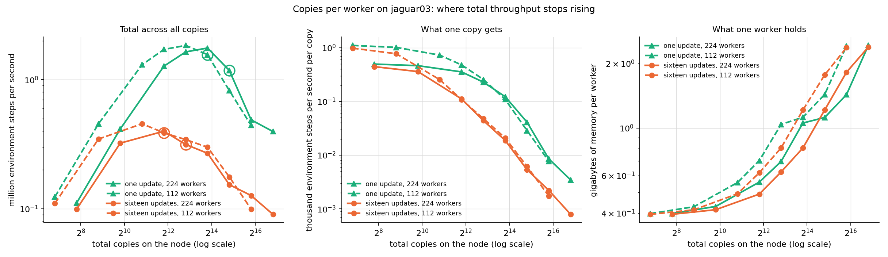

# Running many reinforcement-learning experiments at once on one graphics processor

## 1. What this report covers

This report describes a system that trains many independent reinforcement-learning agents
simultaneously on a single graphics processor, and it reports how fast that system runs. The
work is organised in three parts, and this document has one section for each:

1. **The environment** — the simulated world the agents act in.
2. **The training algorithm** — the procedure that turns experience into improved behaviour.
3. **End to end** — the two combined into a training loop, which is what is actually run.

Each section states what the part does, presents the measured results in tables and figures,
and then lists the optimisation techniques that were tried: those that were kept, and those
that were tried and abandoned, with the measurement that decided each case.

Two further sections put those numbers in context. Section 5 runs the same training loop on
ordinary processor cores, on a cluster node held exclusively so nothing else disturbed the
timings, and compares the two ways of dividing work across many cores. Section 6 names the
single best configuration on each of the two platforms within the range of scale this project
actually uses, and converts each into the wall-clock time to train every copy.

### 1.1 The problem being solved

The agent controls a ball in a two-dimensional maze. It can push the ball in two directions,
it observes the ball's position and velocity, and it receives a reward only when it reaches a
goal square in the far corner. Because the reward appears so rarely, the agent additionally
receives an internally generated "curiosity" reward for visiting unfamiliar states — a standard
method called Random Network Distillation. The learning algorithm is Proximal Policy
Optimisation, a widely used method that repeatedly collects a batch of experience and then
adjusts the agent slightly in the direction that would have made the good outcomes more likely.

Two properties of this workload drive everything that follows:

- **The individual computations are tiny.** The agent's networks have a few tens of thousands
  of parameters; a single agent uses a negligible fraction of a modern graphics processor.
- **Research requires many repetitions.** A result from one agent means little, because
  outcomes vary a great deal between random starts. Conclusions require tens or hundreds of
  independent repetitions, and often several settings of a parameter as well.

The system therefore trains many independent **copies** at once. A copy is a complete,
self-contained experiment: its own networks, its own environments, its own optimiser state,
its own random seed. Copies never exchange information; running them together is purely a
device for using the processor efficiently, and the report includes the tests that confirm
they remain independent.

### 1.2 How to read the numbers

- All throughput figures are given in **millions of environment steps per second**. One
  environment step is one action taken in one environment instance. The one exception is
  throughput *per copy*, which is given in thousands: with thousands of copies sharing the
  processor, each individual copy advances at a rate that would round to zero in millions.
- Timings are for one **training iteration**: collecting a fixed amount of experience from
  every copy and performing the resulting parameter updates. With the default settings each
  iteration collects 512 steps of experience per copy.
- All measurements were taken on one NVIDIA H100 NVL processor (95 gigabytes of memory) with
  exclusive access enforced by a lock, so no other work competed for the device.
- Where a difference is small, the report states the **noise floor**: the same configuration
  measured more than once, in alternating order, so that the spread between repeats of the
  same thing is visible next to the difference being claimed. A difference smaller than that
  spread is reported as no effect rather than as a result.

### 1.3 A note on the two conventions for updating

The training algorithm admits two ways of consuming a batch of collected experience, and both
are implemented and measured throughout:

- **One update per batch**: compute a single parameter update from all the collected data,
  then discard the data.
- **Many small updates per batch**: pass over the data four times, each pass split into four
  smaller portions, updating after each portion — sixteen updates in total.

The second does considerably more arithmetic per unit of collected experience, so it is
slower per iteration. Neither is more correct than the other; they are different algorithms
and both are reported.

## 2. The environment

### 2.1 What it does and why it was rewritten

The original environment came from a standard research library and ran on the processor's
general-purpose cores, simulating one maze at a time through a physics engine. That
arrangement is a poor match for the goal of this project: the training computation lives on
the graphics processor, so every simulated step would require copying data back and forth, and
one maze at a time cannot keep a modern accelerator busy.

The environment was therefore rewritten to run entirely on the graphics processor, holding
thousands to millions of independent mazes in memory at once and advancing all of them with
the same instructions. Three separate implementations were written, because it was not obvious
in advance which approach would win:

- **PyTorch** — expressed as operations on large arrays in the same framework as the trainer.
- **A hand-written CUDA kernel** — the whole step written as one program that the graphics
  processor runs directly, one thread per environment.
- **JAX** — a second array framework whose compiler fuses operations aggressively.

### 2.2 Correctness before speed

A fast environment that simulates different physics from the reference is worthless, so the
first task was to establish exactness. The reference environment's physics were extracted and
reproduced exactly, including the contact model that governs what happens when the ball meets
a wall — the force law, the point at which contact begins, and the case where the ball touches
two walls at once.

The three implementations are checked against trajectories recorded from the reference
environment:

| check | result |
|---|---|
| single-step error against the reference, double precision | at most 4.4e-16, which is the smallest difference representable |
| single-step error, single precision | at most 5e-7 |
| 400-step trajectories through repeated wall contacts | agree to 1e-13 |
| random restarts across the three implementations | identical to the last bit |
| CUDA kernel against the PyTorch version, 500 steps with 320 restarts | worst difference 2.1e-7 |
| 256 episodes under random actions against the reference | distributions of visited squares differ by 0.026, well inside the accepted tolerance |

The one exception is documented rather than hidden: a single recorded trajectory passes
through a knife-edge situation, with the ball balanced on a wall corner against an opposing
push, where any rounding difference eventually sends the two simulations to different places.
Its single-step agreement remains exact.

### 2.3 Results

| implementation | 1,000 envs | 10,000 envs | 100,000 envs | 1,000,000 envs | 3,000,000 envs | best measured |
|---|---|---|---|---|---|---|
| PyTorch, not compiled | 0.658 | 6.47 | 63.9 | 201 | not measured | 201 at 1,000,000 |
| PyTorch, compiled | 6.32 | 60.1 | 608 | 3,888 | 4,166 | 4,166 at 3,000,000 |
| CUDA kernel | 178 | 1,750 | 12,035 | 19,296 | 19,123 | 19,296 at 1,000,000 |
| JAX, one step at a time | 13.2 | 133 | 1,331 | 6,871 | 5,922 | 6,871 at 1,000,000 |
| JAX, many steps per call | 67.6 | 662 | 5,197 | 8,405 | 7,235 | 9,920 at 300,000 |

*Millions of environment steps per second. Higher is better.*

The right-hand panel explains the shape of the left-hand one. Below a certain number of
environments, the time taken by one step of the whole batch does not depend on how many
environments are in it: the processor is idle for most of that time, waiting for instructions
to be dispatched. Throughput therefore grows in direct proportion to the batch. Above that
point the processor is genuinely occupied, the step time begins to rise, and throughput
flattens. The number at which this transition happens is a property of the implementation:

| implementation | flat step time up to | time per step in the flat region | best throughput |
|---|---|---|---|
| PyTorch, not compiled | about 100,000 environments | about 1,540 microseconds | 201 |
| PyTorch, compiled | about 300,000 environments | 155 to 171 microseconds | 4,166 |
| CUDA kernel | about 30,000 environments | 5.6 to 6.2 microseconds | 19,296 |
| JAX, one step at a time | about 100,000 environments | 71 to 79 microseconds | 6,871 |
| JAX, many steps per call | about 100,000 environments | 8 to 19 microseconds | 9,920 |

*The CUDA kernel reaches its flat limit earliest because a single program has no dispatch
overhead left to hide; it is doing real work almost immediately.*

The practical reading is that the hand-written kernel is the fastest environment by a wide
margin at every size, and that the gap is largest for small batches, where the compiled
PyTorch version spends almost all of its time in dispatch overhead rather than simulation.

### 2.4 Optimisation techniques

**Kept.**

| technique | what it does | measured effect |
|---|---|---|
| Rewrite the wall-contact test so that no operation depends on data | The original formulation selected the two nearest walls with a sorting operation, which forces the compiler to stop and start; the replacement computes all eight candidate walls unconditionally and picks the two smallest with arithmetic | 9x at one million environments in PyTorch (2,242 to 248 microseconds per step) |
| Store the maze geometry as one byte per square | Instead of looking up rectangles from tables, the eight neighbouring walls are encoded as bits and the rectangles reconstructed arithmetically | part of the same 9x |
| Compile the step | Ask the framework to fuse the many small operations of a step into a few larger programs | 13x for PyTorch at small batches |
| Write the whole step as one CUDA program | One dispatch instead of dozens; the environment's state stays in processor registers throughout | 24x lower cost per step at small batches than compiled PyTorch |
| Rank the candidate walls by counting | In the CUDA kernel, replace the running "best two so far" comparison chain, which carries ten values from one candidate to the next, with an independent count of how many candidates are closer | 14 percent at one million environments; verified to produce identical results to the last bit |
| Take several environment steps per call in JAX | Let the compiler unroll a short sequence of steps into one program | 1.77x at small batches, 1.11x at one million |
| Launch the CUDA kernel on the framework's own execution stream | Not a speed change but a correctness one: the kernel had been launching on a different stream from the surrounding work, which meant that recorded sequences of operations silently did not contain the environment step at all | the defect is described in section 4.4 |

**Tried and not kept.**

| technique | why it was rejected |
|---|---|
| Force the compiler to fuse the entire step into a single program by raising its internal thresholds | Compilation ran for more than forty minutes without producing a result and was abandoned |
| A simplified wall model that pushes the ball out of walls instead of simulating contact forces | Simpler and slightly faster, but wrong: single-step errors of up to 48 millimetres against the reference, so it was replaced by the exact contact model |
| Pack the environment state so that it is fetched in one wide memory transaction, and remove a redundant output | No measurable change at any batch size, which established that the kernel is limited by computation and latency rather than by memory bandwidth. Kept only because it is simpler, not because it is faster |
| Record the environment step as a replayable sequence of operations | Faster for small batches (18 percent) but slower at one million environments, and the comparison was not exactly like for like; left available but not made the default |

## 3. The training algorithm

### 3.1 What it does, and what "batching the copies" means

One training iteration proceeds in three stages. First the agents act: each copy runs its
environments forward for 128 steps, choosing actions from its current policy and recording
what happened. Second, that recorded experience is processed into learning targets — how much
better or worse each action turned out than expected, and how surprising each visited state
was. Third, the networks are adjusted using those targets.

Running many copies at once required rewriting every part of this so that the copy count is a
dimension of the data rather than a loop. Each copy's networks are stored stacked together, so
a layer that would be one matrix multiplication for one copy becomes one batched matrix
multiplication for all copies. Every running average, every gradient limit, and every random
draw is likewise computed per copy.

That last point is a correctness requirement, not an implementation detail: if any quantity
were accidentally shared, the copies would silently stop being independent experiments and the
results would be worthless. Three tests guard this:

- Two runs with the same seed produce identical parameters to the last bit.
- Deliberately perturbing one copy leaves every other copy's parameters identical to the last
  bit after training.
- The same experiment implemented independently in the second framework agrees to within
  8.6e-7 on every intermediate quantity.

### 3.2 Results: how throughput scales with the number of copies

| copies | milliseconds per iteration | million steps per second, total | thousand steps per second, per copy | hours per million steps, per copy | peak memory (GB) |
|---|---|---|---|---|---|
| 8 | 13.8 | 0.296 | 37 | 0.0075 | 0.1 |
| 16 | 14.9 | 0.550 | 34 | 0.00808 | 0.2 |
| 32 | 15.7 | 1.05 | 33 | 0.00851 | 0.3 |
| 64 | 17.2 | 1.90 | 30 | 0.00934 | 0.5 |
| 128 | 20.4 | 3.21 | 25 | 0.0111 | 0.7 |
| 256 | 28.0 | 4.67 | 18 | 0.0152 | 1.2 |
| 512 | 43.8 | 5.99 | 12 | 0.0237 | 2.4 |
| 1,024 | 76.9 | 6.82 | 6.7 | 0.0417 | 3.6 |

*Many small updates per batch. One iteration collects 512 environment steps per copy.*

The second convention, one update per batch of data, does less arithmetic and is
correspondingly faster:

| copies | milliseconds per iteration | million steps per second, total | thousand steps per second, per copy | hours per million steps, per copy |
|---|---|---|---|---|
| 2,048 | 45.0 | 23.3 | 11 | 0.0244 |
| 4,096 | 86.9 | 24.1 | 5.9 | 0.0471 |

Two observations follow from these tables, and they are the central practical facts about the
system:

- **Total throughput rises with the number of copies and then saturates.** Going from 8 copies
  to 128 multiplies the work done per second by roughly eleven while the time per iteration
  rises only modestly, because at small copy counts the processor is mostly idle. Beyond
  roughly eight thousand copies the curve flattens: the machine is full.
- **Per-copy throughput falls once past that point.** Each individual experiment advances more
  slowly when it shares the processor with thousands of others. A researcher who needs one
  experiment finished quickly should use few copies; a researcher who needs many experiments
  finished should use many. The tables give the exchange rate.

The largest configuration that fits in memory is 16,384 copies. This ceiling moved down from
32,768 during the optimisation work, which is discussed as a deliberate trade in section 3.4.

### 3.3 Results: sweeping a parameter across copy groups

Copies need not be identical. The system can divide them into groups and give each group a
different learning rate — the parameter that controls how large each adjustment is — so that
one run compares several settings instead of testing one. The user supplies two things: the
list of rates, and how many copies each rate receives.

| learning rates | copies per rate | total copies | milliseconds per iteration | million steps per second | hours to train every copy for 10 million steps |
|---|---|---|---|---|---|
| 1 | 128 | 128 | 20.6 | 3.18 | 0.11 |
| 2 | 128 | 256 | 28.4 | 4.61 | 0.15 |
| 4 | 128 | 512 | 44.1 | 5.94 | 0.24 |
| 8 | 128 | 1,024 | 76.9 | 6.82 | 0.42 |
| 16 | 128 | 2,048 | 143.8 | 7.29 | 0.78 |
| 32 | 128 | 4,096 | 274.2 | 7.65 | 1.49 |

The number of distinct rates costs nothing by itself. Holding the total at
2,048 copies and splitting them into between 1 and
128 groups leaves the iteration time between
143.1 and 145.0 milliseconds — a spread of
1.3 percent, within measurement noise — and the
memory identical to the byte. Only the total number of copies matters.

Comparing a swept run against a uniform one mixes two separate changes, so they were measured
apart. Giving every copy its own rate replaces the standard optimiser with a hand-written one,
because the standard implementation accepts only a single rate per group of parameters; that
substitution costs between 0.0 and 1.6 percent. Those rates then actually
differing changes no code at all and costs nothing measurable — at most 0.7 percent,
inside the noise floor at every size.

Finally, fusing the groups into one run is substantially better than training them one after
another, and the advantage grows with the number of groups, because each group alone is too
small to occupy the processor: 1.43 times at two rates, 1.84 at four, 2.11 at eight, and 2.23
at sixteen.

### 3.4 Optimisation techniques

**Kept.**

| technique | what it does | measured effect |
|---|---|---|
| Stack the copies' networks and use batched matrix multiplication | Turns many tiny operations into one larger one | 128 copies cost almost the same as 8 at the start of the work |
| Compile the repeated per-step function | Fuses dozens of small operations into a few programs | 3.4x |
| Record the whole iteration as a replayable sequence of operations | The processor is given one instruction to repeat a fixed sequence, instead of being fed thousands of individual instructions from the host program each iteration | rollout stage 226 to 35 milliseconds; whole iteration 45.6 to 41.5 |
| Use the optimiser variant that keeps its step counter on the device | Required for the recorded sequence to remain correct; a counter kept on the host would be frozen at the value it had when the recording was made | correctness, and it removes a synchronisation |
| Allow reduced-precision matrix multiplication | Uses the processor's dedicated units at slightly lower precision | 9 percent |
| Compute the fixed reference network's outputs once per iteration instead of once per update | Its outputs cannot change within an iteration, so sixteen recomputations were wasted | 1.6 percent with many updates, 6.7 with one |
| Combine matrix multiplications that read the same input | Two networks reading the same observations become one wider multiplication | 1.9 to 2.9 percent |
| Compile the post-rollout processing stage | Its two sequential passes over the collected experience were written as loops, producing hundreds of tiny programs | 11 percent at 128 copies, 14 at 8 |
| Move work out of the sequential loop | The value estimates, the action probabilities and the curiosity rewards do not need to be computed step by step: each depends only on data the loop already stores, so all 128 steps can be computed in one wide operation afterwards | 42 percent at 128 copies, 45 at 8 — the single largest improvement of the second round |
| Write the recorded results directly from the computation | Removes a separate copy operation per quantity per step | 5 percent |
| Compile the per-copy optimiser used by sweeps | Written plainly it is six operations per parameter tensor | reduces the cost of sweeping from 38 percent to about 1 |

**Tried and not kept.**

| technique | why it was rejected |
|---|---|
| Record the uncompiled sequence of operations | Slower than recording the compiled one: replaying thousands of tiny programs is limited by the number of programs, not by the dispatch of them |
| The framework's automatic recording mode | It silently declined to record parts of the computation; recording by hand was both faster and verifiable |
| Present only one of the two update conventions in the source | The concern was that having both might prevent fusion. A build with the other removed entirely, verified to compute identical results, differed by 0.05 to 0.08 percent against a noise floor of 0.01 milliseconds. The two conventions were already separate compiled programs, so the unused one costs nothing |
| Store the copies' networks in one large block-diagonal matrix | 47 times slower than batched multiplication and required 4.45 gigabytes of weights instead of 34 megabytes |
| A loop over copies in the host language | 41 times slower than batched multiplication |
| Remove a redundant value-network pass | Correct but worth 0.4 percent at most; recorded as a simplification rather than a speed improvement |
| Allow the memory allocator to grow its segments, to recover the copy ceiling | Reduced the failing allocation from 32 to 8 gigabytes but still ran out: the demand is real, not fragmentation |

**A trade that was accepted deliberately.** Moving work out of the sequential loop and caching
the reference network's outputs both hold more data in memory at once. The largest workable
configuration fell from 32,768 copies to 16,384, while every size up to that point became
about 1.8 times faster. A run that needs the extra copies more than the speed can switch both
techniques off.

## 4. End to end

### 4.1 What "end to end" means here

Sections 2 and 3 measured the two parts in isolation. In use they are not separate programs:
the environment is stepped from inside the training loop, 128 times per iteration, between the
policy producing an action and the learning stage consuming the result. This section reports
the combined system — which is the only configuration a researcher actually runs.

The essential structural decision is that the environment, the policy, the learning targets and
the parameter update are all expressed as operations on the same device, with no data returned
to the host at any point during an iteration. That makes it possible to record an entire
iteration — all three stages, including the 128 environment steps and the sixteen parameter
updates — as one replayable sequence. The host then issues one instruction per iteration
instead of many thousands.

### 4.2 Where the time goes

| stage of one iteration | milliseconds | share |
|---|---|---|
| rollout (128 sequential steps: policy, environment, buffer writes) | 15.33 | 8 percent |
| post-rollout processing (values, log-probabilities, RND bonus, filter, GAE, statistics) | 19.89 | 11 percent |
| update (16 minibatch steps: gather, forward, backward, clip, Adam) | 152.49 | 81 percent |
| the three stages measured separately | 187.70 | 100 percent |
| the same iteration recorded as ONE sequence, which is what ships | 189.59 | 101 percent of the above |

*At 4096 copies. The last two rows are within measurement noise of each other: once
each stage is itself compiled and recorded, there is little left between them to save. Recording
the whole iteration as one sequence is still the shipped arrangement, because it issues one
instruction per iteration rather than three and so is insensitive to how busy the host is.*

The following table lists individual operations timed on their real sizes without compilation.
It does not decompose the time above — compiling and recording remove most of the overhead
these numbers contain — but it shows where the underlying work sits, which is what explains
which optimisations paid:

| operation | milliseconds if run unoptimised |
|---|---|
| environment: whole step (physics, reward, episode ends, automatic reset) | 595.23 |
| environment: physics step (integrator and contacts) | 475.84 |
| one update step (forward, backward, clip, Adam) x 16 | 153.52 |
| policy network forward (in the sequential loop) | 19.02 |
| advantage estimation and running statistics (post-rollout scans) | 15.98 |
| RND bonus (whitening, target and predictor networks, one wide pass) | 15.62 |
| value network forward (one wide pass after the loop) | 3.49 |

The environment dominates this list, which is why the environment work in section 2 came first.
After the optimisations, however, the picture inverts: see section 4.4.

### 4.3 Which environment to pair with which trainer

Four combinations are possible, and all were measured.

| combination | result |
|---|---|
| PyTorch environment with the PyTorch trainer | the shipped configuration; the environment is compiled into the same recorded sequence as the trainer |
| CUDA-kernel environment with the PyTorch trainer | 8 copies: 13.8 against 14.0 milliseconds, 128 copies: 20.7 against 20.4 milliseconds. The two are equal to about one and a half percent |
| JAX environment with the JAX trainer | the shipped JAX configuration; the environment is traced into the same compiled program as the trainer |
| an environment from one framework with a trainer from the other | rejected. Handing arrays across the framework boundary costs up to 6.8 milliseconds per environment step, against a native step of 0.1 to 0.3 milliseconds — a factor of forty or more — and it also prevents both frameworks from fusing or recording the loop |

The second row deserves comment, because it is the most instructive result in the report. The
CUDA-kernel environment is roughly twenty-four times faster than the PyTorch environment when
measured on its own (section 2.3). Substituting it into the training loop changes the training
rate by about one percent. The reason is visible in section 4.2: after the optimisations, the
environment is a small share of an iteration, so making it faster has little left to give. The
fast kernel earns its place in work that is only environment simulation — generating data,
evaluating a fixed policy — and not in this training loop.

### 4.4 A defect that this pairing measurement exposed

An earlier version of the pairing comparison produced numbers that were wrong, and the way the
error was found is worth recording. The CUDA environment launched its work on a different
execution queue from the surrounding framework operations. When an iteration was recorded for
replay, the environment step was therefore not captured: the recording contained the policy,
the learning targets and the update, but no simulation at all. The replayed iteration ran and
produced plausible timings, and the environment simply never advanced.

The error was found by writing a test that recorded only the environment step, replayed it,
and asserted that the state had changed. It had not; the framework itself then reported that
the recorded sequence was empty. The fix was one line — launch on the current queue — after
which the previously published pairing numbers were discarded and re-measured. The test now
runs alongside the others.

### 4.5 The training campaign

To confirm that the system trains rather than merely runs quickly, every copy count was trained
for 10.24 million environment steps per copy, in both update conventions.

| update convention | copies | wall time (minutes) | million steps per second | thousand steps per second, per copy | hours per million steps, per copy | fraction of the maze explored | copies that reached the goal |
|---|---|---|---|---|---|---|---|
| many small updates per batch | 8 | 4.6 | 0.294 | 37 | 0.00755 | 0.86 | 3 of 8 |
| many small updates per batch | 16 | 5.0 | 0.550 | 34 | 0.00809 | 0.88 | 9 of 16 |
| many small updates per batch | 32 | 5.2 | 1.04 | 33 | 0.00853 | 0.88 | 18 of 32 |
| many small updates per batch | 64 | 5.8 | 1.89 | 30 | 0.00941 | 0.89 | 38 of 64 |
| many small updates per batch | 128 | 6.8 | 3.20 | 25 | 0.0111 | 0.87 | 68 of 128 |
| one update per batch | 8 | 1.9 | 0.719 | 90 | 0.00309 | 0.82 | 5 of 8 |
| one update per batch | 16 | 2.1 | 1.29 | 80 | 0.00345 | 0.83 | 6 of 16 |
| one update per batch | 32 | 2.1 | 2.58 | 81 | 0.00344 | 0.81 | 13 of 32 |
| one update per batch | 64 | 2.3 | 4.72 | 74 | 0.00377 | 0.74 | 19 of 64 |
| one update per batch | 128 | 2.7 | 8.19 | 64 | 0.00434 | 0.80 | 47 of 128 |

Two remarks on reading this table. First, the exploration column is the one that shows the
method working: the agents visit most of the maze, which is what the curiosity reward is for,
and they do so from the very sparse external reward alone. Second, the goal column is a lower
bound — progress is sampled every fifty iterations, so a copy that reached the goal only
between samples is not counted.

The same campaign was run before and after the second round of optimisation work. Across the ten configurations the second run was 2.4 times faster. The learning outcomes differ between the two runs by more than one might expect, and it is worth being explicit that this is not an effect of the optimisation: the algorithm is unchanged and every change was verified to compute the same function. Tiny differences in rounding send the runs down different trajectories, and on a task where the reward is found or not found, per-copy outcomes are close to all-or-nothing, so aggregates move. The two campaigns should be read as two samples of one procedure.

### 4.6 Optimisation techniques at the level of the whole loop

**Kept.**

| technique | what it does | measured effect |
|---|---|---|
| Keep every stage on the device | No data returns to the host during an iteration, so nothing has to wait for the host | a precondition for everything below |
| Record the whole iteration as one sequence | One instruction per iteration instead of thousands | 45.6 to 41.5 milliseconds at 128 copies when it was introduced. Measured again after the later changes it is even with recording the stages separately, because those changes removed the gaps it had been closing; it is kept because it does not depend on the host keeping up |
| Fixed sizes throughout | Copy count, environment count and horizon are constants, so no recompilation occurs during a run | prevents the previous item from being silently undone |
| Draw all random numbers for an iteration in advance | A recorded sequence cannot call a random generator on the host | correctness under recording |

**Tried and not kept.**

| technique | why it was rejected |
|---|---|
| Pairing an environment from one framework with a trainer from the other | measured at more than forty times the cost of a native step, as above |
| Substituting the fastest environment into the training loop | correct and available, but worth about one percent because the environment is no longer the constraint |
| Recording the stages separately rather than together | superseded: recording them together is faster |

## 5. The same work on ordinary processor cores

### 5.1 Why this comparison is here

Every number so far came from a graphics processor. A reader deciding where to run this work
needs to know what the alternative gives, so the same end-to-end training loop was measured on
ordinary processor cores. The measurements below ran on **jaguar03**
(AMD EPYC 7663, 224 logical processors, 1 TB of memory), held exclusively — no other job shared
the machine — so the timings are not contaminated by a neighbour. It was chosen as the largest
completely idle node on the cluster; a node with more cores was available but already had
another job on it, which is exactly the contamination this run set out to avoid.

Nothing in the algorithm changed. What changed is that the graphics-processor features the
optimisation work relied on — recording an iteration as a replayable sequence, the
reduced-precision matrix mode, the fused optimiser — do not exist on a processor, so the
processor runs the same code in its plain form.

### 5.2 Two ways to use many cores, and why they differ so much

A processor has many cores, and the work has to be divided among them. There are two ways:

- **Threads inside one process.** One program holds every copy in one set of arrays. Each
  instruction covers all of them, and the array library splits that one instruction across N
  threads. The threads must regroup after every instruction, because the next one reads what
  the previous one wrote.
- **Independent processes.** N separate programs, each owning its own copies, each using one
  thread. They never coordinate, because there is nothing to coordinate around.

The measurements settle which is better, and the answer is not the obvious one.

| copies | threads | seconds per iteration | million steps per second | thousand steps per second per copy | hours per million steps per copy |
|---|---|---|---|---|---|
| 1 | 8 | 0.399 | 0.0013 | 1.28 | 0.216 |
| 1 | 112 | 0.658 | 0.0008 | 0.779 | 0.357 |
| 2 | 8 | 0.427 | 0.0024 | 1.20 | 0.232 |
| 2 | 112 | 0.655 | 0.0016 | 0.782 | 0.355 |
| 4 | 8 | 0.470 | 0.0044 | 1.09 | 0.255 |
| 4 | 112 | 0.772 | 0.0027 | 0.663 | 0.419 |
| 8 | 8 | 0.516 | 0.0079 | 0.992 | 0.28 |
| 8 | 112 | 0.884 | 0.0046 | 0.579 | 0.479 |
| 16 | 8 | 0.532 | 0.0154 | 0.962 | 0.289 |
| 16 | 112 | 0.782 | 0.0105 | 0.654 | 0.424 |
| 32 | 8 | 0.843 | 0.0194 | 0.607 | 0.457 |
| 32 | 112 | 1.082 | 0.0151 | 0.473 | 0.587 |
| 64 | 8 | 1.245 | 0.0263 | 0.411 | 0.675 |
| 64 | 112 | 1.020 | 0.0321 | 0.502 | 0.553 |
| 128 | 8 | 1.988 | 0.0330 | 0.258 | 1.08 |
| 128 | 112 | 1.813 | 0.0362 | 0.282 | 0.984 |

*One process holding every copy, the array library given 8 or 112 threads. Sixteen updates per batch.*

| workers | copies each | total copies | seconds per iteration | million steps per second | thousand steps per second per copy | hours per million steps per copy | peak memory per worker (GB) |
|---|---|---|---|---|---|---|---|
| 8 | 1 | 8 | 0.372 | 0.0109 | 1.36 | 0.204 | 0.40 |
| 32 | 1 | 32 | 0.389 | 0.0417 | 1.30 | 0.213 | 0.39 |
| 112 | 1 | 112 | 0.511 | 0.1100 | 0.982 | 0.283 | 0.39 |
| 224 | 1 | 224 | 1.132 | 0.0995 | 0.444 | 0.625 | 0.40 |
| 112 | 4 | 448 | 0.647 | 0.3469 | 0.774 | 0.359 | 0.41 |
| 224 | 4 | 896 | 1.376 | 0.3224 | 0.360 | 0.772 | 0.42 |
| 112 | 16 | 1,792 | 1.998 | 0.4554 | 0.254 | 1.09 | 0.49 |
| 112 | 32 | 3,584 | 4.841 | 0.3874 | 0.108 | 2.57 | 0.62 |
| 224 | 16 | 3,584 | 4.503 | 0.3988 | 0.111 | 2.5 | 0.49 |
| 112 | 64 | 7,168 | 9.423 | 0.3434 | 0.048 | 5.8 | 0.81 |
| 224 | 32 | 7,168 | 9.403 | 0.3149 | 0.044 | 6.32 | 0.62 |
| 112 | 128 | 14,336 | 21.210 | 0.2999 | 0.021 | 13.3 | 1.21 |
| 224 | 64 | 14,336 | 22.614 | 0.2691 | 0.019 | 14.8 | 0.81 |
| 112 | 256 | 28,672 | 57.335 | 0.1766 | 0.006 | 45.1 | 1.77 |
| 224 | 128 | 28,672 | 44.921 | 0.1539 | 0.005 | 51.8 | 1.21 |
| 112 | 512 | 57,344 | 184.859 | 0.0994 | 0.002 | 160 | 2.37 |
| 224 | 256 | 57,344 | 142.228 | 0.1266 | 0.002 | 126 | 1.82 |
| 224 | 512 | 114,688 | 408.169 | 0.0905 | 0.001 | 352 | 2.39 |

*Independent single-thread processes. Sixteen updates per batch. Every row is timed over a window of about ninety seconds, with all workers synchronised so the rate is work the machine really did while carrying the full load.*

The two tables answer it. Independent processes reach 0.4554 million environment steps per second at 1,792 copies; one process with threads tops out at 0.0362 million. That is a factor of **13** on the same machine, running the same algorithm — the only difference is how the work was divided.

The thread table also shows that adding threads barely helps. Giving the single process 112 threads instead of 8 was slower at 6 of the 8 copy counts measured — 0.782 seconds per iteration against 0.532 at 16 copies; 1.082 seconds per iteration against 0.843 at 32 copies. At the 2 largest copy counts they were faster, by at most 22% at 64 copies, which is far less than the 14 times as many threads they use.

The reason is the regrouping. One environment step is roughly forty small operations, each
individually cheap, and the coordination after each one costs a fixed amount regardless of how
little work it contained. With N threads that cost is paid forty times per step, so past a
handful of threads the coordination costs more than the work it coordinates. Independent
processes never pay it. This is also why the graphics processor needed the opposite treatment:
the optimisation work there fused those forty operations into a handful and recorded the whole
sequence, which is the same problem solved from the other end.

### 5.3 A correction to the processor numbers above

The processor measurements in this section were taken with a benchmark that times five
iterations, about two seconds of work, and computes the machine's rate as the sum of each
worker process's own rate. Both of those are wrong at large worker counts, for two separate
reasons.

The first is the processor. A server processor runs above its sustained clock for the first
seconds of a load and then settles, so a two-second measurement reads the opening burst rather
than the rate a training run of any length actually gets.

The second is the arithmetic. Adding up each process's own rate assumes every process was
running for the whole time the others were. Over five iterations, hundreds of processes are
still starting at staggered moments, so the sum describes a load that never existed on the
machine at one time. The fix is to hold every worker at a barrier until all of them have warmed
up, and then to count only the work done inside the wall-clock window in which every worker was
running.

| update convention | as published: five iterations, rates added up | five iterations again | ninety seconds, rates added up | ninety seconds, one shared window | what the correction removes |
|---|---|---|---|---|---|
| one update per batch | 3.80 | 3.29 | 1.31 | 1.27 | 67% |
| sixteen updates per batch | 2.11 | 0.9339 | 0.4079 | 0.3988 | 81% |

*The same setting — 224 workers holding 16 copies each, 3,584 copies — measured four ways on the same node. Millions of environment steps per second.*

Both corrections point the same way and together they remove
**81%** of the published rate at this setting.
The columns separate the causes. The second is the five-iteration measurement taken again, and it
comes back 56% away from the first, which
is how unstable a two-second reading is by itself. The third is the old arithmetic applied to a
settled load, so the step from the second column to the third is the clock, and the step from the
third to the fourth is the overlap the old arithmetic assumed and did not have. The clock is by
far the larger of the two.

Every processor number in this section is now a sustained measurement over a shared window;
where a setting has not been retaken, its row says so.

### 5.4 How far the copies per worker go, and what stops them

The sweep above stops at 224 workers holding 16 copies each, and total throughput is still
rising there, so it does not show the machine's ceiling. Workers cannot be added — 224 is the
machine's logical-processor count — but each worker can hold more copies, so the ladder was
continued on that knob, at two worker counts: 224, which uses both hardware threads of every
core, and 112, which uses one thread per core and leaves the other idle.

Every rung below times about ninety seconds of continuous work with every worker synchronised,
as the correction above requires, and records the peak resident memory of its workers, since
copies per worker is what drives memory and the node has a fixed 1 TB of it.

| copies per worker | total copies | seconds per iteration | million steps per second | thousand steps per second per copy | hours per million steps per copy | peak memory per worker (GB) | node memory in use (GB) | percent of the matrix-work floor |
|---|---|---|---|---|---|---|---|---|
| 1 | 224 | 1.015 | 0.1112 | 0.496 | 0.56 | 0.40 | 60 | 1.4% |
| 4 | 896 | 1.076 | 0.4154 | 0.464 | 0.599 | 0.43 | 65 | 5.3% |
| 16 | 3,584 | 1.395 | 1.27 | 0.355 | 0.783 | 0.56 | 88 | 20.6% |
| 32 | 7,168 | 2.166 | 1.64 | 0.229 | 1.21 | 0.70 | 110 | 27.9% |
| 64 | 14,336 | 4.087 | 1.76 | 0.123 | 2.27 | 1.05 | 160 | 31.3% |
| 128 | 28,672 | 10.969 | 1.18 | 0.041 | 6.76 | 1.12 | 173 | 22.6% |
| 256 | 57,344 | 45.656 | 0.4884 | 0.009 | 32.6 | 1.43 | 249 | 10.7% |
| 512 | 114,688 | 91.042 | 0.3967 | 0.003 | 80.3 | 2.43 | 437 | not measured |

*One update per batch, 224 independent single-thread workers.*

| copies per worker | total copies | seconds per iteration | million steps per second | thousand steps per second per copy | hours per million steps per copy | peak memory per worker (GB) | node memory in use (GB) | percent of the matrix-work floor |
|---|---|---|---|---|---|---|---|---|
| 1 | 112 | 0.455 | 0.1236 | 1.10 | 0.252 | 0.40 | 35 | 1.5% |
| 4 | 448 | 0.491 | 0.4550 | 1.02 | 0.273 | 0.43 | 38 | 5.2% |
| 16 | 1,792 | 0.678 | 1.31 | 0.728 | 0.381 | 0.56 | 49 | 18.6% |
| 32 | 3,584 | 1.055 | 1.71 | 0.478 | 0.581 | 0.70 | 60 | 26.9% |
| 64 | 7,168 | 1.961 | 1.84 | 0.257 | 1.08 | 1.04 | 86 | 30.0% |
| 128 | 14,336 | 4.441 | 1.56 | 0.109 | 2.55 | 1.12 | 91 | 27.6% |
| 256 | 28,672 | 16.500 | 0.8237 | 0.029 | 9.67 | 1.43 | 128 | 15.0% |
| 512 | 57,344 | 40.989 | 0.4426 | 0.008 | 36 | 2.41 | 228 | not measured |

*One update per batch, 112 independent single-thread workers.*

| copies per worker | total copies | seconds per iteration | million steps per second | thousand steps per second per copy | hours per million steps per copy | peak memory per worker (GB) | node memory in use (GB) | percent of the matrix-work floor |
|---|---|---|---|---|---|---|---|---|
| 1 | 224 | 1.132 | 0.0995 | 0.444 | 0.625 | 0.40 | 59 | 1.4% |
| 4 | 896 | 1.376 | 0.3224 | 0.360 | 0.772 | 0.42 | 62 | 4.3% |
| 16 | 3,584 | 4.503 | 0.3988 | 0.111 | 2.5 | 0.49 | 76 | 5.9% |
| 32 | 7,168 | 9.403 | 0.3149 | 0.044 | 6.32 | 0.62 | 89 | 6.1% |
| 64 | 14,336 | 22.614 | 0.2691 | 0.019 | 14.8 | 0.81 | 123 | 6.1% |
| 128 | 28,672 | 44.921 | 0.1539 | 0.005 | 51.8 | 1.21 | 184 | 6.7% |
| 256 | 57,344 | 142.228 | 0.1266 | 0.002 | 126 | 1.82 | 308 | 4.2% |
| 512 | 114,688 | 408.169 | 0.0905 | 0.001 | 352 | 2.39 | 419 | not measured |

*Sixteen updates per batch, 224 independent single-thread workers.*

| copies per worker | total copies | seconds per iteration | million steps per second | thousand steps per second per copy | hours per million steps per copy | peak memory per worker (GB) | node memory in use (GB) | percent of the matrix-work floor |
|---|---|---|---|---|---|---|---|---|
| 1 | 112 | 0.511 | 0.1100 | 0.982 | 0.283 | 0.39 | 35 | 1.5% |
| 4 | 448 | 0.647 | 0.3469 | 0.774 | 0.359 | 0.41 | 36 | 4.3% |
| 16 | 1,792 | 1.998 | 0.4554 | 0.254 | 1.09 | 0.49 | 43 | 6.1% |
| 32 | 3,584 | 4.841 | 0.3874 | 0.108 | 2.57 | 0.62 | 49 | 5.6% |
| 64 | 7,168 | 9.423 | 0.3434 | 0.048 | 5.8 | 0.81 | 64 | 6.4% |
| 128 | 14,336 | 21.210 | 0.2999 | 0.021 | 13.3 | 1.21 | 98 | 6.3% |
| 256 | 28,672 | 57.335 | 0.1766 | 0.006 | 45.1 | 1.77 | 152 | 5.3% |
| 512 | 57,344 | 184.859 | 0.0994 | 0.002 | 160 | 2.37 | 214 | not measured |

*Sixteen updates per batch, 112 independent single-thread workers.*

| update convention | workers | best copies per worker | copies at the best setting | seconds per iteration | million steps per second | thousand steps per second per copy | hours per million steps per copy | peak memory per worker (GB) | what ended the sweep |
|---|---|---|---|---|---|---|---|---|---|
| one update per batch | 112 | 64 | 7,168 | 1.961 | 1.84 | 0.257 | 1.08 | 1.04 | turned over |
| one update per batch | 224 | 64 | 14,336 | 4.087 | 1.76 | 0.123 | 2.27 | 1.05 | turned over |
| sixteen updates per batch | 112 | 16 | 1,792 | 1.998 | 0.4554 | 0.254 | 1.09 | 0.49 | turned over |
| sixteen updates per batch | 224 | 16 | 3,584 | 4.503 | 0.3988 | 0.111 | 2.5 | 0.49 | turned over |

*The best rung of each series, and what stopped the series there. Every rung is in the four tables above.*

Four settings were measured twice, to show how much a reading moves between two runs of the same thing.

| update convention | workers | copies per worker | readings, million steps per second | spread |
|---|---|---|---|---|
| sixteen updates | 112 | 16 | 0.4554, 0.5680 | 24.7% |
| sixteen updates | 224 | 16 | 0.3988, 0.4896 | 22.8% |
| one update | 112 | 16 | 1.31, 1.32 | 1.2% |
| one update | 112 | 64 | 1.84, 1.88 | 2.3% |
| one update | 224 | 64 | 1.76, 1.77 | 0.8% |

*Repeats of the same setting under the same method. The tables above report the lower reading where a setting was measured twice.*

One update per batch peaks at **64 copies a worker on 112 workers**, and sixteen updates per batch peaks at **16 copies a worker on 112 workers**. Both curves turn over rather than level off, so the rungs above the peak are not merely no better, they are worse. One worker per physical core beats two at the same copies per worker, at every rung of both conventions, so the second hardware thread of a core is worth nothing here. Memory is not what ends either curve: at the best setting the whole node holds 86 GB of its 1,008 GB, and even the largest rung measured, 512 copies a worker across 224 workers, holds 437 GB. The node would run out somewhere past 1,000 copies a worker, four doublings beyond the point where throughput has already fallen by three quarters.

**Is there a reason to pack more copies into a worker than that?** No, and the reason is that nothing is being traded. A setting past the peak is worse for the queue that cares about total throughput and worse for the run whose owner cares how long one copy takes.

| update convention | workers | copies per worker | million steps per second | thousand steps per second per copy | hours per million steps per copy | against the best rung |
|---|---|---|---|---|---|---|
| one update per batch, the best rung | 112 | 64 | 1.84 | 0.257 | 1.08 |  |
| one update per batch, twice it | 112 | 128 | 1.56 | 0.109 | 2.55 | -15% total, -58% per copy |
| one update per batch, the largest measured | 112 | 512 | 0.4426 | 0.008 | 36 | -76% total, -97% per copy |
| sixteen updates per batch, the best rung | 112 | 16 | 0.4554 | 0.254 | 1.09 |  |
| sixteen updates per batch, twice it | 112 | 32 | 0.3874 | 0.108 | 2.57 | -15% total, -57% per copy |
| sixteen updates per batch, the largest measured | 112 | 512 | 0.0994 | 0.002 | 160 | -78% total, -99% per copy |

*Both quantities fall together past the best rung, so packing more copies into a worker buys nothing on either count.*

### 5.5 What ran out

The curve does not merely stop rising, it turns over, so something gets actively worse as the
copies per worker grow. Four measurements separate the candidates.

**The iteration split into its matrix work and everything else.** Every matrix multiply of one
iteration was timed on its own, with the same worker count on the same node, following the method
the graphics-processor side of this report is measured by. The sum is what the iteration would
cost if the matrix multiplies were the only work in it.

| copies per worker | seconds per iteration | of which the matrix work (seconds) | everything else (seconds) | matrix work against the rung below | everything else against the rung below |
|---|---|---|---|---|---|
| 1 | 0.455 | 0.007 | 0.448 |  |  |
| 4 | 0.491 | 0.026 | 0.466 | 3.81x | 1.04x |
| 16 | 0.678 | 0.126 | 0.552 | 4.89x | 1.19x |
| 32 | 1.055 | 0.284 | 0.772 | 2.25x | 1.40x |
| 64 | 1.961 | 0.589 | 1.372 | 2.08x | 1.78x |
| 128 | 4.441 | 1.224 | 3.216 | 2.08x | 2.34x |
| 256 | 16.500 | 2.472 | 14.028 | 2.02x | 4.36x |

*112 workers, one update per batch. Every rung holds twice the copies of the rung above it, so a column growing by two is growing in proportion to the copies.*

The matrix work grows in exact proportion to the copies —
two times the copies, two times the time — at every rung from 32 upward. Everything else does not.
Below 64 copies it grows more slowly than the copies, which is the whole reason packing copies
helps: the fixed cost of an iteration is being shared among more of them. Above 64 it grows faster
than the copies, and by 256 it is growing more than four times per doubling. The turnover is
entirely in that column.

**Competition, isolated.** The same worker holding the same copies, run alone on the empty node,
then as one of 112, then as one of 224.

| copies per worker | seconds per iteration, one worker alone | seconds per iteration, 112 workers | seconds per iteration, 224 workers | slowdown at 112 workers | slowdown at 224 workers | million steps per second, 112 workers | million steps per second, 224 workers |
|---|---|---|---|---|---|---|---|
| 1 | 0.329 | 0.455 | 1.015 | 1.38x | 3.08x | 0.1236 | 0.1112 |
| 16 | 0.446 | 0.678 | 1.395 | 1.52x | 3.13x | 1.31 | 1.27 |
| 64 | 0.862 | 1.961 | 4.087 | 2.28x | 4.74x | 1.84 | 1.76 |
| 128 | 1.577 | 4.441 | 10.969 | 2.82x | 6.96x | 1.56 | 1.18 |

*One update per batch. The slowdown columns are against the same worker running alone on the node.*

Alone, an iteration at 128 copies costs 1.83 times one at 64 — less than
twice, so a single worker on its own never sees the superlinear growth at all. It appears only
when the machine is full, and it grows with the copies: competition costs 38% at one copy per
worker and 182% at 128. So the thing that turns the curve over is a resource shared between
workers, not anything inside a worker.

**The memory system's rate, and what the load leaves of it.** Independent processes moving arrays
far larger than any cache measure what the memory system delivers.

| processes asking at once | total gigabytes per second | gigabytes per second each | share of the rate one process gets alone |
|---|---|---|---|
| 1 | 46.7 | 46.73 | 1.00 |
| 8 | 226.3 | 28.29 | 0.61 |
| 28 | 281.2 | 10.04 | 0.21 |
| 56 | 316.4 | 5.65 | 0.12 |
| 112 | 301.4 | 2.69 | 0.06 |
| 224 | 309.7 | 1.38 | 0.03 |

*Independent processes, each moving arrays far larger than any cache, run with nothing else on the node.*

The node tops out near 310 gigabytes a second, and it is already there
with 28 to 56 processes; the remaining 168 processes add nothing. That is the shared resource most
likely to be the answer, so it was measured directly: the same stream processes run beside the
training load.

| what else was running | gigabytes per second each stream process got | share of the idle-node rate |
|---|---|---|
| nothing | 31.14 | 1.00 |
| 216 training workers, 1 copy each | 33.65 | 1.08 |
| 216 training workers, 16 copies each | 35.27 | 1.13 |
| 216 training workers, 64 copies each | 31.41 | 1.01 |

*Eight stream processes, measured over twenty seconds after the training load had been running for thirty. One update per batch.*

They get what they got on an idle node. The training load at the setting
where its throughput peaks leaves the memory system's rate untouched, which puts an upper bound of
roughly a fifth of the machine's bandwidth on what the training is using. **Memory bandwidth is
not what runs out.**

**The processor's own counters.** The performance counters are readable on this node, so the
rungs either side of the peak were counted directly while the load ran, with one worker
alone for comparison.

| what was running | copies per worker | instructions per cycle | address translations that missed | first-level data loads that missed | cycles the back end was idle |
|---|---|---|---|---|---|
| one worker alone | 64 | 1.91 | 3.92% | 7.39% | 1.84% |
| 112 workers | 16 | 1.68 | 1.28% | 6.13% | 2.33% |
| 112 workers | 64 | 1.22 | 3.65% | 7.52% | 3.84% |
| 112 workers | 256 | 0.41 | 12.69% | 7.27% | 3.66% |

*Counted across the whole machine while the load ran, one update per batch.*

Instructions per cycle falls by more than half between the peak setting and the
one past it, so the cores are doing progressively less work per cycle rather than running out of
anything they are asked to compute. The share of first-level data loads that miss barely moves,
so the data is no less local in the small caches. What does move, by a factor of ten, is the share
of address translations that miss: the page tables no longer fit the translation caches. A worker
holding 405 MB spans about 98,950
ordinary pages against a translation cache of a few thousand entries, and this node has large
pages set to `madvise`, so the trainer's allocations get ordinary ones. Every missed translation
is itself a chain of dependent memory accesses, which is latency spent, not bandwidth.

What is left is the memory system's latency and the cache. One copy keeps
1.58 MB of state that the update walks every iteration, and the
last-level cache is 256 MB per socket shared by
56 cores, that is 4.8 MB a core.

| copies per worker | state the worker keeps (MB) | times one core's share of the last-level cache |
|---|---|---|
| 1 | 1.6 | 0.3 |
| 4 | 6.3 | 1.3 |
| 16 | 25.3 | 5.3 |
| 64 | 101.3 | 21.1 |
| 128 | 202.6 | 42.3 |
| 256 | 405.3 | 84.6 |
| 512 | 810.6 | 169.1 |

*One core's share of the last-level cache is 4.8 MB (256 MB per socket over 56 cores). At 224 workers two workers share one core, so the demand on that share is twice the figure in the last column.*

From four copies a worker keeps more than its share, and by the rung where
the curve turns over it keeps twenty times its share. The element-wise work and the per-operation
overhead — the "everything else" column — walk that whole set on every iteration, in scattered
small pieces rather than in the long sequential runs the stream benchmark uses. Scattered access
is limited by how long each miss takes, not by how many bytes a second the machine can move, and
what makes each miss take longer is other cores missing at the same time. That is consistent with
every measurement here: bandwidth spare, latency-bound work, and a cost that grows with how much
each core is competing over.

What remains uncertain. The counters say address translation degrades sharply and the small
caches do not, which points at the translation caches and the page walks they cause; they do not
separate that from contention for the last-level cache, since both would lower instructions per
cycle together, and they do not rule out an allocator cost that grows with a worker's heap. The
test that would separate them was not run: give the trainer's allocations large pages and see
whether the turnover moves. If it does, address translation is the binding constraint and this
machine has a setting left to change; if it does not, the last-level cache is.

**The two update conventions differ by exactly this.** Sixteen updates per batch reads and writes
the parameter-side buffers sixteen times per iteration where one update does it once, for the same
512 environment steps per copy. It therefore walks the working set sixteen times as often, gets no
amortisation benefit at all past four copies per worker, and turns over at a quarter of the copies.

| copies per worker | seconds per iteration | of which the matrix work (seconds) | everything else (seconds) | matrix work against the rung below | everything else against the rung below |
|---|---|---|---|---|---|
| 1 | 0.511 | 0.008 | 0.503 |  |  |
| 4 | 0.647 | 0.028 | 0.619 | 3.60x | 1.23x |
| 16 | 1.998 | 0.121 | 1.876 | 4.35x | 3.03x |
| 32 | 4.841 | 0.273 | 4.569 | 2.24x | 2.43x |
| 64 | 9.423 | 0.606 | 8.817 | 2.22x | 1.93x |
| 128 | 21.210 | 1.342 | 19.867 | 2.21x | 2.25x |
| 256 | 57.335 | 3.030 | 54.305 | 2.26x | 2.73x |

*112 workers, sixteen updates per batch. Every rung holds twice the copies of the rung above it, so a column growing by two is growing in proportion to the copies.*

## 6. The best setup on each platform

Graphics-processor throughput keeps rising with the number of copies well past the point most
work needs, so the comparison below is restricted to **4,096 copies or fewer**, which is the
range this project actually operates in. The processor is restricted by the same limit, though
its own curve turns over inside it — section 5.4 has where. For every platform and configuration but one, the table gives the setting
that reaches the highest total throughput inside that range; the exception is the
one-copy-per-worker processor row, explained under the table.

| platform and configuration | copies | seconds per iteration | million steps per second ↑ | thousand steps per second per copy | hours per million steps per copy |
|---|---|---|---|---|---|
| graphics processor, one update per batch | 4,096 | **0.087** | **24.1** | **5.90** | **0.0471** |
| graphics processor, sixteen updates per batch | 4,096 | <u>0.277</u> | <u>7.57</u> | <u>1.85</u> | <u>0.15</u> |
| processor, independent processes, one update | 3,584 | 1.055 | 1.71 | 0.478 | 0.581 |
| processor, independent processes, sixteen updates | 1,792 | 1.998 | 0.4554 | 0.254 | 1.09 |
| processor, independent processes, one update, one copy per worker | 224 | 1.015 | 0.1112 | 0.496 | 0.56 |
| processor, threads in one process, one update | 128 | 0.933 | 0.0702 | 0.548 | 0.506 |
| processor, threads in one process, sixteen updates | 128 | 1.813 | 0.0362 | 0.282 | 0.984 |

The 224-copy row is in the table for a claim that the sustained measurements withdrew. Giving every worker one copy was the processor setting that finished a single copy soonest when these numbers were read off two-second measurements. Measured over a long window it is not: it gives each copy 0.496 thousand steps per second, against 0.548 thousand for processor, threads in one process, one update at 128 copies — a million steps per copy in 0.506 hours against 0.560 — though it reaches only 0.63 times its total throughput. Across every processor setting in section 5.4, the one that finishes a single copy soonest is 112 workers holding 1 copy each, one update per batch, at 1.10 thousand steps per second per copy — a million steps in 0.252 hours. Packing copies into a worker always costs single-copy speed; what it buys, up to the peak, is total throughput.

The best graphics-processor configuration reaches 24.1 million environment steps per second at 4,096 copies; the best processor configuration reaches 1.71 million at 3,584 copies. That is a factor of **14.1**. In wall-clock terms, giving every copy a million environment steps takes 0.047 hours on the graphics processor against 0.581 hours on the processor node.

Best in each column is bold, second best underlined; copies is a setting rather than
a score, so it is not marked. Two qualifications belong with those numbers. The processor figure is for one node held
exclusively; a cluster with many such nodes multiplies it, and the independent-process
arrangement is exactly what a work queue across many nodes would do. And a configuration that
wins on total throughput is not the one that finishes any single copy soonest, which is why both
rates appear in every table and both curves in every figure.

## 7. Method, and how to repeat the measurements

**Hardware and isolation.** One NVIDIA H100 NVL processor with 95 gigabytes of memory, in a
shared machine. Every measurement in this report ran while holding an exclusive lock on the
device, so no other process competed for it.

**Timing.** Each configuration is warmed up first, so that compilation and one-off allocation
are excluded, and then timed over repeated iterations with the device synchronised around each
one. The reported figure is the median.

**Paired comparison.** Where a claimed difference is small, the two configurations are run in
alternating order — first, second, second, first — each in its own process, and the spread
between repeats of the same configuration is reported as a noise floor next to the difference.
A difference below that floor is reported as no effect. This matters: several of the changes in
this report are worth one or two percent, which is not distinguishable from drift without it.

**Comparison against the previous version.** Rather than comparing against a number recorded
earlier, the benchmark can load the previous revision of the trainer from version control and
run both in the same session, so that before and after are measured under identical conditions.

**Provenance.** Every measurement writes a file containing the numbers, the configuration and
the version-control revision. This report is generated from those files, so regenerating it
after a new measurement updates every affected table and figure.

**Reproduction.** The environment implementations, the trainer, the benchmark programs and the
training driver are all in the repository under `09_parallelization/`, with a record of every
experiment attempted — including those abandoned — in a progress file beside each component.
