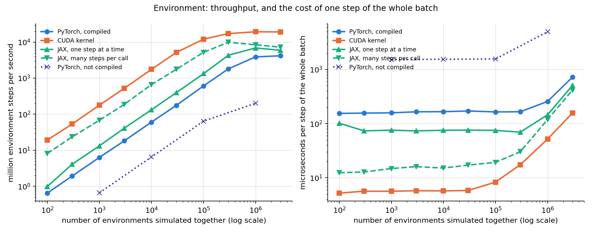
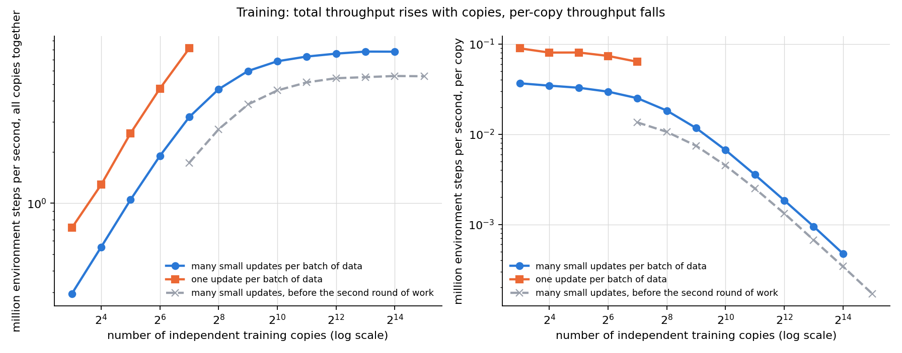
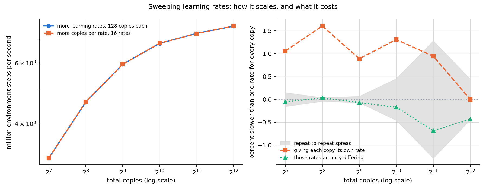
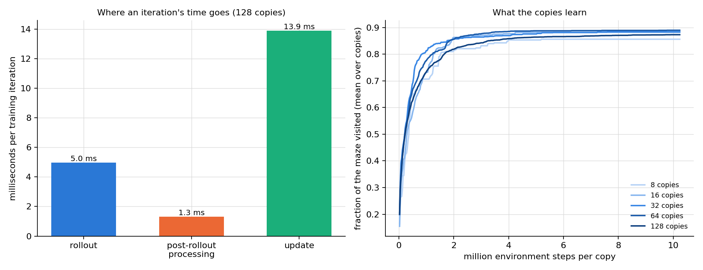
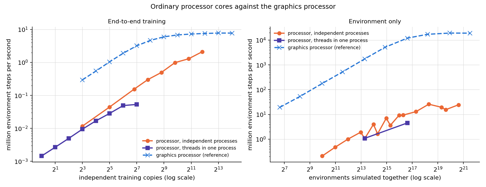
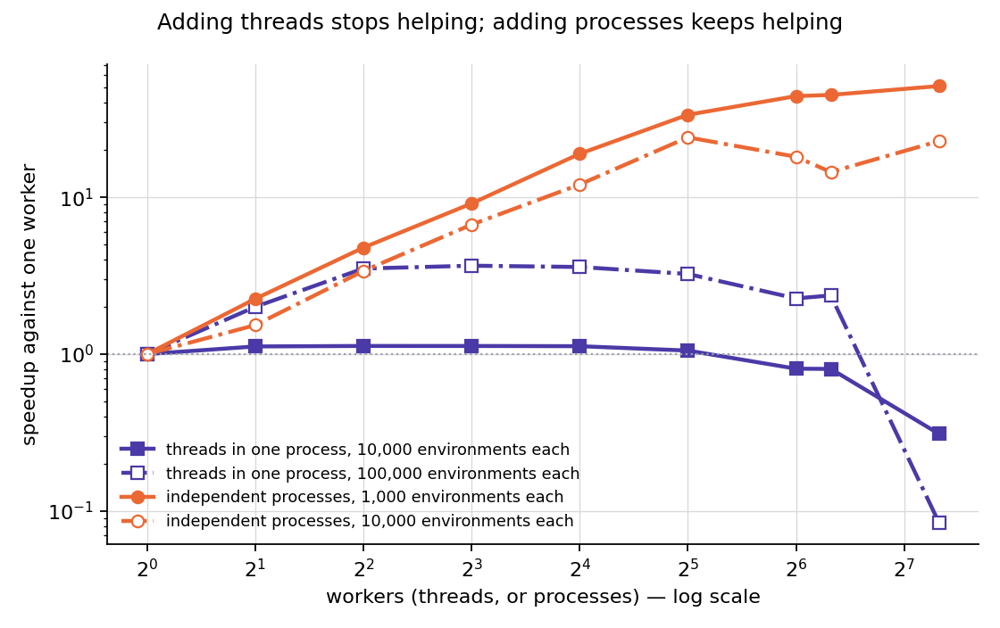
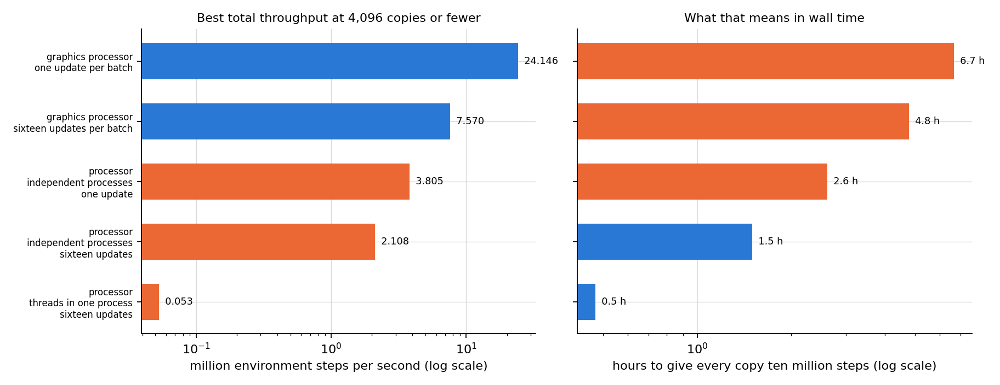

# Running many reinforcement-learning experiments at once on one graphics processor

## 1. What this report covers

This report describes a system that trains many independent reinforcement-learning agents
simultaneously on a single graphics processor, and it reports how fast that system runs. The
work is organised in three parts, and this document has one section for each:

1. **The environment** — the simulated world the agents act in.
2. **The training algorithm** — the procedure that turns experience into improved behaviour.
3. **End to end** — the two combined into a training loop, which is what is actually run.

Each section states what the part does, presents the measured results in tables and figures,
and then lists the optimisation techniques that were tried: those that were kept, and those
that were tried and abandoned, with the measurement that decided each case.

### 1.1 The problem being solved

The agent controls a ball in a two-dimensional maze. It can push the ball in two directions,
it observes the ball's position and velocity, and it receives a reward only when it reaches a
goal square in the far corner. Because the reward appears so rarely, the agent additionally
receives an internally generated "curiosity" reward for visiting unfamiliar states — a standard
method called Random Network Distillation. The learning algorithm is Proximal Policy
Optimisation, a widely used method that repeatedly collects a batch of experience and then
adjusts the agent slightly in the direction that would have made the good outcomes more likely.

Two properties of this workload drive everything that follows:

- **The individual computations are tiny.** The agent's networks have a few tens of thousands
  of parameters; a single agent uses a negligible fraction of a modern graphics processor.
- **Research requires many repetitions.** A result from one agent means little, because
  outcomes vary a great deal between random starts. Conclusions require tens or hundreds of
  independent repetitions, and often several settings of a parameter as well.

The system therefore trains many independent **copies** at once. A copy is a complete,
self-contained experiment: its own networks, its own environments, its own optimiser state,
its own random seed. Copies never exchange information; running them together is purely a
device for using the processor efficiently, and the report includes the tests that confirm
they remain independent.

### 1.2 How to read the numbers

- All throughput figures are given in **millions of environment steps per second**. One
  environment step is one action taken in one environment instance. The one exception is
  throughput *per copy*, which is given in thousands: with thousands of copies sharing the
  processor, each individual copy advances at a rate that would round to zero in millions.
- Timings are for one **training iteration**: collecting a fixed amount of experience from
  every copy and performing the resulting parameter updates. With the default settings each
  iteration collects 512 steps of experience per copy.
- All measurements were taken on one NVIDIA H100 NVL processor (95 gigabytes of memory) with
  exclusive access enforced by a lock, so no other work competed for the device.
- Where a difference is small, the report states the **noise floor**: the same configuration
  measured more than once, in alternating order, so that the spread between repeats of the
  same thing is visible next to the difference being claimed. A difference smaller than that
  spread is reported as no effect rather than as a result.

### 1.3 A note on the two conventions for updating

The training algorithm admits two ways of consuming a batch of collected experience, and both
are implemented and measured throughout:

- **One update per batch**: compute a single parameter update from all the collected data,
  then discard the data.
- **Many small updates per batch**: pass over the data four times, each pass split into four
  smaller portions, updating after each portion — sixteen updates in total.

The second does considerably more arithmetic per unit of collected experience, so it is
slower per iteration. Neither is more correct than the other; they are different algorithms
and both are reported.

## 2. The environment

### 2.1 What it does and why it was rewritten

The original environment came from a standard research library and ran on the processor's
general-purpose cores, simulating one maze at a time through a physics engine. That
arrangement is a poor match for the goal of this project: the training computation lives on
the graphics processor, so every simulated step would require copying data back and forth, and
one maze at a time cannot keep a modern accelerator busy.

The environment was therefore rewritten to run entirely on the graphics processor, holding
thousands to millions of independent mazes in memory at once and advancing all of them with
the same instructions. Three separate implementations were written, because it was not obvious
in advance which approach would win:

- **PyTorch** — expressed as operations on large arrays in the same framework as the trainer.
- **A hand-written CUDA kernel** — the whole step written as one program that the graphics
  processor runs directly, one thread per environment.
- **JAX** — a second array framework whose compiler fuses operations aggressively.

### 2.2 Correctness before speed

A fast environment that simulates different physics from the reference is worthless, so the
first task was to establish exactness. The reference environment's physics were extracted and
reproduced exactly, including the contact model that governs what happens when the ball meets
a wall — the force law, the point at which contact begins, and the case where the ball touches
two walls at once.

The three implementations are checked against trajectories recorded from the reference
environment:

| check | result |
|---|---|
| single-step error against the reference, double precision | at most 4.4e-16, which is the smallest difference representable |
| single-step error, single precision | at most 5e-7 |
| 400-step trajectories through repeated wall contacts | agree to 1e-13 |
| random restarts across the three implementations | identical to the last bit |
| CUDA kernel against the PyTorch version, 500 steps with 320 restarts | worst difference 2.1e-7 |
| 256 episodes under random actions against the reference | distributions of visited squares differ by 0.026, well inside the accepted tolerance |

The one exception is documented rather than hidden: a single recorded trajectory passes
through a knife-edge situation, with the ball balanced on a wall corner against an opposing
push, where any rounding difference eventually sends the two simulations to different places.
Its single-step agreement remains exact.

### 2.3 Results

| implementation | 1,000 envs | 10,000 envs | 100,000 envs | 1,000,000 envs | 3,000,000 envs | best measured |
|---|---|---|---|---|---|---|
| PyTorch, not compiled | 0.658 | 6.47 | 63.9 | 201 | not measured | 201 at 1,000,000 |
| PyTorch, compiled | 6.32 | 60.1 | 608 | 3,888 | 4,166 | 4,166 at 3,000,000 |
| CUDA kernel | 178 | 1,750 | 12,035 | 19,296 | 19,123 | 19,296 at 1,000,000 |
| JAX, one step at a time | 13.2 | 133 | 1,331 | 6,871 | 5,922 | 6,871 at 1,000,000 |
| JAX, many steps per call | 67.6 | 662 | 5,197 | 8,405 | 7,235 | 9,920 at 300,000 |

*Millions of environment steps per second. Higher is better.*

The right-hand panel explains the shape of the left-hand one. Below a certain number of
environments, the time taken by one step of the whole batch does not depend on how many
environments are in it: the processor is idle for most of that time, waiting for instructions
to be dispatched. Throughput therefore grows in direct proportion to the batch. Above that
point the processor is genuinely occupied, the step time begins to rise, and throughput
flattens. The number at which this transition happens is a property of the implementation:

| implementation | flat step time up to | time per step in the flat region | best throughput |
|---|---|---|---|
| PyTorch, not compiled | about 100,000 environments | about 1,540 microseconds | 201 |
| PyTorch, compiled | about 300,000 environments | 155 to 171 microseconds | 4,166 |
| CUDA kernel | about 30,000 environments | 5.6 to 6.2 microseconds | 19,296 |
| JAX, one step at a time | about 100,000 environments | 71 to 79 microseconds | 6,871 |
| JAX, many steps per call | about 100,000 environments | 8 to 19 microseconds | 9,920 |

*The CUDA kernel reaches its flat limit earliest because a single program has no dispatch
overhead left to hide; it is doing real work almost immediately.*

The practical reading is that the hand-written kernel is the fastest environment by a wide
margin at every size, and that the gap is largest for small batches, where the compiled
PyTorch version spends almost all of its time in dispatch overhead rather than simulation.

### 2.4 Optimisation techniques

**Kept.**

| technique | what it does | measured effect |
|---|---|---|
| Rewrite the wall-contact test so that no operation depends on data | The original formulation selected the two nearest walls with a sorting operation, which forces the compiler to stop and start; the replacement computes all eight candidate walls unconditionally and picks the two smallest with arithmetic | 9x at one million environments in PyTorch (2,242 to 248 microseconds per step) |
| Store the maze geometry as one byte per square | Instead of looking up rectangles from tables, the eight neighbouring walls are encoded as bits and the rectangles reconstructed arithmetically | part of the same 9x |
| Compile the step | Ask the framework to fuse the many small operations of a step into a few larger programs | 13x for PyTorch at small batches |
| Write the whole step as one CUDA program | One dispatch instead of dozens; the environment's state stays in processor registers throughout | 24x lower cost per step at small batches than compiled PyTorch |
| Rank the candidate walls by counting | In the CUDA kernel, replace the running "best two so far" comparison chain, which carries ten values from one candidate to the next, with an independent count of how many candidates are closer | 14 percent at one million environments; verified to produce identical results to the last bit |
| Take several environment steps per call in JAX | Let the compiler unroll a short sequence of steps into one program | 1.77x at small batches, 1.11x at one million |
| Launch the CUDA kernel on the framework's own execution stream | Not a speed change but a correctness one: the kernel had been launching on a different stream from the surrounding work, which meant that recorded sequences of operations silently did not contain the environment step at all | the defect is described in section 4.4 |

**Tried and not kept.**

| technique | why it was rejected |
|---|---|
| Force the compiler to fuse the entire step into a single program by raising its internal thresholds | Compilation ran for more than forty minutes without producing a result and was abandoned |
| A simplified wall model that pushes the ball out of walls instead of simulating contact forces | Simpler and slightly faster, but wrong: single-step errors of up to 48 millimetres against the reference, so it was replaced by the exact contact model |
| Pack the environment state so that it is fetched in one wide memory transaction, and remove a redundant output | No measurable change at any batch size, which established that the kernel is limited by computation and latency rather than by memory bandwidth. Kept only because it is simpler, not because it is faster |
| Record the environment step as a replayable sequence of operations | Faster for small batches (18 percent) but slower at one million environments, and the comparison was not exactly like for like; left available but not made the default |

## 3. The training algorithm

### 3.1 What it does, and what "batching the copies" means

One training iteration proceeds in three stages. First the agents act: each copy runs its
environments forward for 128 steps, choosing actions from its current policy and recording
what happened. Second, that recorded experience is processed into learning targets — how much
better or worse each action turned out than expected, and how surprising each visited state
was. Third, the networks are adjusted using those targets.

Running many copies at once required rewriting every part of this so that the copy count is a
dimension of the data rather than a loop. Each copy's networks are stored stacked together, so
a layer that would be one matrix multiplication for one copy becomes one batched matrix
multiplication for all copies. Every running average, every gradient limit, and every random
draw is likewise computed per copy.

That last point is a correctness requirement, not an implementation detail: if any quantity
were accidentally shared, the copies would silently stop being independent experiments and the
results would be worthless. Three tests guard this:

- Two runs with the same seed produce identical parameters to the last bit.
- Deliberately perturbing one copy leaves every other copy's parameters identical to the last
  bit after training.
- The same experiment implemented independently in the second framework agrees to within
  8.6e-7 on every intermediate quantity.

### 3.2 Results: how throughput scales with the number of copies

| copies | milliseconds per iteration | million steps per second, total | thousand steps per second, per copy | peak memory (GB) |
|---|---|---|---|---|
| 8 | 13.8 | 0.296 | 37 | 0.1 |
| 16 | 14.9 | 0.550 | 34 | 0.2 |
| 32 | 15.7 | 1.05 | 33 | 0.3 |
| 64 | 17.2 | 1.90 | 30 | 0.5 |
| 128 | 20.4 | 3.21 | 25 | 0.7 |
| 256 | 28.0 | 4.67 | 18 | 1.2 |
| 512 | 43.8 | 5.99 | 12 | 2.4 |
| 1,024 | 76.9 | 6.82 | 6.7 | 3.6 |

*Many small updates per batch. One iteration collects 512 environment steps per copy.*

The second convention, one update per batch of data, does less arithmetic and is
correspondingly faster:

| copies | milliseconds per iteration | million steps per second, total | thousand steps per second, per copy |
|---|---|---|---|
| 2,048 | 45.0 | 23.3 | 11 |
| 4,096 | 86.9 | 24.1 | 5.9 |

Two observations follow from these tables, and they are the central practical facts about the
system:

- **Total throughput rises with the number of copies and then saturates.** Going from 8 copies
  to 128 multiplies the work done per second by roughly eleven while the time per iteration
  rises only modestly, because at small copy counts the processor is mostly idle. Beyond
  roughly eight thousand copies the curve flattens: the machine is full.
- **Per-copy throughput falls once past that point.** Each individual experiment advances more
  slowly when it shares the processor with thousands of others. A researcher who needs one
  experiment finished quickly should use few copies; a researcher who needs many experiments
  finished should use many. The tables give the exchange rate.

The largest configuration that fits in memory is 16,384 copies. This ceiling moved down from
32,768 during the optimisation work, which is discussed as a deliberate trade in section 3.4.

### 3.3 Results: sweeping a parameter across copy groups

Copies need not be identical. The system can divide them into groups and give each group a
different learning rate — the parameter that controls how large each adjustment is — so that
one run compares several settings instead of testing one. The user supplies two things: the
list of rates, and how many copies each rate receives.

| learning rates | copies per rate | total copies | milliseconds per iteration | million steps per second | hours to train every copy for 10 million steps |
|---|---|---|---|---|---|
| 1 | 128 | 128 | 20.6 | 3.18 | 0.11 |
| 2 | 128 | 256 | 28.4 | 4.61 | 0.15 |
| 4 | 128 | 512 | 44.1 | 5.94 | 0.24 |
| 8 | 128 | 1,024 | 76.9 | 6.82 | 0.42 |
| 16 | 128 | 2,048 | 143.8 | 7.29 | 0.78 |
| 32 | 128 | 4,096 | 274.2 | 7.65 | 1.49 |

The number of distinct rates costs nothing by itself. Holding the total at
2,048 copies and splitting them into between 1 and
128 groups leaves the iteration time between
143.1 and 145.0 milliseconds — a spread of
1.3 percent, within measurement noise — and the
memory identical to the byte. Only the total number of copies matters.

Comparing a swept run against a uniform one mixes two separate changes, so they were measured
apart. Giving every copy its own rate replaces the standard optimiser with a hand-written one,
because the standard implementation accepts only a single rate per group of parameters; that
substitution costs between 0.0 and 1.6 percent. Those rates then actually
differing changes no code at all and costs nothing measurable — at most 0.7 percent,
inside the noise floor at every size.

Finally, fusing the groups into one run is substantially better than training them one after
another, and the advantage grows with the number of groups, because each group alone is too
small to occupy the processor: 1.43 times at two rates, 1.84 at four, 2.11 at eight, and 2.23
at sixteen.

### 3.4 Optimisation techniques

**Kept.**

| technique | what it does | measured effect |
|---|---|---|
| Stack the copies' networks and use batched matrix multiplication | Turns many tiny operations into one larger one | 128 copies cost almost the same as 8 at the start of the work |
| Compile the repeated per-step function | Fuses dozens of small operations into a few programs | 3.4x |
| Record the whole iteration as a replayable sequence of operations | The processor is given one instruction to repeat a fixed sequence, instead of being fed thousands of individual instructions from the host program each iteration | rollout stage 226 to 35 milliseconds; whole iteration 45.6 to 41.5 |
| Use the optimiser variant that keeps its step counter on the device | Required for the recorded sequence to remain correct; a counter kept on the host would be frozen at the value it had when the recording was made | correctness, and it removes a synchronisation |
| Allow reduced-precision matrix multiplication | Uses the processor's dedicated units at slightly lower precision | 9 percent |
| Compute the fixed reference network's outputs once per iteration instead of once per update | Its outputs cannot change within an iteration, so sixteen recomputations were wasted | 1.6 percent with many updates, 6.7 with one |
| Combine matrix multiplications that read the same input | Two networks reading the same observations become one wider multiplication | 1.9 to 2.9 percent |
| Compile the post-rollout processing stage | Its two sequential passes over the collected experience were written as loops, producing hundreds of tiny programs | 11 percent at 128 copies, 14 at 8 |
| Move work out of the sequential loop | The value estimates, the action probabilities and the curiosity rewards do not need to be computed step by step: each depends only on data the loop already stores, so all 128 steps can be computed in one wide operation afterwards | 42 percent at 128 copies, 45 at 8 — the single largest improvement of the second round |
| Write the recorded results directly from the computation | Removes a separate copy operation per quantity per step | 5 percent |
| Compile the per-copy optimiser used by sweeps | Written plainly it is six operations per parameter tensor | reduces the cost of sweeping from 38 percent to about 1 |

**Tried and not kept.**

| technique | why it was rejected |
|---|---|
| Record the uncompiled sequence of operations | Slower than recording the compiled one: replaying thousands of tiny programs is limited by the number of programs, not by the dispatch of them |
| The framework's automatic recording mode | It silently declined to record parts of the computation; recording by hand was both faster and verifiable |
| Present only one of the two update conventions in the source | The concern was that having both might prevent fusion. A build with the other removed entirely, verified to compute identical results, differed by 0.05 to 0.08 percent against a noise floor of 0.01 milliseconds. The two conventions were already separate compiled programs, so the unused one costs nothing |
| Store the copies' networks in one large block-diagonal matrix | 47 times slower than batched multiplication and required 4.45 gigabytes of weights instead of 34 megabytes |
| A loop over copies in the host language | 41 times slower than batched multiplication |
| Remove a redundant value-network pass | Correct but worth 0.4 percent at most; recorded as a simplification rather than a speed improvement |
| Allow the memory allocator to grow its segments, to recover the copy ceiling | Reduced the failing allocation from 32 to 8 gigabytes but still ran out: the demand is real, not fragmentation |

**A trade that was accepted deliberately.** Moving work out of the sequential loop and caching
the reference network's outputs both hold more data in memory at once. The largest workable
configuration fell from 32,768 copies to 16,384, while every size up to that point became
about 1.8 times faster. A run that needs the extra copies more than the speed can switch both
techniques off.

## 4. End to end

### 4.1 What "end to end" means here

Sections 2 and 3 measured the two parts in isolation. In use they are not separate programs:
the environment is stepped from inside the training loop, 128 times per iteration, between the
policy producing an action and the learning stage consuming the result. This section reports
the combined system — which is the only configuration a researcher actually runs.

The essential structural decision is that the environment, the policy, the learning targets and
the parameter update are all expressed as operations on the same device, with no data returned
to the host at any point during an iteration. That makes it possible to record an entire
iteration — all three stages, including the 128 environment steps and the sixteen parameter
updates — as one replayable sequence. The host then issues one instruction per iteration
instead of many thousands.

### 4.2 Where the time goes

| stage of one iteration | milliseconds | share |
|---|---|---|
| rollout (128 sequential steps: policy, environment, buffer writes) | 4.97 | 25 percent |
| post-rollout processing (values, log-probabilities, RND bonus, filter, GAE, statistics) | 1.30 | 6 percent |
| update (16 minibatch steps: gather, forward, backward, clip, Adam) | 13.89 | 69 percent |
| the three stages measured separately | 20.17 | 100 percent |
| the same iteration recorded as ONE sequence, which is what ships | 20.31 | 101 percent of the above |

*At 128 copies. The last two rows are within measurement noise of each other: once
each stage is itself compiled and recorded, there is little left between them to save. Recording
the whole iteration as one sequence is still the shipped arrangement, because it issues one
instruction per iteration rather than three and so is insensitive to how busy the host is.*

The following table lists individual operations timed on their real sizes without compilation.
It does not decompose the time above — compiling and recording remove most of the overhead
these numbers contain — but it shows where the underlying work sits, which is what explains
which optimisations paid:

| operation | milliseconds if run unoptimised |
|---|---|
| environment: whole step (physics, reward, episode ends, automatic reset) | 593.28 |
| environment: physics step (integrator and contacts) | 473.61 |
| one update step (forward, backward, clip, Adam) x 16 | 69.92 |
| policy network forward (in the sequential loop) | 10.74 |
| advantage estimation and running statistics (post-rollout scans) | 1.19 |
| RND bonus (whitening, target and predictor networks, one wide pass) | 0.62 |
| value network forward (one wide pass after the loop) | 0.11 |

The environment dominates this list, which is why the environment work in section 2 came first.
After the optimisations, however, the picture inverts: see section 4.4.

### 4.3 Which environment to pair with which trainer

Four combinations are possible, and all were measured.

| combination | result |
|---|---|
| PyTorch environment with the PyTorch trainer | the shipped configuration; the environment is compiled into the same recorded sequence as the trainer |
| CUDA-kernel environment with the PyTorch trainer | 8 copies: 13.8 against 14.0 milliseconds, 128 copies: 20.7 against 20.4 milliseconds. The two are equal to about one and a half percent |
| JAX environment with the JAX trainer | the shipped JAX configuration; the environment is traced into the same compiled program as the trainer |
| an environment from one framework with a trainer from the other | rejected. Handing arrays across the framework boundary costs up to 6.8 milliseconds per environment step, against a native step of 0.1 to 0.3 milliseconds — a factor of forty or more — and it also prevents both frameworks from fusing or recording the loop |

The second row deserves comment, because it is the most instructive result in the report. The
CUDA-kernel environment is roughly twenty-four times faster than the PyTorch environment when
measured on its own (section 2.3). Substituting it into the training loop changes the training
rate by about one percent. The reason is visible in section 4.2: after the optimisations, the
environment is a small share of an iteration, so making it faster has little left to give. The
fast kernel earns its place in work that is only environment simulation — generating data,
evaluating a fixed policy — and not in this training loop.

### 4.4 A defect that this pairing measurement exposed

An earlier version of the pairing comparison produced numbers that were wrong, and the way the
error was found is worth recording. The CUDA environment launched its work on a different
execution queue from the surrounding framework operations. When an iteration was recorded for
replay, the environment step was therefore not captured: the recording contained the policy,
the learning targets and the update, but no simulation at all. The replayed iteration ran and
produced plausible timings, and the environment simply never advanced.

The error was found by writing a test that recorded only the environment step, replayed it,
and asserted that the state had changed. It had not; the framework itself then reported that
the recorded sequence was empty. The fix was one line — launch on the current queue — after
which the previously published pairing numbers were discarded and re-measured. The test now
runs alongside the others.

### 4.5 The training campaign

To confirm that the system trains rather than merely runs quickly, every copy count was trained
for 10.24 million environment steps per copy, in both update conventions.

| update convention | copies | wall time (minutes) | million steps per second | thousand steps per second, per copy | fraction of the maze explored | copies that reached the goal |
|---|---|---|---|---|---|---|
| many small updates per batch | 8 | 4.6 | 0.294 | 37 | 0.86 | 3 of 8 |
| many small updates per batch | 16 | 5.0 | 0.550 | 34 | 0.88 | 9 of 16 |
| many small updates per batch | 32 | 5.2 | 1.04 | 33 | 0.88 | 18 of 32 |
| many small updates per batch | 64 | 5.8 | 1.89 | 30 | 0.89 | 38 of 64 |
| many small updates per batch | 128 | 6.8 | 3.20 | 25 | 0.87 | 68 of 128 |
| one update per batch | 8 | 1.9 | 0.719 | 90 | 0.82 | 5 of 8 |
| one update per batch | 16 | 2.1 | 1.29 | 80 | 0.83 | 6 of 16 |
| one update per batch | 32 | 2.1 | 2.58 | 81 | 0.81 | 13 of 32 |
| one update per batch | 64 | 2.3 | 4.72 | 74 | 0.74 | 19 of 64 |
| one update per batch | 128 | 2.7 | 8.19 | 64 | 0.80 | 47 of 128 |

Two remarks on reading this table. First, the exploration column is the one that shows the
method working: the agents visit most of the maze, which is what the curiosity reward is for,
and they do so from the very sparse external reward alone. Second, the goal column is a lower
bound — progress is sampled every fifty iterations, so a copy that reached the goal only
between samples is not counted.

The same campaign was run before and after the second round of optimisation work. Across the ten configurations the second run was 2.4 times faster. The learning outcomes differ between the two runs by more than one might expect, and it is worth being explicit that this is not an effect of the optimisation: the algorithm is unchanged and every change was verified to compute the same function. Tiny differences in rounding send the runs down different trajectories, and on a task where the reward is found or not found, per-copy outcomes are close to all-or-nothing, so aggregates move. The two campaigns should be read as two samples of one procedure.

### 4.6 Optimisation techniques at the level of the whole loop

**Kept.**

| technique | what it does | measured effect |
|---|---|---|
| Keep every stage on the device | No data returns to the host during an iteration, so nothing has to wait for the host | a precondition for everything below |
| Record the whole iteration as one sequence | One instruction per iteration instead of thousands | 45.6 to 41.5 milliseconds at 128 copies when it was introduced. Measured again after the later changes it is even with recording the stages separately, because those changes removed the gaps it had been closing; it is kept because it does not depend on the host keeping up |
| Fixed sizes throughout | Copy count, environment count and horizon are constants, so no recompilation occurs during a run | prevents the previous item from being silently undone |
| Draw all random numbers for an iteration in advance | A recorded sequence cannot call a random generator on the host | correctness under recording |

**Tried and not kept.**

| technique | why it was rejected |
|---|---|
| Pairing an environment from one framework with a trainer from the other | measured at more than forty times the cost of a native step, as above |
| Substituting the fastest environment into the training loop | correct and available, but worth about one percent because the environment is no longer the constraint |
| Recording the stages separately rather than together | superseded: recording them together is faster |

## 5. The same work on ordinary processor cores

### 5.1 Why this comparison is here

Every number so far came from a graphics processor. A reader deciding where to run this work
needs to know what the alternative gives, so the same training loop and the same environment
were measured on ordinary processor cores. The training measurements below ran on **jaguar03**
(AMD EPYC 7663, 224 logical processors, 1 TB of memory), held exclusively — no other job shared
the machine — so the timings are not contaminated by a neighbour. It was chosen as the largest
completely idle node on the cluster; a node with more cores was available but already had
another job on it, which is exactly the contamination this run set out to avoid. The
environment-only measurements come from a second node, puma01 (Intel Ice Lake, 160 logical
processors), also held under reservation.

Nothing in the algorithm changed. What changed is that the graphics-processor features the
optimisation work relied on — recording an iteration as a replayable sequence, the
reduced-precision matrix mode, the fused optimiser — do not exist on a processor, so the
processor runs the same code in its plain form.

### 5.2 Two ways to use many cores, and why they differ so much

A processor has many cores, and the work has to be divided among them. There are two ways:

- **Threads inside one process.** One program holds every copy in one set of arrays. Each
  instruction covers all of them, and the array library splits that one instruction across N
  threads. The threads must regroup after every instruction, because the next one reads what
  the previous one wrote.
- **Independent processes.** N separate programs, each owning its own copies, each using one
  thread. They never coordinate, because there is nothing to coordinate around.

The measurements settle which is better, and the answer is not the obvious one.

| copies | threads | seconds per iteration | million steps per second | thousand steps per second per copy |
|---|---|---|---|---|
| 1 | 8 | 0.352 | 0.0015 | 1.45 |
| 2 | 8 | 0.382 | 0.0027 | 1.34 |
| 4 | 8 | 0.410 | 0.0050 | 1.25 |
| 8 | 8 | 0.433 | 0.0095 | 1.18 |
| 16 | 8 | 0.482 | 0.0170 | 1.06 |
| 32 | 8 | 0.576 | 0.0284 | 0.89 |
| 64 | 8 | 0.666 | 0.0492 | 0.77 |
| 128 | 112 | 1.229 | 0.0533 | 0.42 |

*One process, threads varied. Sixteen updates per batch.*

| workers | copies each | total copies | seconds per iteration | million steps per second | thousand steps per second per copy |
|---|---|---|---|---|---|
| 8 | 1 | 8 | 0.349 | 0.0117 | 1.46 |
| 32 | 1 | 32 | 0.370 | 0.0445 | 1.39 |
| 112 | 1 | 112 | 0.370 | 0.1551 | 1.38 |
| 224 | 1 | 224 | 0.379 | 0.3007 | 1.34 |
| 112 | 4 | 448 | 0.464 | 0.4967 | 1.11 |
| 224 | 4 | 896 | 0.456 | 0.9887 | 1.10 |
| 112 | 16 | 1792 | 0.712 | 1.29 | 0.72 |
| 224 | 16 | 3584 | 0.881 | 2.11 | 0.59 |

*Independent single-thread processes. Sixteen updates per batch.*

The environment measurements on the earlier processor node make the threading limit plain: one
process reached its best throughput at four to eight threads and then got **worse**, ending
twelve times slower than a single thread when given 160. Independent processes scaled to about
twenty-four times over the same range.

The reason is the regrouping. One environment step is roughly forty small operations, each
individually cheap, and the coordination after each one costs a fixed amount regardless of how
little work it contained. With N threads that cost is paid forty times per step, so past a
handful of threads the coordination costs more than the work it coordinates. Independent
processes never pay it. This is also why the graphics processor needed the opposite treatment:
the optimisation work there fused those forty operations into a handful and recorded the whole
sequence, which is the same problem solved from the other end.

## 6. The best setup on each platform

Throughput keeps rising with the number of copies well past the point most work needs, so the
comparison below is restricted to **4,096 copies or fewer**, which is the range this project
actually operates in. For each platform and configuration, the table gives the setting that
reaches the highest total throughput inside that range.

| platform and configuration | copies | seconds per iteration | million steps per second | thousand steps per second per copy | hours to ten million steps per copy |
|---|---|---|---|---|---|
| graphics processor, one update per batch | 4,096 | 0.087 | 24.1 | 5.90 | 0.47 |
| graphics processor, sixteen updates per batch | 4,096 | 0.277 | 7.57 | 1.85 | 1.50 |
| processor, independent processes, one update | 3,584 | 0.481 | 3.80 | 1.06 | 2.61 |
| processor, independent processes, sixteen updates | 3,584 | 0.881 | 2.11 | 0.59 | 4.78 |
| processor, threads in one process, sixteen updates | 128 | 1.229 | 0.0533 | 0.42 | 6.67 |

The best graphics-processor configuration reaches 24.1 million environment steps per second at 4,096 copies; the best processor configuration reaches 3.80 million at 3,584 copies. That is a factor of **6**. In wall-clock terms, giving every copy ten million environment steps takes 0.47 hours on the graphics processor against 3 hours on the processor node.

Two qualifications belong with those numbers. The processor figure is for one node held
exclusively; a cluster with many such nodes multiplies it, and the independent-process
arrangement is exactly what a work queue across many nodes would do. And the gap is narrower
for training than for the environment alone, because training is dominated by matrix
arithmetic, which processors handle comparatively better than they handle many tiny
dependent operations.

## 5. Method, and how to repeat the measurements

**Hardware and isolation.** One NVIDIA H100 NVL processor with 95 gigabytes of memory, in a
shared machine. Every measurement in this report ran while holding an exclusive lock on the
device, so no other process competed for it.

**Timing.** Each configuration is warmed up first, so that compilation and one-off allocation
are excluded, and then timed over repeated iterations with the device synchronised around each
one. The reported figure is the median.

**Paired comparison.** Where a claimed difference is small, the two configurations are run in
alternating order — first, second, second, first — each in its own process, and the spread
between repeats of the same configuration is reported as a noise floor next to the difference.
A difference below that floor is reported as no effect. This matters: several of the changes in
this report are worth one or two percent, which is not distinguishable from drift without it.

**Comparison against the previous version.** Rather than comparing against a number recorded
earlier, the benchmark can load the previous revision of the trainer from version control and
run both in the same session, so that before and after are measured under identical conditions.

**Provenance.** Every measurement writes a file containing the numbers, the configuration and
the version-control revision. This report is generated from those files, so regenerating it
after a new measurement updates every affected table and figure.

**Reproduction.** The environment implementations, the trainer, the benchmark programs and the
training driver are all in the repository under `09_parallelization/`, with a record of every
experiment attempted — including those abandoned — in a progress file beside each component.
