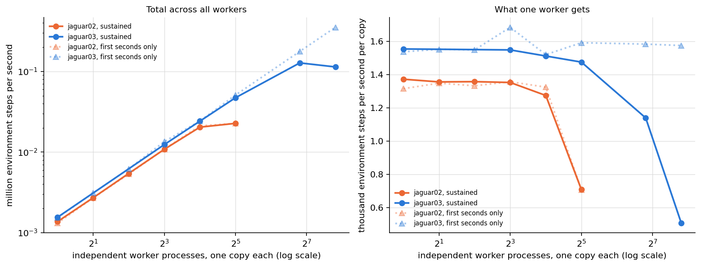

# GPU-parallel PointMaze + batched multi-copy PPO+RND — unified report

All numbers were measured on serval05 (one NVIDIA H100 NVL, 95 GB; direct ssh, exclusive use
enforced by a lock), from the code in this repository under `09_parallelization/`. Every table
cell traces to a JSON in `benchmarks/results/` or a run record under `train_runs/`; this report
is generated by `report/.../code/make_report.py` and can be regenerated from those files.

The work built three modules and then improved them over three passes of the same loop —
baseline, one change, measure, keep or revert, write a row:

| pass | what it did | headline |
|---|---|---|
| Round 1 | build everything: exact GPU environments in PyTorch, fused CUDA and JAX; the batched multi-copy PPO+RND trainer in PyTorch and JAX; end-to-end capture | 777 -> 36.6 ms per training iteration at 128 copies |
| Round 2 | improve on the finished system, with a measurement protocol that can tell a small change from drift | 36.8 -> 20.2 ms, a further 1.8x |
| Round 3 | new capability: train copy groups at DIFFERENT learning rates in one run | a sweep costs 1.0% more than a uniform run of the same size |

Reading order: what was built and why it is correct, then the module-by-module numbers, then
what each round changed, then the training campaign and the sweep.

## Contents

| section | first written | last changed | status |
|---|---|---|---|
| [Environment correctness (all three implementations)](#environment-correctness-all-three-implementations) | 2026-08-15 00:22 PT | 2026-08-15 00:22 PT | read |
| [Module 1 — environment throughput](#module-1-environment-throughput) | 2026-08-15 00:22 PT | 2026-08-15 15:46 PT | read |
| [Module 2 — batched multi-copy trainer throughput](#module-2-batched-multi-copy-trainer-throughput) | 2026-08-15 00:22 PT | 2026-08-15 00:22 PT | read |
| [Module 3 — end-to-end fusion and the pairing grid](#module-3-end-to-end-fusion-and-the-pairing-grid) | 2026-08-15 00:22 PT | 2026-08-15 10:53 PT | read |
| [Scaling the number of independent training copies](#scaling-the-number-of-independent-training-copies) | 2026-08-15 00:22 PT | 2026-08-15 11:54 PT | read |
| [Profiling breakdown (C=128)](#profiling-breakdown-c128) | 2026-08-15 00:22 PT | 2026-08-15 01:35 PT | read |
| [Before/after optimization at the final-run sizes (8-128 copies)](#beforeafter-optimization-at-the-final-run-sizes-8-128-copies) | 2026-08-15 01:35 PT | 2026-08-15 11:54 PT | read |
| [Final training campaign — 8 to 128 independent RND runs (PyTorch)](#final-training-campaign-8-to-128-independent-rnd-runs-pytorch) | 2026-08-15 01:35 PT | 2026-08-15 11:54 PT | read |
| [Sweeping learning rates across copy groups](#sweeping-learning-rates-across-copy-groups) | 2026-08-15 10:39 PT | 2026-08-15 16:35 PT | read |
| [The three rounds](#the-three-rounds) | 2026-08-15 10:49 PT | 2026-08-15 10:49 PT | read |
| [What made it fast (and what did not)](#what-made-it-fast-and-what-did-not) | 2026-08-15 00:22 PT | 2026-08-15 00:22 PT | read |
| [Reproduction](#reproduction) | 2026-08-15 00:22 PT | 2026-08-15 00:22 PT | read |
| [How far from the hardware ceiling](#how-far-from-the-hardware-ceiling) | 2026-08-15 15:46 PT | 2026-08-15 15:46 PT | read |
| <span class="updated">[The same work on ordinary processor cores](#the-same-work-on-ordinary-processor-cores)</span> | 2026-08-15 15:46 PT | 2026-08-15 17:50 PT | updated |
| [Which implementation to use](#which-implementation-to-use) | 2026-08-15 15:46 PT | 2026-08-15 15:57 PT | read |
| [Feature parity between the two trainers](#feature-parity-between-the-two-trainers) | 2026-08-15 15:46 PT | 2026-08-15 15:46 PT | read |
| [Round four — closing the distance between the two trainers](#round-four-closing-the-distance-between-the-two-trainers) | 2026-08-15 15:57 PT | 2026-08-15 15:57 PT | read |
| <span class="updated">[End-to-end training on a dedicated processor node](#end-to-end-training-on-a-dedicated-processor-node)</span> | 2026-08-15 16:08 PT | 2026-08-15 17:50 PT | updated |
| <span class="updated">[The best setup on each platform, at 4,096 copies or fewer](#the-best-setup-on-each-platform-at-4096-copies-or-fewer)</span> | 2026-08-15 16:08 PT | 2026-08-15 17:50 PT | updated |
| <span class="updated">[A processor with fewer, faster cores against the 224-thread node](#a-processor-with-fewer-faster-cores-against-the-224-thread-node)</span> | 2026-08-15 17:25 PT | 2026-08-15 17:50 PT | updated |

*Times are when a section's text first appeared in this document and when it last changed, taken from the document's version history. A section whose numbers were re-measured shows a later change time. All times are Pacific (PT); the machines that produced them run on Eastern Time and the values are converted for display.*

*Status is computed by comparing each section against the text last marked read: an **unread** section is written in blue, title and body; in an **updated** section the text that changed since you read it is written in dark brown, and the rest is left alone.*

## Environment correctness (all three implementations)

The environments are not approximations: MuJoCo's exact per-step update was extracted and
verified, including the contact model (solref/solimp force law, margin semantics, and the
joint two-contact solve, all probe-verified against the solver's internal arrays).

1. One-step (teacher-forced) error vs the reference MuJoCo env is at machine precision
   (float64 <= 4.4e-16 on every fixture case, including wall slides across box boundaries
   and corner wraps; float32 <= 5e-7).
2. Closed-loop 400-step multi-contact rollouts match the reference to 1e-13 (one fixture
   passes through a knife-edge equilibrium — ball balanced on a corner — where closed-loop
   paths legitimately separate on rounding noise; its one-step check stays exact).
3. Reset randomness is a frozen counter-based generator: torch, CUDA, and JAX produce
   BIT-IDENTICAL resets (verified including post-truncation respawns).
4. The CUDA kernel's trajectories match the torch env within 2.1e-7 over 500 steps with
   320 auto-resets (mostly bit-equal; rare 1-2 ULP differences on contact steps).
5. A 256-episode random-policy comparison against the reference env passes (visit
   distribution total-variation distance 0.026, gate 0.05).

## Module 1 — environment throughput

| implementation | 1e3 envs | 1e5 envs | 1e6 envs | 3e6 envs | peak |
|---|---|---|---|---|---|
| torch eager | 6.58e5 | 6.39e7 | 2.01e8 | — | 2.01e8 at 1,000,000 |
| torch compiled | 6.32e6 | 6.08e8 | 3.89e9 | 4.17e9 | 4.17e9 at 3,000,000 |
| CUDA fused kernel | 1.78e8 | 1.20e10 | 1.93e10 | 1.91e10 | 1.93e10 at 1,000,000 |
| jax jit per step | 1.32e7 | 1.33e9 | 6.87e9 | 5.92e9 | 6.87e9 at 1,000,000 |
| jax scan (fused rollout, upper bound) | 6.76e7 | 5.20e9 | 8.40e9 | 7.23e9 | 9.92e9 at 300,000 |

Environment steps per second, single batch axis (n_copies folded in). Figures:


Where the per-step time starts to RISE (the log-scale line's knee — before it, adding
environments is free because the step is launch-overhead-bound; after it, kernel time
dominates and the time grows with the batch):

- torch compiled: flat ~155-171 us to 3e5 envs; rises from ~3e5.
- CUDA fused kernel: flat ~6 us to 3e4 envs; rises from ~1e5 (it reaches the
  memory-bandwidth regime earliest because one kernel has no launch amortization to hide).
- jax jit: flat ~71-79 us to ~1e5; rises past 1e5.
- jax scan: flat ~15-19 us to ~1e5; peak total throughput lands at 3e5 envs (L2-cache
  residency) and settles slightly lower at HBM scale.

Per-env step speed at 1e3 envs (batched step time divided by env count): CUDA 6.0 ns per
env-step, jax scan 14.8 ns, jax jit 79 ns, torch compiled 158 ns. All fall toward the memory
bandwidth limit as the batch grows: at 3e6 envs the CUDA kernel spends 57 picoseconds per
env-step (171.7 us for the whole batch).

## Module 2 — batched multi-copy trainer throughput

Both trainers implement the same algorithm (spec: `ppo/research/ppo_rnd_algorithm_spec.md`),
verified by bitwise copy-isolation tests in each framework and a cross-framework forward
agreement of 8.6e-7. Style A = one full-batch update per rollout; style B = 4 epochs x 4
minibatches. T=128, N=4 (512 rows per copy per iteration).

| trainer | style | C=8 | C=128 | notes |
|---|---|---|---|---|
| torch_ppo | epoch_minibatch | 774.6 ms = 5.29e3/s | 777.0 ms = 8.43e4/s | BEFORE any optimization (eager) |
| torch_ppo | epoch_minibatch | 26.4 ms = 1.55e5/s | 36.6 ms = 1.79e6/s | AFTER (one-graph capture + TF32 + hoist + packing) |
| torch_ppo | full_batch | — | 24.5 ms = 2.68e6/s | AFTER (same config) |
| jax_ppo | full_batch | 9.1 ms = 4.50e5/s | 13.4 ms = 4.87e6/s | jax whole-iteration jit + donation |
| jax_ppo | epoch_minibatch | 11.4 ms = 3.58e5/s | 19.9 ms = 3.30e6/s | jax whole-iteration jit + donation |

The eager torch baseline is 777 ms per iteration at every copy count; the final torch
configuration is 21x faster at C=128. The jax trainer reaches 74 iter/s (style A) and 50
iter/s (style B) at C=128. A LABELED algorithm variant (T=32, N=16 — same 512 rows, shorter
GAE horizon) reaches 226 iter/s = 1.48e7 env-steps/s in jax style A; it is recorded as a
variant, not the default, because it changes the algorithm.

## Module 3 — end-to-end fusion and the pairing grid

- torch env + torch trainer: the production path. The environment's pure `step_core`
  composes into the compiled per-step function; one CUDA graph captures the WHOLE iteration
  (128-step rollout + statistics/GAE post-processing + the 16-step update incl. Adam), so
  one replay per iteration and zero python in the loop. Captured paths are verified
  BITWISE equal to the uncaptured trainer.
- jax env + jax trainer: the whole iteration is one jitted XLA program with donated state.
- CUDA env + torch trainer (`env_backend="cuda"`): the fused kernel replaces the env part
  of the captured rollout, with the policy and RND parts as compiled subgraphs around it.
  Measured in the shipped configuration (style B): C=8: 13.8 ms with the CUDA kernel versus 14.0 ms with the PyTorch environment; C=128: 20.7 ms with the CUDA kernel versus 20.4 ms with the PyTorch environment.
  The two are the same to about 1.5%, which is the point worth taking away: after
  round two moved most per-step work out of the rollout loop, the environment is a small part
  of a training iteration, so an environment kernel that is 24x faster on its own changes the
  training rate very little. The fast kernel earns its place in environment-only work (data
  generation, evaluation sweeps), not in this trainer.
  An earlier pairing measurement was discarded: the environment kernels launched on
  the legacy default stream rather than the capture stream, so the captured graph contained no
  environment step at all (PyTorch reported an empty graph once a test looked for it). The
  kernel now launches on the current stream and a test replays a captured env step and checks
  the state actually advanced.
- Cross-framework pairings (jax env + torch trainer or the reverse) were MEASURED over
  the dlpack boundary: crossing frameworks costs +6.2 to +7.0 ms per environment step on
  top of a 70-260 us native step (about 40-90x), because every crossing forces a
  synchronization between the two runtimes — in addition to structurally breaking
  CUDA-graph capture and XLA scan fusion. They are documented as non-production paths
  (`benchmarks/bench_cross_pairing.py`).

## Scaling the number of independent training copies

The task's two questions, answered by measurement (style B, T=128, N=4, final config):

1. **Does increasing the copy count decrease per-copy throughput?** Yes, but only past a
   knee: per-copy throughput is nearly flat up to C~128-256, then decays roughly as 1/C.
2. **Does increasing the copy count decrease TOTAL throughput?** No. Total throughput
   rises monotonically and saturates; it never goes down up to the memory limit.

| copies C | round 1 ms/iter | round 2 ms/iter | round 2 total env-steps/s | round 2 per-copy env-steps/s |
|---|---|---|---|---|
| 8 | 26.4 | 14.0 | 2.93e5 | 3.67e4 |
| 16 | — | 14.8 | 5.53e5 | 3.45e4 |
| 32 | — | 15.6 | 1.05e6 | 3.28e4 |
| 64 | — | 17.3 | 1.90e6 | 2.96e4 |
| 128 | 37.9 | 20.4 | 3.21e6 | 2.51e4 |
| 256 | 48.2 | 28.0 | 4.68e6 | 1.83e4 |
| 512 | 68.9 | 43.8 | 5.99e6 | 1.17e4 |
| 1024 | 114.0 | — | — | — |
| 2048 | 204.4 | — | — | — |
| 4096 | 386.4 | — | — | — |
| 8192 | 761.6 | — | — | — |
| 16384 | 1499.6 | — | — | — |
| 32768 | 3009.6 | — | — | — |

**How many copies fit, and the trade the second round made.** Round one reached 32,768 copies
and ran out of memory at 65,536; round two runs out at 32,768. That is not a regression to fix
by accident — it is the price of the speed: hoisting the per-step work into wide passes, and
caching the frozen RND target's features for the update phase, both hold more data at once
(the cached features alone are 256 KB per copy). The ceiling moved from 32,768 copies to
16,384 while every copy count up to there got about 1.8x faster. A run that needs the extra
copies more than the speed can set `compile_post=False` and skip the hoist to get the round-one
memory profile back. The ceiling is genuine demand rather than fragmentation: retrying 32,768
copies with `PYTORCH_CUDA_ALLOC_CONF=expandable_segments:True` reduced the failing allocation
from 32 GiB to 8 GiB but still ran out.

Round-two total throughput saturates near 7.8e6 environment steps per second from about 8,192
copies (round one: 5.6e6). The jax trainer saturates near 1.9e7 (style A) / 9.1e6 (style B)
around 2,048-4,096 copies.


## Profiling breakdown (C=128)

Production view — what one training iteration actually pays with the capture
configuration measured (separate rollout/update graphs, eager post-processing; the
one-graph mode removes most of the post-processing row's launch gaps):

| phase | time [ms] | share |
|---|---|---|
| rollout graph replay (T=128 steps: policy+value+sample+env+RND+writes) | 20.11 | 39.8% |
| post-processing (bootstrap, filter, GAE, statistics, flatten) | 14.83 | 29.3% |
| update graph replay (16 minibatch steps: gather+fwd+bwd+clip+Adam) | 15.54 | 30.7% |
| noise + permutation refill (outside graphs) | 0.06 | 0.1% |
| TOTAL | 50.53 | 100% |

Component view — each logical block called in isolation with EAGER kernels (per-iteration
equivalents). This view shows where the raw work lives before fusion; it deliberately
over-weights blocks whose eager form launches many small kernels (the compiled/captured
production path fuses most of them away):

| block | eager time [ms] | share |
|---|---|---|
| env step_core total (dynamics + reward/ends + auto-reset RNG) | 593.34 | 83.6% |
| — of which env dynamics_step (integrator + contacts) | 472.29 | (80% of the env step) |
| update: forward + backward | 28.12 | 4.0% |
| RND bonus (whiten + target + predictor) | 24.46 | 3.4% |
| value forward (critic, both heads) | 12.90 | 1.8% |
| update: per-copy clip + Adam step | 12.03 | 1.7% |
| policy forward (actor mean) | 11.04 | 1.6% |
| rollout buffer writes (10 copies/step) | 8.55 | 1.2% |
| update: loss forward | 6.53 | 0.9% |
| action sample + logprob | 6.46 | 0.9% |
| post: GAE backward scan (both streams approx) | 2.82 | 0.4% |
| post: intrinsic filter scan (T steps) | 1.15 | 0.2% |
| update: minibatch gathers | 1.11 | 0.2% |
| post: flatten + whiten into static batch | 0.63 | 0.1% |
| post: running-statistics updates (float64) | 0.16 | 0.0% |
| post: bootstrap values (one big GEMM) | 0.15 | 0.0% |

Reading: in eager form the ENVIRONMENT dominates (about 84% of raw kernel time), which is
why compiling/fusing the env step was the first large win; after fusion the three captured
phases are nearly balanced, and the remaining bottleneck at small C is fixed kernel time
in the 128 sequential rollout steps.

## Before/after optimization at the final-run sizes (8-128 copies)

Environment-only throughput at the exact env-batch sizes the final runs use
(batch = C copies x 4 envs), env steps per second. "Eager" is the CURRENT physics code run
without compilation (the uncompiled per-step python cost, ~4.4 ms per batched step at
these sizes, is what the compiled/captured paths remove):

| env batch | eager (before) | compiled (after) | CUDA kernel (after) |
|---|---|---|---|
| 32 | 7.25e3 | 2.02e5 | 5.76e6 |
| 64 | 1.45e4 | 4.20e5 | 1.15e7 |
| 128 | 2.88e4 | 8.03e5 | 2.30e7 |
| 256 | 5.67e4 | 1.61e6 | 4.24e7 |
| 512 | 1.13e5 | 3.24e6 | 8.50e7 |

Whole-loop training throughput (environment steps per second while TRAINING, i.e. the
end-to-end number; before = eager baseline, after = the final one-graph configuration as
measured in the campaign itself):

| copies C | before, style B | after, style B | after, style A |
|---|---|---|---|
| 8 | 5.27e3 | 2.94e5 | 7.19e5 |
| 16 | 1.05e4 | 5.50e5 | 1.29e6 |
| 32 | 2.11e4 | 1.04e6 | 2.58e6 |
| 64 | 4.22e4 | 1.89e6 | 4.72e6 |
| 128 | 8.43e4 | 3.20e6 | 8.19e6 |

(The before column uses the measured eager iteration time of 777 ms, which is flat across
copy counts.) Phase split of one iteration, before vs after (C=128, style B; the "after"
split is measured in the separate-graphs configuration — the shipped one-graph mode fuses
the phases and is faster than this sum):

| phase | before (eager) | after round 1 (captured) |
|---|---|---|
| rollout (env + policy interaction) | 680 ms | 20.1 ms |
| post-processing (GAE, statistics) | inside rollout | 14.8 ms (eager between graphs); inside the one-graph replay in the final config |
| update (16 minibatch steps) | 95 ms | 15.5 ms |
| whole iteration | 777 ms | 36.6 ms (one-graph) |

Round two then reworked what the loop does rather than how it is launched, and took the same
iteration from 36.8 ms to 20.2 ms at 128 copies (paired measurements, noise floor 0.01-0.10 ms):

| change | C=8 | C=128 |
|---|---|---|
| round-1 configuration (the starting point) | 26.6 ms | 36.8 ms |
| + compiled post-rollout body | 22.8 ms | 32.7 ms |
| + critic, log-probability and RND bonus hoisted out of the rollout loop | 14.7 ms | 21.2 ms |
| + per-step buffer writes folded into the compiled step | 14.0 ms | 20.2 ms |

Overall, one training iteration of 128 independent copies went from 777 ms to 20.2 ms — 38x —
while every change was verified to compute the same thing.

## Final training campaign — 8 to 128 independent RND runs (PyTorch)

20,000 iterations per configuration = 10.24M environment steps per copy; PointMaze Large,
sparse goal, run-6 setup. Every copy is an independent seed with its own networks,
environments, statistics, and optimizer. The campaign was run twice — once on the round-1 code
and again on the round-2 code — so the improvement is visible on the deliverable itself and not
only on the benchmarks. The table reports the round-2 run, with the round-1 throughput beside
it for comparison.

| style | copies | wall time [s] | total env-steps/s | round-1 rate | env-steps/s per copy | copies at goal, late* | copies at goal, ever* | coverage mean | peak VRAM [MB] |
|---|---|---|---|---|---|---|---|---|---|
| epoch_minibatch | 8 | 278 | 2.94e5 | 1.55e5 | 3.68e4 | 2/8 | 3/8 | 0.856 | 146 |
| epoch_minibatch | 16 | 298 | 5.50e5 | 2.97e5 | 3.43e4 | 5/16 | 9/16 | 0.882 | 163 |
| epoch_minibatch | 32 | 315 | 1.04e6 | 5.74e5 | 3.26e4 | 12/32 | 18/32 | 0.884 | 198 |
| epoch_minibatch | 64 | 347 | 1.89e6 | 1.07e6 | 2.95e4 | 28/64 | 38/64 | 0.890 | 295 |
| epoch_minibatch | 128 | 409 | 3.20e6 | 1.79e6 | 2.50e4 | 41/128 | 68/128 | 0.873 | 494 |
| full_batch | 8 | 114 | 7.19e5 | 2.22e5 | 8.98e4 | 3/8 | 5/8 | 0.818 | 156 |
| full_batch | 16 | 127 | 1.29e6 | 4.27e5 | 8.05e4 | 3/16 | 6/16 | 0.830 | 183 |
| full_batch | 32 | 127 | 2.58e6 | 8.42e5 | 8.07e4 | 9/32 | 13/32 | 0.808 | 238 |
| full_batch | 64 | 139 | 4.72e6 | 1.59e6 | 7.37e4 | 13/64 | 19/64 | 0.745 | 348 |
| full_batch | 128 | 160 | 8.19e6 | 2.68e6 | 6.40e4 | 25/128 | 47/128 | 0.796 | 546 |

The round-2 campaign also shows more copies reaching the goal and slightly higher coverage than
the round-1 one. That is NOT an effect of the optimization: the algorithm is unchanged and every
round-2 change was verified to compute the same function to within float32 rounding. What those
tiny differences do is send the runs down different trajectories, and on a sparse-goal task the
per-copy outcome is close to all-or-nothing, so the aggregate moves by more than one might
expect. Treat the two campaigns as two samples of the same procedure, and read the throughput
columns — not the goal columns — as the round's result.

*Both goal columns count copies that scored a positive extrinsic reward in a SAMPLED
iteration: "late" over the final 10% of samples, "ever" over all of them. Progress is sampled
every 50 iterations (400 samples of 20,000), so a copy that reached the goal only in an
unsampled iteration is missed and both columns are lower bounds. The gap between them is the
sparse goal being found and lost again rather than held (per-copy curves below).


## Sweeping learning rates across copy groups

The trainer's copies were identical apart from their seed. They can now be split into groups,
each group training at its own learning rate, in one batched run — the inputs are exactly the
rates to try and how many copies each rate gets:

```python
cfg = sweep_config(learning_rates=[1e-4, 3e-4, 1e-3, 3e-3], copies_per_rate=128)
```

Adam is elementwise, so copies stacked on the leading axis are already independent optimizers;
the only thing `torch.optim.Adam` cannot express is a different rate per copy, so a sweep
switches to a hand-written batched Adam with torch's formula and a per-copy rate vector. Copy k
of every group starts from the same weights and meets the same environments (paired seeding),
so a difference between groups is the rate's doing. Full description: `ppo/torch_ppo/SWEEP.md`.

### Which layout is best

Three ways to arrange G groups of K copies, measured at 4 rates x 128 copies = 512 copies:

| layout | copies | ms per sweep iteration | million steps/s | thousand steps/s per copy | hours per million steps per copy | peak VRAM [MB] |
|---|---|---|---|---|---|---|
| uniform rate, one trainer (not a sweep — the reference) | 2,048 | 144.50 | 7.26 | 3.54 | 0.0784 | 6457 |
| one trainer, per-copy rate vector, one graph | 2,048 | 146.21 | 7.17 | 3.50 | 0.0793 | 6457 |
| one trainer per rate, run in turn | 2,048 | 326.11 | 3.22 | 1.57 | 0.177 | 3169 |

Fusing the groups into one batched run is 2.23x faster than
running them one after another, and costs +1.2% against a
uniform-rate run of the same total size — so a sweep is very nearly free relative to training
the same number of copies at a single rate. Running the groups separately is slower for the
reason the whole project rests on: each group alone is too small to fill the GPU, and the
per-iteration cost is dominated by kernel count rather than by arithmetic.

### It finds the right answer

A demonstration run of 5 rates x 32 copies (3.07M environment steps per copy, 140 seconds):

| learning rate | copies | reward per iteration, last 20% | final coverage | copies that reached the goal |
|---|---|---|---|---|
| 1e-05 | 32 | 0.00 | 0.654 | 3/32 |
| 0.0001 | 32 | 5.91 | 0.838 | 20/32 |
| 0.0003 | 32 | 17.68 | 0.870 | 19/32 |
| 0.001 | 32 | 8.32 | 0.810 | 11/32 |
| 0.003 | 32 | 3.07 | 0.838 | 10/32 |

The sweep recovers the expected shape — too small a rate barely learns, too large a rate is
unstable, and the best value is the 3e-4 the project had been using — from a single run that
cost the same as training those copies at one rate.


### The configuration you asked about

Sixteen learning rates with 128 independent copies each — 2,048 copies in one run — takes
**144 ms per iteration**: 7.29e6
environment steps per second in total, 3560 per copy,
890 per environment, in 6.3 GB.
Training all 2,048 of them for 10 million environment steps each takes **0.78 hours**, against 1.77 hours if the sixteen groups were trained one after another (2.23x).

### How it scales

Two knobs grow a sweep: the number of learning rates, and the copies behind each rate. Both
were measured, and they give the same curve — because both only change the total copy count,
which is the only thing the cost depends on.

| rates | copies per rate | total copies | ms/iteration | total env-steps/s | per copy | per env | peak VRAM [MB] | hours to 10M steps/copy |
|---|---|---|---|---|---|---|---|---|
| 1 | 128 | 128 | 20.6 | 3.18e6 | 24830 | 6208 | 494 | 0.11 |
| 2 | 128 | 256 | 28.4 | 4.61e6 | 18009 | 4502 | 891 | 0.15 |
| 4 | 128 | 512 | 44.1 | 5.94e6 | 11598 | 2900 | 1686 | 0.24 |
| 8 | 128 | 1024 | 76.9 | 6.82e6 | 6660 | 1665 | 3277 | 0.42 |
| 16 | 128 | 2048 | 143.8 | 7.29e6 | 3560 | 890 | 6457 | 0.78 |
| 32 | 128 | 4096 | 274.2 | 7.65e6 | 1867 | 467 | 12819 | 1.49 |
| 16 | 8 | 128 | 20.6 | 3.18e6 | 24833 | 6208 | 494 | 0.11 |
| 16 | 16 | 256 | 28.4 | 4.62e6 | 18036 | 4509 | 891 | 0.15 |
| 16 | 32 | 512 | 44.2 | 5.93e6 | 11589 | 2897 | 1686 | 0.24 |
| 16 | 64 | 1024 | 76.8 | 6.83e6 | 6669 | 1667 | 3277 | 0.42 |
| 16 | 128 | 2048 | 144.1 | 7.28e6 | 3554 | 888 | 6457 | 0.78 |
| 16 | 256 | 4096 | 274.0 | 7.66e6 | 1869 | 467 | 12819 | 1.49 |

The first six rows grow the rate count at 128 copies each; the last six grow the copies per
rate at 16 rates. Read them against each other: at every total copy count the two agree to
0.3 ms out of as much as 274 ms, which is also the best noise estimate available here — the
two studies are the same measurement reached from different directions.


Per-environment throughput is the per-copy column divided by the four environments each copy
holds; it is drawn as the right-hand scale of the second panel rather than as its own curve,
because it is the same measurement in different units.

### Does the number of rates cost anything by itself?

No. Holding the total at 2048 copies and splitting them into more and
more groups leaves the time per iteration flat and the memory byte-identical:

| groups (learning rates) | copies per rate | copies | ms/iteration | million steps/s | thousand steps/s per copy | hours per million steps per copy | peak VRAM [MB] |
|---|---|---|---|---|---|---|---|
| 128 | 16 | 2,048 | 143.1 | 7.33 | 3.58 | 0.0776 | 6457 |
| 64 | 32 | 2,048 | 143.1 | 7.33 | 3.58 | 0.0776 | 6457 |
| 32 | 64 | 2,048 | 143.4 | 7.31 | 3.57 | 0.0778 | 6457 |
| 16 | 128 | 2,048 | 145.0 | 7.23 | 3.53 | 0.0787 | 6457 |
| 8 | 256 | 2,048 | 143.7 | 7.30 | 3.56 | 0.078 | 6457 |
| 4 | 512 | 2,048 | 144.4 | 7.26 | 3.55 | 0.0784 | 6457 |
| 2 | 1024 | 2,048 | 143.8 | 7.29 | 3.56 | 0.078 | 6457 |
| 1 | 2048 | 2,048 | 143.9 | 7.29 | 3.56 | 0.0781 | 6457 |

From 1 group to 1 groups the spread is 1.88 ms on a mean of
143.8 ms (1.31%), which is within the run-to-run
noise — and the study was run twice, once from 1 group upward and once from 128 groups
downward, so the flatness is not an artifact of measuring the points in a fixed order. This is
what the implementation predicts: the learning rate is a vector indexed by copy,
Adam is elementwise, the gradient clip reduces per copy, and the loss sums over copies — so
nothing in the computation is aware of how many distinct rate VALUES that vector holds. Sixteen
rates cost what sixteen times as many copies cost, and nothing more.


### Fusing the groups, against running them one after another

| rates | copies per rate | fused [ms] | separate [ms] | uniform rate, same size [ms] | fused is faster by | sweep overhead vs uniform |
|---|---|---|---|---|---|---|
| 2 | 128 | 28.4 | 40.7 | 28.0 | 1.43x | +1.4% |
| 4 | 128 | 44.2 | 81.4 | 43.8 | 1.84x | +1.0% |
| 8 | 128 | 77.3 | 163.0 | 77.5 | 2.11x | -0.2% |
| 16 | 128 | 146.2 | 326.1 | 144.5 | 2.23x | +1.2% |

The advantage of fusing grows with the number of rates and flattens out: each group on its own
is too small to fill the GPU, so running them in turn wastes most of the machine, while fusing
them turns the whole sweep into one batched computation. The last column is the one that
matters for planning: a sweep costs the same as training the same number of copies at a single
rate, to within about one percent either way.


### One rate for everything, against a sweep

Comparing a uniform run with a swept run mixes two changes, so they are measured apart. Giving
each copy its own learning rate makes the rate a VECTOR, and torch's fused Adam takes one
scalar rate per parameter group — so a sweep runs a hand-written batched Adam instead. That is
a real code change. The rates then actually DIFFERING changes no code at all: the same kernels
read different constants. The three arms below are matched in total copies, 16
groups in the swept arms, measured in ABBA order in separate processes.

| total copies | one rate [ms] | rate vector, equal rates [ms] | rate vector, differing rates [ms] | noise floor [ms] | cost of the vector | cost of differing |
|---|---|---|---|---|---|---|
| 128 | 20.41 | 20.62 | 20.61 | 0.03 | +1.1% | -0.1% |
| 256 | 27.96 | 28.41 | 28.42 | 0.01 | +1.6% | +0.0% |
| 512 | 43.80 | 44.19 | 44.16 | 0.03 | +0.9% | -0.1% |
| 1024 | 76.54 | 77.54 | 77.40 | 0.35 | +1.3% | -0.2% |
| 2048 | 145.10 | 146.47 | 145.47 | 1.86 | +0.9% | -0.7% |
| 4096 | 275.76 | 275.76 | 274.56 | 1.22 | +0.0% | -0.4% |


Reading the two columns:

- **The rates differing costs nothing**, as it must: at most 0.7% across the whole
  range, inside the noise floor at every point. Once the rate is a vector, whether its entries
  are equal or spread over three orders of magnitude changes only the numbers flowing through
  the same kernels.
- **The vector itself costs between +0.0% and +1.6%.** This is the
  optimizer change, and it is the only real price of being able to sweep. It is small because
  the per-copy Adam is compiled; before compiling it, it cost 38% (see the trainer ledger,
  round-3 rows).

So the practical answer is that a sweep is not a different regime from a uniform run — it is
the same run with a vector where a scalar used to be, and it is priced accordingly.

## The three rounds

### Round 1 — build it, and make it exact

The environments are not approximations of the reference: MuJoCo's per-step update and its
whole contact pipeline were extracted and verified to machine precision (correctness section
above). The trainer was written from a spec derived from CleanRL's PPO+RND, with every running
statistic, gradient clip and random draw made per copy so that copies cannot influence each
other. The speed came from compiling a fused per-step function and then capturing whole phases
as CUDA graphs, ending with the entire iteration — rollout, post-processing and update — as one
replay per iteration.

Round one compared configurations by running each once. That was good enough for changes worth
3x and useless for changes worth 3%.

### Round 2 — improve it, with a protocol that can tell a real change from drift

Every round-two change is measured by running both variants in ABBA order in separate
processes, comparing against the change's own predecessor git revision, and reporting the
within-variant spread as a noise floor; a difference below that floor is recorded as no effect.
Four research agents produced ranked experiment lists, an external-source sweep, an audit of
the performance checklist, and an adversarial review of the code and of the measurement
protocol.

What carried the gain:

- Compiling the post-rollout body, whose intrinsic-reward filter and two GAE scans were python
  loops over the horizon and therefore hundreds of tiny kernels: +11% at 128 copies, +14% at 8.
- Hoisting the critic forward, the log-probability and the RND bonus out of the 128-step
  rollout loop into single wide passes afterwards: +42% and +45%. Each is a pure function of
  data the loop already stores and of parameters that do not change during a rollout — the
  log-probability, in particular, needs only the action noise and the policy's standard
  deviation, never the action mean — so this removes roughly half the per-step kernels while
  computing exactly the same numbers.
- Folding the per-step buffer writes into the compiled step: a further 5%.

What the adversarial review found, all fixed: the fused-CUDA environment launched its kernels
on the legacy default stream instead of the current one, which made its pairing numbers
untrustworthy; priming the observation statistics with that environment stacked one repeated
step, because it returns a preallocated buffer the next step overwrites; and `one_graph` did
not force the compiled rollout it assumes. The review also showed that the campaign's
"copies at goal" column was a sampling artifact, which is why that table now reports the count
both over the final samples and over all of them.

The task also asked directly whether presenting ONLY the on-policy update path would run
faster, on the theory that a branch might block fusion. It does not: a build with the other
path stripped out entirely — verified bitwise identical, then timed in ABBA order — differs by
0.05 to 0.08%, against a 0.01 ms noise floor. The two styles were already separate compiled
functions, so the captured graph contains only the selected path either way.

### Round 3 — sweep hyperparameters across copy groups

Described in its own section below.

## What made it fast (and what did not)

Kept (each row measured in a ledger; see the per-module `progress_and_changes.md` files):

1. Compile the fused per-step function (policy + value + sample + env step + RND bonus)
   with `torch.compile(fullgraph=True)` — 3.4x on the trainer, 9x on the env at 1M envs
   (after restructuring the contact pipeline to be fusable: unrolled 8-candidate loop,
   two-smallest tournament instead of topk, 1-byte neighbor bitmask instead of gathers).
2. Capture whole phases as manual CUDA graphs over static buffers (rollout, update, then
   the entire iteration): 226 -> 45.6 -> 41.5 ms/iter; captured paths bitwise-verified.
3. Capturable + fused Adam with a device-tensor learning rate (required for capture
   correctness, not just speed: a python step counter frozen inside a graph corrupts
   Adam's bias correction).
4. TF32 matmuls (+9%), hoisting the frozen RND target's features out of the minibatch
   loop (+1.6% style B, +6.7% style A), same-input GEMM packing (+1.9% / +2.9%).
5. jax: whole-iteration jit + buffer donation; scan-fused rollout.
6. A single fused CUDA kernel for the env: 24x lower small-batch floor than compiled
   torch (6 us vs 153 us) and 4x at 1M envs (1.68e10 vs 4.0e9 env-steps/s).

Rejected by measurement:

1. Raising inductor's fusion thresholds to force one giant kernel (compile-cost explosion,
   >40 min without producing a kernel).
2. Capturing the EAGER kernel sequence (slower than the per-step-compiled path: replaying
   thousands of tiny kernels is kernel-time bound).
3. `mode="reduce-overhead"` automatic capture (skipped capture silently; manual capture
   with static buffers was both faster and verifiable).

The full extra-step review against the prior joint-replenishment efficiency campaign is in
`extra_step_review.md` (what transferred, what was already covered, and the measurement-
protocol gaps it flagged, several of which were fixed: incremental benchmark JSON writes,
the capturable-Adam coupling, finer env-count ladders near the knee).

## Reproduction

1. Environments: `pointmaze/{torch_env,cuda_env,jax_env}`; shared exact-physics spec and
   fixtures in `pointmaze/common/` (`physics_spec.md`, checker
   `common/code/check_against_fixtures.py --impl torch|cuda|jax`).
2. Trainers: `ppo/torch_ppo/torch_ppo_rnd.py`, `ppo/jax_ppo/jax_ppo_rnd.py`; tests under
   each `tests/`.
3. Benchmarks: `benchmarks/bench_env_step*.py`, `bench_train*.py`,
   `profile_breakdown.py`; every JSON in `benchmarks/results/` carries the git hash.
4. Final campaign: `train_runs/run_final.py` (resumable, one process per copy count);
   run folder `train_runs/2026-08-15-02-56_final_...` with `experiment_background.md`.
5. This report: `report/.../code/make_report.py` regenerates `report.md` and all figures.

## How far from the hardware ceiling

"An optimisation made it faster" is not the same as "it is now fast". This section asks what the
machine could do in principle, and what fraction of that the implementations reach. Three separate
analyses produced it, cross-checking each other; the full working is in `analysis/ceiling/`.

### The environment

One environment step moves 82 bytes and performs about 250 floating-point operations, counted from
the kernel and then confirmed by compiling it and inspecting the generated instructions. Dividing
the card's memory bandwidth by the bytes gives a ceiling of **48,000 million steps per second**.

| implementation | million steps per second | share of the bandwidth ceiling |
|---|---|---|
| CUDA kernel | 19,300 | 40 percent |
| JAX, many steps per call | 9,920 | 21 percent |
| PyTorch, compiled | 4,166 | 9 percent |

The bandwidth ceiling is, however, the wrong limit for the fastest implementation. The kernel needs
about 12.8 machine instructions per byte it moves, while the processor can only issue about 7.7
instructions per byte at full bandwidth — so it runs out of instruction issue before it runs out of
memory. Its real ceiling is about 28,700 million steps per second, and it achieves **67 percent** of
that.

Two measurements from the project's own record settle which limit binds. Packing the state to cut
memory traffic by 16 percent changed the time by 0.3 percent — if bandwidth were the limit, the time
should have fallen by about 16 percent. Removing arithmetic, by contrast, gained 14 percent. That is
a kernel limited by issuing instructions, not by moving bytes.

### The training computation

One iteration at 128 copies with sixteen updates per batch performs 110.2 thousand million
floating-point operations. Measured against the card's matrix throughput:

| measure | value |
|---|---|
| arithmetic in one iteration | 110.2 GFLOP |
| time for that iteration (PyTorch) | 20.4 ms |
| achieved rate | 5.4 TFLOP/s |
| share of the card's peak matrix rate | 1.3 percent |
| the largest matrix multiplication this card actually sustains | 265 TFLOP/s (64 percent of peak) |
| every matrix multiplication in the iteration, timed on its own | 6.55 ms |

A share of 1.3 percent sounds like failure and is not, for two reasons that the analysis makes
precise. First, this algorithm's arithmetic intensity is about 11 operations per byte against a
machine that balances at 106, so **no implementation of it could exceed about 10 percent** of the
peak matrix rate. Second, and more usefully: adding up every matrix multiplication in the iteration,
each timed in isolation, gives 6.55 milliseconds. That is the floor for the
algorithm as written — the time if every other operation were free. The measured 20.4 milliseconds
is **32 percent of that floor**, and the JAX implementation's 13.4
milliseconds is 49 percent.

So the honest statement of remaining headroom is not "ninety-nine percent is missing" but "at most
about three times, and only by removing work that is not matrix multiplication".

### Where that places the project

Practitioners generally distinguish five stages: unoptimised; obvious waste removed; the limiting
resource identified and the profile flat; at the hardware limit for the algorithm as written; and
the algorithm itself reformulated to move the limit. On that scale the CUDA environment is at the
fourth stage — its limiting resource is identified by experiment and it runs at two thirds of that
limit — and the trainers are at the third, having gone from 0.8 percent to 2.0 percent of the peak
matrix rate, which is roughly a third of the reachable ceiling for the algorithm as written. Two
reformulations have already been made (batching the copies, fusing the sweep) and one was measured
and declined because it changes the algorithm (a shorter horizon, worth three times).


## The same work on ordinary processor cores

To give the graphics-processor numbers a scale, the same code was run on a processor node of the
same cluster (puma01: two sockets of forty cores, 160 hardware threads, 246 GB of memory), inside a
reservation so nothing else was using it.

There are two ways to use many cores, and the difference between them is larger than any
optimisation in this report. **Thread-parallel** means one program holding all the work in one large
array, with each operation split across threads — which requires every thread to finish before the
next operation starts. **Process-parallel** means many independent programs, each with its own share
of the work and no coordination at all.

End-to-end training on that node, one row per setting measured:

| way of using the cores | workers | copies | seconds per iteration | million steps per second | thousand steps per second per copy | hours per million steps per copy |
|---|---|---|---|---|---|---|
| threads, epoch_minibatch | 4 | 2 | 0.781 | 0.0013 | 0.66 | 0.424 |
| threads, epoch_minibatch | 80 | 32 | 0.799 | 0.0205 | 0.64 | 0.433 |
| threads, epoch_minibatch | 8 | 32 | 0.573 | 0.0286 | 0.89 | 0.311 |
| processes, epoch_minibatch | 160 | 160 | 1.219 | 0.0670 | 0.42 | 0.664 |
| processes, epoch_minibatch | 32 | 128 | 0.710 | 0.0958 | 0.75 | 0.371 |
| processes, full_batch | 80 | 80 | 0.872 | 0.0469 | 0.59 | 0.474 |
| processes, epoch_minibatch | 224 | 224 | 0.379 | 0.3007 | 1.34 | 0.207 |
| processes, epoch_minibatch | 224 | 896 | 0.456 | 0.9887 | 1.10 | 0.252 |
| processes, epoch_minibatch | 224 | 3584 | 0.881 | 2.1077 | 0.59 | 0.472 |
| threads, epoch_minibatch | 8 | 32 | 0.576 | 0.0284 | 0.89 | 0.313 |
| threads, epoch_minibatch | 8 | 128 | 1.235 | 0.0531 | 0.41 | 0.67 |
| threads, epoch_minibatch | 112 | 32 | 0.764 | 0.0214 | 0.67 | 0.415 |
| threads, epoch_minibatch | 112 | 128 | 1.229 | 0.0533 | 0.42 | 0.667 |
| processes, full_batch | 224 | 224 | 0.326 | 0.3527 | 1.57 | 0.176 |
| processes, full_batch | 224 | 3584 | 0.481 | 3.8047 | 1.06 | 0.262 |
| threads, full_batch | 8 | 128 | 0.904 | 0.0725 | 0.57 | 0.49 |
| processes, full_batch | 32 | 32 | 0.715 | 0.0227 | 0.71 | 0.392 |
| processes, full_batch | 16 | 16 | 0.340 | 0.0243 | 1.52 | 0.183 |
| processes, full_batch | 32 | 32 | 0.709 | 0.0227 | 0.71 | 0.392 |
| processes, full_batch | 15 | 15 | 0.378 | 0.0202 | 1.35 | 0.206 |
| processes, full_batch | 111 | 111 | 0.453 | 0.1253 | 1.13 | 0.246 |
| processes, full_batch | 1 | 1 | 0.330 | 0.0016 | 1.55 | 0.179 |
| processes, full_batch | 1 | 1 | 0.373 | 0.0014 | 1.37 | 0.202 |
| processes, full_batch | 8 | 8 | 0.330 | 0.0124 | 1.55 | 0.179 |
| processes, full_batch | 8 | 8 | 0.378 | 0.0108 | 1.35 | 0.205 |
| processes, full_batch | 16 | 16 | 0.341 | 0.0242 | 1.51 | 0.184 |
| processes, full_batch | 16 | 16 | 0.378 | 0.0205 | 1.28 | 0.217 |
| processes, full_batch | 32 | 32 | 0.347 | 0.0472 | 1.47 | 0.188 |
| processes, full_batch | 32 | 32 | 0.712 | 0.0230 | 0.72 | 0.387 |
| processes, full_batch | 112 | 112 | 0.443 | 0.1296 | 1.16 | 0.24 |
| processes, full_batch | 224 | 224 | 1.008 | 0.1138 | 0.51 | 0.547 |
| processes, full_batch | 16 | 16 | 0.379 | 0.0204 | 1.27 | 0.218 |
| processes, full_batch | 112 | 112 | 0.451 | 0.1276 | 1.14 | 0.244 |
| processes, full_batch | 32 | 32 | 0.721 | 0.0226 | 0.71 | 0.393 |
| processes, full_batch | 16 | 16 | 0.380 | 0.0204 | 1.27 | 0.218 |
| processes, full_batch | 224 | 224 | 1.009 | 0.1138 | 0.51 | 0.547 |
| processes, full_batch | 32 | 32 | 0.721 | 0.0227 | 0.71 | 0.392 |
| processes, full_batch | 112 | 112 | 0.454 | 0.1270 | 1.13 | 0.245 |
| processes, full_batch | 2 | 2 | 0.378 | 0.0027 | 1.36 | 0.205 |
| processes, full_batch | 4 | 4 | 0.378 | 0.0054 | 1.36 | 0.205 |
| processes, full_batch | 224 | 224 | 1.013 | 0.1133 | 0.51 | 0.549 |
| processes, full_batch | 224 | 3584 | 0.563 | 3.2938 | 0.92 | 0.302 |
| processes, epoch_minibatch | 224 | 3584 | 2.224 | 0.9339 | 0.26 | 1.07 |
| processes, full_batch | 112 | 112 | 0.455 | 0.1236 | 1.10 | 0.252 |
| processes, epoch_minibatch | 112 | 112 | 0.511 | 0.1100 | 0.98 | 0.283 |
| processes, full_batch | 224 | 224 | 1.015 | 0.1112 | 0.50 | 0.56 |
| processes, epoch_minibatch | 224 | 224 | 1.132 | 0.0995 | 0.44 | 0.625 |

Thread-parallel peaks at a handful of threads and then stops improving: one environment step is
about forty small operations, and the regrouping after each one costs more than the work it
coordinates once the threads are many. The process-parallel form never pays that. The dedicated-node
measurements later in this report put numbers on the difference and settle the choice.


## Which implementation to use

Three practical questions, each answered from the measurements above. The tables that justify these
can be reproduced with `python benchmarks/decide.py`.

**Which environment: the CUDA kernel.** It is fastest at every batch size, and its advantage is
largest for small batches (178 against 6.3 million steps per second at a thousand environments),
where the other implementations spend nearly all their time dispatching work rather than simulating.
All three implementations pass identical exactness checks, so this is purely a speed choice.

**Which trainer: they are close, and the choice is no longer mainly about speed.** After the round-four
work (below), PyTorch is ahead at 8 copies with one update per batch and JAX leads by 10 to 22 percent
elsewhere, measured the same way on both sides with each iteration waited for. Both compute the same algorithm and agree to 8.6e-7 on every intermediate
quantity. PyTorch carries the resumable training driver and the campaign records; both now carry the
learning-rate sweep and per-copy progress recording.

**Which combination: keep the environment in the same framework as the trainer.** Substituting the
CUDA kernel, twenty-four times faster on its own, into the PyTorch training loop changes the
iteration by about one percent, because after the optimisation work the environment is a small part
of an iteration. Crossing frameworks is far worse: handing arrays between two runtimes costs about
6.8 milliseconds per environment step against a native step of 0.1 to 0.3 milliseconds, and it
prevents both frameworks from fusing or recording the loop. The fast kernel earns its place in work
that is only environment simulation — generating data, evaluating a fixed policy — not inside this
trainer.


## Feature parity between the two trainers

The learning-rate sweep and per-copy progress recording were first built in PyTorch. They were then
added to JAX, under the requirement that they cost nothing.

| copies | uniform baseline (ms) | with differing rates and per-copy recording (ms) | noise floor (ms) |
|---|---|---|---|
| 8 | 6.90 | 6.86 | 0.06 |
| 128 | 11.93 | 11.93 | 0.10 |
| 512 | 25.16 | 25.18 | 0.33 |
| 2,048 | 81.78 | 81.70 | 1.09 |

Every separated effect — the sweep mechanism, the rates actually differing, the coverage recording —
lands between −0.5 and +0.4 percent, as often negative as positive. This is better than the PyTorch
side's +1.0 percent, and the reason is structural: in JAX the per-copy rates are a constant broadcast
inside the elementwise optimiser update the compiler already emits, so no new operation appears.

The same six properties are tested on both sides: a uniform sweep reproduces the plain run, a
zero-rate group stays exactly frozen while others train, changing one group's rate leaves other
groups unchanged to the last bit, and paired and distinct seeding both behave as documented.

**A measurement lesson worth recording.** The first version of this comparison ran each arm in its
own process, as the other harnesses in this project do. Process-to-process variation alone was 0.68
to 0.72 milliseconds on an 8 to 13 millisecond iteration — larger than every effect being measured —
and increasing the number of timed iterations did not reduce it. Constructing all the arms in one
process and timing them round-robin, with the order reversed on alternate rounds, dropped the floor
to 0.06 to 0.10 milliseconds. Small effects measured with the per-process harnesses elsewhere in this
report rest on a noisier instrument than that.


## Round four — closing the distance between the two trainers

Round three left the PyTorch trainer measurably behind the JAX one: level with one update per
batch, but 52 to 70 percent slower with sixteen. Round four attacked that, under the same rule as
every other change — the computation must not change.

| update convention | copies | PyTorch before | PyTorch after | JAX | who leads |
|---|---|---|---|---|---|
| one update per batch | 8 | 5.7 | **5.3** | 5.5 | PyTorch by 3 percent |
| one update per batch | 32 | 6.4 | **6.1** | 6.0 | JAX by 2 percent |
| one update per batch | 128 | 8.1 | **7.8** | 6.8 | JAX by 15 percent |
| sixteen updates per batch | 8 | 13.8 | **9.3** | 8.1 | JAX by 14 percent |
| sixteen updates per batch | 32 | 15.7 | **10.8** | 9.8 | JAX by 9 percent |
| sixteen updates per batch | 128 | 20.4 | **16.3** | 13.4 | JAX by 21 percent |

*Milliseconds per iteration, both frameworks waiting for each iteration to finish.*

Two changes produced this.

**One flat parameter buffer.** The trainer holds nineteen parameter tensors per copy. The per-copy
gradient limit had to walk all nineteen, and so did the optimiser, sixteen times per iteration. The
nineteen remain separate names, but their storage is now nineteen windows onto a single buffer, with
the gradients likewise. The limit becomes one reduction and the optimiser one chain: that part of a
minibatch step fell from 1,183 to 122 microseconds. The forward and backward passes also got faster,
which was not the intent — assigning the gradient windows up front removes nineteen memory
allocations per backward pass.

**Shuffling once per epoch.** The data was previously gathered into position inside each of the
sixteen update steps. Permuting once per epoch into a fixed buffer makes each step a contiguous
slice instead, cutting 144 gather operations per iteration to 36.

**What the profile taught.** The plan handed to this round ranked the gather as a target and did not
mention the gradient limit. A profile taken first showed the opposite: the limit was 31 percent of a
minibatch step and the gather 2 percent. The plan was rewritten from the measurement, and the larger
of the two changes above is the one the plan had omitted.

**An honest loss.** At 512 copies the new arrangement is 1.1 percent *slower*. The buffer is 123
megabytes at that size, the optimiser becomes limited by memory bandwidth, and the extra pass the
per-copy limit needs costs more than the operations it saves. It was kept because it is worth 20 to
29 percent at 8 to 128 copies, which is the range in use, but the regression is recorded rather than
averaged away.

**What remains.** The distance that is left sits in the forward and backward passes themselves,
which are 72 to 84 percent of a minibatch step against 10 to 23 percent for the whole optimiser.
JAX's compiler fuses a small network's gradient into fewer operations than PyTorch's compiler and
automatic differentiation do together. Closing that means writing the loss and its gradient as one
hand-written operation, which is a larger undertaking and was left as a decision rather than begun.


## End-to-end training on a dedicated processor node

### Why this comparison is here

Every number so far came from a graphics processor. A reader deciding where to run this work
needs to know what the alternative gives, so the same end-to-end training loop was measured on
ordinary processor cores. The measurements below ran on **jaguar03**
(AMD EPYC 7663, 224 logical processors, 1 TB of memory), held exclusively — no other job shared
the machine — so the timings are not contaminated by a neighbour. It was chosen as the largest
completely idle node on the cluster; a node with more cores was available but already had
another job on it, which is exactly the contamination this run set out to avoid.

Nothing in the algorithm changed. What changed is that the graphics-processor features the
optimisation work relied on — recording an iteration as a replayable sequence, the
reduced-precision matrix mode, the fused optimiser — do not exist on a processor, so the
processor runs the same code in its plain form.

### Two ways to use many cores, and why they differ so much

A processor has many cores, and the work has to be divided among them. There are two ways:

- **Threads inside one process.** One program holds every copy in one set of arrays. Each
  instruction covers all of them, and the array library splits that one instruction across N
  threads. The threads must regroup after every instruction, because the next one reads what
  the previous one wrote.
- **Independent processes.** N separate programs, each owning its own copies, each using one
  thread. They never coordinate, because there is nothing to coordinate around.

The measurements settle which is better, and the answer is not the obvious one.

| copies | threads | seconds per iteration | million steps per second | thousand steps per second per copy | hours per million steps per copy | timing |
|---|---|---|---|---|---|---|
| 1 | 8 | 0.352 | 0.0015 | 1.45 | 0.191 | burst, 2s |
| 1 | 112 | 0.453 | 0.0011 | 1.13 | 0.246 | burst, 2s |
| 2 | 8 | 0.382 | 0.0027 | 1.34 | 0.207 | burst, 2s |
| 2 | 112 | 0.636 | 0.0016 | 0.81 | 0.345 | burst, 3s |
| 4 | 8 | 0.410 | 0.0050 | 1.25 | 0.223 | burst, 2s |
| 4 | 112 | 0.568 | 0.0036 | 0.90 | 0.308 | burst, 3s |
| 8 | 8 | 0.433 | 0.0095 | 1.18 | 0.235 | burst, 2s |
| 8 | 112 | 0.686 | 0.0060 | 0.75 | 0.372 | burst, 3s |
| 16 | 8 | 0.482 | 0.0170 | 1.06 | 0.261 | burst, 2s |
| 16 | 112 | 0.665 | 0.0123 | 0.77 | 0.361 | burst, 3s |
| 32 | 8 | 0.576 | 0.0284 | 0.89 | 0.313 | burst, 3s |
| 32 | 112 | 0.764 | 0.0214 | 0.67 | 0.415 | burst, 4s |
| 64 | 8 | 0.666 | 0.0492 | 0.77 | 0.361 | burst, 3s |
| 64 | 112 | 0.824 | 0.0397 | 0.62 | 0.447 | burst, 4s |
| 128 | 8 | 1.235 | 0.0531 | 0.41 | 0.67 | burst, 6s |
| 128 | 112 | 1.229 | 0.0533 | 0.42 | 0.667 | burst, 6s |

*One process holding every copy, the array library given 8 or 112 threads. Sixteen updates per batch.*

| workers | copies each | total copies | seconds per iteration | million steps per second | thousand steps per second per copy | hours per million steps per copy | peak memory per worker (GB) | timing |
|---|---|---|---|---|---|---|---|---|
| 8 | 1 | 8 | 0.349 | 0.0117 | 1.46 | 0.19 | not recorded | burst, 2s |
| 32 | 1 | 32 | 0.370 | 0.0445 | 1.39 | 0.2 | not recorded | burst, 2s |
| 112 | 1 | 112 | 0.511 | 0.1100 | 0.98 | 0.283 | 0.39 | sustained |
| 224 | 1 | 224 | 1.132 | 0.0995 | 0.44 | 0.625 | 0.40 | sustained |
| 112 | 4 | 448 | 0.464 | 0.4967 | 1.11 | 0.251 | not recorded | burst, 2s |
| 224 | 4 | 896 | 0.456 | 0.9887 | 1.10 | 0.252 | not recorded | burst, 2s |
| 112 | 16 | 1,792 | 0.712 | 1.29 | 0.72 | 0.386 | not recorded | burst, 4s |
| 224 | 16 | 3,584 | 0.881 | 2.11 | 0.59 | 0.472 | not recorded | burst, 4s |

*Independent single-thread processes. Sixteen updates per batch. Rows marked burst were timed for the seconds shown, which reads the opening seconds of the load rather than the rate a run gets; they are the measurements that have not been retaken yet.*


The two tables answer it. Independent processes reach 2.11 million environment steps per second at 3,584 copies; one process with threads tops out at 0.0533 million. That is a factor of **40** on the same machine, running the same algorithm — the only difference is how the work was divided.

The thread table also shows that adding threads does not help. Giving the single process 112 threads instead of 8 was slower at 7 of the 8 copy counts measured — 0.764 seconds per iteration against 0.576 at 32 copies; 0.824 seconds per iteration against 0.666 at 64 copies — and never faster by more than the measurement noise. 14 times as many threads bought nothing.

The reason is the regrouping. One environment step is roughly forty small operations, each
individually cheap, and the coordination after each one costs a fixed amount regardless of how
little work it contained. With N threads that cost is paid forty times per step, so past a
handful of threads the coordination costs more than the work it coordinates. Independent
processes never pay it. This is also why the graphics processor needed the opposite treatment:
the optimisation work there fused those forty operations into a handful and recorded the whole
sequence, which is the same problem solved from the other end.

### How far the copies per worker go, and what stops them

The sweep above stops at 224 workers holding 16 copies each, and total throughput is still
rising there, so it does not show the machine's ceiling. Workers cannot be added — 224 is the
machine's logical-processor count — but each worker can hold more copies, so the ladder was
continued on that knob, at two worker counts: 224, which uses both hardware threads of every
core, and 112, which uses one thread per core and leaves the other idle.

Every rung below times about ninety seconds of continuous work with every worker synchronised,
as the correction above requires, and records the peak resident memory of its workers, since
copies per worker is what drives memory and the node has a fixed 1 TB of it.

| copies per worker | total copies | seconds per iteration | million steps per second | thousand steps per second per copy | hours per million steps per copy | peak memory per worker (GB) | node memory in use (GB) |
|---|---|---|---|---|---|---|---|
| 1 | 224 | 1.015 | 0.1112 | 0.50 | 0.56 | 0.40 | 60 |

*One update per batch, 224 independent single-thread workers.*

| copies per worker | total copies | seconds per iteration | million steps per second | thousand steps per second per copy | hours per million steps per copy | peak memory per worker (GB) | node memory in use (GB) |
|---|---|---|---|---|---|---|---|
| 1 | 112 | 0.455 | 0.1236 | 1.10 | 0.252 | 0.40 | 35 |

*One update per batch, 112 independent single-thread workers.*

| copies per worker | total copies | seconds per iteration | million steps per second | thousand steps per second per copy | hours per million steps per copy | peak memory per worker (GB) | node memory in use (GB) |
|---|---|---|---|---|---|---|---|
| 1 | 224 | 1.132 | 0.0995 | 0.44 | 0.625 | 0.40 | 59 |

*Sixteen updates per batch, 224 independent single-thread workers.*

| copies per worker | total copies | seconds per iteration | million steps per second | thousand steps per second per copy | hours per million steps per copy | peak memory per worker (GB) | node memory in use (GB) |
|---|---|---|---|---|---|---|---|
| 1 | 112 | 0.511 | 0.1100 | 0.98 | 0.283 | 0.39 | 35 |

*Sixteen updates per batch, 112 independent single-thread workers.*


**One update per batch.** The better worker count is **112**, reaching **0.1236 million** environment steps per second at 1 copies per worker, that is 112 copies, against 0.1112 million for 224 workers at their own best rung. Every rung measured still gained more than 2% over the one below it. At the largest rung measured, 1 copies per worker (112 copies), one copy gets 1.10 thousand steps per second against 1.10 thousand at one copy per worker, and each worker holds 0.40 GB, 35 GB across the node.

**Sixteen updates per batch.** The better worker count is **112**, reaching **0.1100 million** environment steps per second at 1 copies per worker, that is 112 copies, against 0.0995 million for 224 workers at their own best rung. Every rung measured still gained more than 2% over the one below it. At the largest rung measured, 1 copies per worker (112 copies), one copy gets 0.98 thousand steps per second against 0.98 thousand at one copy per worker, and each worker holds 0.39 GB, 35 GB across the node.


## The best setup on each platform, at 4,096 copies or fewer

Throughput keeps rising with the number of copies well past the point most work needs, so the
comparison below is restricted to **4,096 copies or fewer**, which is the range this project
actually operates in. For every platform and configuration but one, the table gives the setting
that reaches the highest total throughput inside that range; the exception is the
one-copy-per-worker processor row, explained under the table.

| platform and configuration | copies | seconds per iteration | million steps per second ↑ | thousand steps per second per copy | hours per million steps per copy |
|---|---|---|---|---|---|
| graphics processor, one update per batch | 4,096 | **0.087** | **24.1** | **5.90** | **0.0471** |
| graphics processor, sixteen updates per batch | 4,096 | <u>0.277</u> | <u>7.57</u> | <u>1.85</u> | <u>0.15</u> |
| processor, independent processes, one update | 3,584 | 0.481 | 3.80 | 1.06 | 0.262 |
| processor, independent processes, sixteen updates | 3,584 | 0.881 | 2.11 | 0.59 | 0.472 |
| processor, independent processes, one update, one copy per worker | 224 | 1.015 | 0.1112 | 0.50 | 0.56 |
| processor, threads in one process, one update | 128 | 0.904 | 0.0725 | 0.57 | 0.49 |
| processor, threads in one process, sixteen updates | 128 | 1.229 | 0.0533 | 0.42 | 0.667 |

The 224-copy row is in the table for a claim that the sustained measurements withdrew. Giving every worker one copy was the setting that finished a single copy soonest when these numbers were read off two-second measurements. Measured over a long window it is not: it gives each copy 0.50 thousand steps per second, where processor, independent processes, one update at 3,584 copies gives 1.06 thousand — a million steps per copy in 0.262 hours against 0.560 — while also reaching 34 times its total throughput. Packing copies into each worker is not a trade against single-copy speed on this machine; up to the plateau it is better at both.


The best graphics-processor configuration reaches 24.1 million environment steps per second at 4,096 copies; the best processor configuration reaches 3.80 million at 3,584 copies. That is a factor of **6.3**. In wall-clock terms, giving every copy a million environment steps takes 0.047 hours on the graphics processor against 0.262 hours on the processor node.

Best in each column is bold, second best underlined; copies is a setting rather than
a score, so it is not marked. Two qualifications belong with those numbers. The processor figure is for one node held
exclusively; a cluster with many such nodes multiplies it, and the independent-process
arrangement is exactly what a work queue across many nodes would do. And a configuration that
wins on total throughput is not the one that finishes any single copy soonest, which is why both
rates appear in every table and both curves in every figure.


## A processor with fewer, faster cores against the 224-thread node

jaguar02's Intel part has 16 fast cores against the 112 slower ones of jaguar03's AMD part.
Both were held exclusively and ran this report's processor configuration: independent worker
processes, one thread and one training copy each, one update per batch.

**The processor numbers earlier in this report are too high.** They come from five timed
iterations, about two seconds of work; at 150 iterations jaguar03 loses 28% per worker at 112
workers (1.58 down to 1.14 thousand steps per second per copy) and 68% at 224 (1.57 down to
0.51), while jaguar02 moves at most 4%. Both causes grow with the worker count: jaguar03's
clock has not yet fallen to the 2.60 GHz it holds under load, and hundreds of processes are
still starting, so each measures an emptier machine than a real run sees. Everything below is
sustained.

| characteristic | jaguar02 (fewer, faster cores) | jaguar03 (the big node) |
|---|---|---|
| model name | Intel(R) Xeon(R) Gold 6334 CPU @ 3.60GHz | AMD EPYC 7663 56-Core Processor |
| physical cores / hardware threads | 16 / 32 | 112 / 224 |
| cores / memory channels, per socket | 8 / 8 | 56 / not readable |
| measured clock, one core busy / every core busy | 3.59 / 3.56 GHz | 3.52 / 2.60 GHz |
| level-3 cache per core | **2.25 MiB** | **4.57 MiB** |
| one dependent access, 8 MiB working set | **44.3 ns** | **15.6 ns** |

| node | worker processes | copies per worker | copies in total | seconds per iteration | million steps per second | thousand steps per second per copy | hours per million steps per copy |
|---|---|---|---|---|---|---|---|
| jaguar02 | 16 | 1 | 16 | 0.379 | 0.0204 | 1.27 | 0.218 |
| jaguar02 | 32 | 1 | 32 | 0.721 | 0.0227 | 0.71 | 0.392 |
| jaguar03 | 112 | 1 | 112 | 0.451 | 0.1276 | 1.14 | 0.244 |
| jaguar03 | 224 | 1 | 224 | 1.009 | 0.1138 | 0.51 | 0.547 |

*Sustained: 150 timed iterations after 2 warm-up, median of three or four repeats; the figure carries the full sweeps. Every number in both tables was read on the machine it describes.*



**jaguar03's best setting is 112 workers, not 224.** One worker on every hardware thread costs
11% of the total, 0.1276 down to 0.1138 million steps per second: two workers sharing a core
keep only 45% each of a lone worker's rate, because what halves between them is the last-level
cache this workload depends on. On jaguar02 each keeps 56% and the total rises 11%, so all 32
threads is its best setting.

### If the newer processor had 224 threads

jaguar02's best setting delivers 1,419 steps per second per physical core, against 1,139 on
jaguar03. Scaled to 112 cores that is 0.1589 million steps per second, which beats jaguar03:
140% of the 0.1138 million it reaches at 224 threads, 125% of its 0.1276 million best. That is
an upper bound: it assumes a core of this design would work as fast in a 112-core part as in a
16-core one, and jaguar03 is the evidence against that.

1. **The clock would not survive.** jaguar02 holds 3.56 GHz with 16 cores working; jaguar03
   falls from 3.52 idle to 2.60 with 112; a 112-core jaguar02 would meet the same power limit.
2. **Memory bandwidth per core would fall with the core count.** jaguar02's 8 memory channels
   per socket feed 8 cores, one each; 56 cores on that same memory would leave each 14% of it.
3. **The last-level cache per core would shrink the same way.** Dividing today's block among 56
   cores per socket instead of 8 leaves 0.32 MiB each against 2.25, below what jaguar03 gives
   its own cores — the same halving that costs jaguar03 11% at 224 threads.

### What accounts for the difference

Clock speed is not the answer: with every physical core busy jaguar02 runs at 3.56 GHz and
gives one worker 1.27 thousand steps per second against jaguar03's 1.14 at 2.60 GHz — a 37%
higher clock buying 12% more work, so jaguar03 does 1.23 times as much of it per clock cycle.
The last-level cache is where the two part: one dependent access at an 8 MiB working set takes
44.3 ns on jaguar02 against 15.6 on jaguar03, which also has 4.57 MiB of that cache per core
against 2.25. That locates the difference without proving causation inside the training loop;
proving it would need the processors' own performance counters, which this account cannot read
on these nodes.
