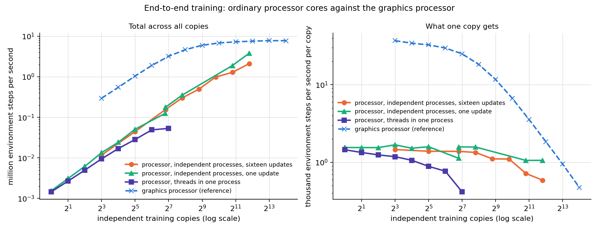
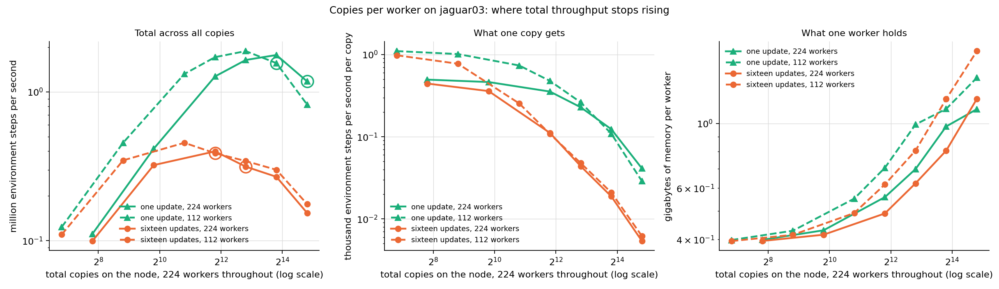

# GPU-parallel PointMaze + batched multi-copy PPO+RND — unified report

All numbers were measured on serval05 (one NVIDIA H100 NVL, 95 GB; direct ssh, exclusive use
enforced by a lock), from the code in this repository under `09_parallelization/`. Every table
cell traces to a JSON in `benchmarks/results/` or a run record under `train_runs/`; this report
is generated by `report/.../code/make_report.py` and can be regenerated from those files.

The work built three modules and then improved them over three passes of the same loop —
baseline, one change, measure, keep or revert, write a row:

| pass | what it did | headline |
|---|---|---|
| Round 1 | build everything: exact GPU environments in PyTorch, fused CUDA and JAX; the batched multi-copy PPO+RND trainer in PyTorch and JAX; end-to-end capture | 777 -> 36.6 ms per training iteration at 128 copies |
| Round 2 | improve on the finished system, with a measurement protocol that can tell a small change from drift | 36.8 -> 20.2 ms, a further 1.8x |
| Round 3 | new capability: train copy groups at DIFFERENT learning rates in one run | a sweep costs 1.0% more than a uniform run of the same size |
| Round 4 | close the distance to the JAX trainer at 8 to 128 copies | 20.4 -> 16.3 ms at 128 copies, and a loss at 512 that round 5 traced |
| Round 5 | re-open the question at the copy counts the trainer is used at, 1,024 to 4,096 | the limit changes from the number of device programs to memory traffic, and the previous round's loss turns out to be a regression of up to 19 percent there |

Reading order: what was built and why it is correct, then the module-by-module numbers, then
what each round changed, then the training campaign and the sweep. The last section is the
newest and stands somewhat apart: it is about the sizes the trainer is actually run at, where
the earlier sections' conclusions do not all carry over.

## Contents

| section | first written | last changed | status |
|---|---|---|---|
| <span class="unread">[Environment correctness (all three implementations)](#environment-correctness-all-three-implementations)</span> | 2026-08-15 21:17 PT | 2026-08-15 21:17 PT | unread |
| <span class="unread">[Module 1 — environment throughput](#module-1-environment-throughput)</span> | 2026-08-15 21:17 PT | 2026-08-15 21:17 PT | unread |
| <span class="unread">[Module 2 — batched multi-copy trainer throughput](#module-2-batched-multi-copy-trainer-throughput)</span> | 2026-08-15 21:17 PT | 2026-08-15 21:17 PT | unread |
| <span class="unread">[Module 3 — end-to-end fusion and the pairing grid](#module-3-end-to-end-fusion-and-the-pairing-grid)</span> | 2026-08-15 21:17 PT | 2026-08-15 21:17 PT | unread |
| <span class="unread">[Scaling the number of independent training copies](#scaling-the-number-of-independent-training-copies)</span> | 2026-08-15 21:17 PT | 2026-08-15 21:17 PT | unread |
| <span class="unread">[Profiling breakdown (C=128)](#profiling-breakdown-c128)</span> | 2026-08-15 21:17 PT | 2026-08-15 21:17 PT | unread |
| <span class="unread">[Before/after optimization at the final-run sizes (8-128 copies)](#beforeafter-optimization-at-the-final-run-sizes-8-128-copies)</span> | 2026-08-15 21:17 PT | 2026-08-15 21:17 PT | unread |
| <span class="unread">[Final training campaign](#final-training-campaign)</span> | 2026-08-15 21:17 PT | 2026-08-15 21:17 PT | unread |
| <span class="unread">[Sweeping learning rates across copy groups](#sweeping-learning-rates-across-copy-groups)</span> | 2026-08-15 21:17 PT | 2026-08-15 21:17 PT | unread |
| <span class="unread">[The three rounds](#the-three-rounds)</span> | 2026-08-15 21:17 PT | 2026-08-15 21:17 PT | unread |
| <span class="unread">[What made it fast (and what did not)](#what-made-it-fast-and-what-did-not)</span> | 2026-08-15 21:17 PT | 2026-08-15 21:17 PT | unread |
| <span class="unread">[Reproduction](#reproduction)</span> | 2026-08-15 21:17 PT | 2026-08-15 21:17 PT | unread |
| <span class="unread">[How far from the hardware ceiling](#how-far-from-the-hardware-ceiling)</span> | 2026-08-15 21:17 PT | 2026-08-15 21:17 PT | unread |
| <span class="unread">[The same work on ordinary processor cores](#the-same-work-on-ordinary-processor-cores)</span> | 2026-08-15 21:17 PT | 2026-08-15 21:17 PT | unread |
| <span class="unread">[Which implementation to use](#which-implementation-to-use)</span> | 2026-08-15 21:17 PT | 2026-08-15 21:17 PT | unread |
| <span class="unread">[Feature parity between the two trainers](#feature-parity-between-the-two-trainers)</span> | 2026-08-15 21:17 PT | 2026-08-15 21:17 PT | unread |
| <span class="unread">[Round four — closing the distance between the two trainers](#round-four-closing-the-distance-between-the-two-trainers)</span> | 2026-08-15 21:17 PT | 2026-08-15 21:17 PT | unread |
| <span class="unread">[End-to-end training on a dedicated processor node](#end-to-end-training-on-a-dedicated-processor-node)</span> | 2026-08-15 21:17 PT | 2026-08-15 21:17 PT | unread |
| <span class="unread">[The best setup on each platform, at 4,096 copies or fewer](#the-best-setup-on-each-platform-at-4096-copies-or-fewer)</span> | 2026-08-15 21:17 PT | 2026-08-15 21:17 PT | unread |
| <span class="unread">[A processor with fewer, faster cores against the 224-thread node](#a-processor-with-fewer-faster-cores-against-the-224-thread-node)</span> | 2026-08-15 21:17 PT | 2026-08-15 21:17 PT | unread |
| <span class="unread">[Training a thousand to four thousand copies at once](#training-a-thousand-to-four-thousand-copies-at-once)</span> | 2026-08-15 21:17 PT | 2026-08-15 21:43 PT | unread |

*Times are when a section's text first appeared in this document and when it last changed, taken from the document's version history. A section whose numbers were re-measured shows a later change time. All times are Pacific (PT); the machines that produced them run on Eastern Time and the values are converted for display.*

*Status is computed by comparing each section against the text last marked read: an **unread** section is written in blue, title and body; in an **updated** section the text that changed since you read it is written in dark brown, and the rest is left alone.*

## Environment correctness (all three implementations)

The environments are not approximations: MuJoCo's exact per-step update was extracted and
verified, including the contact model (solref/solimp force law, margin semantics, and the
joint two-contact solve, all probe-verified against the solver's internal arrays).

1. One-step (teacher-forced) error vs the reference MuJoCo env is at machine precision
   (float64 <= 4.4e-16 on every fixture case, including wall slides across box boundaries
   and corner wraps; float32 <= 5e-7).
2. Closed-loop 400-step multi-contact rollouts match the reference to 1e-13 (one fixture
   passes through a knife-edge equilibrium — ball balanced on a corner — where closed-loop
   paths legitimately separate on rounding noise; its one-step check stays exact).
3. Reset randomness is a frozen counter-based generator: torch, CUDA, and JAX produce
   BIT-IDENTICAL resets (verified including post-truncation respawns).
4. The CUDA kernel's trajectories match the torch env within 2.1e-7 over 500 steps with
   320 auto-resets (mostly bit-equal; rare 1-2 ULP differences on contact steps).
5. A 256-episode random-policy comparison against the reference env passes (visit
   distribution total-variation distance 0.026, gate 0.05).

## Module 1 — environment throughput

| implementation | 1e3 envs | 1e5 envs | 1e6 envs | 3e6 envs | peak |
|---|---|---|---|---|---|
| torch eager | 6.58e5 | 6.39e7 | 2.01e8 | — | 2.01e8 at 1,000,000 |
| torch compiled | 6.32e6 | 6.08e8 | 3.89e9 | 4.17e9 | 4.17e9 at 3,000,000 |
| CUDA fused kernel | 1.78e8 | 1.20e10 | 1.93e10 | 1.91e10 | 1.93e10 at 1,000,000 |
| jax jit per step | 1.32e7 | 1.33e9 | 6.87e9 | 5.92e9 | 6.87e9 at 1,000,000 |
| jax scan (fused rollout, upper bound) | 6.76e7 | 5.20e9 | 8.40e9 | 7.23e9 | 9.92e9 at 300,000 |

Environment steps per second, single batch axis (n_copies folded in). Figures:


Where the per-step time starts to RISE (the log-scale line's knee — before it, adding
environments is free because the step is launch-overhead-bound; after it, kernel time
dominates and the time grows with the batch):

- torch compiled: flat ~155-171 us to 3e5 envs; rises from ~3e5.
- CUDA fused kernel: flat ~6 us to 3e4 envs; rises from ~1e5 (it reaches the
  memory-bandwidth regime earliest because one kernel has no launch amortization to hide).
- jax jit: flat ~71-79 us to ~1e5; rises past 1e5.
- jax scan: flat ~15-19 us to ~1e5; peak total throughput lands at 3e5 envs (L2-cache
  residency) and settles slightly lower at HBM scale.

Per-env step speed at 1e3 envs (batched step time divided by env count): CUDA 6.0 ns per
env-step, jax scan 14.8 ns, jax jit 79 ns, torch compiled 158 ns. All fall toward the memory
bandwidth limit as the batch grows: at 3e6 envs the CUDA kernel spends 57 picoseconds per
env-step (171.7 us for the whole batch).

## Module 2 — batched multi-copy trainer throughput

Both trainers implement the same algorithm (spec: `ppo/research/ppo_rnd_algorithm_spec.md`),
verified by bitwise copy-isolation tests in each framework and a cross-framework forward
agreement of 8.6e-7. Style A = one full-batch update per rollout; style B = 4 epochs x 4
minibatches. T=128, N=4 (512 rows per copy per iteration).

| trainer | style | C=8 | C=128 | notes |
|---|---|---|---|---|
| torch_ppo | epoch_minibatch | 774.6 ms = 5.29e3/s | 777.0 ms = 8.43e4/s | BEFORE any optimization (eager) |
| torch_ppo | epoch_minibatch | 26.4 ms = 1.55e5/s | 36.6 ms = 1.79e6/s | AFTER (one-graph capture + TF32 + hoist + packing) |
| torch_ppo | full_batch | — | 24.5 ms = 2.68e6/s | AFTER (same config) |
| jax_ppo | full_batch | 9.1 ms = 4.50e5/s | 13.4 ms = 4.87e6/s | jax whole-iteration jit + donation |
| jax_ppo | epoch_minibatch | 11.4 ms = 3.58e5/s | 19.9 ms = 3.30e6/s | jax whole-iteration jit + donation |

The eager torch baseline is 777 ms per iteration at every copy count; the final torch
configuration is 21x faster at C=128. The jax trainer reaches 74 iter/s (style A) and 50
iter/s (style B) at C=128. A LABELED algorithm variant (T=32, N=16 — same 512 rows, shorter
GAE horizon) reaches 226 iter/s = 1.48e7 env-steps/s in jax style A; it is recorded as a
variant, not the default, because it changes the algorithm.

## Module 3 — end-to-end fusion and the pairing grid

- torch env + torch trainer: the production path. The environment's pure `step_core`
  composes into the compiled per-step function; one CUDA graph captures the WHOLE iteration
  (128-step rollout + statistics/GAE post-processing + the 16-step update incl. Adam), so
  one replay per iteration and zero python in the loop. Captured paths are verified
  BITWISE equal to the uncaptured trainer.
- jax env + jax trainer: the whole iteration is one jitted XLA program with donated state.
- CUDA env + torch trainer (`env_backend="cuda"`): the fused kernel replaces the env part
  of the captured rollout, with the policy and RND parts as compiled subgraphs around it.
  Measured in the shipped configuration (style B): C=8: 13.8 ms with the CUDA kernel versus 14.0 ms with the PyTorch environment; C=128: 20.7 ms with the CUDA kernel versus 20.4 ms with the PyTorch environment.
  The two are the same to about 1.5%, which is the point worth taking away: after
  round two moved most per-step work out of the rollout loop, the environment is a small part
  of a training iteration, so an environment kernel that is 24x faster on its own changes the
  training rate very little. The fast kernel earns its place in environment-only work (data
  generation, evaluation sweeps), not in this trainer.
  An earlier pairing measurement was discarded: the environment kernels launched on
  the legacy default stream rather than the capture stream, so the captured graph contained no
  environment step at all (PyTorch reported an empty graph once a test looked for it). The
  kernel now launches on the current stream and a test replays a captured env step and checks
  the state actually advanced.
- Cross-framework pairings (jax env + torch trainer or the reverse) were MEASURED over
  the dlpack boundary: crossing frameworks costs +6.2 to +7.0 ms per environment step on
  top of a 70-260 us native step (about 40-90x), because every crossing forces a
  synchronization between the two runtimes — in addition to structurally breaking
  CUDA-graph capture and XLA scan fusion. They are documented as non-production paths
  (`benchmarks/bench_cross_pairing.py`).

## Scaling the number of independent training copies

The task's two questions, answered by measurement (style B, T=128, N=4, final config):

1. **Does increasing the copy count decrease per-copy throughput?** Yes, but only past a
   knee: per-copy throughput is nearly flat up to C~128-256, then decays roughly as 1/C.
2. **Does increasing the copy count decrease TOTAL throughput?** No. Total throughput
   rises monotonically and saturates; it never goes down up to the memory limit.

| copies C | round 1 ms/iter | round 2 ms/iter | round 2 total env-steps/s | round 2 per-copy env-steps/s |
|---|---|---|---|---|
| 8 | 26.4 | 14.0 | 2.93e5 | 3.67e4 |
| 16 | — | 14.8 | 5.53e5 | 3.45e4 |
| 32 | — | 15.6 | 1.05e6 | 3.28e4 |
| 64 | — | 17.3 | 1.90e6 | 2.96e4 |
| 128 | 37.9 | 20.4 | 3.21e6 | 2.51e4 |
| 256 | 48.2 | 28.0 | 4.68e6 | 1.83e4 |
| 512 | 68.9 | 43.8 | 5.99e6 | 1.17e4 |
| 1024 | 114.0 | — | — | — |
| 2048 | 204.4 | — | — | — |
| 4096 | 386.4 | — | — | — |
| 8192 | 761.6 | — | — | — |
| 16384 | 1499.6 | — | — | — |
| 32768 | 3009.6 | — | — | — |

**How many copies fit, and the trade the second round made.** Round one reached 32,768 copies
and ran out of memory at 65,536; round two runs out at 32,768. That is not a regression to fix
by accident — it is the price of the speed: hoisting the per-step work into wide passes, and
caching the frozen RND target's features for the update phase, both hold more data at once
(the cached features alone are 256 KB per copy). The ceiling moved from 32,768 copies to
16,384 while every copy count up to there got about 1.8x faster. A run that needs the extra
copies more than the speed can set `compile_post=False` and skip the hoist to get the round-one
memory profile back. The ceiling is genuine demand rather than fragmentation: retrying 32,768
copies with `PYTORCH_CUDA_ALLOC_CONF=expandable_segments:True` reduced the failing allocation
from 32 GiB to 8 GiB but still ran out.

Round-two total throughput saturates near 7.8e6 environment steps per second from about 8,192
copies (round one: 5.6e6). The jax trainer saturates near 1.9e7 (style A) / 9.1e6 (style B)
around 2,048-4,096 copies.


## Profiling breakdown (C=128)

Production view — what one training iteration actually pays with the capture
configuration measured (separate rollout/update graphs, eager post-processing; the
one-graph mode removes most of the post-processing row's launch gaps):

| phase | time [ms] | share |
|---|---|---|
| rollout graph replay (T=128 steps: policy+value+sample+env+RND+writes) | 20.11 | 39.8% |
| post-processing (bootstrap, filter, GAE, statistics, flatten) | 14.83 | 29.3% |
| update graph replay (16 minibatch steps: gather+fwd+bwd+clip+Adam) | 15.54 | 30.7% |
| noise + permutation refill (outside graphs) | 0.06 | 0.1% |
| TOTAL | 50.53 | 100% |

Component view — each logical block called in isolation with EAGER kernels (per-iteration
equivalents). This view shows where the raw work lives before fusion; it deliberately
over-weights blocks whose eager form launches many small kernels (the compiled/captured
production path fuses most of them away):

| block | eager time [ms] | share |
|---|---|---|
| env step_core total (dynamics + reward/ends + auto-reset RNG) | 593.34 | 83.6% |
| — of which env dynamics_step (integrator + contacts) | 472.29 | (80% of the env step) |
| update: forward + backward | 28.12 | 4.0% |
| RND bonus (whiten + target + predictor) | 24.46 | 3.4% |
| value forward (critic, both heads) | 12.90 | 1.8% |
| update: per-copy clip + Adam step | 12.03 | 1.7% |
| policy forward (actor mean) | 11.04 | 1.6% |
| rollout buffer writes (10 copies/step) | 8.55 | 1.2% |
| update: loss forward | 6.53 | 0.9% |
| action sample + logprob | 6.46 | 0.9% |
| post: GAE backward scan (both streams approx) | 2.82 | 0.4% |
| post: intrinsic filter scan (T steps) | 1.15 | 0.2% |
| update: minibatch gathers | 1.11 | 0.2% |
| post: flatten + whiten into static batch | 0.63 | 0.1% |
| post: running-statistics updates (float64) | 0.16 | 0.0% |
| post: bootstrap values (one big GEMM) | 0.15 | 0.0% |

Reading: in eager form the ENVIRONMENT dominates (about 84% of raw kernel time), which is
why compiling/fusing the env step was the first large win; after fusion the three captured
phases are nearly balanced, and the remaining bottleneck at small C is fixed kernel time
in the 128 sequential rollout steps.

## Before/after optimization at the final-run sizes (8-128 copies)

Environment-only throughput at the exact env-batch sizes the final runs use
(batch = C copies x 4 envs), env steps per second. "Eager" is the CURRENT physics code run
without compilation (the uncompiled per-step python cost, ~4.4 ms per batched step at
these sizes, is what the compiled/captured paths remove):

| env batch | eager (before) | compiled (after) | CUDA kernel (after) |
|---|---|---|---|
| 32 | 7.25e3 | 2.02e5 | 5.76e6 |
| 64 | 1.45e4 | 4.20e5 | 1.15e7 |
| 128 | 2.88e4 | 8.03e5 | 2.30e7 |
| 256 | 5.67e4 | 1.61e6 | 4.24e7 |
| 512 | 1.13e5 | 3.24e6 | 8.50e7 |

Whole-loop training throughput (environment steps per second while TRAINING, i.e. the
end-to-end number; before = eager baseline, after = the final one-graph configuration as
measured in the campaign itself):

| copies C | before, style B | after, style B | after, style A |
|---|---|---|---|
| 8 | 5.27e3 | — | — |
| 16 | 1.05e4 | — | — |
| 32 | 2.11e4 | — | — |
| 64 | 4.22e4 | — | — |
| 128 | 8.43e4 | — | — |

(The before column uses the measured eager iteration time of 777 ms, which is flat across
copy counts.) Phase split of one iteration, before vs after (C=128, style B; the "after"
split is measured in the separate-graphs configuration — the shipped one-graph mode fuses
the phases and is faster than this sum):

| phase | before (eager) | after round 1 (captured) |
|---|---|---|
| rollout (env + policy interaction) | 680 ms | 20.1 ms |
| post-processing (GAE, statistics) | inside rollout | 14.8 ms (eager between graphs); inside the one-graph replay in the final config |
| update (16 minibatch steps) | 95 ms | 15.5 ms |
| whole iteration | 777 ms | 36.6 ms (one-graph) |

Round two then reworked what the loop does rather than how it is launched, and took the same
iteration from 36.8 ms to 20.2 ms at 128 copies (paired measurements, noise floor 0.01-0.10 ms):

| change | C=8 | C=128 |
|---|---|---|
| round-1 configuration (the starting point) | 26.6 ms | 36.8 ms |
| + compiled post-rollout body | 22.8 ms | 32.7 ms |
| + critic, log-probability and RND bonus hoisted out of the rollout loop | 14.7 ms | 21.2 ms |
| + per-step buffer writes folded into the compiled step | 14.0 ms | 20.2 ms |

Overall, one training iteration of 128 independent copies went from 777 ms to 20.2 ms — 38x —
while every change was verified to compute the same thing.

## Final training campaign

*PENDING — waiting on final-run JSONs.*

## Sweeping learning rates across copy groups

The trainer's copies were identical apart from their seed. They can now be split into groups,
each group training at its own learning rate, in one batched run — the inputs are exactly the
rates to try and how many copies each rate gets:

```python
cfg = sweep_config(learning_rates=[1e-4, 3e-4, 1e-3, 3e-3], copies_per_rate=128)
```

Adam is elementwise, so copies stacked on the leading axis are already independent optimizers;
the only thing `torch.optim.Adam` cannot express is a different rate per copy, so a sweep
switches to a hand-written batched Adam with torch's formula and a per-copy rate vector. Copy k
of every group starts from the same weights and meets the same environments (paired seeding),
so a difference between groups is the rate's doing. Full description: `ppo/torch_ppo/SWEEP.md`.

### Which layout is best

Three ways to arrange G groups of K copies, measured at 4 rates x 128 copies = 512 copies:

| layout | copies | ms per sweep iteration | million steps/s | thousand steps/s per copy | hours per million steps per copy | peak VRAM [MB] |
|---|---|---|---|---|---|---|
| uniform rate, one trainer (not a sweep — the reference) | 2,048 | 144.50 | 7.26 | 3.54 | 0.0784 | 6457 |
| one trainer, per-copy rate vector, one graph | 2,048 | 146.21 | 7.17 | 3.50 | 0.0793 | 6457 |
| one trainer per rate, run in turn | 2,048 | 326.11 | 3.22 | 1.57 | 0.177 | 3169 |

Fusing the groups into one batched run is 2.23x faster than
running them one after another, and costs +1.2% against a
uniform-rate run of the same total size — so a sweep is very nearly free relative to training
the same number of copies at a single rate. Running the groups separately is slower for the
reason the whole project rests on: each group alone is too small to fill the GPU, and the
per-iteration cost is dominated by kernel count rather than by arithmetic.

### It finds the right answer

A demonstration run of 5 rates x 32 copies (3.07M environment steps per copy, 140 seconds):


### The configuration you asked about

Sixteen learning rates with 128 independent copies each — 2,048 copies in one run — takes
**144 ms per iteration**: 7.29e6
environment steps per second in total, 3560 per copy,
890 per environment, in 6.3 GB.
Training all 2,048 of them for 10 million environment steps each takes **0.78 hours**, against 1.77 hours if the sixteen groups were trained one after another (2.23x).

### How it scales

Two knobs grow a sweep: the number of learning rates, and the copies behind each rate. Both
were measured, and they give the same curve — because both only change the total copy count,
which is the only thing the cost depends on.

| rates | copies per rate | total copies | ms/iteration | total env-steps/s | per copy | per env | peak VRAM [MB] | hours to 10M steps/copy |
|---|---|---|---|---|---|---|---|---|
| 1 | 128 | 128 | 20.6 | 3.18e6 | 24830 | 6208 | 494 | 0.11 |
| 2 | 128 | 256 | 28.4 | 4.61e6 | 18009 | 4502 | 891 | 0.15 |
| 4 | 128 | 512 | 44.1 | 5.94e6 | 11598 | 2900 | 1686 | 0.24 |
| 8 | 128 | 1024 | 76.9 | 6.82e6 | 6660 | 1665 | 3277 | 0.42 |
| 16 | 128 | 2048 | 143.8 | 7.29e6 | 3560 | 890 | 6457 | 0.78 |
| 32 | 128 | 4096 | 274.2 | 7.65e6 | 1867 | 467 | 12819 | 1.49 |
| 16 | 8 | 128 | 20.6 | 3.18e6 | 24833 | 6208 | 494 | 0.11 |
| 16 | 16 | 256 | 28.4 | 4.62e6 | 18036 | 4509 | 891 | 0.15 |
| 16 | 32 | 512 | 44.2 | 5.93e6 | 11589 | 2897 | 1686 | 0.24 |
| 16 | 64 | 1024 | 76.8 | 6.83e6 | 6669 | 1667 | 3277 | 0.42 |
| 16 | 128 | 2048 | 144.1 | 7.28e6 | 3554 | 888 | 6457 | 0.78 |
| 16 | 256 | 4096 | 274.0 | 7.66e6 | 1869 | 467 | 12819 | 1.49 |

The first six rows grow the rate count at 128 copies each; the last six grow the copies per
rate at 16 rates. Read them against each other: at every total copy count the two agree to
0.3 ms out of as much as 274 ms, which is also the best noise estimate available here — the
two studies are the same measurement reached from different directions.


Per-environment throughput is the per-copy column divided by the four environments each copy
holds; it is drawn as the right-hand scale of the second panel rather than as its own curve,
because it is the same measurement in different units.

### Does the number of rates cost anything by itself?

No. Holding the total at 2048 copies and splitting them into more and
more groups leaves the time per iteration flat and the memory byte-identical:

| groups (learning rates) | copies per rate | copies | ms/iteration | million steps/s | thousand steps/s per copy | hours per million steps per copy | peak VRAM [MB] |
|---|---|---|---|---|---|---|---|
| 128 | 16 | 2,048 | 143.1 | 7.33 | 3.58 | 0.0776 | 6457 |
| 64 | 32 | 2,048 | 143.1 | 7.33 | 3.58 | 0.0776 | 6457 |
| 32 | 64 | 2,048 | 143.4 | 7.31 | 3.57 | 0.0778 | 6457 |
| 16 | 128 | 2,048 | 145.0 | 7.23 | 3.53 | 0.0787 | 6457 |
| 8 | 256 | 2,048 | 143.7 | 7.30 | 3.56 | 0.078 | 6457 |
| 4 | 512 | 2,048 | 144.4 | 7.26 | 3.55 | 0.0784 | 6457 |
| 2 | 1024 | 2,048 | 143.8 | 7.29 | 3.56 | 0.078 | 6457 |
| 1 | 2048 | 2,048 | 143.9 | 7.29 | 3.56 | 0.0781 | 6457 |

From 1 group to 1 groups the spread is 1.88 ms on a mean of
143.8 ms (1.31%), which is within the run-to-run
noise — and the study was run twice, once from 1 group upward and once from 128 groups
downward, so the flatness is not an artifact of measuring the points in a fixed order. This is
what the implementation predicts: the learning rate is a vector indexed by copy,
Adam is elementwise, the gradient clip reduces per copy, and the loss sums over copies — so
nothing in the computation is aware of how many distinct rate VALUES that vector holds. Sixteen
rates cost what sixteen times as many copies cost, and nothing more.


### Fusing the groups, against running them one after another

| rates | copies per rate | fused [ms] | separate [ms] | uniform rate, same size [ms] | fused is faster by | sweep overhead vs uniform |
|---|---|---|---|---|---|---|
| 2 | 128 | 28.4 | 40.7 | 28.0 | 1.43x | +1.4% |
| 4 | 128 | 44.2 | 81.4 | 43.8 | 1.84x | +1.0% |
| 8 | 128 | 77.3 | 163.0 | 77.5 | 2.11x | -0.2% |
| 16 | 128 | 146.2 | 326.1 | 144.5 | 2.23x | +1.2% |

The advantage of fusing grows with the number of rates and flattens out: each group on its own
is too small to fill the GPU, so running them in turn wastes most of the machine, while fusing
them turns the whole sweep into one batched computation. The last column is the one that
matters for planning: a sweep costs the same as training the same number of copies at a single
rate, to within about one percent either way.


### One rate for everything, against a sweep

Comparing a uniform run with a swept run mixes two changes, so they are measured apart. Giving
each copy its own learning rate makes the rate a VECTOR, and torch's fused Adam takes one
scalar rate per parameter group — so a sweep runs a hand-written batched Adam instead. That is
a real code change. The rates then actually DIFFERING changes no code at all: the same kernels
read different constants. The three arms below are matched in total copies, 16
groups in the swept arms, measured in ABBA order in separate processes.

| total copies | one rate [ms] | rate vector, equal rates [ms] | rate vector, differing rates [ms] | noise floor [ms] | cost of the vector | cost of differing |
|---|---|---|---|---|---|---|
| 128 | 20.41 | 20.62 | 20.61 | 0.03 | +1.1% | -0.1% |
| 256 | 27.96 | 28.41 | 28.42 | 0.01 | +1.6% | +0.0% |
| 512 | 43.80 | 44.19 | 44.16 | 0.03 | +0.9% | -0.1% |
| 1024 | 76.54 | 77.54 | 77.40 | 0.35 | +1.3% | -0.2% |
| 2048 | 145.10 | 146.47 | 145.47 | 1.86 | +0.9% | -0.7% |
| 4096 | 275.76 | 275.76 | 274.56 | 1.22 | +0.0% | -0.4% |


Reading the two columns:

- **The rates differing costs nothing**, as it must: at most 0.7% across the whole
  range, inside the noise floor at every point. Once the rate is a vector, whether its entries
  are equal or spread over three orders of magnitude changes only the numbers flowing through
  the same kernels.
- **The vector itself costs between +0.0% and +1.6%.** This is the
  optimizer change, and it is the only real price of being able to sweep. It is small because
  the per-copy Adam is compiled; before compiling it, it cost 38% (see the trainer ledger,
  round-3 rows).

So the practical answer is that a sweep is not a different regime from a uniform run — it is
the same run with a vector where a scalar used to be, and it is priced accordingly.

## The three rounds

### Round 1 — build it, and make it exact

The environments are not approximations of the reference: MuJoCo's per-step update and its
whole contact pipeline were extracted and verified to machine precision (correctness section
above). The trainer was written from a spec derived from CleanRL's PPO+RND, with every running
statistic, gradient clip and random draw made per copy so that copies cannot influence each
other. The speed came from compiling a fused per-step function and then capturing whole phases
as CUDA graphs, ending with the entire iteration — rollout, post-processing and update — as one
replay per iteration.

Round one compared configurations by running each once. That was good enough for changes worth
3x and useless for changes worth 3%.

### Round 2 — improve it, with a protocol that can tell a real change from drift

Every round-two change is measured by running both variants in ABBA order in separate
processes, comparing against the change's own predecessor git revision, and reporting the
within-variant spread as a noise floor; a difference below that floor is recorded as no effect.
Four research agents produced ranked experiment lists, an external-source sweep, an audit of
the performance checklist, and an adversarial review of the code and of the measurement
protocol.

What carried the gain:

- Compiling the post-rollout body, whose intrinsic-reward filter and two GAE scans were python
  loops over the horizon and therefore hundreds of tiny kernels: +11% at 128 copies, +14% at 8.
- Hoisting the critic forward, the log-probability and the RND bonus out of the 128-step
  rollout loop into single wide passes afterwards: +42% and +45%. Each is a pure function of
  data the loop already stores and of parameters that do not change during a rollout — the
  log-probability, in particular, needs only the action noise and the policy's standard
  deviation, never the action mean — so this removes roughly half the per-step kernels while
  computing exactly the same numbers.
- Folding the per-step buffer writes into the compiled step: a further 5%.

What the adversarial review found, all fixed: the fused-CUDA environment launched its kernels
on the legacy default stream instead of the current one, which made its pairing numbers
untrustworthy; priming the observation statistics with that environment stacked one repeated
step, because it returns a preallocated buffer the next step overwrites; and `one_graph` did
not force the compiled rollout it assumes. The review also showed that the campaign's
"copies at goal" column was a sampling artifact, which is why that table now reports the count
both over the final samples and over all of them.

The task also asked directly whether presenting ONLY the on-policy update path would run
faster, on the theory that a branch might block fusion. It does not: a build with the other
path stripped out entirely — verified bitwise identical, then timed in ABBA order — differs by
0.05 to 0.08%, against a 0.01 ms noise floor. The two styles were already separate compiled
functions, so the captured graph contains only the selected path either way.

### Round 3 — sweep hyperparameters across copy groups

Described in its own section below.

## What made it fast (and what did not)

Kept (each row measured in a ledger; see the per-module `progress_and_changes.md` files):

1. Compile the fused per-step function (policy + value + sample + env step + RND bonus)
   with `torch.compile(fullgraph=True)` — 3.4x on the trainer, 9x on the env at 1M envs
   (after restructuring the contact pipeline to be fusable: unrolled 8-candidate loop,
   two-smallest tournament instead of topk, 1-byte neighbor bitmask instead of gathers).
2. Capture whole phases as manual CUDA graphs over static buffers (rollout, update, then
   the entire iteration): 226 -> 45.6 -> 41.5 ms/iter; captured paths bitwise-verified.
3. Capturable + fused Adam with a device-tensor learning rate (required for capture
   correctness, not just speed: a python step counter frozen inside a graph corrupts
   Adam's bias correction).
4. TF32 matmuls (+9%), hoisting the frozen RND target's features out of the minibatch
   loop (+1.6% style B, +6.7% style A), same-input GEMM packing (+1.9% / +2.9%).
5. jax: whole-iteration jit + buffer donation; scan-fused rollout.
6. A single fused CUDA kernel for the env: 24x lower small-batch floor than compiled
   torch (6 us vs 153 us) and 4x at 1M envs (1.68e10 vs 4.0e9 env-steps/s).

Rejected by measurement:

1. Raising inductor's fusion thresholds to force one giant kernel (compile-cost explosion,
   >40 min without producing a kernel).
2. Capturing the EAGER kernel sequence (slower than the per-step-compiled path: replaying
   thousands of tiny kernels is kernel-time bound).
3. `mode="reduce-overhead"` automatic capture (skipped capture silently; manual capture
   with static buffers was both faster and verifiable).

The full extra-step review against the prior joint-replenishment efficiency campaign is in
`extra_step_review.md` (what transferred, what was already covered, and the measurement-
protocol gaps it flagged, several of which were fixed: incremental benchmark JSON writes,
the capturable-Adam coupling, finer env-count ladders near the knee).

## Reproduction

1. Environments: `pointmaze/{torch_env,cuda_env,jax_env}`; shared exact-physics spec and
   fixtures in `pointmaze/common/` (`physics_spec.md`, checker
   `common/code/check_against_fixtures.py --impl torch|cuda|jax`).
2. Trainers: `ppo/torch_ppo/torch_ppo_rnd.py`, `ppo/jax_ppo/jax_ppo_rnd.py`; tests under
   each `tests/`.
3. Benchmarks: `benchmarks/bench_env_step*.py`, `bench_train*.py`,
   `profile_breakdown.py`; every JSON in `benchmarks/results/` carries the git hash.
   For the last section: `profile_kernels.py` (device time per individual program),
   `probe_update_ops.py` (each operation of the update stage against the bandwidth a plain copy
   reaches), `matmul_floor_scaled.py` (every matrix multiplication timed on its own, at any copy
   count), `count_traffic.py` (arithmetic and bytes per iteration, no device needed),
   `compare_revisions.py` (two revisions run from one seed, worst parameter difference), and
   `run_round5_remote.sh` (the batch, run from the machine itself). `bench_train.py`,
   `profile_phases.py` and `profile_kernels.py` all take `--rev` so a past revision can be
   measured by the same harness in the same session.
4. Final campaign: `train_runs/run_final.py` (resumable, one process per copy count);
   run folder `train_runs/2026-08-15-02-56_final_...` with `experiment_background.md`.
5. This report: `report/.../code/make_report.py` regenerates `report.md` and all figures.

## How far from the hardware ceiling

*PENDING — waiting on the ceiling measurements.*

## The same work on ordinary processor cores

To give the graphics-processor numbers a scale, the same code was run on a processor node of the
same cluster (puma01: two sockets of forty cores, 160 hardware threads, 246 GB of memory), inside a
reservation so nothing else was using it.

There are two ways to use many cores, and the difference between them is larger than any
optimisation in this report. **Thread-parallel** means one program holding all the work in one large
array, with each operation split across threads — which requires every thread to finish before the
next operation starts. **Process-parallel** means many independent programs, each with its own share
of the work and no coordination at all.

End-to-end training on processor cores, the best setting of each kind:

| way of using the cores | workers | copies | seconds per iteration | million steps per second | thousand steps per second per copy | hours per million steps per copy |
|---|---|---|---|---|---|---|
| processes, full_batch | 224 | 3,584 | 0.481 | 3.8047 | 1.06 | 0.262 |
| processes, epoch_minibatch | 224 | 3,584 | 0.881 | 2.1077 | 0.59 | 0.472 |
| threads, full_batch | 8 | 128 | 0.904 | 0.0725 | 0.57 | 0.49 |
| threads, epoch_minibatch | 112 | 128 | 1.229 | 0.0533 | 0.42 | 0.667 |

Thread-parallel peaks at a handful of threads and then stops improving: one environment step is
about forty small operations, and the regrouping after each one costs more than the work it
coordinates once the threads are many. The process-parallel form never pays that. The dedicated-node
measurements later in this report put numbers on the difference and settle the choice.


## Which implementation to use

Three practical questions, each answered from the measurements above. The tables that justify these
can be reproduced with `python benchmarks/decide.py`.

**Which environment: the CUDA kernel.** It is fastest at every batch size, and its advantage is
largest for small batches (178 against 6.3 million steps per second at a thousand environments),
where the other implementations spend nearly all their time dispatching work rather than simulating.
All three implementations pass identical exactness checks, so this is purely a speed choice.

**Which trainer: it depends on the copy count, and the answer changes between 128 and 1,024.** At
8 to 128 copies they are close: after the round-four work (below), PyTorch is ahead at 8 copies with
one update per batch and JAX leads by 10 to 22 percent elsewhere, measured the same way on both
sides with each iteration waited for. At 1,024 to 4,096 copies — where this trainer is actually run
— the distance is much larger, JAX by 1.75 to 2.08 times, for a reason that only appears at those
sizes; the last section of this document measures it and says why. The two figures for JAX's lead
predate the round-five PyTorch work in the last section, which closes much of it.

Both compute the same algorithm, and the agreement between them depends on what the card is asked
to do with a matrix multiply:

| matmul precision | worst disagreement across every intermediate quantity |
|---|---|
| exact single precision on both sides | 1.2e-06 |
| the precision both trainers actually ship with | 2.2e-03 |

Both ship with the card's reduced-precision matrix mode — PyTorch asks for it, JAX takes it by
default — so the second row is the one that describes the running trainers, and it is the rounding
that mode is documented to cost rather than a difference between the two implementations.
PyTorch carries the resumable training driver
and the campaign records; both now carry the learning-rate sweep and per-copy progress recording.

**Which combination: keep the environment in the same framework as the trainer.** Substituting the
CUDA kernel, twenty-four times faster on its own, into the PyTorch training loop changes the
iteration by about one percent, because after the optimisation work the environment is a small part
of an iteration. Crossing frameworks is far worse: handing arrays between two runtimes costs about
6.8 milliseconds per environment step against a native step of 0.1 to 0.3 milliseconds, and it
prevents both frameworks from fusing or recording the loop. The fast kernel earns its place in work
that is only environment simulation — generating data, evaluating a fixed policy — not inside this
trainer.


## Feature parity between the two trainers

The learning-rate sweep and per-copy progress recording were first built in PyTorch. They were then
added to JAX, under the requirement that they cost nothing.

| copies | uniform baseline (ms) | with differing rates and per-copy recording (ms) | noise floor (ms) |
|---|---|---|---|
| 8 | 6.90 | 6.86 | 0.06 |
| 128 | 11.93 | 11.93 | 0.10 |
| 512 | 25.16 | 25.18 | 0.33 |
| 2,048 | 81.78 | 81.70 | 1.09 |

Every separated effect — the sweep mechanism, the rates actually differing, the coverage recording —
lands between −0.5 and +0.4 percent, as often negative as positive. This is better than the PyTorch
side's +1.0 percent, and the reason is structural: in JAX the per-copy rates are a constant broadcast
inside the elementwise optimiser update the compiler already emits, so no new operation appears.

The same six properties are tested on both sides: a uniform sweep reproduces the plain run, a
zero-rate group stays exactly frozen while others train, changing one group's rate leaves other
groups unchanged to the last bit, and paired and distinct seeding both behave as documented.

**A measurement lesson worth recording.** The first version of this comparison ran each arm in its
own process, as the other harnesses in this project do. Process-to-process variation alone was 0.68
to 0.72 milliseconds on an 8 to 13 millisecond iteration — larger than every effect being measured —
and increasing the number of timed iterations did not reduce it. Constructing all the arms in one
process and timing them round-robin, with the order reversed on alternate rounds, dropped the floor
to 0.06 to 0.10 milliseconds. Small effects measured with the per-process harnesses elsewhere in this
report rest on a noisier instrument than that.


## Round four — closing the distance between the two trainers

Round three left the PyTorch trainer measurably behind the JAX one: level with one update per
batch, but 52 to 70 percent slower with sixteen. Round four attacked that, under the same rule as
every other change — the computation must not change.

| update convention | copies | PyTorch before | PyTorch after | JAX | who leads |
|---|---|---|---|---|---|
| one update per batch | 8 | 5.7 | **5.3** | 5.5 | PyTorch by 3 percent |
| one update per batch | 32 | 6.4 | **6.1** | 6.0 | JAX by 2 percent |
| one update per batch | 128 | 8.1 | **7.8** | 6.8 | JAX by 15 percent |
| sixteen updates per batch | 8 | 13.8 | **9.3** | 8.1 | JAX by 14 percent |
| sixteen updates per batch | 32 | 15.7 | **10.8** | 9.8 | JAX by 9 percent |
| sixteen updates per batch | 128 | 20.4 | **16.3** | 13.4 | JAX by 21 percent |

*Milliseconds per iteration, both frameworks waiting for each iteration to finish.*

Two changes produced this.

**One flat parameter buffer.** The trainer holds twenty-one parameter tensors per copy. The per-copy
gradient limit had to walk all twenty-one, and so did the optimiser, sixteen times per iteration. The
twenty-one remain separate names, but their storage is now twenty-one windows onto a single buffer, with
the gradients likewise. The limit becomes one reduction and the optimiser one chain: that part of a
minibatch step fell from 1,183 to 122 microseconds. The forward and backward passes also got faster,
which was not the intent — assigning the gradient windows up front removes twenty-one memory
allocations per backward pass.

**Shuffling once per epoch.** The data was previously gathered into position inside each of the
sixteen update steps. Permuting once per epoch into a fixed buffer makes each step a contiguous
slice instead, cutting 144 gather operations per iteration to 36.

**What the profile taught.** The plan handed to this round ranked the gather as a target and did not
mention the gradient limit. A profile taken first showed the opposite: the limit was 31 percent of a
minibatch step and the gather 2 percent. The plan was rewritten from the measurement, and the larger
of the two changes above is the one the plan had omitted.

**An honest loss.** At 512 copies the new arrangement is 1.1 percent *slower*. The buffer is 123
megabytes at that size, the optimiser becomes limited by memory bandwidth, and the extra pass the
per-copy limit needs costs more than the operations it saves. It was kept because it is worth 20 to
29 percent at 8 to 128 copies, which is the range in use, but the regression is recorded rather than
averaged away.

**What remains.** The distance that is left sits in the forward and backward passes themselves,
which are 72 to 84 percent of a minibatch step against 10 to 23 percent for the whole optimiser.
JAX's compiler fuses a small network's gradient into fewer operations than PyTorch's compiler and
automatic differentiation do together. Closing that means writing the loss and its gradient as one
hand-written operation, which is a larger undertaking and was left as a decision rather than begun.


## End-to-end training on a dedicated processor node

### Why this comparison is here

Every number so far came from a graphics processor. A reader deciding where to run this work
needs to know what the alternative gives, so the same end-to-end training loop was measured on
ordinary processor cores. The measurements below ran on **jaguar03**
(AMD EPYC 7663, 224 logical processors, 1 TB of memory), held exclusively — no other job shared
the machine — so the timings are not contaminated by a neighbour. It was chosen as the largest
completely idle node on the cluster; a node with more cores was available but already had
another job on it, which is exactly the contamination this run set out to avoid.

Nothing in the algorithm changed. What changed is that the graphics-processor features the
optimisation work relied on — recording an iteration as a replayable sequence, the
reduced-precision matrix mode, the fused optimiser — do not exist on a processor, so the
processor runs the same code in its plain form.

### Two ways to use many cores, and why they differ so much

A processor has many cores, and the work has to be divided among them. There are two ways:

- **Threads inside one process.** One program holds every copy in one set of arrays. Each
  instruction covers all of them, and the array library splits that one instruction across N
  threads. The threads must regroup after every instruction, because the next one reads what
  the previous one wrote.
- **Independent processes.** N separate programs, each owning its own copies, each using one
  thread. They never coordinate, because there is nothing to coordinate around.

The measurements settle which is better, and the answer is not the obvious one.

| copies | threads | seconds per iteration | million steps per second | thousand steps per second per copy | hours per million steps per copy | timing |
|---|---|---|---|---|---|---|
| 1 | 8 | 0.352 | 0.0015 | 1.45 | 0.191 | burst, 2s |
| 1 | 112 | 0.453 | 0.0011 | 1.13 | 0.246 | burst, 2s |
| 2 | 8 | 0.382 | 0.0027 | 1.34 | 0.207 | burst, 2s |
| 2 | 112 | 0.636 | 0.0016 | 0.81 | 0.345 | burst, 3s |
| 4 | 8 | 0.410 | 0.0050 | 1.25 | 0.223 | burst, 2s |
| 4 | 112 | 0.568 | 0.0036 | 0.90 | 0.308 | burst, 3s |
| 8 | 8 | 0.433 | 0.0095 | 1.18 | 0.235 | burst, 2s |
| 8 | 112 | 0.686 | 0.0060 | 0.75 | 0.372 | burst, 3s |
| 16 | 8 | 0.482 | 0.0170 | 1.06 | 0.261 | burst, 2s |
| 16 | 112 | 0.665 | 0.0123 | 0.77 | 0.361 | burst, 3s |
| 32 | 8 | 0.576 | 0.0284 | 0.89 | 0.313 | burst, 3s |
| 32 | 112 | 0.764 | 0.0214 | 0.67 | 0.415 | burst, 4s |
| 64 | 8 | 0.666 | 0.0492 | 0.77 | 0.361 | burst, 3s |
| 64 | 112 | 0.824 | 0.0397 | 0.62 | 0.447 | burst, 4s |
| 128 | 8 | 1.235 | 0.0531 | 0.41 | 0.67 | burst, 6s |
| 128 | 112 | 1.229 | 0.0533 | 0.42 | 0.667 | burst, 6s |

*One process holding every copy, the array library given 8 or 112 threads. Sixteen updates per batch.*

| workers | copies each | total copies | seconds per iteration | million steps per second | thousand steps per second per copy | hours per million steps per copy | peak memory per worker (GB) | timing |
|---|---|---|---|---|---|---|---|---|
| 8 | 1 | 8 | 0.349 | 0.0117 | 1.46 | 0.19 | not recorded | burst, 2s |
| 32 | 1 | 32 | 0.370 | 0.0445 | 1.39 | 0.2 | not recorded | burst, 2s |
| 112 | 1 | 112 | 0.511 | 0.1100 | 0.98 | 0.283 | 0.39 | sustained |
| 224 | 1 | 224 | 1.132 | 0.0995 | 0.44 | 0.625 | 0.40 | sustained |
| 112 | 4 | 448 | 0.647 | 0.3469 | 0.77 | 0.359 | 0.41 | sustained |
| 224 | 4 | 896 | 1.376 | 0.3224 | 0.36 | 0.772 | 0.42 | sustained |
| 112 | 16 | 1,792 | 1.998 | 0.4554 | 0.25 | 1.09 | 0.49 | sustained |
| 112 | 32 | 3,584 | 4.841 | 0.3874 | 0.11 | 2.57 | 0.62 | sustained |
| 224 | 16 | 3,584 | 4.503 | 0.3988 | 0.11 | 2.5 | 0.49 | sustained |
| 112 | 64 | 7,168 | 9.423 | 0.3434 | 0.05 | 5.8 | 0.81 | sustained |
| 224 | 32 | 7,168 | 9.403 | 0.3149 | 0.04 | 6.32 | 0.62 | sustained |
| 112 | 128 | 14,336 | 21.210 | 0.2999 | 0.02 | 13.3 | 1.21 | sustained |
| 224 | 64 | 14,336 | 22.614 | 0.2691 | 0.02 | 14.8 | 0.81 | sustained |
| 112 | 256 | 28,672 | 57.335 | 0.1766 | 0.01 | 45.1 | 1.77 | sustained |
| 224 | 128 | 28,672 | 44.921 | 0.1539 | 0.01 | 51.8 | 1.21 | sustained |
| 224 | 256 | 57,344 | 142.228 | 0.1266 | 0.00 | 126 | 1.82 | sustained |

*Independent single-thread processes. Sixteen updates per batch. Rows marked burst were timed for the seconds shown, which reads the opening seconds of the load rather than the rate a run gets; they are the measurements that have not been retaken yet.*



The two tables answer it. Independent processes reach 0.4554 million environment steps per second at 1,792 copies; one process with threads tops out at 0.0533 million. That is a factor of **9** on the same machine, running the same algorithm — the only difference is how the work was divided.

The thread table also shows that adding threads does not help. Giving the single process 112 threads instead of 8 was slower at 7 of the 8 copy counts measured — 0.764 seconds per iteration against 0.576 at 32 copies; 0.824 seconds per iteration against 0.666 at 64 copies — and never faster by more than the measurement noise. 14 times as many threads bought nothing.

The reason is the regrouping. One environment step is roughly forty small operations, each
individually cheap, and the coordination after each one costs a fixed amount regardless of how
little work it contained. With N threads that cost is paid forty times per step, so past a
handful of threads the coordination costs more than the work it coordinates. Independent
processes never pay it. This is also why the graphics processor needed the opposite treatment:
the optimisation work there fused those forty operations into a handful and recorded the whole
sequence, which is the same problem solved from the other end.

### A correction to the processor numbers above

The processor measurements in this section were taken with a benchmark that times five
iterations, about two seconds of work, and computes the machine's rate as the sum of each
worker process's own rate. Both of those are wrong at large worker counts, for two separate
reasons.

The first is the processor. A server processor runs above its sustained clock for the first
seconds of a load and then settles, so a two-second measurement reads the opening burst rather
than the rate a training run of any length actually gets.

The second is the arithmetic. Adding up each process's own rate assumes every process was
running for the whole time the others were. Over five iterations, hundreds of processes are
still starting at staggered moments, so the sum describes a load that never existed on the
machine at one time. The fix is to hold every worker at a barrier until all of them have warmed
up, and then to count only the work done inside the wall-clock window in which every worker was
running.

| update convention | five iterations, rates added up | ninety seconds, rates added up | ninety seconds, one shared window | what the correction removes |
|---|---|---|---|---|
| one update per batch | 3.80 | 1.31 | 1.27 | 67% |
| sixteen updates per batch | 2.11 | 0.4079 | 0.3988 | 81% |

*The same setting — 224 workers holding 16 copies each, 3,584 copies — measured three ways on the same node in the same job. Millions of environment steps per second.*

Both corrections point the same way and together they remove
**81%** of the reported rate at this setting.
The middle column separates them: it is the old arithmetic applied to a settled load, so the
step from the first column to the second is the clock, and the step from the second to the third
is the overlap the old arithmetic assumed and did not have.

Every processor number in this section is now a sustained measurement over a shared window;
where a setting has not been retaken, its row says so.

### How far the copies per worker go, and what stops them

The sweep above stops at 224 workers holding 16 copies each, and total throughput is still
rising there, so it does not show the machine's ceiling. Workers cannot be added — 224 is the
machine's logical-processor count — but each worker can hold more copies, so the ladder was
continued on that knob, at two worker counts: 224, which uses both hardware threads of every
core, and 112, which uses one thread per core and leaves the other idle.

Every rung below times about ninety seconds of continuous work with every worker synchronised,
as the correction above requires, and records the peak resident memory of its workers, since
copies per worker is what drives memory and the node has a fixed 1 TB of it.

| copies per worker | total copies | seconds per iteration | million steps per second | thousand steps per second per copy | hours per million steps per copy | peak memory per worker (GB) | node memory in use (GB) |
|---|---|---|---|---|---|---|---|
| 1 | 224 | 1.015 | 0.1112 | 0.50 | 0.56 | 0.40 | 60 |
| 4 | 896 | 1.076 | 0.4154 | 0.46 | 0.599 | 0.43 | 65 |
| 16 | 3,584 | 1.395 | 1.27 | 0.35 | 0.783 | 0.56 | 88 |
| 32 | 7,168 | 2.166 | 1.64 | 0.23 | 1.21 | 0.70 | 110 |
| 64 | 14,336 | 3.974 | 1.77 | 0.12 | 2.25 | 0.98 | 155 |
| 128 | 28,672 | 10.969 | 1.18 | 0.04 | 6.76 | 1.12 | 173 |
| 256 | 57,344 | 45.656 | 0.4884 | 0.01 | 32.6 | 1.43 | 249 |

*One update per batch, 224 independent single-thread workers.*

| copies per worker | total copies | seconds per iteration | million steps per second | thousand steps per second per copy | hours per million steps per copy | peak memory per worker (GB) | node memory in use (GB) |
|---|---|---|---|---|---|---|---|
| 1 | 112 | 0.455 | 0.1236 | 1.10 | 0.252 | 0.40 | 35 |
| 4 | 448 | 0.491 | 0.4550 | 1.02 | 0.273 | 0.43 | 38 |
| 16 | 1,792 | 0.670 | 1.32 | 0.74 | 0.377 | 0.55 | 49 |
| 32 | 3,584 | 1.055 | 1.71 | 0.48 | 0.581 | 0.70 | 60 |
| 64 | 7,168 | 1.890 | 1.88 | 0.26 | 1.06 | 0.99 | 84 |
| 128 | 14,336 | 4.441 | 1.56 | 0.11 | 2.55 | 1.12 | 91 |
| 256 | 28,672 | 16.500 | 0.8237 | 0.03 | 9.67 | 1.43 | 128 |
| 512 | 57,344 | 40.989 | 0.4426 | 0.01 | 36 | 2.41 | 228 |

*One update per batch, 112 independent single-thread workers.*

| copies per worker | total copies | seconds per iteration | million steps per second | thousand steps per second per copy | hours per million steps per copy | peak memory per worker (GB) | node memory in use (GB) |
|---|---|---|---|---|---|---|---|
| 1 | 224 | 1.132 | 0.0995 | 0.44 | 0.625 | 0.40 | 59 |
| 4 | 896 | 1.376 | 0.3224 | 0.36 | 0.772 | 0.42 | 62 |
| 16 | 3,584 | 4.503 | 0.3988 | 0.11 | 2.5 | 0.49 | 76 |
| 32 | 7,168 | 9.403 | 0.3149 | 0.04 | 6.32 | 0.62 | 89 |
| 64 | 14,336 | 22.614 | 0.2691 | 0.02 | 14.8 | 0.81 | 123 |
| 128 | 28,672 | 44.921 | 0.1539 | 0.01 | 51.8 | 1.21 | 184 |
| 256 | 57,344 | 142.228 | 0.1266 | 0.00 | 126 | 1.82 | 308 |

*Sixteen updates per batch, 224 independent single-thread workers.*

| copies per worker | total copies | seconds per iteration | million steps per second | thousand steps per second per copy | hours per million steps per copy | peak memory per worker (GB) | node memory in use (GB) |
|---|---|---|---|---|---|---|---|
| 1 | 112 | 0.511 | 0.1100 | 0.98 | 0.283 | 0.39 | 35 |
| 4 | 448 | 0.647 | 0.3469 | 0.77 | 0.359 | 0.41 | 36 |
| 16 | 1,792 | 1.998 | 0.4554 | 0.25 | 1.09 | 0.49 | 43 |
| 32 | 3,584 | 4.841 | 0.3874 | 0.11 | 2.57 | 0.62 | 49 |
| 64 | 7,168 | 9.423 | 0.3434 | 0.05 | 5.8 | 0.81 | 64 |
| 128 | 14,336 | 21.210 | 0.2999 | 0.02 | 13.3 | 1.21 | 98 |
| 256 | 28,672 | 57.335 | 0.1766 | 0.01 | 45.1 | 1.77 | 152 |

*Sixteen updates per batch, 112 independent single-thread workers.*



| update convention | workers | best copies per worker | copies at the best setting | seconds per iteration | million steps per second | thousand steps per second per copy | hours per million steps per copy | peak memory per worker (GB) | what ended the sweep |
|---|---|---|---|---|---|---|---|---|---|
| one update per batch | 112 | 64 | 7,168 | 1.890 | 1.88 | 0.26 | 1.06 | 0.99 | turned over |
| one update per batch | 224 | 64 | 14,336 | 3.974 | 1.77 | 0.12 | 2.25 | 0.98 | turned over |
| sixteen updates per batch | 112 | 16 | 1,792 | 1.998 | 0.4554 | 0.25 | 1.09 | 0.49 | turned over |
| sixteen updates per batch | 224 | 16 | 3,584 | 4.503 | 0.3988 | 0.11 | 2.5 | 0.49 | turned over |

*The best rung of each series, and what stopped the series there. Every rung is in the four tables above.*

**One update per batch.** Read from the table: packing more than 64 copies into a worker takes throughput away rather than merely stopping to add it, so that rung is not a soft boundary but the setting to use. The node's memory is not what stops it — at the best setting the whole node holds 84 GB of its 1,008 GB.

**Sixteen updates per batch.** Read from the table: packing more than 16 copies into a worker takes throughput away rather than merely stopping to add it, so that rung is not a soft boundary but the setting to use. The node's memory is not what stops it — at the best setting the whole node holds 43 GB of its 1,008 GB.


## The best setup on each platform, at 4,096 copies or fewer

Throughput keeps rising with the number of copies well past the point most work needs, so the
comparison below is restricted to **4,096 copies or fewer**, which is the range this project
actually operates in. For every platform and configuration but one, the table gives the setting
that reaches the highest total throughput inside that range; the exception is the
one-copy-per-worker processor row, explained under the table.

| platform and configuration | copies | seconds per iteration | million steps per second ↑ | thousand steps per second per copy | hours per million steps per copy |
|---|---|---|---|---|---|
| graphics processor, one update per batch | 4,096 | **0.087** | **24.1** | **5.90** | **0.0471** |
| graphics processor, sixteen updates per batch | 4,096 | <u>0.277</u> | <u>7.57</u> | <u>1.85</u> | <u>0.15</u> |
| processor, independent processes, one update | 3,584 | 1.055 | 1.71 | 0.48 | 0.581 |
| processor, independent processes, sixteen updates | 1,792 | 1.998 | 0.4554 | 0.25 | 1.09 |
| processor, independent processes, one update, one copy per worker | 224 | 1.015 | 0.1112 | 0.50 | 0.56 |
| processor, threads in one process, one update | 128 | 0.904 | 0.0725 | 0.57 | 0.49 |
| processor, threads in one process, sixteen updates | 128 | 1.229 | 0.0533 | 0.42 | 0.667 |

The 224-copy row is in the table for a claim that the sustained measurements withdrew. Giving every worker one copy was the setting that finished a single copy soonest when these numbers were read off two-second measurements. Measured over a long window it is not: it gives each copy 0.50 thousand steps per second, where processor, threads in one process, one update at 128 copies gives 0.57 thousand — a million steps per copy in 0.490 hours against 0.560 — while also reaching 1 times its total throughput. Packing copies into each worker is not a trade against single-copy speed on this machine; up to the plateau it is better at both.


The best graphics-processor configuration reaches 24.1 million environment steps per second at 4,096 copies; the best processor configuration reaches 1.71 million at 3,584 copies. That is a factor of **14.1**. In wall-clock terms, giving every copy a million environment steps takes 0.047 hours on the graphics processor against 0.581 hours on the processor node.

Best in each column is bold, second best underlined; copies is a setting rather than
a score, so it is not marked. Two qualifications belong with those numbers. The processor figure is for one node held
exclusively; a cluster with many such nodes multiplies it, and the independent-process
arrangement is exactly what a work queue across many nodes would do. And a configuration that
wins on total throughput is not the one that finishes any single copy soonest, which is why both
rates appear in every table and both curves in every figure.


## A processor with fewer, faster cores against the 224-thread node

*PENDING — waiting on the two nodes' measurements.*

## Training a thousand to four thousand copies at once

An earlier section did measure the trainer past a thousand copies, but its figures come from the
first and second optimisation rounds and its JAX figures from the first, and — more importantly —
every optimisation decision recorded anywhere in this document up to that point was taken by
measuring 8 to 128 copies. The trainer is used at 1,024 to 4,096. Two rounds of work re-opened the
question at those sizes; this section reports both, with the current code on both sides: what the
two frameworks cost there, what limits the PyTorch one, and what changed once the limit was
identified.

The short answer is that the two ranges are different problems. At 128 copies the iteration is a
long chain of small device programs and its cost is set by how many there are. At 1,024 copies and
above the same programs each carry eight to thirty-two times as much data, the data no longer fits
in any cache, and the cost is set by how many bytes move between the chip and its memory. An
optimisation that removes device programs helps at 128 copies and does nothing at 4,096; an
optimisation that removes bytes moved helps at 4,096 and does nothing at 128. Both rounds turned on
that distinction, and one change kept in an earlier round on the strength of 8-to-128 measurements
turned out to be a loss at 1,024 and above. Every change below is therefore measured at both ends
of the range before it is kept.

**The two answers in one line.** At 4,096 copies with one update per batch, the PyTorch trainer takes 90 milliseconds per iteration as these two rounds found it and 63 after their changes, against 44 for the JAX trainer. The distance is not made of any one slow program — each of PyTorch's runs at 72 to 100 percent of the rate a plain copy of memory reaches — but of how many intermediate results have to be written to memory and read back between them.

### Where an iteration's time goes as the copy count grows

| phase | 128 copies | 1,024 copies | 4,096 copies |
|---|---|---|---|
| rollout (128 sequential environment steps) | 4.97 | 12.05 | 15.33 |
| post-rollout processing | 1.30 | 8.76 | 19.94 |
| update (16 minibatch steps) | 13.89 | 63.98 | 168.44 |
| the whole iteration, recorded as one sequence | 20.31 | 81.59 | 204.81 |

*Milliseconds, sixteen updates per batch. The first three lines are the three phases timed as separately recorded sequences; the last is the shipped arrangement, which records all three together.*

From 128 copies to 4,096 — thirty-two times the work — the rollout grows by a factor of 3.1 and the update by a factor of 12.1. The rollout is a chain of about 2,300 small programs whose cost hardly depends on how much data each one carries, so adding copies is very nearly free for it. The update grows in proportion to the copies, which is what a computation limited by memory traffic does.

### The two frameworks at the sizes in use

The two tables below report, for each setting, the time one iteration takes, the aggregate rate
over all copies, the rate a single copy gets, the hours one copy needs to reach a million
environment steps, and the peak memory. Both frameworks wait for every iteration to finish before
timing the next, which is the stricter of the two protocols and the one used everywhere else in
this document.

The rows are three states of the work: "PyTorch before round five" is where the two rounds at
these sizes began, "PyTorch after round six" is where they ended, and "JAX" is
`ppo/jax_ppo/jax_ppo_rnd.py` as it stands after its own fifth round. Every PyTorch and JAX row in
these two tables was measured in one session on the same machine, so the comparison is like for
like — the earlier version of this section reported a JAX revision that a separate line of work
was changing while it was measured, and those figures are superseded here.

**One update per batch.**

| implementation | copies | milliseconds<br>per iteration | total steps<br>per second<br>(millions) | steps per second<br>per copy<br>(thousands) | hours per million<br>steps per copy | peak<br>memory (GB) |
|---|---|---|---|---|---|---|
| PyTorch before round five | 1024 | 29.6 | 17.71 | 17.3 | 0.016 | 3.8 |
| PyTorch after round six | 1024 | 18.1 | <u>29.01</u> | 28.3 | 0.010 | 3.8 |
| JAX | 1024 | 14.2 | **36.89** | 36.0 | 0.008 | 9.1 |
| PyTorch before round five | 2048 | 48.2 | 21.74 | 10.6 | 0.026 | 7.5 |
| PyTorch after round six | 2048 | 32.6 | <u>32.20</u> | 15.7 | 0.018 | 7.5 |
| JAX | 2048 | 23.3 | **45.07** | 22.0 | 0.013 | 9.1 |
| PyTorch before round five | 4096 | 90.4 | 23.21 | 5.7 | 0.049 | 14.8 |
| PyTorch after round six | 4096 | 63.3 | <u>33.11</u> | 8.1 | 0.034 | 14.8 |
| JAX | 4096 | 43.7 | **48.01** | 11.7 | 0.024 | 13.4 |

**Sixteen updates per batch.**

| implementation | copies | milliseconds<br>per iteration | total steps<br>per second<br>(millions) | steps per second<br>per copy<br>(thousands) | hours per million<br>steps per copy | peak<br>memory (GB) |
|---|---|---|---|---|---|---|
| PyTorch before round five | 1024 | 82.2 | 6.38 | 6.2 | 0.045 | 3.5 |
| PyTorch after round six | 1024 | 56.7 | <u>9.24</u> | 9.0 | 0.031 | 3.5 |
| JAX | 1024 | 47.0 | **11.15** | 10.9 | 0.026 | 2.4 |
| PyTorch before round five | 2048 | 152.2 | 6.89 | 3.4 | 0.083 | 6.9 |
| PyTorch after round six | 2048 | 107.1 | <u>9.79</u> | 4.8 | 0.058 | 6.9 |
| JAX | 2048 | 86.0 | **12.19** | 6.0 | 0.047 | 4.7 |
| PyTorch before round five | 4096 | 290.6 | 7.22 | 1.8 | 0.158 | 13.8 |
| PyTorch after round six | 4096 | 205.5 | <u>10.20</u> | 2.5 | 0.111 | 13.8 |
| JAX | 4096 | 167.8 | **12.50** | 3.1 | 0.091 | 9.1 |

*Best aggregate rate per copy count in bold, second best underlined. The aggregate rate rises with the copy count while the rate each individual copy gets falls, so the hours column is the one that says how long a single training run actually takes. 8,192 copies is past the range this section is about and was measured only for the changed PyTorch build, to see whether the card still holds it.*


The two rate columns move in opposite directions and the choice between copy counts depends on which one matters. Going from 1,024 copies to 4,096 with one update per batch raises the aggregate rate from 29.0 to 33.1 million environment steps per second, a factor of 1.14, while the rate an individual copy gets falls from 28.3 to 8.1 thousand per second, a factor of 3.5. In time: one copy reaches ten million environment steps, the budget this project's training campaign used, in 6 minutes at 1,024 copies and 21 minutes at 4,096. Four thousand copies is the right setting when the science needs many independent runs and the wall time of any one of them does not matter; a thousand is the right setting when it does.

### What limits the PyTorch trainer at 4,096 copies

The ceiling section earlier in this document analysed the trainer at 128 copies and concluded that
it was limited by the number of separate device programs it issues, not by arithmetic and not by
memory traffic. At 4,096 copies that conclusion no longer holds. Three measurements say so.

**First, arithmetic cannot be the constraint.** One iteration with sixteen updates per batch
performs 3.53 million million floating-point operations, a figure that follows
from the network shapes and is exact. Counting every tensor the iteration writes and every time a
later operation reads it gives at least 303 gigabytes of memory traffic, which is a
lower bound because it does not count intermediates the compiler has to materialise. The ratio is
therefore at most 11.6 operations per byte. The card balances at about 106
operations per byte when its matrix units are used and about 15 when they are not, so this
computation sits far on the memory side of the balance whatever is done to it.

**Second, the card's real bandwidth is 3,539 gigabytes per second**, measured by
copying a gibibyte rather than quoted from the specification, which says 3,900.

**Third, the operations the iteration is made of already run close to that rate.** Each was timed
on its real shape at 4,096 copies:

| operation | time | bytes | rate reached |
|---|---|---|---|
| multiply, actor and critic first layer, packed | 112 us | 0.29 GB | 2,536 GB/s |
| multiply, actor second layer | 106 us | 0.34 GB | 3,178 GB/s |
| multiply, critic second layer | 106 us | 0.34 GB | 3,172 GB/s |
| multiply, RND predictor first layer | 217 us | 0.56 GB | 2,594 GB/s |
| multiply, RND predictor second layer | 394 us | 1.34 GB | 3,405 GB/s |
| multiply, RND predictor third layer | 256 us | 0.81 GB | 3,147 GB/s |
| gradient limit and Adam step, compiled | 2,218 us | 7.85 GB | 3,540 GB/s |
| gather one epoch's rows | 1,027 us | 2.15 GB | 2,091 GB/s |
| plain copy, the reference | 607 us | 2.15 GB | 3,539 GB/s |

Nothing in that list is far from the reference. The multiplications reach 72 to 96 percent of the
rate a plain copy gets, the optimiser's pass reaches all of it, and the one operation that is well
below — the gather, which reads rows in a random order — is 3 percent of an iteration. So the
iteration is not slow because any one of its programs is slow. It costs what it costs because of
how many bytes pass through those programs.

The same conclusion from the other side: every matrix multiplication of the update stage, timed on its own and summed, comes to 78 milliseconds at 4,096 copies, against 168 measured for the stage. One third of the stage is the multiplications; the other two thirds is moving activations, gradients and optimiser state between them.

**The conclusion, and what follows from it.** At 128 copies the trainer was limited by the number
of device programs; at 4,096 copies it is limited by memory traffic, with every program already at
or near the bandwidth the card delivers. A change that removes device programs — which is what
every optimisation in rounds one to four did — cannot help at this size. A change that removes
*passes over memory* can, and the three changes below are all of that kind. For comparison, the
same iteration's arithmetic would take 8.4 milliseconds if the matrix
units ran at their marketed rate, 4.1 percent of the
205 milliseconds measured; that figure is what the 128-copy analysis reported, and
at this size it says only that the shapes are small, not that there is room in the arithmetic.

One further measurement worth recording: the optimiser's pass over the parameters, the moments and the gradients reaches 3,540 gigabytes per second compiled and 775 uncompiled, so compiling it is worth a factor of 4.6 and there is nothing left to win inside it.

### The previous round, measured where the trainer is used

The previous round was decided at 8 to 128 copies and recorded a 1.1 percent loss at 512 as the single size where it was a loss. Measured against its own predecessor at the sizes in use, with both sides pinned to their revisions:

| setting | before that round | after it | difference | noise floor |
|---|---|---|---|---|
| 1,024 copies,<br>one update per batch | 24.86 ms | 29.64 ms | that round +19.2 percent | 0.03 ms |
| 1,024 copies,<br>sixteen updates per batch | 77.24 ms | 82.73 ms | that round +7.1 percent | 0.52 ms |
| 4,096 copies,<br>sixteen updates per batch | 275.12 ms | 290.97 ms | that round +5.8 percent | 0.18 ms |

A positive number means the previous round made it slower. The 512-copy loss was not an isolated size but the start of a trend, and the first of this round's changes is its repair.

### What was changed

Three changes, all of them removing passes over memory, none of them changing what the trainer
computes.

**Aligning the parameters.** The previous round put the twenty-one parameter tensors of each copy
into one buffer, as twenty-one windows onto a row of 59,910 numbers. Neither that row length nor
several of the window offsets is a multiple of four, so a given parameter's address for copy *c*
is a multiple of sixteen bytes for almost no *c*, and the matrix library responded by selecting
its kernels that load one number at a time instead of four. A profile of the previous build at
1,024 copies found 18.8 of its 31.1 milliseconds of multiplication time in those unvectorised
kernels. Padding each window and the row to a multiple of four numbers costs ten numbers per copy,
is never read, and restores the vectorised kernels. This also explains a loss the previous round
recorded but could not account for: measured against its own predecessor at 1,024 copies, that
round was 19.2 percent slower with one update per batch and 7.1 percent slower with sixteen —
a real regression at exactly the sizes the trainer is used at, invisible at the sizes it was
tuned on.

**Adding the bias after the multiplication.** Every layer was written as one library call that
multiplies and adds the bias together. There is no batched multiplication that broadcasts a bias,
so that call first writes the expanded bias into the output tensor and then asks the
multiplication to accumulate on top of it; the activation function afterwards reads and writes the
same tensor again. Five passes over the output. Written instead as "multiply, then add the bias
and apply the activation in one expression", the compiler fuses the bias and the activation into
a single pass and the output is touched three times. The result is bitwise identical — the same
sum in the same precision, only computed by different programs — which the equivalence test
records.

**Writing gradients rather than accumulating them, and separating the gradient limit from the
Adam step.** Two changes to the update stage with the same character. First: with a gradient
tensor attached to each parameter, a backward pass *adds* into it, which reads and rewrites the
whole gradient buffer, and the buffer then has to be zeroed before the next step — four passes
over a buffer that holds a gigabyte at 4,096 copies. Asking the automatic-differentiation system
for the gradients instead returns freshly written tensors that nothing has to be added to, and one
call copies them into their windows. Second: the gradient limit and the Adam step were one
compiled function, which the compiler fused into a single program that both reduces and updates;
that program reached 2.4 of the card's 3.5 terabytes per second. Compiled separately, the
reduction reaches 3.2 and the update 3.5.

Each change was then measured on its own against the revision before it, at 1,024 copies with
sixteen updates per batch, both sides built in their own process and run in the order A B B A so
that the spread between two runs of the same side gives the noise floor.

| change | before | after | difference | noise floor |
|---|---|---|---|---|
| aligning the<br>parameter windows | 82.48 ms | 73.14 ms | -9.34 ms (-11.3 percent) | 0.54 ms |
| adding the bias after<br>the multiplication | 73.26 ms | 61.51 ms | -11.75 ms (-16.0 percent) | 0.50 ms |
| writing gradients, and<br>splitting the gradient<br>limit from the Adam step | 61.45 ms | 57.07 ms | -4.38 ms (-7.1 percent) | 0.46 ms |

The three together, at the sizes in use and at the small ones the earlier rounds optimised for:

| setting | before | after | difference | noise floor |
|---|---|---|---|---|
| 4,096 copies,<br>sixteen updates per batch | 290.94 ms | 205.36 ms | -85.58 ms (-29.4 percent) | 0.44 ms |
| 4,096 copies,<br>one update per batch | 89.93 ms | 63.06 ms | -26.87 ms (-29.9 percent) | 0.11 ms |
| 128 copies,<br>sixteen updates per batch | 16.18 ms | 12.54 ms | -3.64 ms (-22.5 percent) | 0.03 ms |
| 8 copies,<br>sixteen updates per batch | 9.32 ms | 7.96 ms | -1.37 ms (-14.7 percent) | 0.09 ms |

### The small sizes, re-measured

The previous round's loss at 512 copies was found only because the sizes it had not optimised for were measured afterwards, so the same check is repeated here in the other direction.

**Sixteen updates per batch.**

| implementation | copies | milliseconds<br>per iteration | total steps<br>per second<br>(millions) | steps per second<br>per copy<br>(thousands) | hours per million<br>steps per copy | peak<br>memory (GB) |
|---|---|---|---|---|---|---|
| PyTorch before | 8 | 9.3 | 0.44 | 55.0 | 0.005 | 0.1 |
| PyTorch after | 8 | 8.0 | **0.51** | 64.4 | 0.004 | 0.1 |
| PyTorch before | 32 | 10.7 | 1.53 | 47.7 | 0.006 | 0.3 |
| PyTorch after | 32 | 9.0 | **1.82** | 56.9 | 0.005 | 0.3 |
| PyTorch before | 128 | 16.2 | 4.04 | 31.6 | 0.009 | 0.7 |
| PyTorch after | 128 | 12.5 | **5.23** | 40.9 | 0.007 | 0.7 |
| PyTorch before | 512 | 44.0 | 5.96 | 11.6 | 0.024 | 2.0 |
| PyTorch after | 512 | 30.3 | **8.65** | 16.9 | 0.016 | 2.0 |

**One update per batch.**

| implementation | copies | milliseconds<br>per iteration | total steps<br>per second<br>(millions) | steps per second<br>per copy<br>(thousands) | hours per million<br>steps per copy | peak<br>memory (GB) |
|---|---|---|---|---|---|---|
| PyTorch before | 8 | 5.3 | 0.77 | 95.7 | 0.003 | 0.2 |
| PyTorch after | 8 | 4.5 | **0.90** | 112.6 | 0.002 | 0.2 |
| PyTorch before | 32 | 6.1 | 2.68 | 83.9 | 0.003 | 0.3 |
| PyTorch after | 32 | 5.1 | **3.21** | 100.3 | 0.003 | 0.3 |
| PyTorch before | 128 | 7.8 | 8.42 | 65.8 | 0.004 | 0.7 |
| PyTorch after | 128 | 6.1 | **10.76** | 84.0 | 0.003 | 0.7 |
| PyTorch before | 512 | 17.5 | 15.02 | 29.3 | 0.009 | 2.1 |
| PyTorch after | 512 | 11.2 | **23.33** | 45.6 | 0.006 | 2.3 |

### Whether the three changes changed what the trainer computes

The rule for the round was that they must not. Two of them are exactly neutral and one needs a
sentence.

Adding the bias after the multiplication is **bitwise identical**: the loss and all twenty-one
parameter gradients, computed from the same inputs both ways, agree to zero. Writing the
gradients rather than accumulating them is arithmetically the same sequence of Adam steps; the
only reordering is that the per-copy gradient limit now sums twenty-one tensors' contributions in
the same order as before but in its own program, and one optimiser step from identical inputs
agrees with the previous form to 6.9e-6 relative on parameters that moved 3.0e-4.

Aligning the parameters is the one that needs care. Comparing whole iterations of the two
revisions from one seed gives a difference of 1.08e-3 after a single iteration, which looks
alarming and means nothing: an iteration samples actions, so a difference in the last bits of the
first action sends the two runs down different trajectories, and what is measured afterwards is
divergence rather than error. Asked of the arithmetic in isolation — the same weights read from
an aligned window and from one offset by two numbers, multiplied by the same input — the answer
is exact and in two parts. In full single precision the alignment changes nothing anywhere, in
every layer, to the last bit. In the configuration this trainer actually runs, which enables the
card's reduced-precision matrix units, it changes the two layers whose inner dimension is four,
by about 5e-4 relative. Those two facts together say what happened: when the weights were
misaligned the library could not use the reduced-precision units for those layers and fell back
to full precision, and aligning them lets the setting apply where it previously could not. The
trainer's own configuration documents that setting as costing about 1e-3 of relative rounding,
and it already governs every other multiplication in the program, so the change makes the trainer
more consistent with its own setting rather than quietly less accurate. A run that needs full
single precision throughout has always had to turn that setting off, and with it off the
alignment is exactly neutral.

### What was considered and not done, with the arithmetic that decided it

Three further ideas were costed against the byte counts above and rejected without being built.
Recording them is the point: two of them look obviously right until the bytes are counted.

1. **Recompute the frozen RND target's features in every update step instead of storing them.**
   This is what the JAX trainer does, and at these sizes it looks like the better trade, because
   storing them spends memory traffic to save arithmetic and memory traffic is the constraint.
   Counted per copy per iteration, storing costs 0.26 megabytes to write the features, 2.1 to
   permute them once per epoch and 1.0 to read them across the sixteen steps: about 3.4 in total.
   Recomputing stores nothing but writes and reads a 256-wide intermediate in every one of the
   sixteen steps, about 6.4 megabytes, plus the target's own weights sixteen times. Storing wins
   by nearly a factor of two.
2. **Process the copies in groups small enough that a group's parameters, moments and gradients
   stay in the 50-megabyte cache across all sixteen update steps.** That would remove fifteen
   sixteenths of the parameter traffic, which is about a third of an iteration — by far the
   largest remaining saving. A copy's working set is about 1.65 megabytes, so a group that fits
   the cache holds about thirty copies, and a program with thirty pieces of work cannot fill the
   card's 132 processing blocks. The two requirements cannot both be met at this network size.
3. **Hold the optimiser's two moments in a narrower number format.** It removes two of the eight
   passes the optimiser makes, about 5 percent of an update step. It changes what the trainer
   computes, so it belongs in a round whose rule permits that, with its own equivalence gate,
   rather than in this one.

### Round six: what transferred from the other framework, and two more passes removed

The JAX trainer's fifth round finished after this document's round-five section was written, so
its findings had never been read from the PyTorch side. This subsection reports what transferred,
what did not, and the changes that followed.

#### What transferred, and what did not

**The measurement method transferred.** That round found that comparing two medians against the
largest spread a single version shows between rounds called a real three-percent effect "noise",
because both versions drift together within a round. The two versions are timed in the same round
on the same machine, so the difference belongs round by round, and a version that wins every round
is faster whatever the between-round spread is. Every comparison below uses that statistic, through
a harness (`benchmarks/bench_torch_change.py`) that builds both versions in ONE process and times
them round-robin with the order reversed on alternate rounds. The older spread is reported beside
it, so the two rules can be compared on the same data.

**The direction transferred.** Both of that round's gains came from making the compiler emit fewer,
longer-running programs, which at these sizes means fewer round trips through memory for the same
work.

**Its two kept changes did not, and that is a result.** Both are unroll factors on loops. The
PyTorch trainer has no loop to unroll: its sixteen update steps are already emitted one after
another into a single recorded sequence of device programs, so there is no loop for a compiler to
emit more copies of. The JAX round is also worth nothing at these sizes on its own side — its
trainer measures within a percent of what it did before that round at 1,024 to 4,096 copies, and
the gains it reports are at 8 to 128 copies, where an iteration's cost is the number of programs
it issues. The regime split cuts both ways.

#### Where the update stage's time goes at 4,096 copies

Every program of one iteration, named and summed by kind. This is what chose the changes below.

| part of the update stage | time | share |
|---|---|---|
| matrix multiplications | 62.72 ms | 37.6% |
| the Adam step | 31.94 ms | 19.1% |
| copying the gradients into the flat buffer | 16.70 ms | 10.0% |
| shuffling the batch once per epoch | 6.42 ms | 3.8% |
| the per-copy gradient limit | 4.58 ms | 2.7% |
| everything else (bias, activations, and their gradients) | 44.66 ms | 26.7% |

*Sixteen updates per batch, 4,096 copies, the three stages timed without graph capture so the
profiler can name each program (`benchmarks/profile_kernels.py`).*

The Adam step and the gradient limit already run at the full 3,540 gigabytes per second a plain
copy of memory reaches on this card, so there is nothing left inside them. The copy does not: it
reaches 1,878, because its destination is a strided window of the buffer rather than a contiguous
tensor. That is the largest single removable item, and it is what round five's own change created.

#### The changes, each measured against the revision before it

**Reading the gradients where the backward pass wrote them**, instead of copying them into one buffer so that the gradient limit and the Adam step can each be a single program over one contiguous array. The price is twenty-one programs per optimizer pass instead of one; the measurement is whether that costs more than the copy it removes.

| copies | before | reading them in place | change | rounds favouring it | spread within a version |
|---|---|---|---|---|---|
| 8 | 7.88 ms | 8.41 ms | +6.7 percent | 0 of 11 | 0.01 ms |
| 32 | 8.95 ms | 9.43 ms | +5.4 percent | 0 of 11 | 0.03 ms |
| 128 | 12.38 ms | 12.73 ms | +2.8 percent | 0 of 11 | 0.03 ms |
| 512 | 30.03 ms | 29.29 ms | -2.4 percent | 11 of 11 | 0.69 ms |
| 1024 | 57.19 ms | 54.89 ms | -4.0 percent | 11 of 11 | 0.84 ms |
| 2048 | 105.69 ms | 100.19 ms | -5.2 percent | 11 of 11 | 1.85 ms |
| 4096 | 208.45 ms | 199.23 ms | -4.4 percent | 11 of 11 | 3.49 ms |
| 8192 | 404.39 ms | 385.10 ms | -4.8 percent | 11 of 11 | 6.36 ms |

*Sixteen updates per batch. A negative change is faster.*

**The sign reverses, and where it reverses is the whole point of this section.** At 8 to 128 copies an iteration costs what it costs because of how many device programs it issues, and forty-two extra programs per update step is a bad trade for one copy of a buffer that is only 2 to 31 megabytes there. At 512 and above the same copy is 123 megabytes to a gigabyte and the programs are large enough that their number stops mattering. The trainer therefore chooses between the two forms by copy count (`production_config`), which is the same shape of answer the previous round arrived at from the other direction.

**Writing the shuffled batch straight into its buffer.** Once per epoch the whole batch is permuted into a second buffer so that each of the four update steps is a contiguous slice of it. Written as `buffer.copy_(t.gather(...))` the permutation allocates a whole second copy of the batch and then copies it across. Written as `torch.gather(t, 1, ix, out=buffer)` it does not.

| measurement | before | after |
|---|---|---|
| device-to-device copying in the update stage, 4,096 copies | 2.86 ms | absent |
| one whole iteration, 4,096 copies, separate processes | 205.59 ms | 204.57 ms |

*The second row is at the resolution limit of the cross-process harness — its noise floor here is 0.93 ms — which is why the program that disappears is quoted as well. This change cannot be a knob, so it cannot be measured by the paired harness, which compares two configurations of one build.*

The same change with one update per batch, where the iteration has one update step rather than sixteen and so pays for the copy once rather than sixteen times:

| copies | before | reading them in place | change | rounds favouring it | spread within a version |
|---|---|---|---|---|---|
| 128 | 6.09 ms | 6.10 ms | +0.1 percent | 0 of 11 | 0.01 ms |
| 1024 | 18.05 ms | 17.95 ms | -0.6 percent | 11 of 11 | 0.15 ms |
| 4096 | 63.43 ms | 62.65 ms | -1.2 percent | 11 of 11 | 0.97 ms |

A third form was measured because it removes a different pass: keep the buffer, but sum the squared gradients in the same program that copies them into it, so the buffer is never read a second time for the gradient limit.

| copies | before | with the limit fused into the copy | change | rounds favouring it | spread within a version |
|---|---|---|---|---|---|
| 1024 | 56.56 ms | 54.17 ms | -4.2 percent | 11 of 11 | 0.73 ms |
| 4096 | 204.75 ms | 197.83 ms | -3.4 percent | 11 of 11 | 3.36 ms |

The two new forms against each other, so the choice between them is measured rather than inferred from their separate comparisons:

| copies | before | no buffer at all | change | rounds favouring it | spread within a version |
|---|---|---|---|---|---|
| 1024 | 54.38 ms | 54.11 ms | -0.5 percent | 11 of 11 | 0.63 ms |
| 4096 | 198.34 ms | 195.18 ms | -1.6 percent | 11 of 11 | 3.57 ms |

**One contiguous block per parameter, instead of one buffer row per copy.** The round-four buffer holds [copies, parameters]: the layout a single-program optimizer needs, because a copy then owns a contiguous row and one kernel can walk the whole array applying that copy's rate. With the optimizer now twenty-one programs, that is the wrong layout — a parameter's window of it is strided across copies, and a pass over a strided window reaches 2,022 gigabytes per second against 3,588 for the same pass over a contiguous tensor. Holding one block per parameter instead makes every window a multiplication or the optimizer touches contiguous, and keeps every copy on a sixteen-byte boundary by padding each block's per-copy length to a multiple of four numbers. Only four of the twenty-one need that padding, and none of them is a multiplication operand.

| copies | before | one block per parameter | change | rounds favouring it | spread within a version |
|---|---|---|---|---|---|
| 128 | 12.71 ms | 12.61 ms | -0.8 percent | 11 of 11 | 0.04 ms |
| 1024 | 54.06 ms | 53.26 ms | -1.5 percent | 11 of 11 | 0.98 ms |
| 4096 | 195.19 ms | 193.77 ms | -0.7 percent | 11 of 11 | 3.92 ms |

*Both sides read the gradients where they were written, so the only difference is the layout. The two are bitwise identical: the same numbers at different addresses.*

Why the gradient forms differ, program by program at 4,096 copies (`benchmarks/probe_gradient_form.py`):

| program | time | bytes | rate |
|---|---|---|---|
| gradient limit over the twenty-one gradients (read 1), no-buffer form | 342 us | 0.98 GB | 2,868 GB/s |
| Adam over the twenty-one windows (read 4, write 3), no-buffer form | 2,102 us | 6.87 GB | 3,268 GB/s |

#### Tried and not kept: letting the compiler generate the multiplications

Round five measured this and set it aside with the note that "the compiler's chosen kernels set
`ALLOW_TF32=False`", so adopting it would silently stop using the card's reduced-precision matrix
units. This round found the reason, and it is a size rule in the compiler's own template
heuristics: a generated multiplication is allowed those units only when it has at least sixteen
rows AND the smaller of its two inner dimensions is at least 512. Every multiplication in this
trainer has an inner dimension of 4, 64, 128 or 256, so the rule refuses all of them — while the
multiplication library is under no such rule and does use the units at an inner dimension of four,
which is what round five's alignment measurement showed when it found those layers moving by 5e-4
as the setting was switched on.

So it was measured with the library backend removed, so that a generated kernel is used even where
the library's is faster — which is the point, because leaving both backends offered means the
library's kernel wins the selection on nearly every shape and no epilogue fuses at all — and again
with the size rule replaced by the configuration's own answer.

| form | update stage at 4,096 copies | against the shipped form | rounds faster | loss differs by |
|---|---|---|---|---|
| the library's multiplication, as shipped | 164.94 ms | +0.0 percent | 0 of 7 | — |
| the compiler's, library backend removed | 235.21 ms | +42.6 percent | 0 of 7 | 3.4e-03 relative |
| the same, with the matrix units allowed | 235.40 ms | +42.7 percent | 0 of 7 | 3.5e-03 relative |

The generated kernels are not close. The selection log has the library's multiplication at 0.071 milliseconds against the best generated candidate's 0.078 on the first shape it tries, and the backward pass's transposed shapes are worse; the passes an epilogue would remove cannot pay for that. Switching the matrix units back on changes nothing, so round five's reason for setting this aside was a real observation about a form that was not going to pay anyway.

**A note on how this was measured, because the first attempt measured nothing.** The first version of the probe built ONE trainer and swapped four compiled versions of its loss onto it, each compiled inside a context that set the compiler's options. All four came out bitwise identical and within 0.1 percent of each other in time — one form measured four times, not four forms agreeing. The compiler caches its work against the function being compiled and against the backend the wrapper carries, and a setting applied through a surrounding context is part of neither. The probe now gives each arm its own trainer and passes the settings as options rather than around them, and it says so out loud when two arms agree to zero. The accuracy line it already printed is what caught it.

#### Whether round six changed what the trainer computes

One change is exactly neutral and two are not, and the two that are not are the same change to the
same sum, so there is one thing to establish rather than three.

Writing the shuffled batch straight into its buffer moves the same rows in the same order to the
same place; nothing about the arithmetic differs, and the capture test still reports the recorded
iteration as bitwise equal to the uncaptured one.

Holding one contiguous block per parameter instead of one row per copy is **bitwise identical**:
the same numbers at different addresses, run through the same programs. A test trains the trainer
for two iterations in each layout and requires exact equality on every parameter.

Reading the gradients where the backward pass wrote them changes the order in which the per-copy
gradient limit adds its squares: one contiguous reduction over a row of 59,920 numbers becomes
twenty-one sub-reductions summed. That is a reassociation of a float32 sum, so it cannot be
bitwise neutral, and the question is whether it is the same quantity. It is: recomputed in double
precision from the same gradients, the two norms agree to **1.4e-16 relative**. In single
precision one optimizer step from byte-identical inputs moves the parameters by 3.0e-4 and the two
forms land 3.0e-8 apart, which is 2.9e-7 of the largest parameter.

| gate | result |
|---|---|
| the two gradient forms, one step from identical inputs | 3.0e-08 absolute, 2.9e-07 relative |
| the same two gradient norms, recomputed in double precision | 1.4e-16 relative |
| the two buffer layouts, two iterations of training | bitwise equal |
| the recorded iteration against the uncaptured one, both update conventions | 0.000e+00 |
| the annealed rate reaches the recorded graph; a zero-rate group stays frozen | 0.000e+00 |
| six learning-rate-sweep gates | all pass |
| every parameter, moment and gradient window on a sixteen-byte boundary, both layouts, more than one copy | pass |

#### The largest inefficiency left, measured but not attempted

The kernel profile names one item that neither round went after, and it is not in the update
stage. Of the rollout's 15.3 milliseconds at 4,096 copies, **11.45 are matrix multiplications
running at about 850 gigabytes per second** — a fifth of the rate the update stage's
multiplications reach, and the counted floor for the whole rollout is 2.8 milliseconds.

The cause is structural rather than a missing optimisation. The rollout is 128 sequential
environment steps, and each step multiplies **four rows per copy** — one per environment — against
that copy's entire actor weights. Across 4,096 copies those weights are 75.6 megabytes, they do
not fit the card's 50-megabyte cache, and they are therefore re-read from memory on all 128 steps
to serve almost no arithmetic each time.

| | rollout at 4,096 copies |
|---|---|
| measured | 15.33 ms |
| of which matrix multiplications | 11.45 ms |
| the rate those multiplications reach | ~850 GB/s |
| the bytes the rollout requires, at the card's measured bandwidth | 2.80 ms |

Two shapes of answer exist and neither is small. Processing the copies in groups whose weights fit
the cache would make the re-reads come from there, at the price of doubling the program count in a
stage that is already partly bound by it. Generating the multiplications for these four-row shapes
instead of calling the library's, whose kernels are plainly not tuned for four rows, is the other
— and this round's measurement of that route on the update stage's shapes, where it lost by 42
percent, says nothing about these, which are a different problem. Recorded with its measurement
rather than attempted at the end of a round.

### Why the JAX trainer is still faster at these copy counts

| update convention | copies | PyTorch | JAX | ratio |
|---|---|---|---|---|
| one update per batch | 1024 | 18.1 ms | 14.2 ms | 1.27 |
| one update per batch | 2048 | 32.6 ms | 23.3 ms | 1.40 |
| one update per batch | 4096 | 63.3 ms | 43.7 ms | 1.45 |
| sixteen updates per batch | 1024 | 56.7 ms | 47.0 ms | 1.21 |
| sixteen updates per batch | 2048 | 107.1 ms | 86.0 ms | 1.24 |
| sixteen updates per batch | 4096 | 205.5 ms | 167.8 ms | 1.23 |

The reason is not that any PyTorch program is slow. Each is timed on its real shape in the
subsection above and reaches 72 to 100 percent of the rate a plain copy of memory gets. The reason
is that there are more of them, and every program writes its output to memory for the next one to
read.

The two frameworks arrange an iteration differently. The PyTorch trainer records it as a sequence
of separate device programs — a multiplication, then a program that adds the bias and applies the
activation, then the next multiplication — and every intermediate between them is written to
memory and read back. The JAX trainer hands the whole iteration to a compiler that emits fewer
programs, folding chains of element-wise work into the loops that produce and consume them, so a
number of the intermediates PyTorch writes and re-reads are never written at all.

Both trainers implement the same algorithm on the same shapes, so the bytes the algorithm itself requires are the same for both, and the distance each one sits above that figure is comparable:

| | milliseconds per iteration | times the counted traffic floor |
|---|---|---|
| the bytes the algorithm requires, at the card's measured bandwidth | 77 | 1.00 |
| JAX | 168 | 2.18 |
| PyTorch | 206 | 2.67 |

*4,096 copies, sixteen updates per batch. The floor counts every tensor the algorithm writes and every later read of it (`benchmarks/count_traffic.py`); it does not count intermediates a particular implementation has to materialise, which is exactly the quantity the two frameworks differ in.*

Round six measured the obvious way to close that difference — having PyTorch's compiler generate
the multiplications so that the bias and the activation fold into them as an epilogue — and the
answer is in the previous subsection. It is not the missing piece. What is left is spread across
every program the iteration issues, and the arrangement of separate library calls is what produces
it.

The peak memory in the tables above points the same way. At 4,096 copies with sixteen updates per
batch the PyTorch trainer holds 12.8 gigabytes after this round (13.8 before it) and the JAX
trainer 9.1. Two deliberate PyTorch choices account for most of the difference: it stores the
frozen target network's features for the whole batch rather than recomputing them in each update
step, and it keeps a second copy of the batch in shuffled order so that each update step is a
contiguous slice rather than its own gather. Both were the right trade at 128 copies and both are
still the right trade on the byte count here, but they are no longer free.

One asymmetry in the comparison, stated so it is not mistaken for part of the gap: the PyTorch
trainer maintains a per-copy map of which maze cells each copy has visited on every iteration,
while the JAX trainer does so only when asked for it, and it was not asked here. That is a
difference in what the two are computing, not in how well they compute it, and it is small — two
integer conversions and a scatter over the stored rows — but it is on the PyTorch side of the
ledger.

