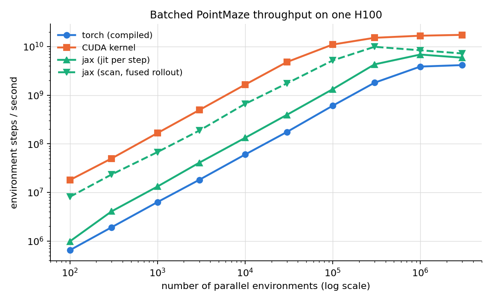
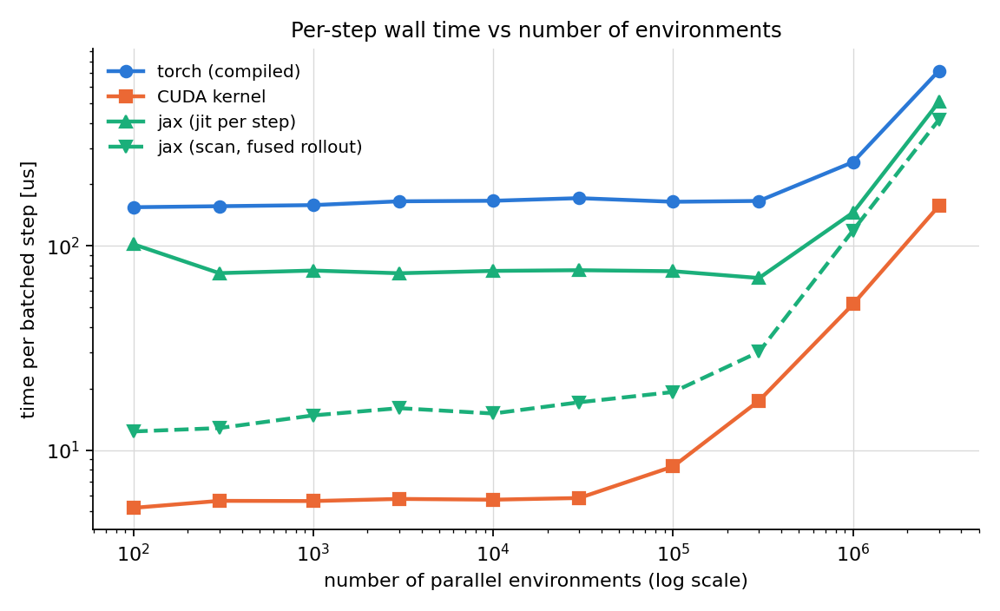
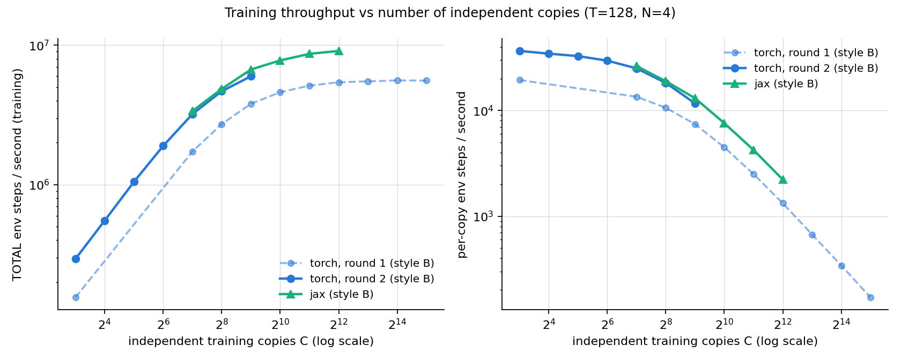
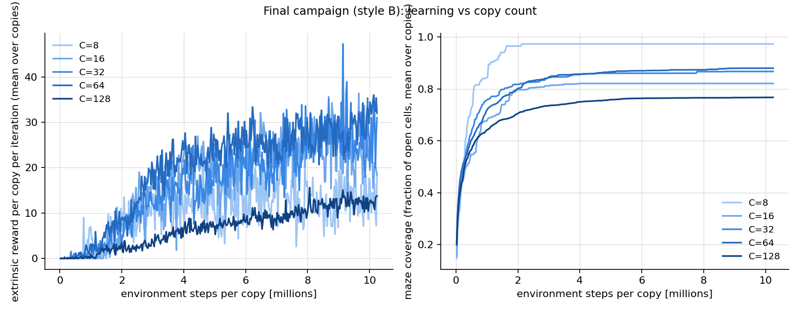
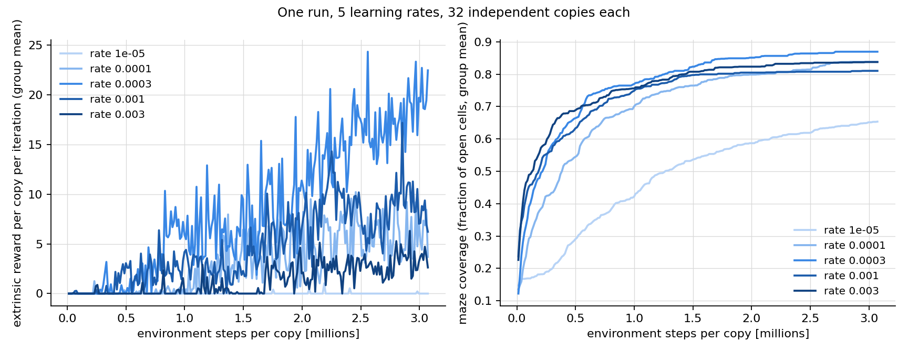
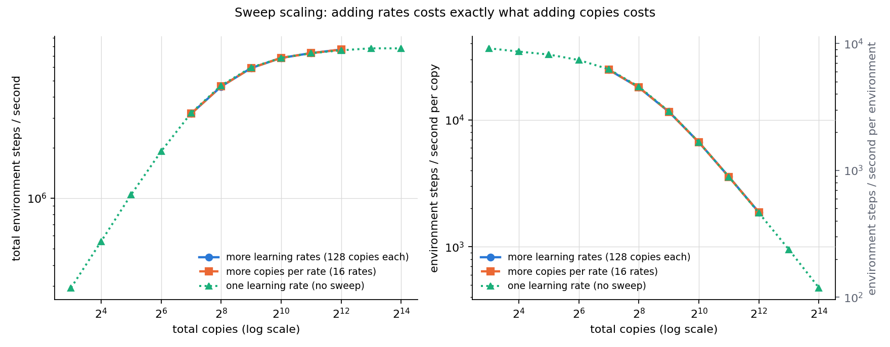
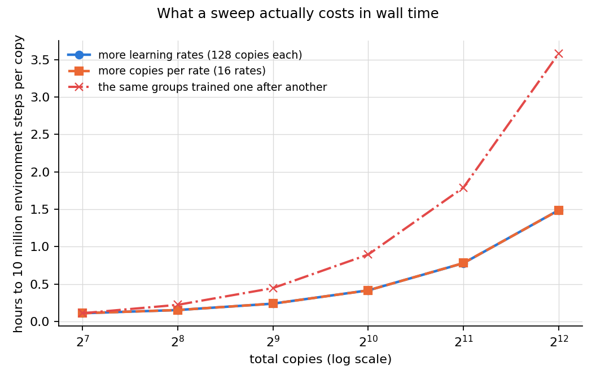
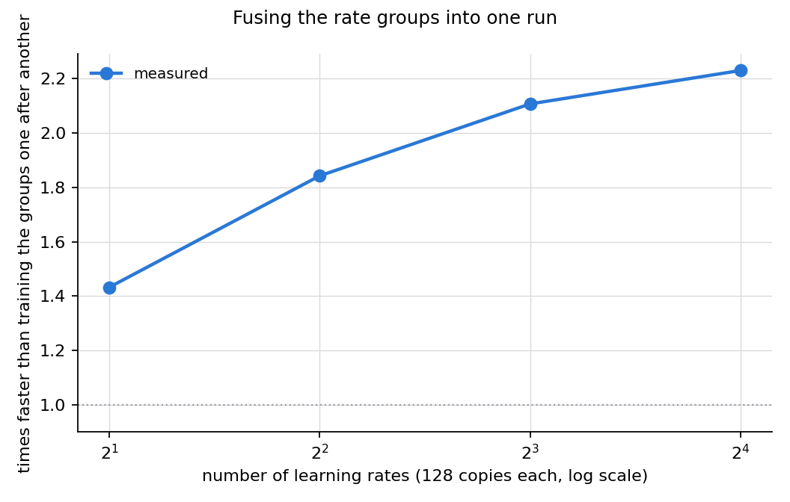
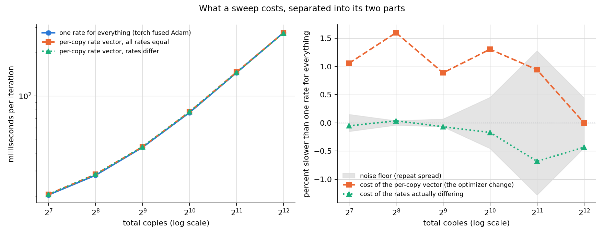
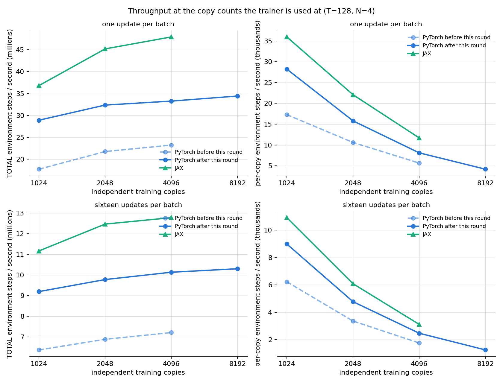

# GPU-parallel PointMaze + batched multi-copy PPO+RND — unified report

All numbers were measured on serval05 (one NVIDIA H100 NVL, 95 GB; direct ssh, exclusive use
enforced by a lock), from the code in this repository under `09_parallelization/`. Every table
cell traces to a JSON in `benchmarks/results/` or a run record under `train_runs/`; this report
is generated by `report/.../code/make_report.py` and can be regenerated from those files.

The work built three modules and then improved them over three passes of the same loop —
baseline, one change, measure, keep or revert, write a row:

| pass | what it did | headline |
|---|---|---|
| Round 1 | build everything: exact GPU environments in PyTorch, fused CUDA and JAX; the batched multi-copy PPO+RND trainer in PyTorch and JAX; end-to-end capture | 777 -> 36.6 ms per training iteration at 128 copies |
| Round 2 | improve on the finished system, with a measurement protocol that can tell a small change from drift | 36.8 -> 20.2 ms, a further 1.8x |
| Round 3 | new capability: train copy groups at DIFFERENT learning rates in one run | a sweep costs 1.0% more than a uniform run of the same size |
| Round 4 | close the distance to the JAX trainer at 8 to 128 copies | 20.4 -> 16.3 ms at 128 copies, and a loss at 512 that round 5 traced |
| Round 5 | re-open the question at the copy counts the trainer is used at, 1,024 to 4,096 | the limit changes from the number of device programs to memory traffic, and the previous round's loss turns out to be a regression of up to 19 percent there |

Reading order: what was built and why it is correct, then the module-by-module numbers, then
what each round changed, then the training campaign and the sweep. The last section is the
newest and stands somewhat apart: it is about the sizes the trainer is actually run at, where
the earlier sections' conclusions do not all carry over.

## Contents

| section | first written | last changed |
|---|---|---|
| [Environment correctness (all three implementations)](#environment-correctness-all-three-implementations) | 2026-08-15 00:22 PT | 2026-08-15 00:22 PT |
| [Module 1 — environment throughput](#module-1-environment-throughput) | 2026-08-15 00:22 PT | 2026-08-15 15:46 PT |
| [Module 2 — batched multi-copy trainer throughput](#module-2-batched-multi-copy-trainer-throughput) | 2026-08-15 00:22 PT | 2026-08-15 00:22 PT |
| [Module 3 — end-to-end fusion and the pairing grid](#module-3-end-to-end-fusion-and-the-pairing-grid) | 2026-08-15 00:22 PT | 2026-08-15 10:53 PT |
| [Scaling the number of independent training copies](#scaling-the-number-of-independent-training-copies) | 2026-08-15 00:22 PT | 2026-08-15 11:54 PT |
| [Profiling breakdown (C=128)](#profiling-breakdown-c128) | 2026-08-15 00:22 PT | 2026-08-15 01:35 PT |
| [Before/after optimization at the final-run sizes (8-128 copies)](#beforeafter-optimization-at-the-final-run-sizes-8-128-copies) | 2026-08-15 01:35 PT | 2026-08-15 11:54 PT |
| [Final training campaign — 8 to 128 independent RND runs (PyTorch)](#final-training-campaign-8-to-128-independent-rnd-runs-pytorch) | 2026-08-15 01:35 PT | 2026-08-15 11:54 PT |
| [Sweeping learning rates across copy groups](#sweeping-learning-rates-across-copy-groups) | 2026-08-15 10:39 PT | 2026-08-15 17:02 PT |
| [The three rounds](#the-three-rounds) | 2026-08-15 10:49 PT | 2026-08-15 10:49 PT |
| [What made it fast (and what did not)](#what-made-it-fast-and-what-did-not) | 2026-08-15 00:22 PT | 2026-08-15 00:22 PT |
| [Reproduction](#reproduction) | 2026-08-15 00:22 PT | 2026-08-15 17:46 PT |
| [How far from the hardware ceiling](#how-far-from-the-hardware-ceiling) | 2026-08-15 15:46 PT | 2026-08-15 15:46 PT |
| [The same work on ordinary processor cores](#the-same-work-on-ordinary-processor-cores) | 2026-08-15 15:46 PT | 2026-08-15 17:02 PT |
| [Which implementation to use](#which-implementation-to-use) | 2026-08-15 15:46 PT | 2026-08-15 17:54 PT |
| [Feature parity between the two trainers](#feature-parity-between-the-two-trainers) | 2026-08-15 15:46 PT | 2026-08-15 15:46 PT |
| [Round four — closing the distance between the two trainers](#round-four-closing-the-distance-between-the-two-trainers) | 2026-08-15 15:57 PT | 2026-08-15 15:57 PT |
| [Training a thousand to four thousand copies at once](#training-a-thousand-to-four-thousand-copies-at-once) | 2026-08-15 17:02 PT | 2026-08-15 18:25 PT |

*Times are when a section's text first appeared in this document and when it last changed, taken from the document's version history. A section whose numbers were re-measured shows a later change time. All times are Pacific (PT); the machines that produced them run on Eastern Time and the values are converted for display.*

## Environment correctness (all three implementations)

The environments are not approximations: MuJoCo's exact per-step update was extracted and
verified, including the contact model (solref/solimp force law, margin semantics, and the
joint two-contact solve, all probe-verified against the solver's internal arrays).

1. One-step (teacher-forced) error vs the reference MuJoCo env is at machine precision
   (float64 <= 4.4e-16 on every fixture case, including wall slides across box boundaries
   and corner wraps; float32 <= 5e-7).
2. Closed-loop 400-step multi-contact rollouts match the reference to 1e-13 (one fixture
   passes through a knife-edge equilibrium — ball balanced on a corner — where closed-loop
   paths legitimately separate on rounding noise; its one-step check stays exact).
3. Reset randomness is a frozen counter-based generator: torch, CUDA, and JAX produce
   BIT-IDENTICAL resets (verified including post-truncation respawns).
4. The CUDA kernel's trajectories match the torch env within 2.1e-7 over 500 steps with
   320 auto-resets (mostly bit-equal; rare 1-2 ULP differences on contact steps).
5. A 256-episode random-policy comparison against the reference env passes (visit
   distribution total-variation distance 0.026, gate 0.05).

## Module 1 — environment throughput

| implementation | 1e3 envs | 1e5 envs | 1e6 envs | 3e6 envs | peak |
|---|---|---|---|---|---|
| torch eager | 6.58e5 | 6.39e7 | 2.01e8 | — | 2.01e8 at 1,000,000 |
| torch compiled | 6.32e6 | 6.08e8 | 3.89e9 | 4.17e9 | 4.17e9 at 3,000,000 |
| CUDA fused kernel | 1.78e8 | 1.20e10 | 1.93e10 | 1.91e10 | 1.93e10 at 1,000,000 |
| jax jit per step | 1.32e7 | 1.33e9 | 6.87e9 | 5.92e9 | 6.87e9 at 1,000,000 |
| jax scan (fused rollout, upper bound) | 6.76e7 | 5.20e9 | 8.40e9 | 7.23e9 | 9.92e9 at 300,000 |

Environment steps per second, single batch axis (n_copies folded in). Figures:





Where the per-step time starts to RISE (the log-scale line's knee — before it, adding
environments is free because the step is launch-overhead-bound; after it, kernel time
dominates and the time grows with the batch):

- torch compiled: flat ~155-171 us to 3e5 envs; rises from ~3e5.
- CUDA fused kernel: flat ~6 us to 3e4 envs; rises from ~1e5 (it reaches the
  memory-bandwidth regime earliest because one kernel has no launch amortization to hide).
- jax jit: flat ~71-79 us to ~1e5; rises past 1e5.
- jax scan: flat ~15-19 us to ~1e5; peak total throughput lands at 3e5 envs (L2-cache
  residency) and settles slightly lower at HBM scale.

Per-env step speed at 1e3 envs (batched step time divided by env count): CUDA 6.0 ns per
env-step, jax scan 14.8 ns, jax jit 79 ns, torch compiled 158 ns. All fall toward the memory
bandwidth limit as the batch grows: at 3e6 envs the CUDA kernel spends 57 picoseconds per
env-step (171.7 us for the whole batch).

## Module 2 — batched multi-copy trainer throughput

Both trainers implement the same algorithm (spec: `ppo/research/ppo_rnd_algorithm_spec.md`),
verified by bitwise copy-isolation tests in each framework and a cross-framework forward
agreement of 8.6e-7. Style A = one full-batch update per rollout; style B = 4 epochs x 4
minibatches. T=128, N=4 (512 rows per copy per iteration).

| trainer | style | C=8 | C=128 | notes |
|---|---|---|---|---|
| torch_ppo | epoch_minibatch | 774.6 ms = 5.29e3/s | 777.0 ms = 8.43e4/s | BEFORE any optimization (eager) |
| torch_ppo | epoch_minibatch | 26.4 ms = 1.55e5/s | 36.6 ms = 1.79e6/s | AFTER (one-graph capture + TF32 + hoist + packing) |
| torch_ppo | full_batch | — | 24.5 ms = 2.68e6/s | AFTER (same config) |
| jax_ppo | full_batch | 9.1 ms = 4.50e5/s | 13.4 ms = 4.87e6/s | jax whole-iteration jit + donation |
| jax_ppo | epoch_minibatch | 11.4 ms = 3.58e5/s | 19.9 ms = 3.30e6/s | jax whole-iteration jit + donation |

The eager torch baseline is 777 ms per iteration at every copy count; the final torch
configuration is 21x faster at C=128. The jax trainer reaches 74 iter/s (style A) and 50
iter/s (style B) at C=128. A LABELED algorithm variant (T=32, N=16 — same 512 rows, shorter
GAE horizon) reaches 226 iter/s = 1.48e7 env-steps/s in jax style A; it is recorded as a
variant, not the default, because it changes the algorithm.

## Module 3 — end-to-end fusion and the pairing grid

- torch env + torch trainer: the production path. The environment's pure `step_core`
  composes into the compiled per-step function; one CUDA graph captures the WHOLE iteration
  (128-step rollout + statistics/GAE post-processing + the 16-step update incl. Adam), so
  one replay per iteration and zero python in the loop. Captured paths are verified
  BITWISE equal to the uncaptured trainer.
- jax env + jax trainer: the whole iteration is one jitted XLA program with donated state.
- CUDA env + torch trainer (`env_backend="cuda"`): the fused kernel replaces the env part
  of the captured rollout, with the policy and RND parts as compiled subgraphs around it.
  Measured in the shipped configuration (style B): C=8: 13.8 ms with the CUDA kernel versus 14.0 ms with the PyTorch environment; C=128: 20.7 ms with the CUDA kernel versus 20.4 ms with the PyTorch environment.
  The two are the same to about 1.5%, which is the point worth taking away: after
  round two moved most per-step work out of the rollout loop, the environment is a small part
  of a training iteration, so an environment kernel that is 24x faster on its own changes the
  training rate very little. The fast kernel earns its place in environment-only work (data
  generation, evaluation sweeps), not in this trainer.
  An earlier pairing measurement was discarded: the environment kernels launched on
  the legacy default stream rather than the capture stream, so the captured graph contained no
  environment step at all (PyTorch reported an empty graph once a test looked for it). The
  kernel now launches on the current stream and a test replays a captured env step and checks
  the state actually advanced.
- Cross-framework pairings (jax env + torch trainer or the reverse) were MEASURED over
  the dlpack boundary: crossing frameworks costs +6.2 to +7.0 ms per environment step on
  top of a 70-260 us native step (about 40-90x), because every crossing forces a
  synchronization between the two runtimes — in addition to structurally breaking
  CUDA-graph capture and XLA scan fusion. They are documented as non-production paths
  (`benchmarks/bench_cross_pairing.py`).

## Scaling the number of independent training copies

The task's two questions, answered by measurement (style B, T=128, N=4, final config):

1. **Does increasing the copy count decrease per-copy throughput?** Yes, but only past a
   knee: per-copy throughput is nearly flat up to C~128-256, then decays roughly as 1/C.
2. **Does increasing the copy count decrease TOTAL throughput?** No. Total throughput
   rises monotonically and saturates; it never goes down up to the memory limit.

| copies C | round 1 ms/iter | round 2 ms/iter | round 2 total env-steps/s | round 2 per-copy env-steps/s |
|---|---|---|---|---|
| 8 | 26.4 | 14.0 | 2.93e5 | 3.67e4 |
| 16 | — | 14.8 | 5.53e5 | 3.45e4 |
| 32 | — | 15.6 | 1.05e6 | 3.28e4 |
| 64 | — | 17.3 | 1.90e6 | 2.96e4 |
| 128 | 37.9 | 20.4 | 3.21e6 | 2.51e4 |
| 256 | 48.2 | 28.0 | 4.68e6 | 1.83e4 |
| 512 | 68.9 | 43.8 | 5.99e6 | 1.17e4 |
| 1024 | 114.0 | — | — | — |
| 2048 | 204.4 | — | — | — |
| 4096 | 386.4 | — | — | — |
| 8192 | 761.6 | — | — | — |
| 16384 | 1499.6 | — | — | — |
| 32768 | 3009.6 | — | — | — |

**How many copies fit, and the trade the second round made.** Round one reached 32,768 copies
and ran out of memory at 65,536; round two runs out at 32,768. That is not a regression to fix
by accident — it is the price of the speed: hoisting the per-step work into wide passes, and
caching the frozen RND target's features for the update phase, both hold more data at once
(the cached features alone are 256 KB per copy). The ceiling moved from 32,768 copies to
16,384 while every copy count up to there got about 1.8x faster. A run that needs the extra
copies more than the speed can set `compile_post=False` and skip the hoist to get the round-one
memory profile back. The ceiling is genuine demand rather than fragmentation: retrying 32,768
copies with `PYTORCH_CUDA_ALLOC_CONF=expandable_segments:True` reduced the failing allocation
from 32 GiB to 8 GiB but still ran out.

Round-two total throughput saturates near 7.8e6 environment steps per second from about 8,192
copies (round one: 5.6e6). The jax trainer saturates near 1.9e7 (style A) / 9.1e6 (style B)
around 2,048-4,096 copies.



## Profiling breakdown (C=128)

Production view — what one training iteration actually pays with the capture
configuration measured (separate rollout/update graphs, eager post-processing; the
one-graph mode removes most of the post-processing row's launch gaps):

| phase | time [ms] | share |
|---|---|---|
| rollout graph replay (T=128 steps: policy+value+sample+env+RND+writes) | 20.11 | 39.8% |
| post-processing (bootstrap, filter, GAE, statistics, flatten) | 14.83 | 29.3% |
| update graph replay (16 minibatch steps: gather+fwd+bwd+clip+Adam) | 15.54 | 30.7% |
| noise + permutation refill (outside graphs) | 0.06 | 0.1% |
| TOTAL | 50.53 | 100% |

Component view — each logical block called in isolation with EAGER kernels (per-iteration
equivalents). This view shows where the raw work lives before fusion; it deliberately
over-weights blocks whose eager form launches many small kernels (the compiled/captured
production path fuses most of them away):

| block | eager time [ms] | share |
|---|---|---|
| env step_core total (dynamics + reward/ends + auto-reset RNG) | 593.34 | 83.6% |
| — of which env dynamics_step (integrator + contacts) | 472.29 | (80% of the env step) |
| update: forward + backward | 28.12 | 4.0% |
| RND bonus (whiten + target + predictor) | 24.46 | 3.4% |
| value forward (critic, both heads) | 12.90 | 1.8% |
| update: per-copy clip + Adam step | 12.03 | 1.7% |
| policy forward (actor mean) | 11.04 | 1.6% |
| rollout buffer writes (10 copies/step) | 8.55 | 1.2% |
| update: loss forward | 6.53 | 0.9% |
| action sample + logprob | 6.46 | 0.9% |
| post: GAE backward scan (both streams approx) | 2.82 | 0.4% |
| post: intrinsic filter scan (T steps) | 1.15 | 0.2% |
| update: minibatch gathers | 1.11 | 0.2% |
| post: flatten + whiten into static batch | 0.63 | 0.1% |
| post: running-statistics updates (float64) | 0.16 | 0.0% |
| post: bootstrap values (one big GEMM) | 0.15 | 0.0% |

Reading: in eager form the ENVIRONMENT dominates (about 84% of raw kernel time), which is
why compiling/fusing the env step was the first large win; after fusion the three captured
phases are nearly balanced, and the remaining bottleneck at small C is fixed kernel time
in the 128 sequential rollout steps.

## Before/after optimization at the final-run sizes (8-128 copies)

Environment-only throughput at the exact env-batch sizes the final runs use
(batch = C copies x 4 envs), env steps per second. "Eager" is the CURRENT physics code run
without compilation (the uncompiled per-step python cost, ~4.4 ms per batched step at
these sizes, is what the compiled/captured paths remove):

| env batch | eager (before) | compiled (after) | CUDA kernel (after) |
|---|---|---|---|
| 32 | 7.25e3 | 2.02e5 | 5.76e6 |
| 64 | 1.45e4 | 4.20e5 | 1.15e7 |
| 128 | 2.88e4 | 8.03e5 | 2.30e7 |
| 256 | 5.67e4 | 1.61e6 | 4.24e7 |
| 512 | 1.13e5 | 3.24e6 | 8.50e7 |

Whole-loop training throughput (environment steps per second while TRAINING, i.e. the
end-to-end number; before = eager baseline, after = the final one-graph configuration as
measured in the campaign itself):

| copies C | before, style B | after, style B | after, style A |
|---|---|---|---|
| 8 | 5.27e3 | 2.94e5 | 7.19e5 |
| 16 | 1.05e4 | 5.50e5 | 1.29e6 |
| 32 | 2.11e4 | 1.04e6 | 2.58e6 |
| 64 | 4.22e4 | 1.89e6 | 4.72e6 |
| 128 | 8.43e4 | 3.20e6 | 8.19e6 |

(The before column uses the measured eager iteration time of 777 ms, which is flat across
copy counts.) Phase split of one iteration, before vs after (C=128, style B; the "after"
split is measured in the separate-graphs configuration — the shipped one-graph mode fuses
the phases and is faster than this sum):

| phase | before (eager) | after round 1 (captured) |
|---|---|---|
| rollout (env + policy interaction) | 680 ms | 20.1 ms |
| post-processing (GAE, statistics) | inside rollout | 14.8 ms (eager between graphs); inside the one-graph replay in the final config |
| update (16 minibatch steps) | 95 ms | 15.5 ms |
| whole iteration | 777 ms | 36.6 ms (one-graph) |

Round two then reworked what the loop does rather than how it is launched, and took the same
iteration from 36.8 ms to 20.2 ms at 128 copies (paired measurements, noise floor 0.01-0.10 ms):

| change | C=8 | C=128 |
|---|---|---|
| round-1 configuration (the starting point) | 26.6 ms | 36.8 ms |
| + compiled post-rollout body | 22.8 ms | 32.7 ms |
| + critic, log-probability and RND bonus hoisted out of the rollout loop | 14.7 ms | 21.2 ms |
| + per-step buffer writes folded into the compiled step | 14.0 ms | 20.2 ms |

Overall, one training iteration of 128 independent copies went from 777 ms to 20.2 ms — 38x —
while every change was verified to compute the same thing.

## Final training campaign — 8 to 128 independent RND runs (PyTorch)

20,000 iterations per configuration = 10.24M environment steps per copy; PointMaze Large,
sparse goal, run-6 setup. Every copy is an independent seed with its own networks,
environments, statistics, and optimizer. The campaign was run twice — once on the round-1 code
and again on the round-2 code — so the improvement is visible on the deliverable itself and not
only on the benchmarks. The table reports the round-2 run, with the round-1 throughput beside
it for comparison.

| style | copies | wall time [s] | total env-steps/s | round-1 rate | env-steps/s per copy | copies at goal, late* | copies at goal, ever* | coverage mean | peak VRAM [MB] |
|---|---|---|---|---|---|---|---|---|---|
| epoch_minibatch | 8 | 278 | 2.94e5 | 1.55e5 | 3.68e4 | 2/8 | 3/8 | 0.856 | 146 |
| epoch_minibatch | 16 | 298 | 5.50e5 | 2.97e5 | 3.43e4 | 5/16 | 9/16 | 0.882 | 163 |
| epoch_minibatch | 32 | 315 | 1.04e6 | 5.74e5 | 3.26e4 | 12/32 | 18/32 | 0.884 | 198 |
| epoch_minibatch | 64 | 347 | 1.89e6 | 1.07e6 | 2.95e4 | 28/64 | 38/64 | 0.890 | 295 |
| epoch_minibatch | 128 | 409 | 3.20e6 | 1.79e6 | 2.50e4 | 41/128 | 68/128 | 0.873 | 494 |
| full_batch | 8 | 114 | 7.19e5 | 2.22e5 | 8.98e4 | 3/8 | 5/8 | 0.818 | 156 |
| full_batch | 16 | 127 | 1.29e6 | 4.27e5 | 8.05e4 | 3/16 | 6/16 | 0.830 | 183 |
| full_batch | 32 | 127 | 2.58e6 | 8.42e5 | 8.07e4 | 9/32 | 13/32 | 0.808 | 238 |
| full_batch | 64 | 139 | 4.72e6 | 1.59e6 | 7.37e4 | 13/64 | 19/64 | 0.745 | 348 |
| full_batch | 128 | 160 | 8.19e6 | 2.68e6 | 6.40e4 | 25/128 | 47/128 | 0.796 | 546 |

The round-2 campaign also shows more copies reaching the goal and slightly higher coverage than
the round-1 one. That is NOT an effect of the optimization: the algorithm is unchanged and every
round-2 change was verified to compute the same function to within float32 rounding. What those
tiny differences do is send the runs down different trajectories, and on a sparse-goal task the
per-copy outcome is close to all-or-nothing, so the aggregate moves by more than one might
expect. Treat the two campaigns as two samples of the same procedure, and read the throughput
columns — not the goal columns — as the round's result.

*Both goal columns count copies that scored a positive extrinsic reward in a SAMPLED
iteration: "late" over the final 10% of samples, "ever" over all of them. Progress is sampled
every 50 iterations (400 samples of 20,000), so a copy that reached the goal only in an
unsampled iteration is missed and both columns are lower bounds. The gap between them is the
sparse goal being found and lost again rather than held (per-copy curves below).



## Sweeping learning rates across copy groups

The trainer's copies were identical apart from their seed. They can now be split into groups,
each group training at its own learning rate, in one batched run — the inputs are exactly the
rates to try and how many copies each rate gets:

```python
cfg = sweep_config(learning_rates=[1e-4, 3e-4, 1e-3, 3e-3], copies_per_rate=128)
```

Adam is elementwise, so copies stacked on the leading axis are already independent optimizers;
the only thing `torch.optim.Adam` cannot express is a different rate per copy, so a sweep
switches to a hand-written batched Adam with torch's formula and a per-copy rate vector. Copy k
of every group starts from the same weights and meets the same environments (paired seeding),
so a difference between groups is the rate's doing. Full description: `ppo/torch_ppo/SWEEP.md`.

### Which layout is best

Three ways to arrange G groups of K copies, measured at 4 rates x 128 copies = 512 copies:

| layout | ms per sweep iteration | peak VRAM [MB] |
|---|---|---|
| uniform rate, one trainer (not a sweep — the reference) | 144.50 | 6457 |
| one trainer, per-copy rate vector, one graph | 146.21 | 6457 |
| one trainer per rate, run in turn | 326.11 | 3169 |

Fusing the groups into one batched run is 2.23x faster than
running them one after another, and costs +1.2% against a
uniform-rate run of the same total size — so a sweep is very nearly free relative to training
the same number of copies at a single rate. Running the groups separately is slower for the
reason the whole project rests on: each group alone is too small to fill the GPU, and the
per-iteration cost is dominated by kernel count rather than by arithmetic.

### It finds the right answer

A demonstration run of 5 rates x 32 copies (3.07M environment steps per copy, 140 seconds):

| learning rate | copies | reward per iteration, last 20% | final coverage | copies that reached the goal |
|---|---|---|---|---|
| 1e-05 | 32 | 0.00 | 0.654 | 3/32 |
| 0.0001 | 32 | 5.91 | 0.838 | 20/32 |
| 0.0003 | 32 | 17.68 | 0.870 | 19/32 |
| 0.001 | 32 | 8.32 | 0.810 | 11/32 |
| 0.003 | 32 | 3.07 | 0.838 | 10/32 |

The sweep recovers the expected shape — too small a rate barely learns, too large a rate is
unstable, and the best value is the 3e-4 the project had been using — from a single run that
cost the same as training those copies at one rate.



### The configuration you asked about

Sixteen learning rates with 128 independent copies each — 2,048 copies in one run — takes
**144 ms per iteration**: 7.29e6
environment steps per second in total, 3560 per copy,
890 per environment, in 6.3 GB.
Training all 2,048 of them for 10 million environment steps each takes **0.78 hours**, against 1.77 hours if the sixteen groups were trained one after another (2.23x).

### How it scales

Two knobs grow a sweep: the number of learning rates, and the copies behind each rate. Both
were measured, and they give the same curve — because both only change the total copy count,
which is the only thing the cost depends on.

| rates | copies per rate | total copies | ms/iteration | total env-steps/s | per copy | per env | peak VRAM [MB] | hours to 10M steps/copy |
|---|---|---|---|---|---|---|---|---|
| 1 | 128 | 128 | 20.6 | 3.18e6 | 24830 | 6208 | 494 | 0.11 |
| 2 | 128 | 256 | 28.4 | 4.61e6 | 18009 | 4502 | 891 | 0.15 |
| 4 | 128 | 512 | 44.1 | 5.94e6 | 11598 | 2900 | 1686 | 0.24 |
| 8 | 128 | 1024 | 76.9 | 6.82e6 | 6660 | 1665 | 3277 | 0.42 |
| 16 | 128 | 2048 | 143.8 | 7.29e6 | 3560 | 890 | 6457 | 0.78 |
| 32 | 128 | 4096 | 274.2 | 7.65e6 | 1867 | 467 | 12819 | 1.49 |
| 16 | 8 | 128 | 20.6 | 3.18e6 | 24833 | 6208 | 494 | 0.11 |
| 16 | 16 | 256 | 28.4 | 4.62e6 | 18036 | 4509 | 891 | 0.15 |
| 16 | 32 | 512 | 44.2 | 5.93e6 | 11589 | 2897 | 1686 | 0.24 |
| 16 | 64 | 1024 | 76.8 | 6.83e6 | 6669 | 1667 | 3277 | 0.42 |
| 16 | 128 | 2048 | 144.1 | 7.28e6 | 3554 | 888 | 6457 | 0.78 |
| 16 | 256 | 4096 | 274.0 | 7.66e6 | 1869 | 467 | 12819 | 1.49 |

The first six rows grow the rate count at 128 copies each; the last six grow the copies per
rate at 16 rates. Read them against each other: at every total copy count the two agree to
0.3 ms out of as much as 274 ms, which is also the best noise estimate available here — the
two studies are the same measurement reached from different directions.



Per-environment throughput is the per-copy column divided by the four environments each copy
holds; it is drawn as the right-hand scale of the second panel rather than as its own curve,
because it is the same measurement in different units.

### Does the number of rates cost anything by itself?

No. Holding the total at 2048 copies and splitting them into more and
more groups leaves the time per iteration flat and the memory byte-identical:

| groups (learning rates) | copies per rate | ms/iteration | peak VRAM [MB] |
|---|---|---|---|
| 128 | 16 | 143.1 | 6457 |
| 64 | 32 | 143.1 | 6457 |
| 32 | 64 | 143.4 | 6457 |
| 16 | 128 | 145.0 | 6457 |
| 8 | 256 | 143.7 | 6457 |
| 4 | 512 | 144.4 | 6457 |
| 2 | 1024 | 143.8 | 6457 |
| 1 | 2048 | 143.9 | 6457 |

From 1 group to 1 groups the spread is 1.88 ms on a mean of
143.8 ms (1.31%), which is within the run-to-run
noise — and the study was run twice, once from 1 group upward and once from 128 groups
downward, so the flatness is not an artifact of measuring the points in a fixed order. This is
what the implementation predicts: the learning rate is a vector indexed by copy,
Adam is elementwise, the gradient clip reduces per copy, and the loss sums over copies — so
nothing in the computation is aware of how many distinct rate VALUES that vector holds. Sixteen
rates cost what sixteen times as many copies cost, and nothing more.



### Fusing the groups, against running them one after another

| rates | copies per rate | fused [ms] | separate [ms] | uniform rate, same size [ms] | fused is faster by | sweep overhead vs uniform |
|---|---|---|---|---|---|---|
| 2 | 128 | 28.4 | 40.7 | 28.0 | 1.43x | +1.4% |
| 4 | 128 | 44.2 | 81.4 | 43.8 | 1.84x | +1.0% |
| 8 | 128 | 77.3 | 163.0 | 77.5 | 2.11x | -0.2% |
| 16 | 128 | 146.2 | 326.1 | 144.5 | 2.23x | +1.2% |

The advantage of fusing grows with the number of rates and flattens out: each group on its own
is too small to fill the GPU, so running them in turn wastes most of the machine, while fusing
them turns the whole sweep into one batched computation. The last column is the one that
matters for planning: a sweep costs the same as training the same number of copies at a single
rate, to within about one percent either way.



### One rate for everything, against a sweep

Comparing a uniform run with a swept run mixes two changes, so they are measured apart. Giving
each copy its own learning rate makes the rate a VECTOR, and torch's fused Adam takes one
scalar rate per parameter group — so a sweep runs a hand-written batched Adam instead. That is
a real code change. The rates then actually DIFFERING changes no code at all: the same kernels
read different constants. The three arms below are matched in total copies, 16
groups in the swept arms, measured in ABBA order in separate processes.

| total copies | one rate [ms] | rate vector, equal rates [ms] | rate vector, differing rates [ms] | noise floor [ms] | cost of the vector | cost of differing |
|---|---|---|---|---|---|---|
| 128 | 20.41 | 20.62 | 20.61 | 0.03 | +1.1% | -0.1% |
| 256 | 27.96 | 28.41 | 28.42 | 0.01 | +1.6% | +0.0% |
| 512 | 43.80 | 44.19 | 44.16 | 0.03 | +0.9% | -0.1% |
| 1024 | 76.54 | 77.54 | 77.40 | 0.35 | +1.3% | -0.2% |
| 2048 | 145.10 | 146.47 | 145.47 | 1.86 | +0.9% | -0.7% |
| 4096 | 275.76 | 275.76 | 274.56 | 1.22 | +0.0% | -0.4% |



Reading the two columns:

- **The rates differing costs nothing**, as it must: at most 0.7% across the whole
  range, inside the noise floor at every point. Once the rate is a vector, whether its entries
  are equal or spread over three orders of magnitude changes only the numbers flowing through
  the same kernels.
- **The vector itself costs between +0.0% and +1.6%.** This is the
  optimizer change, and it is the only real price of being able to sweep. It is small because
  the per-copy Adam is compiled; before compiling it, it cost 38% (see the trainer ledger,
  round-3 rows).

So the practical answer is that a sweep is not a different regime from a uniform run — it is
the same run with a vector where a scalar used to be, and it is priced accordingly.

## The three rounds

### Round 1 — build it, and make it exact

The environments are not approximations of the reference: MuJoCo's per-step update and its
whole contact pipeline were extracted and verified to machine precision (correctness section
above). The trainer was written from a spec derived from CleanRL's PPO+RND, with every running
statistic, gradient clip and random draw made per copy so that copies cannot influence each
other. The speed came from compiling a fused per-step function and then capturing whole phases
as CUDA graphs, ending with the entire iteration — rollout, post-processing and update — as one
replay per iteration.

Round one compared configurations by running each once. That was good enough for changes worth
3x and useless for changes worth 3%.

### Round 2 — improve it, with a protocol that can tell a real change from drift

Every round-two change is measured by running both variants in ABBA order in separate
processes, comparing against the change's own predecessor git revision, and reporting the
within-variant spread as a noise floor; a difference below that floor is recorded as no effect.
Four research agents produced ranked experiment lists, an external-source sweep, an audit of
the performance checklist, and an adversarial review of the code and of the measurement
protocol.

What carried the gain:

- Compiling the post-rollout body, whose intrinsic-reward filter and two GAE scans were python
  loops over the horizon and therefore hundreds of tiny kernels: +11% at 128 copies, +14% at 8.
- Hoisting the critic forward, the log-probability and the RND bonus out of the 128-step
  rollout loop into single wide passes afterwards: +42% and +45%. Each is a pure function of
  data the loop already stores and of parameters that do not change during a rollout — the
  log-probability, in particular, needs only the action noise and the policy's standard
  deviation, never the action mean — so this removes roughly half the per-step kernels while
  computing exactly the same numbers.
- Folding the per-step buffer writes into the compiled step: a further 5%.

What the adversarial review found, all fixed: the fused-CUDA environment launched its kernels
on the legacy default stream instead of the current one, which made its pairing numbers
untrustworthy; priming the observation statistics with that environment stacked one repeated
step, because it returns a preallocated buffer the next step overwrites; and `one_graph` did
not force the compiled rollout it assumes. The review also showed that the campaign's
"copies at goal" column was a sampling artifact, which is why that table now reports the count
both over the final samples and over all of them.

The task also asked directly whether presenting ONLY the on-policy update path would run
faster, on the theory that a branch might block fusion. It does not: a build with the other
path stripped out entirely — verified bitwise identical, then timed in ABBA order — differs by
0.05 to 0.08%, against a 0.01 ms noise floor. The two styles were already separate compiled
functions, so the captured graph contains only the selected path either way.

### Round 3 — sweep hyperparameters across copy groups

Described in its own section below.

## What made it fast (and what did not)

Kept (each row measured in a ledger; see the per-module `progress_and_changes.md` files):

1. Compile the fused per-step function (policy + value + sample + env step + RND bonus)
   with `torch.compile(fullgraph=True)` — 3.4x on the trainer, 9x on the env at 1M envs
   (after restructuring the contact pipeline to be fusable: unrolled 8-candidate loop,
   two-smallest tournament instead of topk, 1-byte neighbor bitmask instead of gathers).
2. Capture whole phases as manual CUDA graphs over static buffers (rollout, update, then
   the entire iteration): 226 -> 45.6 -> 41.5 ms/iter; captured paths bitwise-verified.
3. Capturable + fused Adam with a device-tensor learning rate (required for capture
   correctness, not just speed: a python step counter frozen inside a graph corrupts
   Adam's bias correction).
4. TF32 matmuls (+9%), hoisting the frozen RND target's features out of the minibatch
   loop (+1.6% style B, +6.7% style A), same-input GEMM packing (+1.9% / +2.9%).
5. jax: whole-iteration jit + buffer donation; scan-fused rollout.
6. A single fused CUDA kernel for the env: 24x lower small-batch floor than compiled
   torch (6 us vs 153 us) and 4x at 1M envs (1.68e10 vs 4.0e9 env-steps/s).

Rejected by measurement:

1. Raising inductor's fusion thresholds to force one giant kernel (compile-cost explosion,
   >40 min without producing a kernel).
2. Capturing the EAGER kernel sequence (slower than the per-step-compiled path: replaying
   thousands of tiny kernels is kernel-time bound).
3. `mode="reduce-overhead"` automatic capture (skipped capture silently; manual capture
   with static buffers was both faster and verifiable).

The full extra-step review against the prior joint-replenishment efficiency campaign is in
`extra_step_review.md` (what transferred, what was already covered, and the measurement-
protocol gaps it flagged, several of which were fixed: incremental benchmark JSON writes,
the capturable-Adam coupling, finer env-count ladders near the knee).

## Reproduction

1. Environments: `pointmaze/{torch_env,cuda_env,jax_env}`; shared exact-physics spec and
   fixtures in `pointmaze/common/` (`physics_spec.md`, checker
   `common/code/check_against_fixtures.py --impl torch|cuda|jax`).
2. Trainers: `ppo/torch_ppo/torch_ppo_rnd.py`, `ppo/jax_ppo/jax_ppo_rnd.py`; tests under
   each `tests/`.
3. Benchmarks: `benchmarks/bench_env_step*.py`, `bench_train*.py`,
   `profile_breakdown.py`; every JSON in `benchmarks/results/` carries the git hash.
   For the last section: `profile_kernels.py` (device time per individual program),
   `probe_update_ops.py` (each operation of the update stage against the bandwidth a plain copy
   reaches), `matmul_floor_scaled.py` (every matrix multiplication timed on its own, at any copy
   count), `count_traffic.py` (arithmetic and bytes per iteration, no device needed),
   `compare_revisions.py` (two revisions run from one seed, worst parameter difference), and
   `run_round5_remote.sh` (the batch, run from the machine itself). `bench_train.py`,
   `profile_phases.py` and `profile_kernels.py` all take `--rev` so a past revision can be
   measured by the same harness in the same session.
4. Final campaign: `train_runs/run_final.py` (resumable, one process per copy count);
   run folder `train_runs/2026-08-15-02-56_final_...` with `experiment_background.md`.
5. This report: `report/.../code/make_report.py` regenerates `report.md` and all figures.

## How far from the hardware ceiling

"An optimisation made it faster" is not the same as "it is now fast". This section asks what the
machine could do in principle, and what fraction of that the implementations reach. Three separate
analyses produced it, cross-checking each other; the full working is in `analysis/ceiling/`.

### The environment

One environment step moves 82 bytes and performs about 250 floating-point operations, counted from
the kernel and then confirmed by compiling it and inspecting the generated instructions. Dividing
the card's memory bandwidth by the bytes gives a ceiling of **48,000 million steps per second**.

| implementation | million steps per second | share of the bandwidth ceiling |
|---|---|---|
| CUDA kernel | 19,300 | 40 percent |
| JAX, many steps per call | 9,920 | 21 percent |
| PyTorch, compiled | 4,166 | 9 percent |

The bandwidth ceiling is, however, the wrong limit for the fastest implementation. The kernel needs
about 12.8 machine instructions per byte it moves, while the processor can only issue about 7.7
instructions per byte at full bandwidth — so it runs out of instruction issue before it runs out of
memory. Its real ceiling is about 28,700 million steps per second, and it achieves **67 percent** of
that.

Two measurements from the project's own record settle which limit binds. Packing the state to cut
memory traffic by 16 percent changed the time by 0.3 percent — if bandwidth were the limit, the time
should have fallen by about 16 percent. Removing arithmetic, by contrast, gained 14 percent. That is
a kernel limited by issuing instructions, not by moving bytes.

### The training computation

One iteration at 128 copies with sixteen updates per batch performs 110.2 thousand million
floating-point operations. Measured against the card's matrix throughput:

| measure | value |
|---|---|
| arithmetic in one iteration | 110.2 GFLOP |
| time for that iteration (PyTorch) | 20.4 ms |
| achieved rate | 5.4 TFLOP/s |
| share of the card's peak matrix rate | 1.3 percent |
| the largest matrix multiplication this card actually sustains | 265 TFLOP/s (64 percent of peak) |
| every matrix multiplication in the iteration, timed on its own | 6.55 ms |

A share of 1.3 percent sounds like failure and is not, for two reasons that the analysis makes
precise. First, this algorithm's arithmetic intensity is about 11 operations per byte against a
machine that balances at 106, so **no implementation of it could exceed about 10 percent** of the
peak matrix rate. Second, and more usefully: adding up every matrix multiplication in the iteration,
each timed in isolation, gives 6.55 milliseconds. That is the floor for the
algorithm as written — the time if every other operation were free. The measured 20.4 milliseconds
is **32 percent of that floor**, and the JAX implementation's 13.4
milliseconds is 49 percent.

So the honest statement of remaining headroom is not "ninety-nine percent is missing" but "at most
about three times, and only by removing work that is not matrix multiplication".

### Where that places the project

Practitioners generally distinguish five stages: unoptimised; obvious waste removed; the limiting
resource identified and the profile flat; at the hardware limit for the algorithm as written; and
the algorithm itself reformulated to move the limit. On that scale the CUDA environment is at the
fourth stage — its limiting resource is identified by experiment and it runs at two thirds of that
limit — and the trainers are at the third, having gone from 0.8 percent to 2.0 percent of the peak
matrix rate, which is roughly a third of the reachable ceiling for the algorithm as written. Two
reformulations have already been made (batching the copies, fusing the sweep) and one was measured
and declined because it changes the algorithm (a shorter horizon, worth three times).


## The same work on ordinary processor cores

To give the graphics-processor numbers a scale, the same code was run on a processor node of the
same cluster (puma01: two sockets of forty cores, 160 hardware threads, 246 GB of memory), inside a
reservation so nothing else was using it.

There are two ways to use many cores, and the difference between them is larger than any
optimisation in this report. **Thread-parallel** means one program holding all the work in one large
array, with each operation split across threads — which requires every thread to finish before the
next operation starts. **Process-parallel** means many independent programs, each with its own share
of the work and no coordination at all.

| way of using the cores | best aggregate, million steps per second | where the best point was |
|---|---|---|
| environment, threads, 10,000 environments each | 1.078 | 4 workers |
| environment, threads, 100,000 environments each | 4.490 | 8 workers |
| environment, processes, 1,000 environments each | 10.670 | 160 workers |
| environment, processes, 10,000 environments each | 25.730 | 32 workers |

Thread-parallel peaks at four to eight threads and then gets *worse* — at 160 threads it is twelve
times slower than a single thread. One environment step is about forty small operations, and the
regrouping after each one costs more than the work it coordinates once the threads are many. The
process-parallel form never pays that, and reaches about twenty-four times a single core.

End-to-end training on the same node:

| way of using the cores | workers | copies | seconds per iteration | million steps per second | steps per second per copy |
|---|---|---|---|---|---|
| threads, epoch_minibatch | 4 | 2 | 0.781 | 0.0013 | 655 |
| threads, epoch_minibatch | 80 | 32 | 0.799 | 0.0205 | 641 |
| threads, epoch_minibatch | 8 | 32 | 0.573 | 0.0286 | 894 |
| processes, epoch_minibatch | 160 | 160 | 1.219 | 0.0670 | 418 |
| processes, epoch_minibatch | 32 | 128 | 0.710 | 0.0958 | 749 |
| processes, full_batch | 80 | 80 | 0.872 | 0.0469 | 586 |
| processes, epoch_minibatch | 224 | 224 | 0.379 | 0.3007 | 1,343 |
| processes, epoch_minibatch | 224 | 896 | 0.456 | 0.9887 | 1,104 |
| processes, epoch_minibatch | 224 | 3584 | 0.881 | 2.1077 | 588 |
| threads, epoch_minibatch | 8 | 32 | 0.576 | 0.0284 | 889 |
| threads, epoch_minibatch | 8 | 128 | 1.235 | 0.0531 | 414 |
| threads, epoch_minibatch | 112 | 32 | 0.764 | 0.0214 | 670 |
| threads, epoch_minibatch | 112 | 128 | 1.229 | 0.0533 | 417 |
| processes, full_batch | 224 | 224 | 0.326 | 0.3527 | 1,574 |
| processes, full_batch | 224 | 3584 | 0.481 | 3.8047 | 1,062 |
| threads, full_batch | 8 | 128 | 0.904 | 0.0725 | 567 |

Putting the two platforms beside each other: for the environment alone the graphics processor is
about seven hundred and fifty times faster (19,300 against 25.7 million steps per second); for
end-to-end training the ratio is about thirty (3.21 against 0.096 million). The gap narrows because
training is dominated by matrix multiplication, which processors do comparatively well, while the
environment is dominated by many tiny independent operations, which is exactly what a graphics
processor is for.


## Which implementation to use

Three practical questions, each answered from the measurements above. The tables that justify these
can be reproduced with `python benchmarks/decide.py`.

**Which environment: the CUDA kernel.** It is fastest at every batch size, and its advantage is
largest for small batches (178 against 6.3 million steps per second at a thousand environments),
where the other implementations spend nearly all their time dispatching work rather than simulating.
All three implementations pass identical exactness checks, so this is purely a speed choice.

**Which trainer: it depends on the copy count, and the answer changes between 128 and 1,024.** At
8 to 128 copies they are close: after the round-four work (below), PyTorch is ahead at 8 copies with
one update per batch and JAX leads by 10 to 22 percent elsewhere, measured the same way on both
sides with each iteration waited for. At 1,024 to 4,096 copies — where this trainer is actually run
— the distance is much larger, JAX by 1.75 to 2.08 times, for a reason that only appears at those
sizes; the last section of this document measures it and says why. Both compute the same algorithm
and agree to 8.6e-7 on every intermediate quantity. PyTorch carries the resumable training driver
and the campaign records; both now carry the learning-rate sweep and per-copy progress recording.

**Which combination: keep the environment in the same framework as the trainer.** Substituting the
CUDA kernel, twenty-four times faster on its own, into the PyTorch training loop changes the
iteration by about one percent, because after the optimisation work the environment is a small part
of an iteration. Crossing frameworks is far worse: handing arrays between two runtimes costs about
6.8 milliseconds per environment step against a native step of 0.1 to 0.3 milliseconds, and it
prevents both frameworks from fusing or recording the loop. The fast kernel earns its place in work
that is only environment simulation — generating data, evaluating a fixed policy — not inside this
trainer.


## Feature parity between the two trainers

The learning-rate sweep and per-copy progress recording were first built in PyTorch. They were then
added to JAX, under the requirement that they cost nothing.

| copies | uniform baseline (ms) | with differing rates and per-copy recording (ms) | noise floor (ms) |
|---|---|---|---|
| 8 | 6.90 | 6.86 | 0.06 |
| 128 | 11.93 | 11.93 | 0.10 |
| 512 | 25.16 | 25.18 | 0.33 |
| 2,048 | 81.78 | 81.70 | 1.09 |

Every separated effect — the sweep mechanism, the rates actually differing, the coverage recording —
lands between −0.5 and +0.4 percent, as often negative as positive. This is better than the PyTorch
side's +1.0 percent, and the reason is structural: in JAX the per-copy rates are a constant broadcast
inside the elementwise optimiser update the compiler already emits, so no new operation appears.

The same six properties are tested on both sides: a uniform sweep reproduces the plain run, a
zero-rate group stays exactly frozen while others train, changing one group's rate leaves other
groups unchanged to the last bit, and paired and distinct seeding both behave as documented.

**A measurement lesson worth recording.** The first version of this comparison ran each arm in its
own process, as the other harnesses in this project do. Process-to-process variation alone was 0.68
to 0.72 milliseconds on an 8 to 13 millisecond iteration — larger than every effect being measured —
and increasing the number of timed iterations did not reduce it. Constructing all the arms in one
process and timing them round-robin, with the order reversed on alternate rounds, dropped the floor
to 0.06 to 0.10 milliseconds. Small effects measured with the per-process harnesses elsewhere in this
report rest on a noisier instrument than that.


## Round four — closing the distance between the two trainers

Round three left the PyTorch trainer measurably behind the JAX one: level with one update per
batch, but 52 to 70 percent slower with sixteen. Round four attacked that, under the same rule as
every other change — the computation must not change.

| update convention | copies | PyTorch before | PyTorch after | JAX | who leads |
|---|---|---|---|---|---|
| one update per batch | 8 | 5.7 | **5.3** | 5.5 | PyTorch by 3 percent |
| one update per batch | 32 | 6.4 | **6.1** | 6.0 | JAX by 2 percent |
| one update per batch | 128 | 8.1 | **7.8** | 6.8 | JAX by 15 percent |
| sixteen updates per batch | 8 | 13.8 | **9.3** | 8.1 | JAX by 14 percent |
| sixteen updates per batch | 32 | 15.7 | **10.8** | 9.8 | JAX by 9 percent |
| sixteen updates per batch | 128 | 20.4 | **16.3** | 13.4 | JAX by 21 percent |

*Milliseconds per iteration, both frameworks waiting for each iteration to finish.*

Two changes produced this.

**One flat parameter buffer.** The trainer holds nineteen parameter tensors per copy. The per-copy
gradient limit had to walk all nineteen, and so did the optimiser, sixteen times per iteration. The
nineteen remain separate names, but their storage is now nineteen windows onto a single buffer, with
the gradients likewise. The limit becomes one reduction and the optimiser one chain: that part of a
minibatch step fell from 1,183 to 122 microseconds. The forward and backward passes also got faster,
which was not the intent — assigning the gradient windows up front removes nineteen memory
allocations per backward pass.

**Shuffling once per epoch.** The data was previously gathered into position inside each of the
sixteen update steps. Permuting once per epoch into a fixed buffer makes each step a contiguous
slice instead, cutting 144 gather operations per iteration to 36.

**What the profile taught.** The plan handed to this round ranked the gather as a target and did not
mention the gradient limit. A profile taken first showed the opposite: the limit was 31 percent of a
minibatch step and the gather 2 percent. The plan was rewritten from the measurement, and the larger
of the two changes above is the one the plan had omitted.

**An honest loss.** At 512 copies the new arrangement is 1.1 percent *slower*. The buffer is 123
megabytes at that size, the optimiser becomes limited by memory bandwidth, and the extra pass the
per-copy limit needs costs more than the operations it saves. It was kept because it is worth 20 to
29 percent at 8 to 128 copies, which is the range in use, but the regression is recorded rather than
averaged away.

**What remains.** The distance that is left sits in the forward and backward passes themselves,
which are 72 to 84 percent of a minibatch step against 10 to 23 percent for the whole optimiser.
JAX's compiler fuses a small network's gradient into fewer operations than PyTorch's compiler and
automatic differentiation do together. Closing that means writing the loss and its gradient as one
hand-written operation, which is a larger undertaking and was left as a decision rather than begun.


## Training a thousand to four thousand copies at once

An earlier section did measure the trainer past a thousand copies, but its figures come from the
first and second optimisation rounds and its JAX figures from the first, and — more importantly —
every optimisation decision recorded anywhere in this document was taken by measuring 8 to 128
copies. The trainer is used at 1,024 to 4,096. This section re-opens the question at those sizes,
with the current code on both sides: what the two frameworks cost there, what limits the PyTorch
one, and what changed once the limit was identified.

The short answer is that the two ranges are different problems. At 128 copies the iteration is a
long chain of small device programs and its cost is set by how many there are. At 1,024 copies and
above the same programs each carry eight to thirty-two times as much data, the data no longer fits
in any cache, and the cost is set by how many bytes move between the chip and its memory. An
optimisation that removes device programs helps at 128 copies and does nothing at 4,096; an
optimisation that removes bytes moved helps at 4,096 and does nothing at 128. One change kept in
the previous round on the strength of the 8-to-128 measurements turns out to be a loss at 1,024
and above, and is recorded below.

**The two answers in one line.** At 4,096 copies with one update per batch, the PyTorch trainer takes 90 milliseconds per iteration as this round found it and 63 after this round's changes, against 44 for the JAX trainer. The distance is not made of any one slow program — each of PyTorch's runs at 72 to 100 percent of the rate a plain copy of memory reaches — but of how many intermediate results have to be written to memory and read back between them.

### Where an iteration's time goes as the copy count grows

| phase | 128 copies | 1,024 copies | 4,096 copies |
|---|---|---|---|
| rollout (128 sequential environment steps) | 4.97 | 12.05 | 16.85 |
| post-rollout processing | 1.30 | 8.76 | 35.30 |
| update (16 minibatch steps) | 13.89 | 63.98 | 239.15 |
| the whole iteration, recorded as one sequence | 20.31 | 81.59 | 290.58 |

*Milliseconds, sixteen updates per batch. The first three lines are the three phases timed as separately recorded sequences; the last is the shipped arrangement, which records all three together.*

From 128 copies to 4,096 — thirty-two times the work — the rollout grows by a factor of 3.4 and the update by a factor of 17.2. The rollout is a chain of about 2,300 small programs whose cost hardly depends on how much data each one carries, so adding copies is very nearly free for it. The update grows in proportion to the copies, which is what a computation limited by memory traffic does.

### The two frameworks at the sizes in use

The two tables below report, for each setting, the time one iteration takes, the aggregate rate
over all copies, the rate a single copy gets, the hours one copy needs to reach a million
environment steps, and the peak memory. Both frameworks wait for every iteration to finish before
timing the next, which is the stricter of the two protocols and the one used everywhere else in
this document. "PyTorch before" is the trainer as this round found it; "PyTorch after" is the
same trainer with this round's changes.

The JAX figures are for `ppo/jax_ppo/jax_ppo_rnd.py` as this round found it (last changed at
commit `7609297`). This round changed nothing in it, and a separate line of work was changing it
while these measurements were taken, so its figures here are a snapshot of one revision rather
than the last word on that trainer.

**One update per batch.**

| implementation | copies | milliseconds<br>per iteration | total steps<br>per second<br>(millions) | steps per second<br>per copy<br>(thousands) | hours per million<br>steps per copy | peak<br>memory (GB) |
|---|---|---|---|---|---|---|
| PyTorch before | 1024 | 29.6 | 17.71 | 17.3 | 0.016 | 3.8 |
| PyTorch after | 1024 | 18.1 | <u>28.90</u> | 28.2 | 0.010 | 3.8 |
| JAX | 1024 | 14.2 | **36.81** | 35.9 | 0.008 | 3.4 |
| PyTorch before | 2048 | 48.2 | 21.74 | 10.6 | 0.026 | 7.5 |
| PyTorch after | 2048 | 32.4 | <u>32.36</u> | 15.8 | 0.018 | 7.5 |
| JAX | 2048 | 23.2 | **45.20** | 22.1 | 0.013 | 6.8 |
| PyTorch before | 4096 | 90.4 | 23.21 | 5.7 | 0.049 | 14.8 |
| PyTorch after | 4096 | 63.0 | <u>33.27</u> | 8.1 | 0.034 | 14.8 |
| JAX | 4096 | 43.8 | **47.93** | 11.7 | 0.024 | 13.4 |
| PyTorch after | 8192 | 121.8 | 34.43 | 4.2 | 0.066 | 29.5 |

**Sixteen updates per batch.**

| implementation | copies | milliseconds<br>per iteration | total steps<br>per second<br>(millions) | steps per second<br>per copy<br>(thousands) | hours per million<br>steps per copy | peak<br>memory (GB) |
|---|---|---|---|---|---|---|
| PyTorch before | 1024 | 82.2 | 6.38 | 6.2 | 0.045 | 3.5 |
| PyTorch after | 1024 | 57.0 | <u>9.20</u> | 9.0 | 0.031 | 3.5 |
| JAX | 1024 | 46.9 | **11.17** | 10.9 | 0.025 | 2.4 |
| PyTorch before | 2048 | 152.2 | 6.89 | 3.4 | 0.083 | 6.9 |
| PyTorch after | 2048 | 107.2 | <u>9.78</u> | 4.8 | 0.058 | 6.9 |
| JAX | 2048 | 84.1 | **12.47** | 6.1 | 0.046 | 4.6 |
| PyTorch before | 4096 | 290.6 | 7.22 | 1.8 | 0.158 | 13.8 |
| PyTorch after | 4096 | 206.9 | <u>10.14</u> | 2.5 | 0.112 | 13.8 |
| JAX | 4096 | 164.1 | **12.78** | 3.1 | 0.089 | 8.8 |
| PyTorch after | 8192 | 407.0 | 10.31 | 1.3 | 0.221 | 27.4 |

*Best aggregate rate per copy count in bold, second best underlined. The aggregate rate rises with the copy count while the rate each individual copy gets falls, so the hours column is the one that says how long a single training run actually takes. 8,192 copies is past the range this section is about and was measured only for the changed PyTorch build, to see whether the card still holds it.*



The two rate columns move in opposite directions and the choice between copy counts depends on which one matters. Going from 1,024 copies to 4,096 with one update per batch raises the aggregate rate from 28.9 to 33.3 million environment steps per second, a factor of 1.15, while the rate an individual copy gets falls from 28.2 to 8.1 thousand per second, a factor of 3.5. In time: one copy reaches ten million environment steps, the budget this project's training campaign used, in 6 minutes at 1,024 copies and 21 minutes at 4,096. Four thousand copies is the right setting when the science needs many independent runs and the wall time of any one of them does not matter; a thousand is the right setting when it does.

### What limits the PyTorch trainer at 4,096 copies

The ceiling section earlier in this document analysed the trainer at 128 copies and concluded that
it was limited by the number of separate device programs it issues, not by arithmetic and not by
memory traffic. At 4,096 copies that conclusion no longer holds. Three measurements say so.

**First, arithmetic cannot be the constraint.** One iteration with sixteen updates per batch
performs 3.53 million million floating-point operations, a figure that follows
from the network shapes and is exact. Counting every tensor the iteration writes and every time a
later operation reads it gives at least 319 gigabytes of memory traffic, which is a
lower bound because it does not count intermediates the compiler has to materialise. The ratio is
therefore at most 11.1 operations per byte. The card balances at about 106
operations per byte when its matrix units are used and about 15 when they are not, so this
computation sits far on the memory side of the balance whatever is done to it.

**Second, the card's real bandwidth is 3,539 gigabytes per second**, measured by
copying a gibibyte rather than quoted from the specification, which says 3,900.

**Third, the operations the iteration is made of already run close to that rate.** Each was timed
on its real shape at 4,096 copies:

| operation | time | bytes | rate reached |
|---|---|---|---|
| multiply, actor and critic first layer, packed | 112 us | 0.29 GB | 2,536 GB/s |
| multiply, actor second layer | 106 us | 0.34 GB | 3,178 GB/s |
| multiply, critic second layer | 106 us | 0.34 GB | 3,172 GB/s |
| multiply, RND predictor first layer | 217 us | 0.56 GB | 2,594 GB/s |
| multiply, RND predictor second layer | 394 us | 1.34 GB | 3,405 GB/s |
| multiply, RND predictor third layer | 256 us | 0.81 GB | 3,147 GB/s |
| gradient limit and Adam step, compiled | 2,218 us | 7.85 GB | 3,540 GB/s |
| gather one epoch's rows | 1,027 us | 2.15 GB | 2,091 GB/s |
| plain copy, the reference | 607 us | 2.15 GB | 3,539 GB/s |

Nothing in that list is far from the reference. The multiplications reach 72 to 96 percent of the
rate a plain copy gets, the optimiser's pass reaches all of it, and the one operation that is well
below — the gather, which reads rows in a random order — is 3 percent of an iteration. So the
iteration is not slow because any one of its programs is slow. It costs what it costs because of
how many bytes pass through those programs.

The same conclusion from the other side: every matrix multiplication of the update stage, timed on its own and summed, comes to 78 milliseconds at 4,096 copies, against 239 measured for the stage. One third of the stage is the multiplications; the other two thirds is moving activations, gradients and optimiser state between them.

**The conclusion, and what follows from it.** At 128 copies the trainer was limited by the number
of device programs; at 4,096 copies it is limited by memory traffic, with every program already at
or near the bandwidth the card delivers. A change that removes device programs — which is what
every optimisation in rounds one to four did — cannot help at this size. A change that removes
*passes over memory* can, and the three changes below are all of that kind. For comparison, the
same iteration's arithmetic would take 8.4 milliseconds if the matrix
units ran at their marketed rate, 2.9 percent of the
291 milliseconds measured; that figure is what the 128-copy analysis reported, and
at this size it says only that the shapes are small, not that there is room in the arithmetic.

One further measurement worth recording: the optimiser's pass over the parameters, the moments and the gradients reaches 3,540 gigabytes per second compiled and 775 uncompiled, so compiling it is worth a factor of 4.6 and there is nothing left to win inside it.

### The previous round, measured where the trainer is used

The previous round was decided at 8 to 128 copies and recorded a 1.1 percent loss at 512 as the single size where it was a loss. Measured against its own predecessor at the sizes in use, with both sides pinned to their revisions:

| setting | before that round | after it | difference | noise floor |
|---|---|---|---|---|
| 1,024 copies,<br>one update per batch | 24.86 ms | 29.64 ms | that round +19.2 percent | 0.03 ms |
| 1,024 copies,<br>sixteen updates per batch | 77.24 ms | 82.73 ms | that round +7.1 percent | 0.52 ms |
| 4,096 copies,<br>sixteen updates per batch | 275.12 ms | 290.97 ms | that round +5.8 percent | 0.18 ms |

A positive number means the previous round made it slower. The 512-copy loss was not an isolated size but the start of a trend, and the first of this round's changes is its repair.


*PENDING — waiting on the round-five paired comparisons.*
### Why the JAX trainer is faster at these copy counts

| update convention | copies | PyTorch | JAX | ratio |
|---|---|---|---|---|
| one update per batch | 1024 | 18.1 ms | 14.2 ms | 1.27 |
| one update per batch | 2048 | 32.4 ms | 23.2 ms | 1.40 |
| one update per batch | 4096 | 63.0 ms | 43.8 ms | 1.44 |
| sixteen updates per batch | 1024 | 57.0 ms | 46.9 ms | 1.21 |
| sixteen updates per batch | 2048 | 107.2 ms | 84.1 ms | 1.27 |
| sixteen updates per batch | 4096 | 206.9 ms | 164.1 ms | 1.26 |

The reason is not that any PyTorch program is slow. The table in the previous subsection times
each of them on its real shape and finds them at 72 to 100 percent of the rate a plain copy
reaches. The reason is that there are more of them, and every program writes its output to memory
for the next one to read.

The two frameworks arrange an iteration differently. The PyTorch trainer records the iteration as
a sequence of separate device programs — a multiplication, then a program that adds the bias and
applies the activation, then the next multiplication, and so on — and every intermediate between
them is written to memory and read back. The JAX trainer hands the whole iteration to a compiler
that emits far fewer programs, folding chains of element-wise work into the loops that produce
and consume them, so a number of the intermediates PyTorch writes and re-reads are never written
at all. At 128 copies that difference showed up as a difference in the number of programs issued,
worth 10 to 22 percent. At these sizes it shows up as a difference in bytes moved, and bytes are
what the iteration costs, so the same difference is worth about a factor of two.

Closing it would mean folding the bias and the activation into the multiplication itself rather
than leaving them as a following pass — that is, having the compiler generate the multiplication
instead of calling the library's. PyTorch can be asked to do this, and it is the obvious next
experiment; it changes the order in which the multiplication accumulates, so it needs its own
equivalence gate and its own tolerance rather than the bitwise agreement this round's changes
have.

The peak memory in the tables above points the same way. At 4,096 copies with sixteen updates per
batch the PyTorch trainer holds 13.8 gigabytes and the JAX trainer 9.0. The difference is two
deliberate choices on the PyTorch side that trade memory for programs: it stores the frozen
target network's features for the whole batch rather than recomputing them in each update step,
and it keeps a second copy of the batch in shuffled order so that each update step is a
contiguous slice rather than its own gather. Both were the right trade at 128 copies. At these
sizes they are close to neutral — the stored features still win on the byte count, as the
arithmetic in the next subsection shows — but they are no longer free.

One asymmetry in the comparison, stated so it is not mistaken for part of the gap: the PyTorch
trainer maintains a per-copy map of which maze cells each copy has visited on every iteration,
while the JAX trainer does so only when asked for it, and it was not asked here. That is a
difference in what the two are computing, not in how well they compute it, and it is small — two
integer conversions and a scatter over the stored rows — but it is on the PyTorch side of the
ledger.

