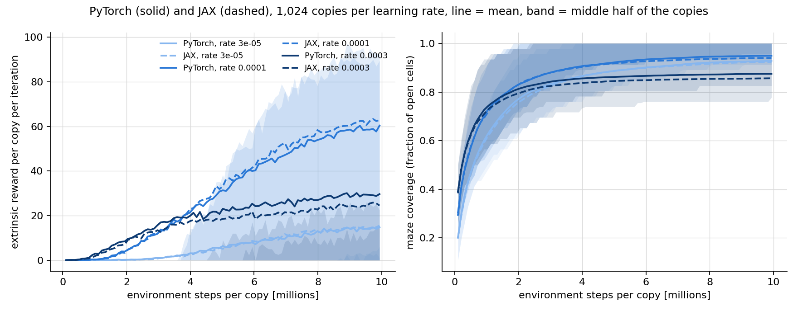
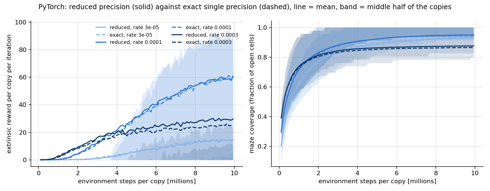
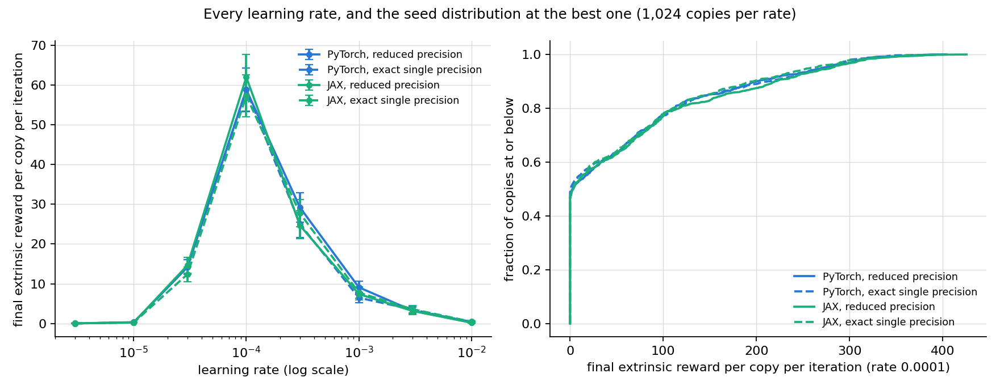

# Do the two implementations learn the same thing, and does reduced precision change it?

Four runs, each 8 learning rates x 1,024 independent copies x 9,999,872 environment
steps per copy: {PyTorch, JAX} x {reduced precision, exact single precision}.

Define $R$ with subscripts $c$ and $k$ as the extrinsic reward copy $c$ collected over the
512 environment steps of recorded iteration $k$ — the number of those steps it spent inside the
goal radius. Let $K$ be the last recorded iteration and let $m$ be 10. A copy's score is
$s_c = \dfrac{1}{m}\sum_{k=K-m+1}^{K} R_{c,k}$, taken over records at one episode phase (below).
Parity between the two implementations was checked first and is written down in
`../parity_check.md`.

## The metric has an episode clock in it

Nothing in this task ever terminates early, so the only episode end is truncation at
400 steps, and every copy's environments start together: all 8,192 copies share ONE
episode clock. An iteration covers 128 of those 400 steps, so which part of the episode an
iteration sees repeats every 25 iterations, and the reward it collects depends on which part.
Records were written every 200 iterations, a multiple of that cycle, so all but one of them sit at
a single phase; the exception is the final iteration, which lands elsewhere and reads about five
reward lower in every configuration. Scores and curves here use only the records at each run's
dominant phase, so the comparison is like for like.

| configuration | last record at the run's phase | final record, different phase |
|---|---|---|
| PyTorch reduced precision | 14.773 | 9.401 |
| PyTorch exact single precision | 14.026 | 9.064 |
| JAX reduced precision | 14.273 | 9.420 |
| JAX exact single precision | 13.869 | 9.150 |

## What each configuration reached, per learning rate

Mean over the 1,024 copies of a rate group.

| configuration | 3e-06 | 1e-05 | 3e-05 | 0.0001 | 0.0003 | 0.001 | 0.003 | 0.01 |
|---|---|---|---|---|---|---|---|---|
| PyTorch reduced precision | 0.02 | 0.31 | 14.17 | 58.84 | 29.17 | 9.10 | 3.24 | 0.43 |
| PyTorch exact single precision | 0.02 | 0.28 | 14.23 | 58.83 | 25.00 | 6.48 | 3.50 | 0.21 |
| JAX reduced precision | 0.01 | 0.24 | 14.64 | 61.99 | 24.65 | 7.40 | 3.15 | 0.18 |
| JAX exact single precision | 0.02 | 0.25 | 12.38 | 57.28 | 27.71 | 7.77 | 3.60 | 0.46 |

The three rates carried through the figures are 3e-05, 0.0001, 0.0003 — the best of the
eight and its two neighbours, chosen from all four configurations pooled.

About half the copies never reach the goal at all and the ones that do spread from a few reward to
four hundred, so the mean above is set by a heavy tail. The fraction that reached the goal at all
is the bounded summary of the same distribution, and the four configurations agree on it at every
rate by less than the width this run can resolve:

| learning rate | PyTorch reduced precision | PyTorch exact single precision | JAX reduced precision | JAX exact single precision | widest gap between the four | gap this run could resolve |
|---|---|---|---|---|---|---|
| 3e-06 | 1.5% | 1.4% | 0.7% | 1.3% | 0.8 points | 0.9 points |
| 1e-05 | 13.7% | 12.5% | 11.9% | 12.1% | 1.8 points | 2.9 points |
| 3e-05 | 38.4% | 36.6% | 38.2% | 36.1% | 2.2 points | 4.2 points |
| 0.0001 | 52.6% | 51.1% | 53.7% | 53.2% | 2.6 points | 4.3 points |
| 0.0003 | 34.9% | 31.5% | 31.1% | 35.4% | 4.3 points | 4.1 points |
| 0.001 | 19.8% | 17.3% | 17.7% | 17.8% | 2.5 points | 3.4 points |
| 0.003 | 11.2% | 12.1% | 12.3% | 13.2% | 2.0 points | 2.8 points |
| 0.01 | 2.2% | 2.1% | 2.4% | 2.8% | 0.8 points | 1.3 points |

## PyTorch against JAX, both at reduced precision

| learning rate | A: PyTorch reduced precision | B: JAX reduced precision | difference A − B | 95% interval for the difference | rank test p | P(A copy above B copy) |
|---|---|---|---|---|---|---|
| 3e-06 | 0.020 | 0.010 | 0.010 | [-0.005, 0.025] | 0.0862 | 0.504 |
| 1e-05 | 0.315 | 0.241 | 0.074 | [-0.026, 0.173] | 0.209 | 0.509 |
| 3e-05 | 14.170 | 14.637 | -0.466 | [-3.209, 2.276] | 0.923 | 0.501 |
| 0.0001 | 58.840 | 61.990 | -3.150 | [-11.014, 4.714] | 0.608 | 0.494 |
| 0.0003 | 29.165 | 24.653 | 4.512 | [-0.405, 9.428] | 0.0663 | 0.520 |
| 0.001 | 9.099 | 7.401 | 1.698 | [-0.478, 3.874] | 0.187 | 0.511 |
| 0.003 | 3.238 | 3.154 | 0.084 | [-1.183, 1.351] | 0.487 | 0.495 |
| 0.01 | 0.429 | 0.184 | 0.246 | [-0.078, 0.569] | 0.785 | 0.499 |
| all rates, blocked | 14.410 | 14.034 | 0.376 | [-0.874, 1.626] | 0.357 | 0.504 |

## Reduced against exact single precision, inside PyTorch

| learning rate | A: PyTorch reduced precision | B: PyTorch exact single precision | difference A − B | 95% interval for the difference | rank test p | P(A copy above B copy) |
|---|---|---|---|---|---|---|
| 3e-06 | 0.020 | 0.016 | 0.005 | [-0.010, 0.020] | 0.845 | 0.501 |
| 1e-05 | 0.315 | 0.284 | 0.031 | [-0.075, 0.137] | 0.453 | 0.506 |
| 3e-05 | 14.170 | 14.229 | -0.059 | [-2.737, 2.619] | 0.531 | 0.507 |
| 0.0001 | 58.840 | 58.831 | 0.009 | [-7.697, 7.714] | 0.674 | 0.505 |
| 0.0003 | 29.165 | 25.000 | 4.165 | [-0.852, 9.182] | 0.0907 | 0.518 |
| 0.001 | 9.099 | 6.481 | 2.618 | [0.546, 4.690] | 0.0983 | 0.514 |
| 0.003 | 3.238 | 3.501 | -0.263 | [-1.535, 1.009] | 0.501 | 0.495 |
| 0.01 | 0.429 | 0.208 | 0.222 | [-0.116, 0.559] | 0.751 | 0.501 |
| all rates, blocked | 14.410 | 13.569 | 0.841 | [-0.395, 2.077] | 0.195 | 0.506 |

## Reduced against exact single precision, inside JAX

| learning rate | A: JAX reduced precision | B: JAX exact single precision | difference A − B | 95% interval for the difference | rank test p | P(A copy above B copy) |
|---|---|---|---|---|---|---|
| 3e-06 | 0.010 | 0.023 | -0.013 | [-0.031, 0.005] | 0.177 | 0.497 |
| 1e-05 | 0.241 | 0.251 | -0.009 | [-0.108, 0.089] | 0.908 | 0.499 |
| 3e-05 | 14.637 | 12.383 | 2.254 | [-0.443, 4.951] | 0.223 | 0.513 |
| 0.0001 | 61.990 | 57.280 | 4.710 | [-3.080, 12.500] | 0.562 | 0.507 |
| 0.0003 | 24.653 | 27.711 | -3.058 | [-7.783, 1.668] | 0.05 | 0.479 |
| 0.001 | 7.401 | 7.774 | -0.373 | [-2.451, 1.706] | 0.899 | 0.499 |
| 0.003 | 3.154 | 3.599 | -0.445 | [-1.697, 0.807] | 0.488 | 0.495 |
| 0.01 | 0.184 | 0.461 | -0.278 | [-0.561, 0.006] | 0.564 | 0.498 |
| all rates, blocked | 14.034 | 13.685 | 0.348 | [-0.878, 1.575] | 0.73 | 0.498 |

## Every rate, and the seed distribution at the best one

## What the four runs cost

| configuration | copies | seconds per iteration | total million steps per second | thousand steps per second per copy | hours per million steps per copy | peak memory (MB) | whole run (hours) |
|---|---|---|---|---|---|---|---|
| PyTorch reduced precision | 8,192 | 0.384 | 10.93 | 1.33 | 0.21 | 26,006 | 2.08 |
| PyTorch exact single precision | 8,192 | 0.547 | 7.67 | 0.94 | 0.30 | 26,006 | 2.97 |
| JAX reduced precision | 8,192 | 0.336 | 12.49 | 1.52 | 0.18 | 18,317 | 1.82 |
| JAX exact single precision | 8,192 | 0.506 | 8.29 | 1.01 | 0.27 | 18,575 | 2.74 |

## The precision each run actually used

| configuration | declared setting | largest relative error of a float32 matrix product against float64 |
|---|---|---|

| PyTorch reduced precision | high | 3.54e-04 |
| PyTorch exact single precision | highest | 3.59e-07 |
| JAX reduced precision | None | 3.62e-04 |
| JAX exact single precision | highest | 3.70e-07 |
